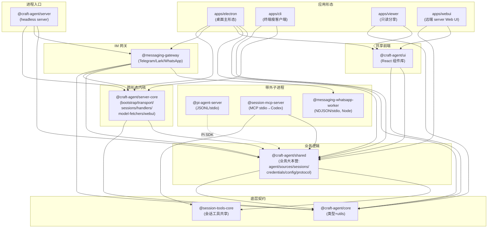
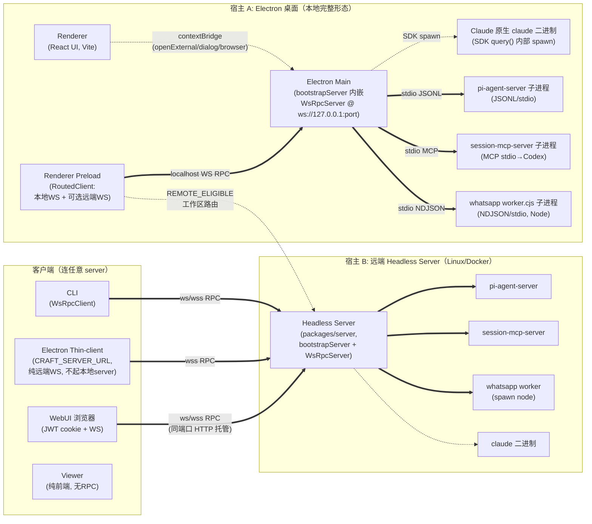
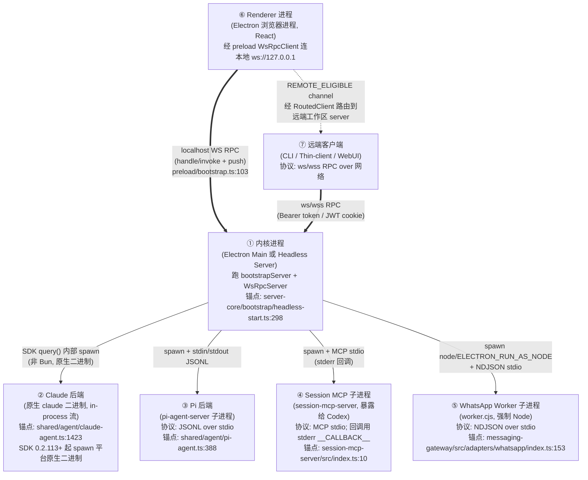
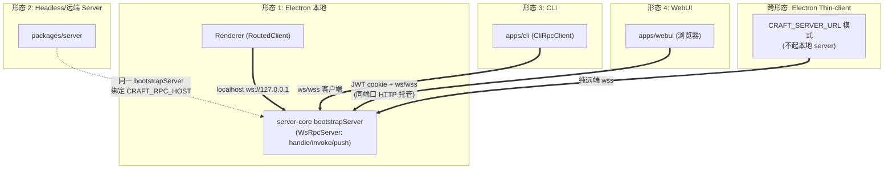

# 架构全景

> 本文档研究 Craft Agents（craft.do 开源的 Agent 工作站）monorepo 的「架构全景」：模块组成、进程拓扑、跨形态复用机制、技术栈与构建分发。所有结论均附源码路径证据。

---

## 项目概述

**它是什么**：Craft Agents 是一个「Agent 工作站」——一个让你与世界上最强大的 Agent（Claude、Pi/Gemini/GPT/Copilot 等）协作的桌面 + 远端 + 终端 + Web 多形态应用。它把 Agent 会话（session）当作一等公民来管理（收件箱、状态工作流、标签、归档、分享），并内置 Sources（连接 MCP / REST API / 本地文件）、Skills、Automations（事件驱动自动化）、多 provider LLM 连接等能力。根 `package.json` 描述为 *"Claude Code-like agent for Craft documents"*（`package.json:5`），Apache-2.0，Bun monorepo。

**为什么存在**：见 `README.md:18-27`——团队（craft.do）希望用一个「更偏文档、更非 CLI、更可定制」的方式驱动 Agent，做到直观多任务、零配置连接任意 API/服务、可分享会话。没有它，开发者只能用各 provider 的 CLI 或 Web，缺乏统一的会话管理、权限治理、多 provider 并存、以及 IM 自动化集成。

**核心设计理念**（三个关键决策，后文详述）：
1. **内核与宿主解耦**：把所有业务逻辑/会话编排从 Electron 剥离成 `@craft-agent/server-core`，用统一的 `bootstrapServer()` 泛型内核 + WS RPC transport 同时驱动 Electron、Headless Server、CLI、WebUI 四种形态。
2. **双 Agent 后端并存**：Claude Agent SDK（原生 `claude` 二进制，in-process 异步流）与 Pi SDK（独立子进程 `pi-agent-server`，JSONL over stdio）按 provider 路由，共享同一套 session/权限/工具契约。
3. **transport-first 的跨形态复用**：Electron 主进程不靠传统 Electron IPC 跑业务 RPC，而是在进程内启动同一个 WS server，renderer 经 localhost WS 连入；远端 server 用同一段代码但绑定对外地址。差异几乎只在 transport 与 platform 注入。

---

## 模块拆解

monorepo 用 Bun workspaces 组织（`package.json:18-22`）：`packages/*` + `apps/*`，排除 `apps/online-docs`（Mintlify 文档站，独立 npm）。共 **4 个 app + 11 个 package**。

### 顶层脚本分组（`package.json` scripts）

| 前缀 | 归属 | 作用 |
|------|------|------|
| `server:*` | 远端 headless server | 启动 / 多平台构建（`server:build:linux/darwin-*`，仅 darwin/linux）|
| `electron:*` | 桌面主形态 | main/preload/renderer/resources 构建 + dev + dist（mac/win/linux）|
| `viewer:*` / `webui:*` / `marketing:*` | 三个独立 Vite 前端 | 会话分享只读视图 / 远端 server 的 Web UI / 营销站 |
| `build:wa-worker` | WhatsApp worker | 强制 Node target 的单文件 worker |
| `server:build:subprocess` | 子进程预构建 | `session-mcp-server` + `pi-agent-server` 产物 |

关键依赖（`package.json:140-202`）：双 SDK `@anthropic-ai/claude-agent-sdk@0.3.170` 与 `@earendil-works/pi-ai`/`pi-coding-agent@0.79.9`；`@modelcontextprotocol/sdk`；`@tiptap/*` v3（富文本）；`@radix-ui/*` + shadcn 体系（`class-variance-authority`/`tailwind-merge`/`clsx`）；`beautiful-mermaid`；`@vscode/ripgrep`。`trustedDependencies`（`package.json:8-17`）声明需原生编译的包：`electron`/`esbuild`/`koffi`/`sharp`/`@sentry/cli`/`@vscode/ripgrep`/`protobufjs`/`electron-winstaller`。

---

### 应用层（apps/）

#### `apps/electron` —— 桌面主形态

**它是什么**：Electron 39 桌面应用，monorepo 的主形态，React + Vite 渲染层。`apps/electron/package.json:1`。
**为什么存在**：提供富 GUI（会话收件箱、多文件 diff、TipTap 编辑、托盘、深度链接 `craftagents://`、原生 dialog、自动更新）。它是 craft.do 团队「非 CLI」诉求的核心载体。

**结构**（`apps/electron/src/`）：
- `main/` —— Electron 主进程。**关键**：`main/index.ts`（1273 行）在 `app.whenReady()` 后调用与 headless server **完全相同**的 `bootstrapServer()`（`main/index.ts:93` 导入、`:627` 调用，`@craft-agent/server-core/bootstrap`）。即：Electron 主进程内嵌一个完整 server-core 内核（SessionManager + WS RPC + 全部 RPC handler），renderer 连本机 WS。`main/` 还含窗口/托盘/菜单/自动更新/CDP 浏览器面板/网络代理/深度链接等 Electron 专属能力。
- `preload/bootstrap.ts` —— contextBridge。**纠正一个常见误解**：业务 RPC **不走 Electron IPC**，而是 preload 创建 `WsRpcClient` 连到 `ws://127.0.0.1:{wsPort}`（`preload/bootstrap.ts:103`）。真正的 Electron `ipcRenderer` 只用于纯客户端能力（`shell.openExternal`、`dialog`、`__browser:invoke`、`relaunch`，见 `:161-186`、`:414-445`）。preload 还实现 **RoutedClient** 路由：`LOCAL_ONLY` channel 走本地 server，`REMOTE_ELIGIBLE` channel 走工作区所属 server（本地或远端），切换工作区时透明换客户端（`:94-155`）。
- `preload/browser-toolbar.ts` —— 浏览器工具栏 preload（独立窗口）。
- `renderer/` —— React UI（Vite 构建，消费 `@craft-agent/ui`）。
- `transport/` —— WS 客户端实现（`client.ts`=WsRpcClient、`routed-client.ts`=路由器、`channel-map.ts`=LOCAL_ONLY/REMOTE_ELIGIBLE 分类表、`build-api.ts`=按 channel-map 生成强类型 API 代理）。注意 `transport/server.ts` 只是 `export { WsRpcServer } from '@craft-agent/server-core/transport'`，印证 server 侧复用 server-core。
- `runtime/platform.ts` —— Electron 专属 `PlatformServices`（真实窗口/托盘/Sentry/截图等），注入给 `bootstrapServer.platformFactory`。

**构建**：三段（`scripts/electron-build-*.ts`）——main 用 esbuild+`cjs`+`external:electron`+`external:@anthropic-ai/claude-agent-sdk`（`electron-build-main.ts:341-365`；external SDK 是因为 SDK 是 ESM-only 且初始化时用 `createRequire(import.meta.url)`，esbuild cjs 打包会破坏 `import.meta.url`）；preload 同样 esbuild+cjs+external electron；renderer 用 Vite（`electron-build-renderer.ts:18-24`）。分发由 `apps/electron/electron-builder.yml` 配置：mac=dmg+zip（arm64/x64）、win=nsis（x64）、linux=AppImage（x64），`appId: com.lukilabs.craft-agent`，`asar: false`，SDK 原生二进制与 WhatsApp worker 经 `extraResources` 注入。

---

#### `apps/cli` —— 终端瘦客户端

**它是什么**：纯终端客户端，连任意运行中的 Craft Agent server（`apps/cli/package.json:1`，`description: "Terminal client for Craft Agent server"`）。
**为什么存在**：为脚本化、CI/CD、服务器验证、CLI 偏好者服务。`run` 命令可自包含地 spawn 一个 headless server 跑完单条 prompt 再退出（`README.md:295`）。
**实现要点**：入口 `apps/cli/src/index.ts`；通过 `CliRpcClient`（依赖 `@craft-agent/server-core`，WS 客户端）连 `ws://`/`wss://`（`apps/cli/package.json:19` deps 仅 `shared`+`server-core`）。命令含 `ping/health/sessions/send/cancel/listen/run/--validate-server`（`README.md:279-296`）。多 provider（`--provider anthropic/openai/google/...`）。

---

#### `apps/viewer` —— 会话只读分享视图

**它是什么**：独立 Vite 前端，上传/分享会话 transcript 的只读 Web 视图（`apps/viewer/package.json:1`）。
**为什么存在**：让 Agent 会话可像文档一样被分享（`agents.craft.do/s/<id>` 形态），无需登录、无需后端会话编排——纯前端解析渲染。是 craft.do「以文档为中心」理念的延伸。
**实现要点**：`apps/viewer/src/{App.tsx,main.tsx}`；依赖仅 `@craft-agent/core`+`@craft-agent/ui`（用共享的 SessionViewer/Markdown 组件渲染），dev 端口 5174（`package.json:83`）。

---

#### `apps/webui` —— 远端 server 的 Web UI

**它是什么**：远端 headless server 自带的浏览器 UI（`apps/webui/package.json:1`）。
**为什么存在**：当 server 跑在远端（Linux VPS/Docker）时，用户除 CLI/Electron thin-client 外，还能直接用浏览器访问——通过 JWT cookie 登录后连**同一 RPC 端口**的 WS，把「远端 server + Web 前端」变成一个完整 SaaS 式体验。
**实现要点**：`apps/webui/src/{App.tsx,main.tsx}` + `login.html` + `adapter/web-api.ts` + 一组 `shims/`（`ws.ts`/`sentry-electron.ts`/`electron-log.ts`/`node-builtins.ts` 等），把 Electron 专属 API 替换成 Web 等价物，从而能复用大部分 renderer 逻辑。webui 静态产物由 server 经 `createWebuiHandler`（`packages/server-core/src/webui/`）在 RPC 端口上同端口托管（`packages/server/src/index.ts:134-152`），登录走 `validateSession`（JWT，`webui/auth.ts`）。dev 端口 5175（`package.json:87`）。

---

### 共享内核层（packages/）

#### `packages/core` —— 共享类型与工具

**它是什么**：纯类型 + utils 包，**不含运行时业务逻辑**（`packages/core/src/index.ts` 注释明确：「currently only exports types and utilities」）。
**为什么存在**：定义跨所有形态/进程的公共契约（`types/`：`session.ts`/`message.ts`/`workspace.ts`/`server.ts`/`message-mapper.ts`），避免循环依赖。它是依赖图最底层，被几乎所有其他包 peer 依赖。
**主要文件**：`src/types/`、`src/utils/`。peer 声明 `@anthropic-ai/claude-agent-sdk` 与 `@modelcontextprotocol/sdk`（`packages/core/package.json:14-17`）。

---

#### `packages/shared` —— 业务逻辑大本营

**它是什么**：monorepo 最大、最核心的包，承载所有与宿主无关的业务逻辑（`packages/shared/package.json:1`：「Shared business logic … agent, auth, config, credentials, MCP integration」）。
**为什么存在**：是「内核与宿主解耦」的物理承载——把 Agent/Sources/Sessions/Credentials/Auth/Config/Prompts/Automations/Protocol 全部放在这里，使 Electron main、headless server、（间接）子进程都能共享同一套实现。
**主要子目录**（`packages/shared/src/`，亦见 `packages/shared/CLAUDE.md`）：
- `agent/` —— 双后端：`claude-agent.ts`（调 Claude Agent SDK 的 `query()` 异步生成器，`claude-agent.ts:1423/2750`；SDK 内部 spawn 原生 `claude` 二进制）、`pi-agent.ts`（spawn `pi-agent-server` 子进程，JSONL over stdio，`pi-agent.ts:153/388`）、`base-agent.ts`（共享基类，含 session-mcp-server 接线，`base-agent.ts:413`）。`backend/` 下按 provider 分 `claude/`、`pi/`、`internal/`（`runtime-resolver.ts` 解析各后端运行时与子进程路径）。
- `config/` `credentials/` `auth/` `sessions/` `sources/` `skills/` `statuses/` `labels/` `views/` `automations/` `prompts/` —— 配置/加密凭证（AES-256-GCM）/OAuth/会话持久化(JSONL)/数据源/Skills/状态/标签/视图/自动化/系统提示词。
- `protocol/` —— **跨形态 RPC 契约层**：`channels.ts`（所有 RPC channel 名）、`dto.ts`（数据结构）、`events.ts`（push 事件）、`routing.ts`（LOCAL/REMOTE 分类）、`types.ts`。被 server-core、electron transport、cli、webui 共同消费。
- 导出极细（`package.json` exports 段 40+ 子路径），便于按需引用、抑制循环依赖。

---

#### `packages/server-core` —— 跨形态内核（核心抽象所在）

**它是什么**：可复用的 headless server 基础设施，定义「server 是什么」并实现 WS RPC、引导、运行时、会话管理、handler、model-fetcher、domain 逻辑（`packages/server-core/package.json:1`：「Reusable headless server infrastructure」）。
**为什么存在**：**整个项目最关键的架构决策的落点**。把「server 生命周期 + RPC + session 编排 + handler 注册」抽成泛型 `bootstrapServer<TSessionManager, THandlerDeps>()`，让 Electron 与 headless server 用**同一段启动代码**、同一个 WS transport、同一套 handler，差异仅在 platform 工厂与 deps 装配。没有它，Electron 和远端 server 会各写一份等价逻辑，迅速漂移。
**主要子目录**（`packages/server-core/src/`）：
- `bootstrap/headless-start.ts` —— **核心**：`bootstrapServer()`（`:258`）按固定顺序完成 token 校验（`:88` 熵校验，最少 16 字符）→ platform 创建 → bundledAssetsRoot → 配置初始化 → 启动锁（`:171`，单实例，处理 PID 复用/Docker PID 1）→ 创建 SessionManager → 起 `WsRpcServer`（`:298`）→ 装载 deps → 注册 RPC handler（`:343` `registerAllRpcHandlers`）→ 设置事件 sink（`:345`）→ 初始化 SessionManager → 起模型刷新服务。返回 `ServerInstance`（含 platform/sessionManager/wsServer/host/port/protocol/token/stop）。还导出 `generateServerToken()`（48 字符 hex，192 bit）、`startHealthHttpServer()`（k8s/LB 探针）。
- `transport/` —— **核心抽象**：`types.ts` 定义 `RpcServer` 接口（`handle/push/invokeClient/hasClientCapability/findClientsWithCapability`，`:15-26`）与 `RpcClient`（`invoke/on/handleCapability`，`:28-32`）。`server.ts`=WsRpcServer（实现 RpcServer）、`client.ts`=WsRpcClient、`codec.ts`（分帧编解码）、`capabilities.ts`（handshake 能力协商，如 `LOCAL_CLIENT_CAPABILITIES`）、`browser-capability.ts`（远端调用本地浏览器面板）、`push.ts`（向工作区/客户端/all 推送）。
- `runtime/` —— `platform.ts`（`PlatformServices` 接口：logger/imageProcessor/captureError 等）、`platform-headless.ts`（headless 默认实现）、`null-browser-pane-manager.ts`。
- `sessions/` —— `SessionManager.ts`（会话编排，7000+ 行，含自动化触发 `executePromptAutomation`、`setAutomationBinder`、`setRpcServer`、事件 sink）、`RemoteBrowserPaneManager.ts`、`runtime-config.ts`（Pi 运行时配置热更新，含 `buildRestartRequiredSignature`）。
- `handlers/` —— RPC handler 注册入口 `handlers/rpc/index.ts`（`registerCoreRpcHandlers`）、各 handler、`handler-deps.ts`（`HandlerDeps`：sessionManager/platform/oauthFlowStore/messagingRegistry）、各 `*-interface.ts`（依赖接口，便于注入）。
- `model-fetchers/` —— 多 provider 模型列表刷新：`registry.ts` 用映射 `{anthropic, pi}`（`:23-24`，**编译期强制**每个 `FetchableProvider` 必须注册 fetcher，否则 `Record<FetchableProvider, …>` 编译失败，`:6-20` 注释）；`anthropic.ts`/`pi.ts`/`bedrock-vertex.ts`/`runtime.ts`。
- `domain/` —— 业务规则：`browser-tool-detection.ts`、`connection-setup-logic.ts`、`init-gate.ts`、`session-branch-cleanup.ts`、`session-browser-release.ts`、`title-sanitizer.ts`。
- `services/` —— `git-bash.ts`/`image-utils.ts`/`privileged-execution-broker.ts`/`search.ts`/`vcredist.ts`。
- `webui/` —— `http-server.ts`/`auth.ts`（JWT 会话）/`node-adapter.ts`/`index.ts`（`createWebuiHandler`/`validateSession`/`nodeHttpAdapter`）。

---

#### `packages/server` —— Headless server 入口

**它是什么**：独立可运行的 headless server 的薄入口（`packages/server/package.json:1`：「Standalone headless Craft Agent server (Bun runtime)」，`bin: craft-server`）。
**为什么存在**：把 server-core 装配成一个具体可执行进程——负责 env 解析（host/port/TLS/webui/messaging-worker 路径）、TLS 证书读取、webui handler 装配、messaging bootstrap 接线、health endpoint、**安全策略**（非 localhost 绑定且无 TLS 时拒绝启动，`packages/server/src/index.ts:317-336`），并打印 `CRAFT_SERVER_URL`/`CRAFT_SERVER_TOKEN` 供客户端连接。
**主要文件**：唯一的 `src/index.ts`（354 行）。它调 `bootstrapServer()`（`:168`）传入完整 options，把 `createMessagingBootstrap` 的 handle 接到 `createHandlerDeps`（`:210`）与 `setSessionEventSink`（`:237`，用 `messagingHandle.wrapSink` 叠加消息网关）。依赖 `@craft-agent/messaging-gateway`（`package.json:9`）。

---

#### `packages/ui` —— 共享 React 组件库

**它是什么**：跨前端形态复用的 React 组件库（`packages/ui/package.json:1`）。
**为什么存在**：让 Electron renderer、viewer、webui 共用同一套会话渲染（SessionViewer/TurnCard/Markdown/代码高亮/终端/JSON 视图），避免三处前端各写一份。大部分重依赖（Radix/Tailwind/react-markdown/shiki/jotai）声明为 `peerDependencies` + `peerDependenciesMeta.optional`，让消费方按需提供，保持包轻量。
**主要目录**（`packages/ui/src/components/`）：`chat/`（SessionViewer、TurnCard、turn-utils）、`markdown/`、`code-viewer/`、`terminal/`、`overlay/`、`annotations/`、`icons/`、`ui/`（drawer 等）。

---

#### `packages/pi-agent-server` —— Pi 后端子进程

**它是什么**：Pi SDK 的带外子进程，通过 **JSONL over stdio** 与父进程通信（`packages/pi-agent-server/package.json:1`：「Out-of-process Pi agent server communicating via JSONL over stdio」，`bin: pi-agent-server`）。
**为什么存在**：Pi SDK（`@earendil-works/pi-coding-agent`）处理 Gemini/ChatGPT/Copilot/OpenAI-key 等连接。把它放独立子进程的理由（`packages/shared/src/agent/pi-agent.ts:1-13`）：进程隔离（崩溃/段错误不拖垮主进程）、工具包装与权限执行的隔离、内存隔离。父进程 `pi-agent.ts:388` spawn 它，auth 是 API key（启动时传入）。
**主要文件**：`src/index.ts`（main=`dist/index.js`，`bun build --target=bun --format=esm --external koffi`，ESM 因 Pi SDK 是 ESM-only）。依赖含 `pdfjs-dist`/`turndown`/`duck-duck-scrape`/`node-html-parser`（Pi 自带 web 搜索/抓取/PDF 工具）。

---

#### `packages/session-mcp-server` —— 会话级 MCP 子进程

**它是什么**：向 **Codex** 暴露 session 级工具的 MCP server，走 **stdio transport**（`packages/session-mcp-server/package.json:1`：「MCP server that provides session-scoped tools (SubmitPlan, config_validate, etc.) to Codex via stdio transport」，`bin: session-mcp-server`）。
**为什么存在**：给 Codex 后端提供与 Claude 对等的 session 工具（SubmitPlan、配置校验等），保证跨后端功能对等。逻辑与 Claude 复用 `@craft-agent/session-tools-core`。**注意它是 `type: commonjs`、`build --target=node --format=cjs`**（`package.json:6`、scripts），因为 MCP SDK 在该形态下需 CJS。
**主要文件**：`src/index.ts`（576 行）。回调通信机制：需要通知主进程的工具（如 SubmitPlan 触发计划展示）向 **stderr** 写 `__CALLBACK__` 前缀的 JSON（`index.ts:10-11` 注释），主进程监听 stderr 处理。它还作为 `craft-agent-session-proxy` 连接 craft-agents-docs MCP 上游并代理其工具（`:282-299`）。被 `packages/shared/src/agent/backend/internal/runtime-resolver.ts:225` 引用路径、由 `base-agent.ts:413` 接线。

---

#### `packages/session-tools-core` —— 会话工具共享逻辑

**它是什么**：Claude 与 Codex 共用的 session 级工具逻辑（`packages/session-tools-core/package.json:1`：「Shared utilities for session-scoped tools (Claude and Codex)」）。
**为什么存在**：消除两个后端的工具实现重复——session-mcp-server 与 Claude 的 session 工具都从这里取 handler，保证对等。
**主要文件**：`src/index.ts`。依赖 `beautiful-mermaid`、`zod`、`zod-to-json-schema`、`gray-matter`（工具 schema 与文档 frontmatter 处理）。

---

#### `packages/messaging-gateway` —— IM 自动化网关

**它是什么**：把 Agent 会话接入即时通讯平台（Telegram / Lark 飞书 / WhatsApp）的网关，并实现事件驱动的自动化闭环（`packages/messaging-gateway/package.json:1`：「Messaging gateway … Telegram & WhatsApp」）。
**为什么存在**：让 Agent 能「住」在 IM 里——定时/cron、标签变化、工具调用等事件自动 spawn session，并把 session 的输出推回 IM 频道/Telegram 论坛 topic。这是 craft.do「Agent Native」与自动化诉求的载体。
**主要文件**（`packages/messaging-gateway/src/`）：
- `bootstrap.ts` —— `createMessagingBootstrap()` 返回 `MessagingBootstrapHandle`（`registry`/`setPublisher`/`wrapSink`/`initializeWorkspaces`/`dispose`，`:50-118`）。
- `registry.ts` —— `MessagingGatewayRegistry`：`registerAdapter` 注册 Telegram(grammY)/Lark(`@larksuiteoapi/node-sdk`)/WhatsApp(worker)；构造时通过 `sessionManager.setAutomationBinder()` 挂自动化→topic 绑定钩子（`:106-118`，**避免 SessionManager 反向 import messaging 造成循环依赖**）。
- `gateway.ts` —— `onSessionEvent`（`:342`）把 session 事件经 adapter 渲染回 IM；入站消息路由到绑定 session。
- `event-fanout.ts` —— `createFanOutSink()` 把 WS push sink 与 `registry.onSessionEvent` 叠加（任一抛错不阻塞其他）。
- `adapters/{telegram,lark,whatsapp}/` —— 三平台 adapter。

---

#### `packages/messaging-whatsapp-worker` —— WhatsApp worker（强制 Node）

**它是什么**：WhatsApp 子进程，基于 Baileys（非官方 WA 多设备协议），打包成单文件 `dist/worker.cjs`（`packages/messaging-whatsapp-worker/package.json:1`）。
**为什么存在**：WhatsApp 无官方机器人 API，Baileys 重实现协议；其密码学依赖（libsignal/curve25519）**只能跑在 Node**，Bun 跑不了。子进程化还带来崩溃隔离与内存隔离（`messaging-gateway/src/adapters/whatsapp/index.ts:6-9` 注释）。
**主要文件**：`src/worker.ts`（主=`worker.ts`）、`src/protocol.ts`。**通信协议 = NDJSON over 父子进程 stdio**（`protocol.ts:1-12`）：父→子（stdin）`WorkerCommand`（start/submit_pairing_phone/send_text/send_file/shutdown）；子→父（stdout）`WorkerEvent`（ready/qr/pairing_code/connected/disconnected/incoming/send_result/error/unavailable）；stderr 留给自由日志。构建由 `scripts/build-wa-worker.ts`：`--platform=node --format=cjs --target=node20`，Baileys 全树 bundle 进产物（`build-wa-worker.ts:6-10,84-104`）。被 spawn 方式：Electron 宿主用 `process.execPath`+`ELECTRON_RUN_AS_NODE=1`（让 Electron 内置 Node 以 Node 模式重入），Bun/headless 宿主必须显式传 `node`（`messaging-gateway/src/adapters/whatsapp/index.ts:153-214` + `bootstrap.ts:42-46`）。

---

## 模块依赖关系

下图展示 package 之间的依赖（箭头 A→B 表示 A 依赖 B）。`core` 是最底层；`shared` 依赖 `core`+`session-tools-core`；`server-core` 依赖 `core`+`shared`；各 app 与 server/messaging-gateway 依赖 `server-core`。注意 `ui` 不依赖 server-core（纯前端组件）。

依赖分层清晰：`core` → `shared` → `server-core` → {`server`, `electron`, `cli`, `messaging-gateway`}。`ui` 与子进程包是旁支。`messaging-gateway` 是唯一引入 IM SDK 与 worker 的地方，被 `server` 与 `electron` 两处 `createMessagingBootstrap` 接线（`packages/server/src/index.ts:210`、`apps/electron/src/main/index.ts:665`）。

---

## 进程拓扑

> 研究过程中的**重要修正**：任务假设「Electron Main / Renderer 用 IPC、7 进程含 messaging-gateway worker」。源码证据表明，Electron 的**业务 RPC 走 localhost WS**（main 内嵌 server-core 的 WsRpcServer，renderer 经 WsRpcClient 连入），传统 Electron IPC 仅用于纯客户端能力。因此实际是「按宿主分组的进程拓扑」，单宿主内可达 7 进程。

### 宿主与通信总览

### 7 进程关系图（单宿主内 + 跨宿主客户端）

下图聚焦「一个完整宿主内最多 7 个进程」以及客户端如何接入。图中标注每条边的协议与代码锚点。

**通信协议证据汇总**：

| 边 | 协议 | 证据 |
|----|------|------|
| 内核 ↔ Renderer/客户端 | **WebSocket RPC**（`ws://` 或 `wss://`，Bearer token / JWT cookie 鉴权）| `server-core/src/transport/server.ts`（WsRpcServer）、`apps/electron/src/preload/bootstrap.ts:103`、`apps/cli` |
| 内核 → Claude 后端 | SDK `query()` 异步生成器；SDK ≥0.2.113 内部 spawn 平台原生 `claude` 二进制（非 Bun 子进程）| `shared/src/agent/claude-agent.ts:1423`、`packages/shared/CLAUDE.md`（interceptor 段）|
| 内核 → Pi 后端 | **JSONL over stdin/stdout**（readline 分帧）| `shared/src/agent/pi-agent.ts:388`、`pi-agent-server/package.json` 描述 |
| 内核 → session-mcp-server | **MCP stdio**（ListTools/CallTool）；回调经 **stderr `__CALLBACK__` 前缀 JSON** | `session-mcp-server/src/index.ts:5-11`、`shared/src/agent/base-agent.ts:413` |
| 内核 → WhatsApp worker | **NDJSON over stdin/stdout**；Electron 用 `ELECTRON_RUN_AS_NODE=1`，Bun 宿主用 `node` | `messaging-whatsapp-worker/src/protocol.ts:1-12`、`messaging-gateway/src/adapters/whatsapp/index.ts:153-214` |
| Renderer ↔ Main 的纯客户端能力 | **Electron IPC**（`ipcRenderer.invoke`：openExternal/dialog/browser:invoke/relaunch）| `apps/electron/src/preload/bootstrap.ts:161-186,414-445` |

---

## 跨形态复用：内核如何同时驱动四种形态

**核心机制**：`server-core` 的 `bootstrapServer<TSessionManager, THandlerDeps>()` 是泛型工厂（`bootstrap/headless-start.ts:258`）。它把「可变部分」全部抽成回调 options（`platformFactory`/`applyPlatformToSubsystems`/`createSessionManager`/`createHandlerDeps`/`registerAllRpcHandlers`/`setSessionEventSink`/…），「不变部分」是固定启动序列与 WS RPC transport。三种宿主各自实现回调，复用同一段内核。

**Electron vs Headless Server 的差异点**：

| 维度 | Electron Main | Headless Server |
|------|---------------|-----------------|
| 入口 | `apps/electron/src/main/index.ts:627` | `packages/server/src/index.ts:168` |
| platformFactory | Electron 专属 PlatformServices（窗口/托盘/Sentry）| `createHeadlessPlatform()`（`runtime/platform-headless.ts`）|
| 绑定地址 | localhost（renderer 本机连）| `CRAFT_RPC_HOST`（可对外，强制 TLS）|
| messaging worker nodeBin | `process.execPath` + `ELECTRON_RUN_AS_NODE` | 显式 `node`（Bun 不能跑 CJS worker）|
| WebUI | 一般不托管 | `CRAFT_WEBUI_DIR` 启用时同端口托管 |
| 进程生命周期 | 随 Electron 窗口 | systemd / Docker，SIGINT/SIGTERM 优雅退出 |

两者都调 `registerCoreRpcHandlers`（同一套 RPC handler）、都建 `SessionManager`、都用 `WsRpcServer`。**差异确实主要在 transport 绑定参数与 platform 注入**，业务逻辑零分叉。

**四种客户端形态如何接入同一内核**：

**契约层**是 `packages/shared/src/protocol/`（channels/dto/events/routing）—— 所有形态共享同一份 RPC channel 名与数据结构，确保客户端/服务端版本兼容。Electron 的 `transport/channel-map.ts` 据此把 channel 分为 `LOCAL_ONLY`（如窗口、托盘、原生 dialog，只能本地）与 `REMOTE_ELIGIBLE`（工作区级业务，可路由到远端 server），由 `RoutedClient`（`apps/electron/src/transport/routed-client.ts`）按工作区透明分发。这就是「一个 Electron 同时管理本地工作区 + 多个远端工作区」的实现基础。

---

## 核心抽象

1. **`RpcServer` / `RpcClient` 接口**（`packages/server-core/src/transport/types.ts:15-32`）—— 定义系统边界的核心接口。`handle(channel, fn)` 注册请求处理器，`push(channel, target, ...args)` 服务端推送，`invokeClient` 服务端反向调用客户端能力（如让远端 server 调用本地浏览器面板）。所有形态的客户端/服务端都实现这俩接口，是跨形态复用的契约基石。
2. **`bootstrapServer<TSessionManager, THandlerDeps>()`**（`bootstrap/headless-start.ts:258`）—— 整个项目最重要的函数。泛型 + 回调 options 模式让同一启动序列服务 Electron 与 headless 两种宿主。
3. **`PlatformServices`**（`runtime/platform.ts`）—— 注入式平台抽象（logger/imageProcessor/captureError/…），让内核不感知自己跑在 Electron 还是 headless。
4. **`SessionManager`**（`sessions/SessionManager.ts`）—— 会话编排中枢：agent 创建/销毁、消息收发、自动化触发（`executePromptAutomation`）、事件 sink、自动化绑定（`setAutomationBinder`）、运行时配置热更新（`refreshConnectionRuntime`）。7000+ 行，是业务核心。
5. **`AgentBackend` 契约**（`shared/src/agent/backend/types.ts`）—— 双后端（Claude/Pi）的共同接口，含 `queryLlm(request: LLMQueryRequest)` 等必须实现的方法（见 `packages/shared/CLAUDE.md` 的 `queryLlm` 段）。这是双 SDK 能互换的基础。
6. **RPC_CHANNELS**（`shared/src/protocol/channels.ts`）—— 跨形态共享的 channel 命名表，是版本兼容性的 Single Source of Truth。

---

## 扩展机制

**它是什么**：项目在多个维度提供扩展点：

1. **Sources（数据源扩展）**：三种固定类型 `mcp` / `api` / `local`（`packages/shared/CLAUDE.md` 硬规则）。MCP 走 stdio/HTTP 子进程；REST API 支持自定义 OpenAPI spec 与 OAuth/Renew token 刷新；local 接文件系统/Obsidian/Git。新 provider 模型默认走 Pi 路径（`providerType: 'pi'`）。
2. **Provider/模型扩展（model-fetchers 编译期守卫）**：`model-fetchers/registry.ts` 用 `Record<FetchableProvider, ModelFetcher>` 类型，**新增 provider 不注册 fetcher 会编译失败**（`registry.ts:6-20` 注释），强制完整性。
3. **Skills**：per-workspace 的 Agent 指令包，可 `@mention` 即时生效（无需重启），支持从 Claude Code 迁移。
4. **Automations（事件驱动）**：事件类型 `LabelAdd/LabelRemove/PermissionModeChange/SessionStatusChange/SchedulerTick/PreToolUse/PostToolUse/SessionStart/SessionEnd…`（`README.md:551`），通过 `cron` 或 matcher 触发 `prompt` action 创建 session。自动化 matcher 经 `automations/utils.ts` 的 canonical adapter 统一，可选 `telegramTopic` 路由到 IM。
5. **IM 平台扩展（messaging-gateway adapter）**：实现 `PlatformAdapter` 接口（`registry.ts:138-152` `registerAdapter`）即可接入新 IM 平台；当前有 Telegram(grammY)/Lark/WhatsApp。
6. **客户端能力协商（capabilities）**：WS handshake 时客户端声明能力（`LOCAL_CLIENT_CAPABILITIES`），服务端用 `hasClientCapability`/`findClientsWithCapability` 决定能否 `invokeClient`（如调用本地浏览器面板、弹原生 dialog）。这让远端 server 能优雅利用本地客户端的 GUI 能力。
7. **双 Agent 后端**：新增 LLM provider 优先走 Pi 后端（`pi-agent-server` 子进程），与 Claude 后端共享同一 session/权限/工具契约（`AgentBackend` 接口 + `session-tools-core`）。

**为什么这么设计**：
- **Sources/Provider/Skills 走声明式配置 + 编译期类型守卫**而非硬编码，是为了兑现「零配置连接任意服务」（`README.md:31-49`）的产品承诺，同时用类型系统防止遗漏。
- **Automations/IM 走事件驱动 + fan-out sink + binder 钩子**，是为了让 SessionManager 不反向依赖具体平台（避免循环依赖，见 `registry.ts:103-105` 注释），保持内核纯净。
- **客户端能力协商**让「远端算力 + 本地 GUI」可组合（thin-client 模式），是 headless server 架构能成立的必要条件。

---

## 待解决疑问

1. `apps/marketing`（根 `package.json:94-96` 有 `marketing:*` 脚本）与 `apps/online-docs`（Mintlify）在仓库当前快照下未出现在 `apps/` 目录列表中——推测为独立仓库或被 `.gitignore`/oss-sync 流程排除（`scripts/oss-sync.ts`）。本次未深入验证其归属。
2. `messaging-gateway` 的 Lark 适配器是否走 `@larksuiteoapi/node-sdk` 的完整能力，还是仅用 fetch 调 `tenant_access_token` 接口——agent 结论倾向后者（`registry.ts:656-660`），但未逐行确认 SDK 调用点。
3. Claude 原生 `claude` 二进制的具体 spawn 参数（stdin/stdout 协议或进程边界）属 Claude Agent SDK 内部实现，本次仅以 SDK `query()` 调用点与 `packages/shared/CLAUDE.md` 陈述为据，未进入 SDK 包内验证。

---

## 附：技术栈与构建分发速查

**运行时/构建**：Bun（runtime + test，`trustedDependencies` 标注原生编译包）；Electron 39（`electron-builder.yml:5`）；React 18；Vite 6（renderer/webui/viewer/marketing）+ esbuild 0.25（main/preload/subprocess）。

**UI**：Tailwind CSS v4 + shadcn 体系（Radix primitives + CVA + tailwind-merge + clsx + lucide-react）；TipTap v3（富文本，含 bubble-menu/file-handler/image/mathematics/task-*）；`beautiful-mermaid`（Mermaid 渲染）；shiki（代码高亮）；KaTeX（数学）。

**AI / 工具**：`@anthropic-ai/claude-agent-sdk@0.3.170` + `@anthropic-ai/sdk`；`@earendil-works/pi-ai`/`pi-coding-agent`/`pi-agent-core@0.79.9`；`@modelcontextprotocol/sdk@^1.29.0`；`@github/copilot-sdk`；`@vscode/ripgrep`。

**Server 分发**（`scripts/build-server.ts`）：组装源码 + 下载 Bun 运行时（`bun-v1.3.9`）+ uv（`0.10.6`）的可执行目录，**仅 darwin/linux**（显式拒绝 win32，`:789-795`），`--compress` 出 `tar.gz`，含 Dockerfile + install.sh（可装 systemd）。**不是 `bun build` 单二进制**。

**Electron 分发**（`apps/electron/electron-builder.yml`）：mac=dmg+zip（arm64/x64）、win=nsis（x64）、linux=AppImage（x64）；`asar: false`；SDK 原生二进制（`claude-agent-sdk-binary` ~210MB）与 WhatsApp worker 经 `extraResources` 注入；`publish` 走 generic provider `https://agents.craft.do/electron/latest` 供 electron-updater。
