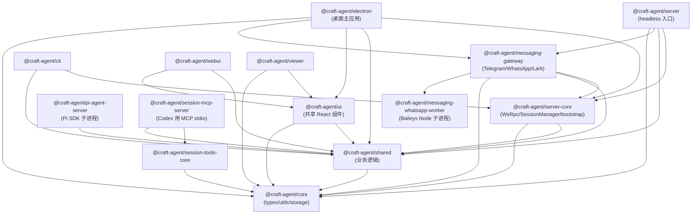
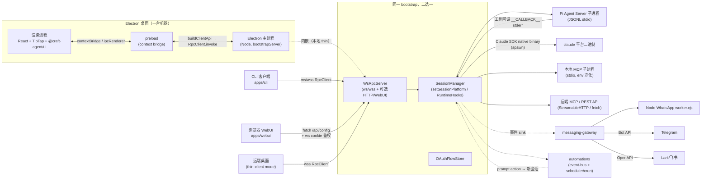

# 架构总览

> 本文档为 Craft Agents（v0.10.4）的整体架构总览，覆盖 monorepo 形态、进程拓扑、跨端复用机制与基础设施选型。所有结论基于源码与 README，凡推断处均明确标注。

## 1. Craft Agents 是什么（What）

Craft Agents 是 craft.do 开源的「**文档为中心、Agent 原生**」的多形态 Agent 工作站。它把 Claude Agent SDK 与 Pi SDK 并列作为内核后端，把任意 MCP / REST API / 本地文件系统作为可被 Agent 自主接入的「Sources」，并以同一套 SessionManager + Agent 内核同时支撑四种产品形态：

- **Electron 桌面应用**（主形态，apps/electron）
- **本地 / 远端 Headless Server**（packages/server，Bun 运行）
- **CLI 客户端**（apps/cli，连任意 Server）
- **WebUI**（apps/webui，浏览器 thin client，复用 Electron 渲染层）
- **Session Viewer**（apps/viewer，只读分享会话 JSON 的静态站点）

它以 `~/.craft-agent/` 为单一持久化根（config / 加密凭据 / 偏好 / 主题 / 工作区会话 JSONL），并内置权限模式（safe/ask/allow-all）、Skills、Automations（事件 + cron）、动态 Status、消息桥（Telegram/WhatsApp/Lark）等 Agent-native 基础设施。

## 2. 为什么这样拆（Why）

| 设计决策 | 动因（基于代码证据） |
|---|---|
| 拆出 `server-core` 而非塞进 Electron | Electron main 与远端 Bun server 共用同一份 `bootstrapServer`、`WsRpcServer`、`SessionManager`、`PlatformServices`。`apps/electron/src/transport/server.ts:1` 直接 re-export `@craft-agent/server-core/transport` 的 `WsRpcServer`；headless 端 `packages/server/src/index.ts:168` 调用同一 `bootstrapServer`。 |
| 远端 Server 形态 | README「Remote Server」段：让长会话常驻、跨机器访问、把算力放服务器、桌面/CLI/WebUI 都做 thin client。 |
| Pi 后端独立子进程 | `packages/pi-agent-server/src/index.ts:14` 注释：「将 Pi SDK 的 ESM + 重依赖隔离到独立进程，避免 Electron main 打包冲突」。JSONL over stdio。 |
| Session MCP Server 独立子进程 | `packages/session-mcp-server/src/index.ts:1`：以 stdio MCP 形式向 Codex（Pi）暴露 session-scoped 工具（SubmitPlan 等），共享 `session-tools-core` 处理器以与 Claude 对齐。 |
| `core` / `shared` 分层 | `core` 仅放纯类型/存储/工具（无 React、可被 viewer/pi-agent-server 等纯 Node 上下文安全引用）；`shared` 放业务逻辑（agent/auth/config/credentials/sessions/sources）。viewer 的 package.json 只依赖 `@craft-agent/core`，CLI 只依赖 `shared + server-core`。 |
| `ui` 单独成包 | 让 Electron 渲染层、WebUI、Viewer 共享 SessionViewer / TurnCard / Markdown 渲染。`apps/webui/src/App.tsx:24` 直接 `import('@/App')` 拉取 Electron 渲染层根组件。 |
| `messaging-gateway` + `messaging-whatsapp-worker` 分离 | WhatsApp 用 Baileys（非官方、长连接、Node-only），需独立 `worker.cjs` 子进程；gateway 本体负责 Telegram/Lark/WhatsApp 的统一事件总线与会话绑定。 |
| Bun workspaces + hoisted linker | `bunfig.toml:9`：Vite/esbuild 期望传递依赖落到顶层 node_modules，isolated linker 会破坏 i18next / tiptap / pdfjs-dist 的渲染层导入。 |

## 3. 包/应用职责一览（What / Why 一句话）

| 路径 | What（是什么） | Why（存在的理由） |
|---|---|---|
| `packages/core` | 纯类型 + 存储 + 工具的零依赖底座 | 给所有 Node-only 上下文（viewer、pi-agent-server、session-mcp-server）安全引用，不染 React/SDK |
| `packages/shared` | 业务逻辑主体：agent / auth / config / credentials / sessions / sources / skills / automations / i18n / protocol | Electron main、headless server、CLI 共用的唯一业务层 |
| `packages/server-core` | headless 服务器基础设施：WsRpcServer、SessionManager、handlers、bootstrap、platform、model-fetchers | 让 Electron main 与远端 server 走同一份 bootstrap 与传输层 |
| `packages/server` | 远端 server 的可执行入口（Bun 运行 `src/index.ts`） | 一行命令起的独立部署形态，含 TLS/WebUI/Messaging 装配 |
| `packages/pi-agent-server` | Pi SDK 的 out-of-process JSONL 子进程 | 隔离 Pi SDK 的 ESM/重依赖，支持 OpenAI/Google/Copilot/Codex 等非 Anthropic 路由 |
| `packages/session-mcp-server` | 向 Codex 暴露 session 工具的 stdio MCP 子进程 | 让 Pi 后端也能用 SubmitPlan 等 session-scoped 工具，与 Claude 对等 |
| `packages/session-tools-core` | session 工具的共享处理器 | 让 Claude（内置）与 Codex（MCP 子进程）用同一份工具实现，避免漂移 |
| `packages/messaging-gateway` | Telegram / WhatsApp / Lark 消息桥与会话绑定 | 把外部聊天映射为会话事件 / 触发 automations / 反向推送许可提示 |
| `packages/messaging-whatsapp-worker` | Baileys WhatsApp 子进程（Node-only worker.cjs） | Bun/Electron 跑不了 Baileys，必须独立 Node 子进程 |
| `packages/ui` | 共享 React UI（SessionViewer、Markdown、TurnCard） | Electron 渲染层 / WebUI / Viewer 复用同一套会话展示组件 |
| `apps/electron` | 主形态桌面应用（main / preload / renderer / transport / runtime） | 富 GUI、本地 shell、文件拖拽、CDP 浏览器面板等桌面能力 |
| `apps/cli` | 终端客户端（WebSocket 连任意 server） | 脚本/CI/服务器体检，`run` 子命令可自起 server 跑 prompt 即退 |
| `apps/webui` | 浏览器 thin client（Vite 产物） | 同端口服务在 RPC 端口，cookie 鉴权，复用 Electron 渲染层 |
| `apps/viewer` | 静态会话查看站点 | 上传/分享会话 JSON，只读 |

## 4. Monorepo 包依赖关系（Mermaid）

注：`pi-agent-server` 与 `session-mcp-server` 在运行时由 SessionManager 作为子进程拉起（`server:build:subprocess`），编译期不直接被 app 依赖，故以虚运行时关系存在。

## 5. 进程与传输拓扑（Mermaid）

要点（基于代码）：

- **传输层是同一个抽象**：`RpcServer`/`RpcClient`/`EventSink` 接口在 `packages/server-core/src/transport/types.ts` 定义，`WsRpcServer` 是其 WebSocket 实现（`packages/server-core/src/transport/server.ts`）。Electron 主进程内嵌使用时，渲染层通过 preload 暴露的 `buildClientApi(client, CHANNEL_MAP)`（`apps/electron/src/transport/build-api.ts:25`）把 `RpcClient.invoke(channel, ...args)` 包装成与原 `ElectronAPI` 同形的代理对象——`apps/electron/src/transport/channel-map.ts:19` 是方法→RPC 通道的唯一映射表。
- **CLI / WebUI / 远端桌面** 都通过 WebSocket 连同一个 `WsRpcServer`，差别仅在传输安全（ws/wss + token / cookie）。
- **同一 SessionManager** 通过 `setSessionPlatform(platform)`（`packages/server-core/src/sessions/SessionManager.ts:113`）注入不同 `PlatformServices`：Electron 端用 `createElectronPlatform`（`apps/electron/src/main/platform.ts:21`），headless 端用 `createHeadlessPlatform`（`packages/server-core/src/runtime/platform-headless.ts:44`）。两者只在 openExternal/图片处理/退出/暗色等少数能力上不同。
- **远端 Server 形态解决了**：长会话常驻、跨机器访问、把 Pi/Claude/本地 MCP 这类重子进程集中在算力更强的 Linux 主机上，桌面/CLI/浏览器都退化成只渲染、走 RPC 的 thin client（README「Remote Server」段）。

## 6. 跨端复用机制小结

| 抽象 | 定义点 | Electron 实现 | Headless 实现 |
|---|---|---|---|
| `bootstrapServer` | `packages/server-core/src/bootstrap/headless-start.ts:18` | main/index.ts 调用 | packages/server/src/index.ts 调用 |
| `PlatformServices` | `packages/server-core/src/runtime/platform.ts:39` | `createElectronPlatform`（nativeImage/shell） | `createHeadlessPlatform`（sharp + 子进程退出） |
| `SessionManager` | `packages/server-core/src/sessions/SessionManager.ts:1102` | 同一类 | 同一类 |
| `WsRpcServer` / `RpcClient` | `packages/server-core/src/transport/` | 渲染层经 preload→ipc 调本地 client；main 持 server | 浏览器/CLI/远端桌面经 ws/wss 调 |
| `RPC_CHANNELS` | `packages/shared/src/protocol` | 共享 | 共享 |
| `registerCoreRpcHandlers` | `packages/server-core/src/handlers/rpc/index.ts` | 共享 | 共享 |

## 7. 配套基础设施

- **构建**：`scripts/electron-build-{main,preload,renderer,resources}.ts` 分别构建 Electron 三段 + 资源；main 用 esbuild（CJS bundle，`--external:electron`），renderer 用 Vite；`scripts/build-server.ts` 跨平台编译 headless server（linux/darwin × x64/arm64，含 compress）；`scripts/build-wa-worker.ts` 单独打 WhatsApp worker.cjs（`build:wa-worker`）；`server:build:subprocess` 构建 `session-mcp-server` 与 `pi-agent-server`。
- **发布**：`electron-builder`（`electron:dist:{mac,win,linux}`），OAuth secrets 经 esbuild `--define` 在构建期注入（`apps/electron/package.json` 的 `build:main`）。
- **类型检查**：`typecheck:all`（`package.json:28`）按 core→shared→server-core→server→session-tools-core→pi-agent-server→electron→ui 顺序串联 `tsc --noEmit`。
- **i18n**：`packages/shared/src/i18n`，`registry.ts` 为唯一 locale 注册表；三道闸 `lint:i18n:{sorted,parity,coverage}` 在 pre-commit 与 `validate:ci` 强制；主进程通过 `preferences.uiLanguage` 持久化、渲染层用 localStorage（CLAUDE.md「Cross-process language persistence」段）。
- **Automations / Scheduler**：`packages/shared/src/automations/automation-system.ts` 自带 `SchedulerService`（cron）与 `event-bus`，事件含 `LabelAdd/PermissionModeChange/PreToolUse/PostToolUse/SessionStart/SessionEnd/SchedulerTick` 等；匹配统一走 `utils.ts` 的 `matcherMatches*` 适配器；可经 `telegramTopic` 把自动触发的会话落到 Telegram 论坛 topic。
- **messaging-gateway**：实际三适配器 `adapters/{telegram,whatsapp,lark}`，Telegram 用 `grammy`，WhatsApp 走独立 Baileys worker（Node 子进程），Lark 用 `@larksuiteoapi/node-sdk`；`TopicRegistry` / `MessagingGatewayRegistry.bindAutomationSession` 负责会话绑定，并通过 `setAutomationBinder` 钩子注入 SessionManager。
- **凭据**：AES-256-GCM 加密文件 `~/.craft-agent/credentials.enc`，统一走 `packages/shared/src/credentials`；本地 MCP 子进程启动前会净化 `ANTHROPIC_API_KEY/AWS_*/GITHUB_TOKEN` 等敏感环境变量（README「Local MCP Server Isolation」）。

## 8. Tech Stack 表

| 层 | 技术 | 选型理由（基于代码/README 推断） |
|---|---|---|
| Runtime | Bun（server/CLI/subprocess）、Node（WA worker）、Electron 39（桌面） | Bun 原生 TS + 快启动 + 兼容 npm 生态；Electron 提供跨平台 GUI 与文件/shell 能力 |
| 包管理 | Bun workspaces + hoisted linker | monorepo + Vite/esbuild 对顶层 node_modules 的依赖 |
| AI 内核 | `@anthropic-ai/claude-agent-sdk` 0.3.170（spawn native `claude` 二进制）+ Pi SDK（`@earendil-works/pi-{ai,coding-agent,agent-core}` 0.79.9） | 双后端：Claude 直连 Anthropic/OpenRouter/自定义 endpoint；Pi 承载 Google/ChatGPT/Copilot/OpenAI key 等多 provider |
| MCP | `@modelcontextprotocol/sdk` 1.29 | Sources 接入与向 Codex 暴露 session 工具的统一协议 |
| UI | React 18 + TipTap 3 + Radix UI + Tailwind v4 + shadcn 风格 | 文档为中心（TipTap）、可访问性（Radix）、原子化样式（Tailwind v4） |
| 状态 | jotai（renderer）、localStorage（prefs） | 渲染层原子化状态 |
| 富文本/代码 | shiki、KaTeX、marked、react-markdown、prosemirror-highlight、markitdown-js | 代码高亮、数学、Markdown 渲染、Office→MD 转换 |
| 加密 | 自实现 AES-256-GCM 文件存储 | 无需外部密钥管理服务，纯本地 |
| 传输 | 自实现 WsRpc（`ws` 库）+ TLS + JWT cookie（WebUI，`jose`） | 一套 RPC 抽象贯通 IPC/ws/wss，server-core 是其实现库 |
| 图像 | sharp（headless）/ nativeImage（Electron） | 平台抽象的 imageProcessor |
| 桥接 | grammy（Telegram）、`@whiskeysockets/baileys`（WhatsApp）、`@larksuiteoapi/node-sdk`（Lark） | 多聊天平台统一到 gateway |
| 构建/打包 | esbuild（main/preload/subprocess）、Vite（renderer/webui/viewer）、electron-builder（dist） | Node 侧追求 bundle 速度，浏览器侧追求 HMR 与生态 |
| 可观测 | Sentry（Electron main + React）、electron-log、`@craft-agent/shared/utils/debug` | 生产错误上报 + 本地日志（`~/Library/Logs/@craft-agent/electron/`） |

## 9. 未解决疑问

1. **`session-tools-core` 与 Codex 的耦合细节**：`session-mcp-server` 注释提到「向 Codex 暴露 session 工具」，但 Pi 后端是否同时通过同一条 stdio MCP 链路消费这些工具，还是在 `pi-agent-server` 内部直接调用，未在入口文件完全证实——推断为前者，需读 `handlers/` 与 Pi 后端的 MCP 客户端代码确认。
2. **远端 server 的「remote workspace」与本地 workspace 的会话所有权切分**：`packages/server/src/index.ts:266` 显式过滤 `!ws.remoteServer` 来初始化 messaging，提示存在 remote-owned workspace，但其在桌面 thin client 下的会话同步/权限边界未在本研究覆盖范围。
3. **`apps/marketing` 与 `apps/online-docs`**：根 package.json 含 `marketing:dev/build` 与 `docs:dev` 脚本，但 apps 目录未见 marketing（online-docs 被 workspaces 排除）。推断为站点/文档子项目，未深入。
4. **Pi 的 `unified-network-interceptor.ts` 预加载**：CLAUDE.md 明确说仅 Pi 子进程经 Bun `--preload` 加载；Claude SDK 自 0.2.113 起走 native 二进制不再可 preload。原属 Claude 的拦截能力（rich tool intent 等）被列为 Phase-2 工作——是否已有迁移到 SDK hooks 的进展，未确认。
