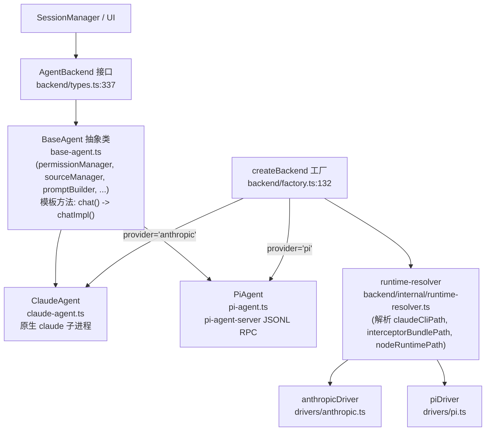
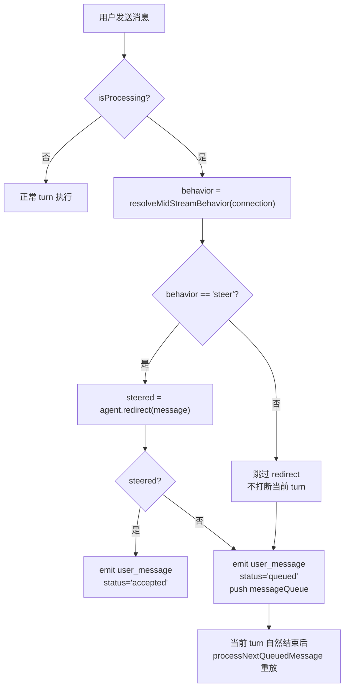

# Agent 内核机制

> 本报告研究 Craft Agents OSS 中 Agent 子系统的内核实现，覆盖三层 Agent 抽象、backend factory、Prompt 构建、权限模式、思考控制、中途消息行为、Pi 拦截器以及会话生命周期信号等八项主题。所有引用均按 `relative-path:line` 格式给出。

## 0. 总览

Craft Agents 的 Agent 内核通过分层抽象同时支撑 Anthropic 官方 SDK 与 Pi（兼容 OpenAI 的多厂商）通道。核心设计可以归纳为：

- **接口层**：`AgentBackend`（`backend/types.ts:337`）规定所有后端必须实现的统一契约——`chat / abort / forceAbort / interruptForHandoff / redirect / setSourceServers / respondToPermission …`，使上层 SessionManager 与 UI 不必关心后端差异。
- **模板层**：`BaseAgent`（`base-agent.ts`）以模板方法模式封装所有后端共享的能力——权限管理、Source 管理、Prompt 构建、配置监听、Usage 追踪、Prerequisite 校验等。
- **实现层**：`ClaudeAgent`（`claude-agent.ts`）通过 `@anthropic-ai/claude-agent-sdk` 启动原生 `claude` 子进程；`PiAgent`（`pi-agent.ts`）通过 `pi-agent-server` 子进程暴露 JSONL RPC。
- **工厂层**：`createBackend`（`backend/factory.ts:132`）依据 `provider` 选择 `ClaudeAgent` 或 `PiAgent`；`DRIVER_REGISTRY`（`backend/factory.ts:63`）则持有 `anthropicDriver`、`piDriver` 负责运行时引导、模型列表与连接校验。



注意：`backend/index.ts` 导出的 `createAgent` 实为 `createBackend` 别名（`backend/factory.ts:152`），`ClaudeAgent` 旧称 `CraftAgent`，仍以别名导出以保持向后兼容（`packages/shared/CLAUDE.md`）。

## 1. 三层 Agent 抽象与 CraftAgent 别名

### 1.1 BaseAgent 的角色

`BaseAgent`（`base-agent.ts`）实现了 `AgentBackend` 接口，但不提供具体的 `chatImpl / abort / forceAbort / interruptForHandoff / redirect / respondToPermission / runMiniCompletion / queryLlm` 等抽象方法，而是把共享逻辑沉淀到模块化的"内核组件"中：

| 内核组件 | 文件 | 职责 |
|---|---|---|
| `permissionManager` | `core/permission-manager.ts` | 工具权限判定、`shouldAllowToolInMode` 委托 |
| `sourceManager` | `core/source-manager.ts` | 已激活 Source 的注入与上下文构造 |
| `promptBuilder` | `core/prompt-builder.ts` | 系统 Prompt 与上下文块（volatile / stable）构造 |
| `pathProcessor` | `core/path-processor.ts` | 工具调用中的路径改写 |
| `configWatcherManager` | `core/config-watcher-manager.ts` | 监听 `permissions.json` 等 |
| `usageTracker` | `core/usage-tracker.ts` | Token 使用统计 |
| `prerequisiteManager` | `core/prerequisite-manager.ts` | 模型/Source 前置依赖检查 |

模板方法 `async *chat()`（`base-agent.ts:1008`）统一处理 Skills 校验、turn-state 初始化，然后调用 `chatImpl()`（`base-agent.ts:1069`），由具体子类产出 `AgentEvent` 流。此外：

- `MINI_AGENT_TOOLS / MINI_AGENT_MCP_KEYS`（`base-agent.ts:136-139`）定义"迷你 Agent"工具集，用于标题生成与摘要。
- `setPendingSourceActivationRestart`（`base-agent.ts:219`）配合 `SourceActivationDrainController`，实现 #790 的 source 激活竞态处理。
- `handleSessionMcpToolCompletion`（`base-agent.ts:429`）处理 `SubmitPlan`、`Auth` 等需要 UI 交接的 session-scoped 工具结果。

### 1.2 ClaudeAgent 与 PiAgent 的差异

| 维度 | ClaudeAgent（`claude-agent.ts`） | PiAgent（`pi-agent.ts`） |
|---|---|---|
| 底层 SDK | `@anthropic-ai/claude-agent-sdk` | `@earendil-works/pi-ai` + `pi-coding-agent` |
| 进程模型 | SDK 启动原生 `claude` 二进制（SDK ≥ 0.2.113） | `spawnSubprocess()` 启动 `pi-agent-server`（`pi-agent.ts:390`） |
| 通信协议 | SDK 自有 stdio + Anthropic Messages API | JSONL RPC：`init / register_tools / prompt / steer / abort / compact`（`pi-agent.ts:858` 的 `handleLine`） |
| 网络拦截 | 不再支持（原生二进制不接受 Bun `--preload`） | 通过 Bun `--require` 预加载 `interceptorBundlePath`（`pi-agent.ts:419`） |
| Steer | `redirect()` 基类实现：在 PreToolUse 注入 additionalContext | `redirect()` 重写：发送 `{ type:'steer', message }`（`pi-agent.ts:2302`），返回 `true` |
| backendName | 沿用 SDK 默认 | `'Craft Agents Backend'`（`pi-agent.ts:158`） |

### 1.3 CraftAgent 别名

历史上类名叫 `CraftAgent`，后端抽象重构后改名为 `ClaudeAgent`。为兼容外部 import，`packages/shared/CLAUDE.md` 明确指出："`Backward alias export (CraftAgent) exists for compatibility.`"。同理 `createAgent = createBackend`（`backend/factory.ts:152`）保留旧调用路径。

## 2. Backend Factory 与 runtime-resolver

### 2.1 createBackend 分发

`createBackend(config)`（`backend/factory.ts:132`）通过 `provider` 字段分发：

- `'anthropic'` → `new ClaudeAgent(...)`
- `'pi'` → `new PiAgent(...)`

`providerTypeToAgentProvider`（`backend/factory.ts:251`）把更细粒度的 `providerType`（如 `anthropic`、`pi`、`pi_compat`）映射到两个抽象后端标识。`BACKEND_CAPABILITIES`（`backend/factory.ts:585`）声明两者的能力位，例如 `needsHttpPoolServer: false`（两者都不需要 MCP Pool Server）。

### 2.2 Driver Registry

`DRIVER_REGISTRY`（`backend/factory.ts:63`）以 `ProviderDriver`（`backend/internal/driver-types.ts`）为接口持有：

- `anthropicDriver`（`drivers/anthropic.ts:6`）：`initializeHostRuntime / prepareRuntime` 调用 `applyAnthropicRuntimeBootstrap`；`fetchModels` 分页拉取 `/v1/models`；`validateStoredConnection` 验证 API key 或 OAuth token。
- `piDriver`（`drivers/pi.ts:228`）：`buildRuntime` 返回 `{ piAuthProvider, baseUrl, customEndpoint, customModels, paths: { piServer, interceptor, node } }`；`fetchModels` 对 GitHub Copilot 走两层回退（HTTP /models → Pi SDK 静态目录）；`testConnection` 对 `anthropic-messages` 类型直接 HTTP `POST /v1/messages`，避免启动 Pi 子进程。

### 2.3 runtime-resolver 解析

`runtime-resolver.ts` 的 `resolveBackendRuntimePaths(hostRuntime)`（`runtime-resolver.ts:219`）从 `BackendHostRuntimeContext`（`backend/types.ts:152`）解析：

| 输出字段 | 解析逻辑（关键路径优先级） |
|---|---|
| `claudeCliPath` | `resolveClaudeBinaryPath`（`:119`）：1) `@anthropic-ai/claude-agent-sdk-binary/<binary>` 别名包；2) 平台可选依赖包 `claude-agent-sdk-{platform}-{arch}`；3) dev runtime 向上递归查找 |
| `interceptorBundlePath` | `resolveInterceptorBundlePath`（`:149`）：hostRuntime 显式路径 → 未打包时优先 `packages/shared/src/unified-network-interceptor.ts` 源码 → 打包后 `dist/interceptor.cjs` |
| `piServerPath / sessionServerPath / bridgeServerPath` | `resolveServerPath`（`:171`）：打包时 `resources/<server>/index.js`，否则 monorepo `packages/<server>/dist/index.js` |
| `nodeRuntimePath / bundledRuntimePath` | `resolveBundledRuntimePath`（`:63`）：打包内 `vendor/bun` → 系统 `bun`（仅未打包） |
| `ripgrepPath` | `resolveRipgrepPath`（`:190`）：`@vscode/ripgrep` |

`applyAnthropicRuntimeBootstrap`（`:251`）将解析出的 `claudeCliPath` 写入 SDK 全局（`options.ts:setPathToClaudeCodeExecutable`），strict 模式下缺失会抛错。`packages/shared/CLAUDE.md` 强调：**SDK 0.2.113 起改用原生二进制，旧的 Bun `--preload` 拦截器机制对 Claude 不再生效**。

## 3. Prompt 构建：Volatile vs Stable 上下文分离

### 3.1 设计动机（issue #862）

每轮都会变化的内容（时间戳、模式状态、Source 状态）若塞进系统前缀，会反复"re-stamp"上游的 prompt-cache 前缀，让所有下游历史命中失败。Craft Agents 将每条用户消息的附加上下文拆成两块：

| 类型 | 定义 | 块 | 缓存位置 |
|---|---|---|---|
| Volatile | 每轮可能变化 | 1) 日期时间（分钟精度）2) `<session_state>`（权限模式、`plansFolderPath`、`dataFolderPath`）3) Source 状态 | 用户消息尾部 |
| Stable | 会话内不变 | 1) `<workspace_capabilities>`（local-mcp 启停）2) 工作目录上下文 | 系统前缀（仅 Pi）或同样放用户尾部（Claude） |

实现见 `core/prompt-builder.ts:75-159`：`buildContextParts` = `buildVolatileContextParts` + `buildStableContextParts`。

### 3.2 Claude 与 Pi 的差异

- **Claude**：全部块都拼到用户消息尾部，系统 Prompt 不含 volatile 内容，保留缓存命中（`core/prompt-builder.ts:75` 的 `buildContextParts`）。
- **Pi**：把 `buildStableContextParts` 折进系统前缀，把 `buildVolatileContextParts` 路由到用户尾部。原因：pi-ai 的系统前缀缓存对每分钟时间戳极其敏感，per-minute re-stamp 会连锁失效所有历史。

### 3.3 consumeModeChangeUserSignal

`buildVolatileContextParts` 在调用 `formatSessionState(..., { consumeModeChangeUserSignal: true })`（`prompt-builder.ts:121-125`）时消费"用户手动切换权限模式"的一次性信号。`mode-manager.ts:318` 的 `consumeUserModeSignal` 会把 `lastUserSignalConsumedModeVersion` 推进到当前 `modeVersion`，确保 `<session_state>` 中的 `modeChangeUserSignal: ...` 提示只出现一次。因此 `buildVolatileContextParts` **每轮只能调用一次**——再次调用会导致信号丢失；需要计算 cache-debug hash 时应哈希产出的字符串而不是重新调用 builder（`packages/shared/CLAUDE.md` 明确强调）。

## 4. 权限模式与 Bash/PowerShell 校验

### 4.1 三种权限模式

`mode-types.ts` 定义 `PermissionMode`：`'safe' | 'ask' | 'allow-all'`（对应 UI 的 explore / ask / auto）。`mode-manager.ts` 提供 `getPermissionMode / setPermissionMode / cyclePermissionMode / consumeUserModeSignal / getPermissionModeDiagnostics` 等单例 API。`ModeState`（`mode-manager.ts:85`）记录 `modeVersion`、`lastChangedBy`（`'user' | 'system' | 'restore' | 'automation' | 'unknown'`）、`previousPermissionMode` 等。

`shouldAllowToolInMode`（`mode-manager.ts:1803`）是唯一权威判定函数：

- `allow-all`：全部放行；
- `ask`：全部允许，危险操作后续在 PreToolUse 触发 UI 弹窗；
- `safe`：检查 `ALWAYS_ALLOWED_TOOLS`（`Read / Glob / Grep / Task / WebFetch / WebSearch / TodoWrite / SubmitPlan / LSP / browser_tool`，`mode-manager.ts:1775`）→ 写工具检查 `plansFolderPath / dataFolderPath / allowedWritePaths` 是否包含目标 → `Bash` 走 `getBashRejectionReason` AST 校验 → MCP/API 工具走只读模式匹配与 endpoint 规则。

### 4.2 Bash AST 校验

`bash-validator.ts` 提供 `validateBashCommand`，按 AST 分支处理 `pipeline / redirect / command_expansion / process_substitution / parameter_expansion / env_assignment / unsafe_command / compound_partial_fail / background_execution` 等 reason。`mode-manager.ts:1083` 的 `getBashRejectionReason` 把这些 reason 转成 `BashRejectionReason` 并生成可读错误（`formatBashRejectionMessage`，`:1385`）。关键细节：

- `hasDangerousSubstitution`（`:579`）检测 `$()`、反引号、`<( / >(`；单引号内的 `$(` 被视为字面量豁免。
- `normalizeWindowsPathsForBashParser`（`:983`）专门修复 `"C:\path\"` 中 `\"` 被误当作转义引号导致 `Unclosed quote` 的 bash-parser bug。
- 路径包含性检查 `isPathWithinDirectory`（`:189`）使用 `realpathSync.native` 防 symlink 逃逸，且对尚未存在的目标文件回溯到最近存在的祖先目录。

### 4.3 PowerShell 校验

`powershell-validator.ts` 在 `looksLikePowerShell(command)` 且 `isPowerShellAvailable()` 为真时启用（`mode-manager.ts:1106`）。它复用 .NET 的 `System.Management.Automation` 解析器，识别 `pipeline / redirect / subexpression / script_block / invoke_expression / dot_sourcing / assignment / background_execution / unsafe_command`。注意：当 PS 不可用时（如 Codex 的 `powershell.exe -Command` 包裹场景）退化为 bash 校验，并由 `extractBashWriteTarget` 的 Pattern 7/8 通过 `\\"` 转义引号正则兜底（`mode-manager.ts:1655`）。

## 5. 思考控制

### 5.1 思考层级

`thinking-levels.ts` 定义 6 档：`off / low / medium / high / xhigh / max`，默认 `medium`（`:63`）。映射表 `THINKING_TO_EFFORT`（`:70`）把 `off` 映射为 `null`（完全禁用），其余映射到 Anthropic 的 effort 参数；不支持 adaptive thinking 的模型退化为 `getThinkingTokens(level, modelId)`（`:115`），按 Haiku 与 default 两套 token 预算查表。

### 5.2 resolveClaudeThinkingOptions 决策表

`claude-agent.ts:139` 的 `resolveClaudeThinkingOptions` 是 Claude 后端的核心决策函数：

| 条件 | `adaptiveAlwaysOn`（Mythos/Fable 5） | 普通 Claude（Opus/Sonnet/Haiku） | 不支持 adaptive 的模型 |
|---|---|---|---|
| `minimizeThinking` 或非 Claude 或 `effort=null`（off） | `{ thinking: { type: 'adaptive' }, effort: 'low' }` | `{ thinking: { type: 'disabled' } }` | `{ maxThinkingTokens: 0 }` |
| 正常 effort | `{ thinking: { type: 'adaptive' }, effort }` | `{ thinking: { type: 'adaptive' }, effort }` | `{ maxThinkingTokens: getThinkingTokens(level, model) }` |

要点（引自 `packages/shared/CLAUDE.md`）：

- **Mythos-class 模型**（`claude-fable-5` / Mythos 5 / Mythos Preview）的 Messages API 拒绝 `thinking:{type:'disabled'}`，adaptive 永远开启，只能用 `effort:'low'` 控制。
- 识别函数 `isAdaptiveThinkingAlwaysOnModel`（`config/models.ts:335`）使用正则 `/claude-(fable|mythos)/i`，匹配 bare、`pi/`-prefixed、Bedrock-native id 三种形态。
- `claude-fable-5` 是 dateless 固定快照，1M context、128k max output，登记在 `MODEL_REGISTRY`（`config/models.ts:124`）。
- `runMiniCompletion` 不受影响（运行在 Haiku mini 模型上）。

### 5.3 minimizeThinking 的传播

`minimizeThinking` 通常由"迷你 Agent"、标题生成等场景设为 true，目的是把思考成本降到最低。普通模型会得到 `disabled`；Mythos 模型则降级到 `adaptive + low`，无法彻底关闭。

## 6. 中途消息行为：queue vs steer

### 6.1 resolveMidStreamBehavior

`config/llm-connections.ts:487` 的 `resolveMidStreamBehavior` 是唯一权威读取点：

```typescript
function resolveMidStreamBehavior(connection) {
  if (connection.midStreamBehavior === 'steer' || connection.midStreamBehavior === 'queue') {
    return connection.midStreamBehavior;
  }
  return defaultMidStreamBehavior(connection.providerType); // anthropic→'queue', 其余→'steer'
}
```

默认逻辑（`llm-connections.ts:475`）：

- `anthropic` → `'queue'`：Claude 没有原生 `.steer()`，硬中断会浪费已生成 token；
- `pi / pi_compat` → `'steer'`：Pi 的 steer 非破坏，在当前工具结束后送达，保留完整上下文。

新连接在 `createBuiltInConnection` 时会持久化默认值，避免旧连接依赖 fallback。

### 6.2 SessionManager.sendMessage 决策流

`server-core/src/sessions/SessionManager.ts:5480` 是中途消息的唯一决策点：



`packages/shared/CLAUDE.md` 强调：**后端代码（`claude-agent.ts`、`pi-agent.ts`）不感知 queue/steer 的差异**——queue 模式根本不调用 `agent.redirect()`，让当前 turn 跑到自然结束；steer 模式则由后端自行决定（Pi 原生 steer 返回 true，Claude 退化为 PreToolUse 注入 additionalContext，失败时自行 `forceAbort(Redirect)` 并返回 false 进入 queue 重放）。

## 7. Pi 拦截器与 OpenAI SSE 剥离

### 7.1 为何仅 Pi 适用

`packages/shared/CLAUDE.md` 明确说明：拦截器（`unified-network-interceptor.ts`）当前 **Pi-only**，通过 Bun `--preload`（或 `--require`）预加载到 Pi 子进程（`pi-agent.ts:419` 的 `args.unshift('--require', interceptorPath)`）。Claude SDK 自 0.2.113 起改为启动 per-platform 原生 `claude` 二进制，不再接受 Bun 特定的 `--preload` 标志，因此曾经依赖拦截器实现的功能（rich tool intent、fast-mode override、MalformedBodyError 校验等）对 Claude 失效，是 Phase 2 待迁移到 SDK hooks 或本地代理 的工作。

### 7.2 createOpenAiSseStrippingStream

`unified-network-interceptor.ts:857` 的 `createOpenAiSseStrippingStream` 是一个 `TransformStream<Uint8Array, Uint8Array>`，核心契约（见 `:840-856` 的注释）：

- **每个逻辑 tool_call 只输出一个合并事件**，包含 `delta.tool_calls: [{ index, id, type, function: { name, arguments } }]`。
- **绝不输出 args-only delta**（只有 arguments 没有 id/name），否则下游 SDK（特别是 Pi SDK）会把它当作新的 tool_call 而不是按 `index` 合并，导致 DeepSeek 等中继在并行工具调用时出现重复空 id。
- 非 tool 事件直接透传。
- 所有上游 tool_call chunk 被缓冲，在原 `[DONE] / finish_reason` 之前统一 flush。

`flushTrackedCalls`（`:877`）按 `(choiceIndex, toolIndex)` 排序输出，参数合并优先级：phase-1 部分参数 → phase-2 shifted 参数（DeepSeek 的二次发送），合并后调用 `captureMetadataFromInput` 抽取 `_intent / _displayName` 并从对外 args 中删除。

### 7.3 sanitizeOpenAiHistoryInPlace

`unified-network-interceptor.ts:1503` 的 `sanitizeOpenAiHistoryInPlace` 用于修复历史持久化数据——如果某个会话曾被旧版"拆分发射"拦截器写入，其 messages history 可能包含孤儿 args-only delta；此函数在请求发出前就地清洗。

## 8. 会话生命周期信号

### 8.1 Hard abort vs UI handoff

`backend/types.ts:28` 从 `core/index.ts` 再导出 `AbortReason` 枚举。`AgentBackend` 暴露两条不同的停止路径：

| 方法 | 语义 | 触发场景 |
|---|---|---|
| `forceAbort(reason)`（`types.ts:370`） | 真硬停 | 用户主动 Stop、redirect 失败回退、teardown |
| `interruptForHandoff(reason)`（`types.ts:381`） | 软中断，控制权交给 UI | `PlanSubmitted`、`AuthRequest` 等暂停点 |

`packages/shared/CLAUDE.md` 与 `types.ts:373-381` 的注释一致强调：**hard abort 用于真正的取消/teardown；handoff interrupt 用于控制权移到 UI 的暂停点**。Pi 后端的 `forceAbort`（`pi-agent.ts:2262`）进一步区分：当 reason 是 `PlanSubmitted / AuthRequest` 时只调用 interrupt 语义（不发送 abort 消息），其他 reason 才真正发送 `abort` JSONL。

### 8.2 Source activation drain（#790）

当 `mcp__session__source_test` 在 turn 中途成功激活一个新 Source，agent 需要让当前 turn 干净结束以便 UI 重新发送用户消息（此时新工具已生效）。朴素的"一看到 tool_result 就 abort"会丢弃同一并行批次的兄弟 tool_result，留下孤儿 `tool_use` id，阻塞后续所有发送。

`source-activation-drain.ts:49` 的 `SourceActivationDrainController` 提供两种策略：

| 策略 | 适用后端 | 触发点 |
|---|---|---|
| `'batch-boundary'` | Claude | Claude 事件适配器会在同一个 SDK user message 的 tool_result 之间穿插合成事件（`task_backgrounded`、`shell_backgrounded`、`shell_killed`），必须等整批 drain 完。由 `shouldFireAtBoundary()` 在批末/流末触发 |
| `'fire-on-non-tool-result'` | Pi | 适配器 1:1 无穿插，第一个非 tool_result 事件标志着下一个 assistant turn 开始，是天然 drain 边界。由 `shouldFireBeforeEvent(event)` 在 yield 前触发 |

`observe(event, consumePending)`（`:87`）返回 true 表示调用方应"yield-and-continue"（跳过 inactive-source 探测、compaction 重置、大结果拦截等常规处理）；返回 false 则正常处理。`BaseAgent.setPendingSourceActivationRestart`（`base-agent.ts:219`）是它的入口。

### 8.3 Session-scoped tools

`session-scoped-tools.ts` 是一层薄适配器，包裹 `@craft-agent/session-tools-core` 的共享 handler。`SESSION_TOOL_REGISTRY` 提供工具定义、schema、base description；本文件负责：

- 每 session 注册回调（`onPlanSubmitted / onAuthRequest / queryFn`）—— 通过 `session-scoped-tool-callback-registry.ts`；
- Plan 状态管理（`sessionPlanFilePaths` Map，`:104`）；
- Claude SDK `tool()` 包装与 `DOC_REFS` 富化描述（`:197`）；
- 后端专属工具 `call_llm / spawn_session / browser_tool` 的实现绑定（`CLAUDE_BACKEND_SESSION_TOOL_NAMES`，`:77`），并通过 `assertClaudeBackendSessionToolParity`（`:87`）保证与 core 声明一致。

`spawn-session-tool.ts:40` 的 `createSpawnSessionTool` 让 agent 可以 fire-and-forget 创建独立子会话，支持 `help=true` 发现可用连接/模型/Source，以及 `model / llmConnection / permissionMode / thinkingLevel / enabledSourceSlugs / labels / workingDirectory / attachments` 等覆盖参数。`thinkingLevel` 在非推理模型（如 `gpt-4o`、`gemini-2.5-flash`）上会被静默忽略。

### 8.4 初始化与销毁序列

`AgentBackend` 规定的生命周期：构造（`createBackend`）→ `postInit`（注入凭证、生成初始配置，`types.ts:421`）→ 回调挂载（`onPermissionRequest / onPlanSubmitted / ...`）→ `chat()` 流 → `abort / forceAbort / interruptForHandoff / redirect`（运行中）→ `applyBridgeUpdates`（Source/token 变更）→ `ensureBranchReady`（分支会话预热）→ `destroy / dispose`（清理）。`updateRuntimeConfig?` 与 `disposeForRestart?` 是可选扩展：前者尝试热更新 `model/providerType/authType/baseUrl/customEndpoint/customModels`，返回 false 时由 SessionManager 触发 idle restart；后者用于子进程优雅退出，避免短暂泄漏。

## 9. 关键不变式速查

1. **每轮只调一次** `buildVolatileContextParts`：它消费 `consumeModeChangeUserSignal`。
2. **中途消息决策只在 SessionManager.sendMessage**：`claude-agent.ts / pi-agent.ts` 不感知 queue/steer。
3. **OpenAI SSE 剥离**：每个 tool_call 恰好一个合并事件，禁止 args-only delta。
4. **Mythos 模型无法关闭思考**：`thinking:{type:'disabled'}` 会被 API 拒绝，只能 `adaptive + effort`。
5. **Hard abort vs handoff interrupt 不可混用**：前者取消，后者交 UI。
6. **`isPathWithinDirectory` 必须做 realpath 校验**，防 symlink 逃逸与 sibling-prefix 绕过。
7. **权限三模式固定**：`safe / ask / allow-all`，不可扩展（`packages/shared/CLAUDE.md` 硬规则）。
8. **网络拦截器仅 Pi**：Claude 原生二进制不支持 `--preload`。

## 10. 参考文件索引

| 主题 | 文件 |
|---|---|
| BaseAgent | `packages/shared/src/agent/base-agent.ts` |
| ClaudeAgent | `packages/shared/src/agent/claude-agent.ts` |
| PiAgent | `packages/shared/src/agent/pi-agent.ts` |
| Backend 接口 | `packages/shared/src/agent/backend/types.ts` |
| 工厂 | `packages/shared/src/agent/backend/factory.ts` |
| Runtime resolver | `packages/shared/src/agent/backend/internal/runtime-resolver.ts` |
| Anthropic driver | `packages/shared/src/agent/backend/internal/drivers/anthropic.ts` |
| Pi driver | `packages/shared/src/agent/backend/internal/drivers/pi.ts` |
| Prompt builder | `packages/shared/src/agent/core/prompt-builder.ts` |
| Mode manager | `packages/shared/src/agent/mode-manager.ts` |
| Bash validator | `packages/shared/src/agent/bash-validator.ts` |
| PowerShell validator | `packages/shared/src/agent/powershell-validator.ts` |
| Thinking levels | `packages/shared/src/agent/thinking-levels.ts` |
| Options (SDK env) | `packages/shared/src/agent/options.ts` |
| Source activation drain | `packages/shared/src/agent/source-activation-drain.ts` |
| Session-scoped tools | `packages/shared/src/agent/session-scoped-tools.ts` |
| Spawn session tool | `packages/shared/src/agent/spawn-session-tool.ts` |
| Network interceptor | `packages/shared/src/unified-network-interceptor.ts` |
| 模型注册 | `packages/shared/src/config/models.ts` |
| Mid-stream resolver | `packages/shared/src/config/llm-connections.ts` |
| SessionManager 中途消息 | `packages/server-core/src/sessions/SessionManager.ts` |
| 项目注记 | `packages/shared/CLAUDE.md` |
