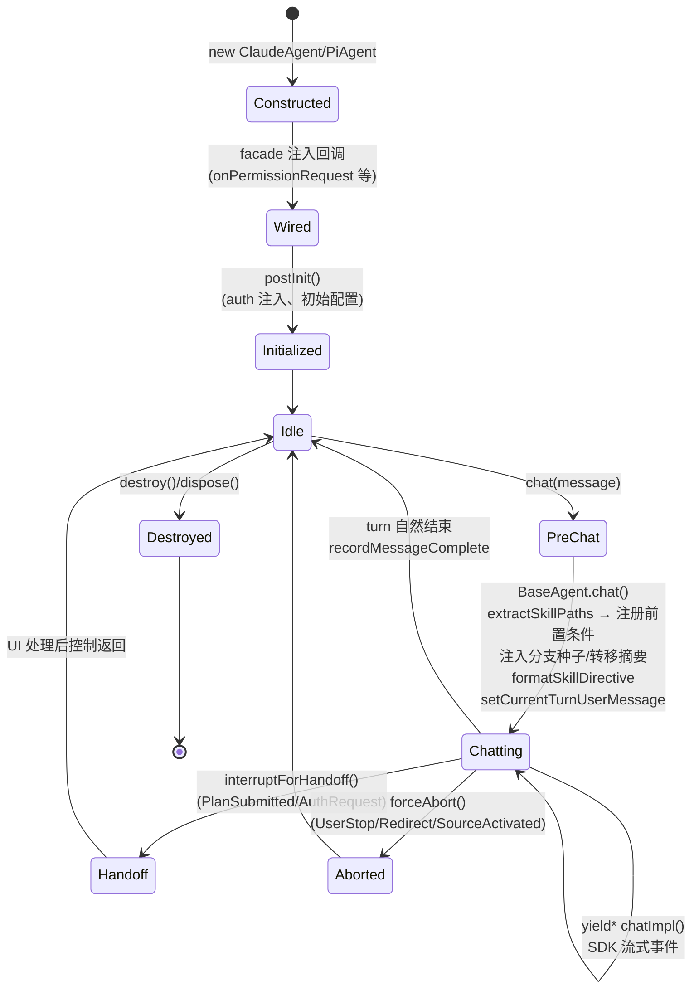
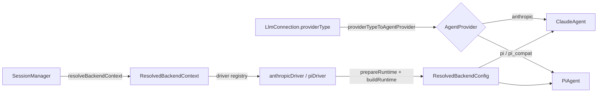
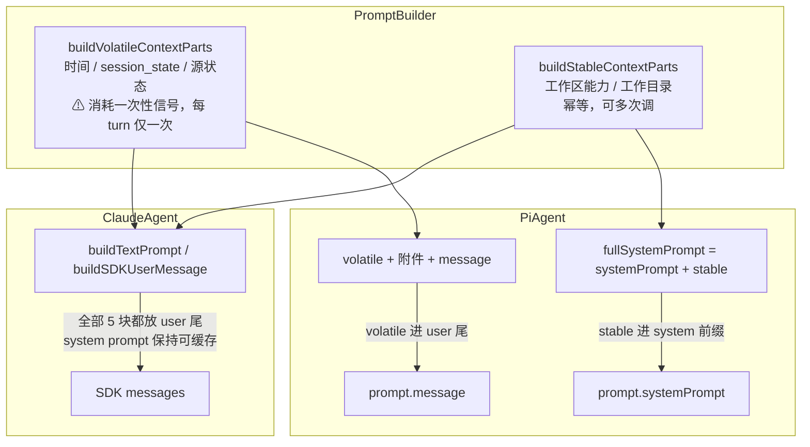
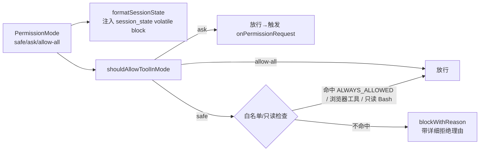
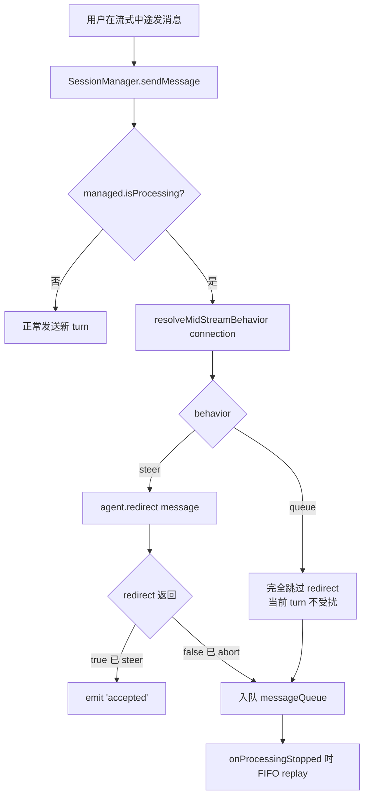
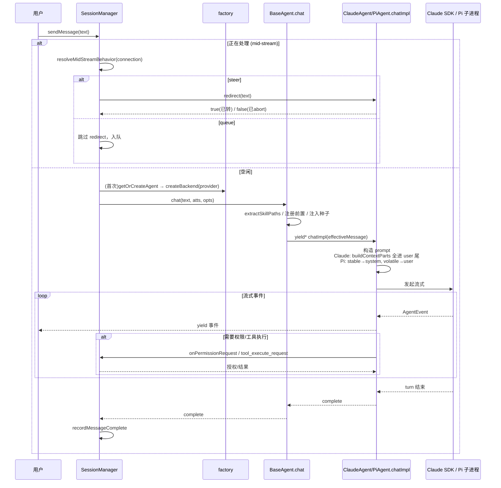

# 核心机制：Agent 内核（三层抽象、生命周期、Prompt、权限、Mid-Stream）

> 适用范围：`packages/shared/src/agent/`、`packages/pi-agent-server/`、`packages/session-tools-core/`、`packages/server-core/src/sessions/SessionManager.ts`
> 忽略：测试文件、`dist`、`node_modules`、lock 文件。

---

## 这是什么机制

**它是什么**：Craft Agents 在两套异构 AI SDK（Anthropic 的 `@anthropic-ai/claude-agent-sdk` 与 `@earendil-works/pi-coding-agent`）之上，建立了一层「Agent 内核」，由三类角色组成：

- `AgentBackend`（接口）—— 所有后端必须实现的统一契约；
- `BaseAgent`（抽象类）—— 收敛两套 SDK 的公共生命周期、权限、源管理、Prompt 构造、技能注入逻辑；
- `ClaudeAgent` / `PiAgent`（具体类）—— 各自对接一套 SDK，只实现差异部分。

外层 `factory.ts` 根据 `providerType` 决定实例化哪一个；`SessionManager` 永远只面向 `AgentBackend` 接口编程。

**为什么需要它**：两套 SDK 的运行模型完全不同——Claude SDK 自 0.2.113 起是一个独立的原生 `claude` 二进制（不再跑在 Bun 下），而 Pi SDK 是 ESM + 重依赖、必须隔离到子进程。如果让 UI / Session 层直接调两套 SDK，每个特性（权限、技能、来源、流式中断）都要写两遍且极易漂移。内核抽象把「跨后端不变的部分」收进 `BaseAgent`，把「后端特异的部分」下沉到子类，使得新增一家模型厂商（OpenAI、Bedrock、Ollama……）只需走 Pi 通道，不必再造一个 backend。

**设计核心**：

1. **模板方法 + 接口双约束**：`AgentBackend` 是对外契约（接口），`BaseAgent.chat()` 是模板方法（收敛技能/分支种子/恢复上下文），`chatImpl()` 是后端特异点。生命周期、权限、Prompt 三条横切关注点都在基类收敛。
2. **Volatile / Stable Prompt 分离**（issue #862）：每 turn 把易变上下文（时间、session_state、源状态）放 user 尾，稳定上下文（工作区能力、工作目录）放 system 前缀——保住 prompt cache。
3. **Driver Registry**：把 provider 特异的「运行时解析 / 模型发现 / 连接校验」收进 `anthropicDriver` / `piDriver`，factory 本身不分支 provider 字符串。

---

## 三层抽象：类层次

```mermaid
classDiagram
    class AgentBackend {
        <<interface>>
        +chat(message, attachments?, options?) AsyncGenerator~AgentEvent~
        +abort(reason?) Promise~void~
        +forceAbort(reason: AbortReason) void
        +interruptForHandoff(reason: AbortReason) void
        +redirect(message) boolean
        +runMiniCompletion(prompt) Promise~string|null~
        +queryLlm(request) Promise~LLMQueryResult~
        +postInit() Promise~PostInitResult~
        +destroy() / dispose() void
        +getModel() / setModel() / getThinkingLevel()
        +getPermissionMode() / setPermissionMode()
        +setSourceServers(mcp, api, slugs?) void
        +onPermissionRequest: PermissionCallback|null
        +onPlanSubmitted / onAuthRequest / onSourceChange
    }
    class BaseAgent {
        <<abstract>>
        #backendName: string
        #permissionManager: PermissionManager
        #sourceManager: SourceManager
        #promptBuilder: PromptBuilder
        #usageTracker: UsageTracker
        #prerequisiteManager: PrerequisiteManager
        +chat()* 模板方法
        #chatImpl(message, atts, opts)* AsyncGenerator
        +abort()* / +forceAbort()*
        +redirect(msg) → forceAbort(Redirect)
        +interruptForHandoff(reason) → forceAbort(reason)
        +getMiniAgentConfig()
        #extractSkillPaths(message)
        #formatSkillDirective(paths)
    }
    class ClaudeAgent {
        +backendName = 'Claude'
        -pendingSteerMessage: string|null
        -currentQueryAbortController
        +redirect(msg): 存消息→PreToolUse 注入
        +interruptForHandoff(): query.interrupt()
        +forceAbort(): AbortController.abort()
        +queryLlm(): SDK query() with OAuth
    }
    class PiAgent {
        +backendName = 'Craft Agents Backend'
        -subprocess: 子进程(JSONL stdio)
        -piSessionId
        +redirect(msg): send({type:'steer'}) → true
        +forceAbort(): send({type:'abort'})
        +send(msg): 写 stdin JSONL
        +killSubprocess()
    }

    AgentBackend <|.. BaseAgent : implements
    BaseAgent <|-- ClaudeAgent : extends
    BaseAgent <|-- PiAgent : extends
```

> 源码锚点：
> - 接口 `AgentBackend`：`packages/shared/src/agent/backend/types.ts:337`
> - 抽象基类 `BaseAgent`：`packages/shared/src/agent/base-agent.ts:162`
> - `ClaudeAgent extends BaseAgent`：`packages/shared/src/agent/claude-agent.ts:471`（向后兼容别名 `CraftAgent` 见 `claude-agent.ts:2900`）
> - `PiAgent extends BaseAgent`：`packages/shared/src/agent/pi-agent.ts:157`
> - factory 分支：`packages/shared/src/agent/backend/factory.ts:132`（`createBackend` 按 `config.provider` 选类）

### 三层各自的 What / Why / How

| 层 | What（是什么） | Why（为什么存在） | How（实现要点） |
|---|---|---|---|
| `AgentBackend`（接口） | 所有 AI 后端的统一对外契约：chat / abort / redirect / runMiniCompletion / 权限回调 / 源管理。 | 让 `SessionManager`、UI、自动化系统对「Anthropic 还是 Pi」无感。换 provider 只换实现，不动调用方。 | `types.ts` 定义 ~40 个方法 + 7 个回调字段（`onPermissionRequest` 等）。回调由 facade 在构造后注入。 |
| `BaseAgent`（抽象类） | 收敛「跨后端不变」的横切逻辑：构造核心模块、技能/来源/分支种子注入、模板方法 `chat()`、mini-agent 配置、恢复上下文、共享 title 生成。 | 避免两套 SDK 各写一遍技能解析、权限模式快照、上下文块构造而漂移。 | 模板方法 `chat()` 先做 `extractSkillPaths()` + 注册前置条件 + 注入分支种子/转移摘要，再 `yield* chatImpl()`；`chatImpl/abort/forceAbort/runMiniCompletion/queryLlm` 为抽象方法。 |
| `ClaudeAgent` / `PiAgent`（具体类） | 各自对接一套 SDK 的「差异部分」：进程模型、steer 机制、thinking 映射、Prompt 落点。 | 两套 SDK 的运行/中断/缓存模型根本不同，必须由子类特化。 | Claude：原生二进制 + AbortController + PreToolUse hook 做权限与 emulated steer；Pi：JSONL-over-stdio 子进程 + 原生 `.steer()`。 |

---

## 生命周期：如何在 BaseAgent 收敛

**它是什么**：一个 turn 从「用户消息进入」到「流式产出结束 + 资源清理」的状态流转，且这套流转的公共部分写死在 `BaseAgent`，只有「真正调 SDK 跑流」和「如何中止」交给子类。

**为什么需要它**：技能读取前置条件、分支会话种子、跨机器转移摘要、权限模式快照、token 用量追踪这些逻辑与后端无关；若由两个子类各写一遍，会出现「Claude 注入了技能但 Pi 没注入」这类隐性不一致。基类模板方法保证顺序与一致性。



### 调用链：chat() 模板方法

```
SessionManager.sendMessage
  → BaseAgent.chat(message, attachments, options)        base-agent.ts:1008
    → extractSkillPaths(message)                          base-agent.ts:930  (技能/@mention 解析)
    → prerequisiteManager.registerSkillPrerequisites()    base-agent.ts:1022 (注册前置：读完 SKILL.md 才放行工具)
    → buildBranchSeedContext() / buildTransferredSessionContext()  (一次性隐藏上下文)
    → formatSkillDirective(skillPaths)                    base-agent.ts:990
    → effectiveMessage = [分支种子, 转移摘要, 读指令, 干净消息].join
    → setCurrentTurnUserMessage(cleanMessage)             base-agent.ts:1047
    → yield* chatImpl(effectiveMessage, ...)              base-agent.ts:1069 (抽象，子类实现)
        ├── ClaudeAgent.chatImpl → SDK query() 流式
        └── PiAgent.chatImpl → send({type:'prompt'}) 到子进程
    → finally: setCurrentTurnUserMessage(null)
```

> 关键证据：
> - 模板方法注释明确「All skill logic is handled here — chatImpl never sees skill paths」(`base-agent.ts:1004-1007`)。
> - `interruptForHandoff` 默认实现是 `forceAbort(reason)`（`base-agent.ts:1092`）；`ClaudeAgent` 覆写为协作式中断 `currentQuery.interrupt()`（`claude-agent.ts:2506`）。
> - 中止语义区分：**硬中止**（`UserStop`、redirect 兜底）用 `forceAbort`；**UI 交接中断**（`PlanSubmitted`、`AuthRequest`）用 `interruptForHandoff`——见 `AbortReason` 枚举 (`core/session-lifecycle.ts:22`)。

---

## 后端选择：Factory + Driver Registry

**它是什么**：`createBackend(config)` 根据 `config.provider`（`'anthropic'` 或 `'pi'`）实例化对应类；而 `provider` 由 `providerTypeToAgentProvider(connection.providerType)` 从存储的 LLM 连接推导。

**为什么需要它**：UI 存的是「连接」（带 providerType / authType / 模型列表），而内核要的是「AgentProvider」。这层映射把存储模型与运行模型解耦，并保证「新增厂商优先走 Pi 通道」这条规则集中在一处。



> 源码锚点：
> - `providerTypeToAgentProvider`：`factory.ts:251`（`anthropic→anthropic`；`pi`/`pi_compat→pi`）
> - `createBackend` switch：`factory.ts:132`
> - Driver Registry `DRIVER_REGISTRY`：`factory.ts:63`（`anthropicDriver` / `piDriver`）
> - 从连接解析：`createBackendFromConnection` → `createBackendFromResolvedContext` (`factory.ts:528` / `:158`)

---

## Prompt 构造：Volatile / Stable 分离（issue #862 核心设计）

**它是什么**：每 turn 的「附加上下文」被切成两组：
- **Volatile（易变）**：日期时间、`session_state`（含权限模式 + plans/data 路径 + 一次性 mode-change 信号）、源状态——每 turn 都可能变；
- **Stable（稳定）**：工作区能力（local-mcp 开关）、工作目录——会话内不变。

`PromptBuilder` 提供 `buildVolatileContextParts()` 与 `buildStableContextParts()` 两个纯函数式构造器，`buildContextParts()` 把两者拼接（向后兼容）。

**为什么需要它**：把易变内容塞进 system prompt，会让每分钟/每 turn 重盖时间戳，**作废 prompt cache 的前缀**，连带整条历史的缓存命中归零（`cacheRead=0`）。分离后：Claude 全部上下文走 user 尾、system 保持可缓存；Pi 把稳定块折进 system 前缀、易变块走 user 尾——否则同样击穿 pi-ai 的缓存前缀。

**核心约束（极易踩坑）**：`buildVolatileContextParts` 会 **consume 一次性 mode-change 信号**（`consumeModeChangeUserSignal`），所以 **每个 turn 必须且只能调用一次**。绝不能为了算 cache-debug hash 再调一次——要对已产出的字符串算 hash。



> 源码锚点：
> - `buildVolatileContextParts`：`core/prompt-builder.ts:105`（注释明确「MUST be called exactly once per turn」）
> - `buildStableContextParts`：`core/prompt-builder.ts:146`（「Pure and idempotent」）
> - Pi 分流：`pi-agent.ts:2050-2067`（注释引用 #862）
> - Claude 走 user 尾：`claude-agent.ts:2168` / `:2214`（`buildContextParts` 结果全部 push 进 user 内容块）

### 系统提示本身如何组装

系统提示由 `getSystemPrompt()`（`prompts/system.ts:346`）组装，结构为：

```
basePrompt（getCraftAssistantPrompt：含工作区路径、环境标记、技能/浏览器工具说明）
+ preferences（formatPreferencesForPrompt：用户偏好）
+ debugContext（仅 debug 模式：日志路径 + rg 查询示例）
+ projectContextFiles（monorepo 的 AGENTS.md / CLAUDE.md 列表，放 system 以抗 compaction）
```

注意：日期/时间、安全模式上下文**故意不放 system prompt**（`system.ts:372-374` 注释），就是为了保缓存。

### 技能 / 来源 / @mention 注入

- **技能 `[skill:slug]`**：`BaseAgent.extractSkillPaths()`（`base-agent.ts:930`）解析 `[skill:slug]` / `[skill:workspaceId:slug]` mention，解析成 `SKILL.md` 绝对路径，但**不读取文件**——由 `formatSkillDirective()` 生成「必须先用 Read 读这些文件」的指令，并经 `PrerequisiteManager` 在工具调用前拦截，直到读完才放行。
- **源状态**：`sourceManager.formatSourceState()` 产出 volatile block，注入 user 尾。
- **附件**：文本类只放路径占位（`[Attached file: x] [Stored at: y]`），由 agent 用 Read 读取——避免大文件内联撑爆上下文；图片/PDF 才内联。

### 关于 `{{SESSION_PATH}}` 占位符的核实结果

研究目标提到「`{{SESSION_PATH}}` 等占位符」。**实测在 `prompts/system.ts` 中未发现任何 `{{...}}` 模板占位符**（`grep '{{'` 无命中）。session/data/plans 路径是以**普通文本字符串**形式直接拼进 `session_state` block（`formatSessionState`），而非模板替换。该描述应视为不准确——已如实记录于「待解决疑问」。

---

## 权限三级：safe / ask / allow-all

**它是什么**：固定三档权限模式（内部键 `safe` / `ask` / `allow-all`，UI 显示名 `Explore` / `Ask` / `Execute`），决定工具执行前的拦截策略。

**为什么需要它**：提供「只读探索 / 逐次确认 / 全自动」三档安全姿态，让用户在信任度与生产力间权衡。三档是**硬编码固定**的（`packages/shared/CLAUDE.md` 明确「Permission modes are fixed」）。

| 内部键 | UI 名 | 语义 |
|---|---|---|
| `safe` | Explore | 只读探索。硬编码阻止 `Write/Edit/MultiEdit/NotebookEdit`，Bash/MCP/API 按 `permissions.json` 白名单放行只读命令，从不弹窗。 |
| `ask` | Ask to Edit | 放行所有工具，但执行前弹窗确认。 |
| `allow-all` | Execute | 全自动，无提示。 |

### 权限如何注入与求值



> 源码锚点：
> - 类型与映射：`mode-types.ts:24`（`PermissionMode`）、`:34`（`PERMISSION_MODE_ORDER = ['safe','ask','allow-all']`）、`:39`（canonical 映射 `safe→explore` 等）
> - `SAFE_MODE_CONFIG` 硬编码阻止集：`mode-types.ts:265`（`blockedTools = {Write, Edit, MultiEdit, NotebookEdit}`）
> - 求值：`shouldAllowToolInMode()` 在 `mode-manager.ts:1803`（`allow-all`/`ask` 直接放行，仅 `safe` 走白名单）
> - 注入：`formatSessionState()` 把当前 mode 写进 volatile context（`prompt-builder.ts:121`）
> - 会话工具自带 `safeMode` 标记：`session-tools-core/src/tool-defs.ts:498`（如 `source_oauth_trigger` 在 Explore 模式 `block`）

---

## Thinking 等级

**它是什么**：六档扩展推理强度 `off / low / medium / high / xhigh / max`（默认 `medium`），单一真源 `THINKING_LEVEL_IDS`。

**为什么需要它**：让用户在「快」与「深思」间调节；同时把 Craft 的抽象等级映射到两家 SDK 各自不同的参数形态。

| 后端 | 映射方式 | 关键点 |
|---|---|---|
| Claude | `THINKING_TO_EFFORT` → `thinking:{type:'adaptive'}, effort` | Haiku 不支持 adaptive；Mythos 类（Fable 5）thinking **永远开**、API 拒绝 `disabled`，`off` 退化为 `adaptive + effort:'low'`。 |
| Pi | `THINKING_TO_PI` → Pi `reasoning_effort` | Pi 上限是 `xhigh`，Craft 的 `max` 在此**饱和**为 `xhigh`。 |

> 源码锚点：
> - 等级定义与 `getThinkingTokens`：`thinking-levels.ts:28` / `:115`
> - Claude 映射 `resolveClaudeThinkingOptions`：`claude-agent.ts:139`（`isAdaptiveThinkingAlwaysOnModel` 检测 Mythos）
> - Pi 映射 `THINKING_TO_PI`：`backend/pi/constants.ts:15`
> - Mythos 说明：`packages/shared/CLAUDE.md` 末尾「Mythos-class thinking」段

---

## Mid-Stream 行为：steer vs queue

**它是什么**：用户在 agent 流式输出**中途**发送新消息时，内核决定是**打断并转向**（steer，把消息送进当前 turn）还是**排队等下一 turn**（queue）。

**为什么需要它**：两套 SDK 的「中途插入」能力与代价不同，硬选一种会要么破坏上下文（Claude 无原生 steer），要么牺牲响应性（Pi 明明能 steer 却被排队）。所以做成**每连接可配 + provider 默认**。

### 决策机制：resolveMidStreamBehavior()



**默认值**（`defaultMidStreamBehavior`，`llm-connections.ts:475`）：

- `'anthropic' → 'queue'`：Claude 的 steer 是**模拟**（见下），若本 turn 没有工具调用就结束，steer 会变成 `steer_undelivered` 还得重新排队——白白付了原 turn 的 token。默认排队更可预测。
- `'pi' / 'pi_compat' → 'steer'`：Pi 原生 `.steer()` 非破坏性（当前工具跑完后投递，全上下文保留），无副作用，默认即转。

**单一真源约束**：所有判断必须经 `resolveMidStreamBehavior()`（`llm-connections.ts:487`），**禁止直接按 providerType 分支**——因为旧连接没有该字段，要靠 resolver 回落默认。决策**只发生在 `SessionManager.sendMessage` 的 mid-stream 分支**（`SessionManager.ts:5480`），backend 代码不变。

### redirect() 的两套实现（差异收敛点）

| 后端 | `redirect()` 实现 | 返回 | 机制 |
|---|---|---|---|
| **PiAgent** | `send({type:'steer', message})` 到子进程 | `true`（已 steer） | 子进程 `processMessage('steer')` → `piSession.steer()` (`pi-agent-server/src/index.ts:1718`)；事件继续走原 generator，**不 abort**。 |
| **ClaudeAgent** | 存入 `pendingSteerMessage`，不立即 abort | `true` | 下一次 `PreToolUse` hook 触发时，把消息作为 `additionalContext` 注入（`claude-agent.ts:1140`）；若本 turn **没有任何工具调用**就结束，则 yield `steer_undelivered`（`claude-agent.ts:2138`），由 session 层重新排队。 |
| **默认（BaseAgent）** | `forceAbort(Redirect)` | `false` | 不支持 steer 的后端兜底。 |

> queue 模式：`SessionManager` **完全跳过 `agent.redirect()`**，当前 turn 自然跑到结束，新消息进 `messageQueue`，在 `onProcessingStopped` 时 FIFO 重放（`SessionManager.ts:5488-5530`）。

---

## Pi 后端：子进程与通信

**它是什么**：`PiAgent` 在主进程，真正的 Pi SDK 交互（建会话、prompt、工具执行、权限）在 `pi-agent-server` **子进程**里完成，二者用 **JSONL over stdio** 通信。

**为什么需要它**：Pi SDK 是 ESM + 重依赖，直接进 Electron 主进程会有打包/隔离问题；独立子进程把它的依赖边界与主进程隔离（`pi-agent-server/src/index.ts:5-13` 注释）。Claude SDK 则是原生二进制，不走这条路。

### 通信协议

- **主 → 子（stdin）**：`init` / `prompt`（带 `systemPrompt` + `message` + images）/ `register_tools` / `tool_execute_response` / `pre_tool_use_response` / `abort` / `steer` / `mini_completion` / `llm_query` / `set_model` / `set_thinking_level` / `compact` / `update_runtime_config` / `token_update` / `shutdown`（`index.ts:132-150`）。
- **子 → 主（stdout）**：`ready` / `event`（转发 Pi SDK 事件）/ `pre_tool_use_request` / `tool_execute_request` / `session_tool_completed` / `mini_completion_result` / `llm_query_result` 等。
- **调试日志走 stderr**（避免污染 JSONL 协议，`index.ts:290`）。

工具执行与权限通过「请求-响应」往返：子进程遇到工具调用 → 发 `tool_execute_request`/`pre_tool_use_request` 给主进程 → 主进程执行/求值后回 `tool_execute_response`/`pre_tool_use_response`。

---

## 工具路由：session-tools-core 统一两套 SDK

**它是什么**：会话级工具（SubmitPlan、source_test、各种 OAuth、call_llm、spawn_session、browser_tool、send_agent_message 等）在 `SESSION_TOOL_DEFS`（`tool-defs.ts:529`）**集中定义一次**，每个工具带 `executionMode` + `safeMode` + `readOnly` 元数据，两套 SDK 共用。

**为什么需要它**：避免「Claude 用一套工具描述、Pi 用另一套」导致的契约漂移。集中定义让权限（safeMode）、只读并行（readOnly）、执行位置（executionMode）单点可改。

| `executionMode` | 含义 | 例子 |
|---|---|---|
| `'registry'` | 用统一的 handler 函数执行，两套 SDK 共用 | `SubmitPlan`、`source_test`、`config_validate` |
| `'backend'` | 由后端特异适配器实现（Claude in-process / Pi 子进程 / session-mcp-server） | `call_llm`、`spawn_session`、`browser_tool` |

> 工具名归一化：Pi SDK 用小写工具名（`read`/`bash`），权限系统用 PascalCase（`Read`/`Bash`），由 `PI_TOOL_NAME_MAP`（`backend/pi/constants.ts:31`）统一。

---

## 完整调用链：用户消息 → backend → prompt → 流式 → mid-stream 决策



---

## 关键设计决策

### 1. 为什么不让 UI 直接调 SDK？

UI / `SessionManager` 只面向 `AgentBackend` 接口，从不 import `ClaudeAgent` 或 `PiAgent`，更不碰 SDK。好处：

- **换 provider 零改 UI**：新增厂商走 Pi 通道即可。
- **生命周期/权限集中**：技能前置条件、mode 快照、恢复上下文这些横切逻辑只在 `BaseAgent.chat()` 写一次。
- **进程隔离由 backend 自己管**：UI 不需要知道 Claude 是原生二进制、Pi 是 JSONL 子进程。

### 2. 为什么 volatile / stable 要分离？

如果不分，把每 turn 都变的时间戳/session_state 塞进 system prompt，会**击穿 prompt cache 前缀**，导致 cacheRead 归零、整条历史重算——这是 #862 的根因。分离后 Claude 全走 user 尾、system 保持可缓存；Pi 把稳定块进 system 前缀、易变块走 user 尾，保住 pi-ai 缓存。

### 3. 为什么 mid-stream 要 steer vs queue 双模式 + provider 默认？

两套 SDK 的中途插入代价不对称：Pi 原生 steer 无副作用，Claude 的模拟 steer 在「无工具调用」时失败。统一选一种要么浪费 Pi 的能力，要么让 Claude 白烧 token。做成「每连接可配 + provider 默认 + 单一 resolver」既给用户控制权，又保证旧连接与异常值有合理回落。

### 4. 为什么硬中止与 UI 交接中断要区分？

`forceAbort`（SIGTERM/SIGKILL 级，立即终止）用于真取消；`interruptForHandoff`（协作式，如 Claude 的 `query.interrupt()`）用于「Plan 提交 / Auth 请求」这种**暂停点**——控制权交给 UI 后还可能回来。混用会在写控制信号中途硬中止，留下脏状态（见 `claude-agent.ts:2506` 注释）。

---

## 文件索引（均为绝对路径）

| 主题 | 文件 | 关键符号 |
|---|---|---|
| 后端接口 | `packages/shared/src/agent/backend/types.ts` | `AgentBackend` (`:337`) |
| 抽象基类 | `packages/shared/src/agent/base-agent.ts` | `BaseAgent` (`:162`)、`chat()` (`:1008`)、`chatImpl` (`:1069`) |
| Claude 后端 | `packages/shared/src/agent/claude-agent.ts` | `ClaudeAgent` (`:471`)、`redirect` (`:2488`)、`resolveClaudeThinkingOptions` (`:139`) |
| Pi 后端 | `packages/shared/src/agent/pi-agent.ts` | `PiAgent` (`:157`)、prompt 分流 (`:2050`)、`redirect` (`:2302`) |
| Factory | `packages/shared/src/agent/backend/factory.ts` | `createBackend` (`:132`)、`providerTypeToAgentProvider` (`:251`)、Driver Registry (`:63`) |
| Prompt 构造 | `packages/shared/src/agent/core/prompt-builder.ts` | `buildVolatileContextParts` (`:105`)、`buildStableContextParts` (`:146`) |
| 系统提示 | `packages/shared/src/prompts/system.ts` | `getSystemPrompt` (`:346`) |
| 权限模式 | `packages/shared/src/agent/mode-types.ts`、`mode-manager.ts` | `PermissionMode` (`mode-types.ts:24`)、`shouldAllowToolInMode` (`mode-manager.ts:1803`) |
| Thinking | `packages/shared/src/agent/thinking-levels.ts`、`backend/pi/constants.ts` | `THINKING_LEVEL_IDS`、`THINKING_TO_PI` (`constants.ts:15`) |
| Mid-stream | `packages/shared/src/config/llm-connections.ts` | `MidStreamBehavior` (`:129`)、`resolveMidStreamBehavior` (`:487`)、`defaultMidStreamBehavior` (`:475`) |
| Mid-stream 决策点 | `packages/server-core/src/sessions/SessionManager.ts` | sendMessage mid-stream 分支 (`:5480`) |
| Pi 子进程 | `packages/pi-agent-server/src/index.ts` | JSONL 协议 (`:132`)、`processMessage` (`:1660`)、`steer` (`:1718`) |
| 工具统一 | `packages/session-tools-core/src/tool-defs.ts` | `SESSION_TOOL_DEFS` (`:529`)、`executionMode` (`:495`) |
| 中止原因 | `packages/shared/src/agent/core/session-lifecycle.ts` | `AbortReason` 枚举 (`:22`) |

---

## 待解决疑问

1. **`{{SESSION_PATH}}` 占位符**：研究目标提及，但 `prompts/system.ts` 实测无 `{{...}}` 模板语法。session/plans/data 路径以普通文本拼进 `session_state` block（`formatSessionState`）。如确有占位符机制，应在 `mode-manager.ts` 的 `formatSessionState` 内部——需进一步核实该函数实现。
2. **`update_runtime_config` 的 in-place 重启签名**：CLAUDE.md 提到 `runtime-config.ts:buildRestartRequiredSignature`，本次未深入；Pi 子进程「哪些字段能热更、哪些必须 dispose+recreate」需单独核实 `runtime-resolver.ts`。
3. **网络拦截器（unified-network-interceptor）**：仅 Pi 侧通过 Bun `--preload` 注入子进程；Claude 原生二进制无此机制，相关 Phase-2 功能（rich tool intent 等）如何回填未在本次范围。
