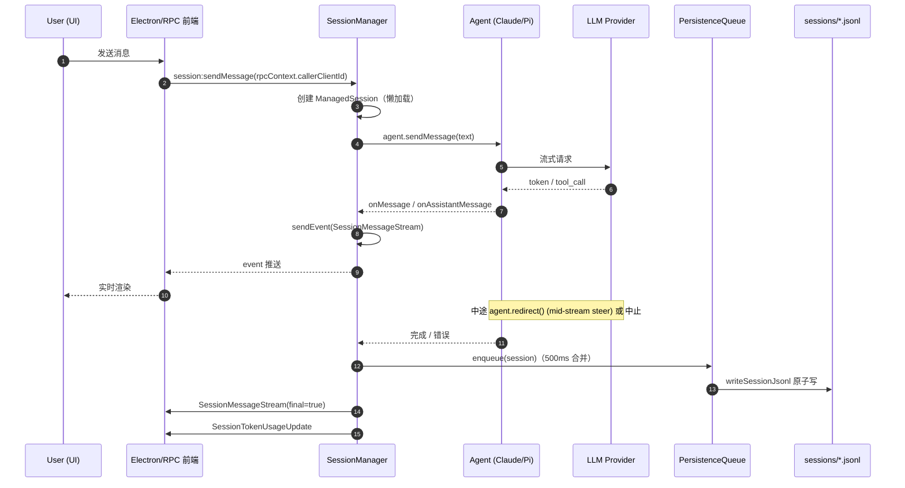
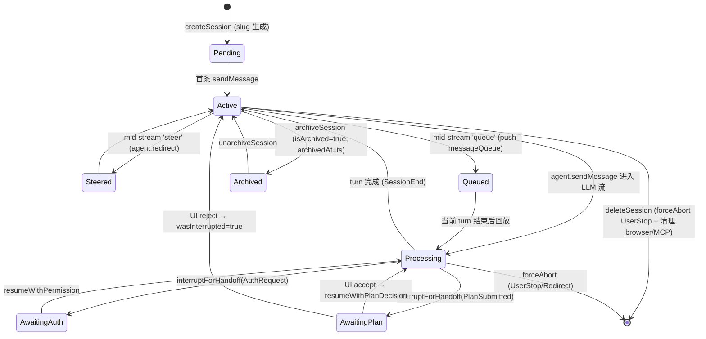

# Session 生命周期与传输协议

> Craft Agents 代码研究 · 第 3 章
> 适用版本：2026-06 工作树
> 范围：`packages/shared/src/sessions/**`、`packages/server-core/src/sessions/**`、`packages/server-core/src/transport/**`、`packages/shared/src/protocol/**`、`apps/electron/src/transport/**`、`apps/cli/src/**`、`packages/server/src/index.ts`

## 0. 概览

Craft Agents 把 "对话" 视作一条完整的生命周期：从工作区下的一个目录开始，落地为 JSONL 文件，跨进程通过 WebSocket 传输，最终与 Claude / Pi Agent 子进程绑定。本章回答七个问题：

1. **What/Why**：SessionManager 到底承担什么职责？
2. **持久化**：JSONL 文件、状态字段、bundle、队列、slug 生成是如何组织的？
3. **传输三态**：Electron / RPC-WS / CLI 三种入口有什么异同？
4. **统一契约**：能力协商、推送通道、二进制流、错误与中断如何统一？
5. **生命周期事件**：有哪些 Session 事件、如何路由？
6. **远端鉴权**：TLS、Bearer、明文拒绝策略如何落地？
7. **Handoff 语义**：硬中断与 UI 移交、远程摘要注入如何区分？

## 1. What/Why：SessionManager

`SessionManager`（`packages/server-core/src/sessions/SessionManager.ts:1102-1305`）是 **每个后端进程内的单例编排器**，把三件事缝在一起：

| 维度 | 实现 |
|------|------|
| 内存态 | `sessions: Map<string, ManagedSession>` —— 每个 `ManagedSession` 持有 `agent`、`messageQueue`、`isProcessing`、`wasInterrupted`、`llmConnection`、`browserHost` 等 |
| 持久化 | 通过 `SessionPersistenceQueue` 异步落盘 |
| 传输 | 通过 `setRpcServer(server)` 绑定 `WsRpcServer`，借助 `setEventSink` 推送广播事件 |
| 浏览器托管 | 通过 `setBrowserPaneManager` + 每个 session 的 `browserHost` 实现"浏览器粘性"，避免在远程多客户端场景下乱开窗 |

它的存在让上层（Electron 主进程 / 无头 server / CLI）只感知到一个面向 "会话" 的 RPC 接口（`session:*`），而不必关心底层是 Claude SDK 子进程还是 Pi 子进程，也不必关心落盘格式。



## 2. 持久化层：JSONL、Bundle、Queue、Slug

### 2.1 JSONL 格式与原子写

每个会话对应一个工作区目录下的文件：`{workspaceRootPath}/sessions/{id}/session.jsonl`。文件结构（`packages/shared/src/sessions/jsonl.ts:80-164`、`packages/shared/src/sessions/types.ts:26-56`）：

- 第 1 行：`SessionHeader`，包含所有持久化字段 + 预计算字段（`messageCount`、`preview`、`lastMessageRole`、`tokenUsage`、`lastFinalMessageId`）。
- 第 2 行起：每行一条 `StoredMessage`。

写入采用 **临时文件 + rename** 的原子写策略（`writeSessionJsonl`，`packages/shared/src/sessions/jsonl.ts:150-164`）：

```
writeFileSync(tmp, lines.join('\n') + '\n')
unlinkSync(target)            // Windows 兼容
renameSync(tmp, target)
```

这样即使进程崩溃，要么旧文件完好，要么新文件完整，永远不会留下截断的半行。

### 2.2 快速列表：8KB 头读取

列表视图只读首行：

```ts
// packages/shared/src/sessions/jsonl.ts:80-97
const fd = openSync(sessionFile, 'r');
const buffer = Buffer.alloc(8192);
const bytesRead = readSync(fd, buffer, 0, 8192, 0);
```

读取后 `expandSessionPath` 把可移植 token `{{SESSION_PATH}}` 还原成绝对路径，避免在不同机器上硬编码绝对路径。`makeSessionPathPortable`（同文件 30-41 行）负责写盘前的反向替换，覆盖 JSON 字符串里所有出现的位置（datatable src、planPath、attachment storedPath 等）。

### 2.3 SESSION_PERSISTENT_FIELDS：单一来源

`packages/shared/src/sessions/types.ts:26-56` 维护一个常量数组 `SESSION_PERSISTENT_FIELDS`，列出所有需要落盘的字段。`pickSessionFields()`（`sessions/utils.ts`）据此从内存对象抽取，确保新字段**一处添加、到处生效**——`SessionConfig`、`SessionHeader`、`SessionMetadata` 都靠它派生。

关键字段分组：

- **身份**：`id`、`workspaceRootPath`、`sdkSessionId`、`sdkCwd`
- **时间戳**：`createdAt`、`lastUsedAt`、`lastMessageAt`
- **配置**：`permissionMode`、`previousPermissionMode`、`workingDirectory`、`thinkingLevel`
- **模型/连接**：`model`、`llmConnection`、`connectionLocked`
- **分支**：`branchFromMessageId`、`branchFromSdkSessionId`、`branchFromSessionPath`、`branchFromSdkCwd`、`branchFromSdkTurnId`
- **远程移交**：`transferredSessionSummary`、`transferredSessionSummaryApplied`
- **自动化**：`triggeredBy`（`{automationName, event, timestamp}`）

### 2.4 SessionPersistenceQueue：合并 + 签名比对

`packages/shared/src/sessions/persistence-queue.ts:59-241` 实现了每个 session 一个队列项，500ms 防抖：

- `enqueue(session)` 计算元数据签名（`computeMetadataSignature`），如果与队首一致则跳过，避免 UI 频繁刷新触发无效 IO。
- 持久化时调用 `writeSessionJsonl` + 触发 `onExternalChange` 钩子。
- 比较签名时忽略 `lastUsedAt`、`tokenUsage` 等高频变化字段，只关注结构性变化。

### 2.5 Slug 生成：YYMMDD-adjective-noun

`packages/shared/src/sessions/slug-generator.ts:49-78`：

```ts
function generateUniqueSessionId(existingIds, date = new Date()): string {
  // 100 次 adjective-noun 组合 + 2..99 数字后缀
  // 最终兜底：4 位随机 hex
}
```

- 前缀时间排序（`generateDatePrefix`，YYMMDD）。
- ~20,000 组合/天，碰撞处理自动加 `-2`、`-3`……
- `parseSessionId` / `isHumanReadableId` 用于判定会话 ID 是否是新型人类可读格式。

### 2.6 存储目录布局

`packages/shared/src/sessions/storage.ts:70-115`：`ensureSessionDir` 创建子目录 `plans/`、`attachments/`、`long_responses/`、`data/`、`downloads/`，每个会话是一个完整的微文件系统。

### 2.7 SessionBundle：搬家/分叉的载荷

`packages/shared/src/sessions/bundle.ts:60-74`：

```ts
interface SessionBundle {
  version: 1;
  session: { header: SessionHeader; messages: StoredMessage[] };
  files: BundleFile[];      // 路径相对化后的附件
  branchInfo?: { ... };
}
```

Bundle 把 session 的 header + 消息 + 关联文件打包，用于"移动到另一个工作区"或"分叉出新 session"的远程调度（与远程移交摘要配合，见 §7）。

## 3. 传输层：三态对比

Craft Agents 不为 Electron 单独写一套 `ipcMain/ipcRenderer`，而是 **所有入口都跑在 WsRpcServer + WsRpcClient 之上**。差异仅在客户端包装方式与部署形态。

| 维度 | Electron 桌面 | RPC over WebSocket（无头 server） | CLI |
|------|---------------|------------------------------------|-----|
| 服务端启动 | `apps/electron/src/main/index.ts` 内嵌 `bootstrapServer`，在同一进程起 `WsRpcServer.listen()` | `packages/server/src/index.ts` 独立可执行，`bootstrapServer` + 显式 `listen()` | CLI 临时 `spawnServer`（`apps/cli/src/server-spawner.ts:55-149`），UUID token，stdout 解析 URL |
| 客户端 | `WsRpcClient`（`packages/server-core/src/transport/client.ts:109`）+ `RoutedClient`（`apps/electron/src/transport/routed-client.ts:40-255`）make-before-break | 同样是 `WsRpcClient`，但常驻单一工作区 | `CliRpcClient`（`apps/cli/src/client.ts:38-239`）极简：无自动重连、无能力广播 |
| 能力协商 | `LOCAL_CLIENT_CAPABILITIES`（openExternal/openFileDialog/confirmDialog/browser:invoke 等）通过 handshake 上报 | 服务端进程可能只暴露 `REMOTE_ELIGIBLE` 能力 | CLI 几乎不上报能力，只做最低限度的 request/response |
| 鉴权 | 本地 loopback，通常无 token | `CRAFT_SERVER_TOKEN` bearer + 可选 TLS | UUID token 通过命令行参数传入子进程 |
| 重连 | `WsRpcClient` 自带重连：`reconnectClientId`、`lastSeq`、环形缓冲回放（`EVENT_BUFFER_MAX_SIZE=500`、TTL 30s） | 同上 | CLI 默认无重连，断线即退出 |
| 推送目标 | `RoutedClient` 把 `'all'`/`'workspace'`/`'client'` 路由到正确的本地或工作区客户端 | 单一连接，直接发送 | 单一连接，按 `PushTarget` 过滤 |
| 典型用法 | 桌面 GUI 多工作区 | 团队/服务器部署，被多个远程客户端连接 | `craft-agent chat --workspace .` 一次性命令行会话 |

### 3.1 WsRpcServer：握手与版本协商

`packages/server-core/src/transport/server.ts:122-365` 的 `listen()`：

1. 根据 `CRAFT_RPC_TLS_CERT/KEY/CA` 决定 `https` + `wss`，否则 `http` + `ws`；非 loopback 且无 TLS 直接拒绝（`packages/server/src/index.ts:315-336`）。
2. `onConnection`：先读 handshake，校验 `protocolVersion` 主版本号、`clientId`、可选 `reconnectClientId` 与 `lastSeq`。
3. 命中 reconnect 路径时进入缓冲回放：`server.ts:746-799` 的 `bufferAndMaybeSendEvent` 给每条 event 分配 `seq`，维护 `lastAckedSeq`，并在 `EVENT_BUFFER_MAX_SIZE=500` 或 TTL 30s 内可重放。
4. 60s 超时（`HANDLER_TIMEOUT_MS`，`server.ts:642-683`）防止 request 挂死。
5. 心跳 30s ping，连续两次未收到 pong 即 `terminate`。

### 3.2 WsRpcClient：自动重连与 `__transport:reconnected`

`packages/server-core/src/transport/client.ts:514-653` 的 `onMessage` 处理 6 类信封：

- `handshake_ack`：服务端确认能力、广播允许的事件名。
- `response` / `error`：匹配 `pendingRequests`。
- `request`：服务端反向调用客户端能力（`invokeClient`）。
- `event`：推送事件，校验 `seq` 是否连续，发现 gap 立即告警并触发重放请求。
- `sequence_ack`：服务端确认已收到 seq。
- 特殊事件 `__transport:reconnected`：客户端据此通知上层 "缓冲已回放完成"，上层可以选择刷新 UI。

`reconnectNow`（同文件 240-319）实现指数退避，恢复后用最近 `lastSeq` 请求缺口。

### 3.3 RoutedClient：多工作区 make-before-break

`apps/electron/src/transport/routed-client.ts:40-255`：Electron 主进程可能同时承载多个工作区，每个工作区对应一条到 server 的 `WsRpcClient`。`RoutedClient` 把 RPC 调用按 `workspaceId` 分发：

- `handleWorkspaceSwitch`：切换工作区前先把旧 client 标记 `draining`，新 client 建立（make）成功后再关闭旧的（break），避免切换瞬间丢消息。
- `setWorkspaceMapping`：把 workspaceId 映射到底层 client。
- 客户端能力由本地注册的处理器（openExternal 等）+ 远端上报组合而成。

### 3.4 build-api：从 CHANNEL_MAP 生成强类型代理

`apps/electron/src/transport/build-api.ts:25-65` 读 `CHANNEL_MAP`（`apps/electron/src/transport/channel-map.ts:19-420`，约 200 项），动态生成嵌套对象：

```
session.sendMessage(...)
config.update(...)
sources.list(...)
```

每个属性访问把路径拼成 dotted-key（如 `session.sendMessage`），最终走 `invoke('session.sendMessage', args)`。这样 `ElectronAPI` 的 TS 类型与 `CHANNEL_MAP` 严格一致，新增 RPC 方法只要改一处。

### 3.5 CliRpcClient：极简客户端

`apps/cli/src/client.ts:38-239` 只实现 `request` 与 `event` 监听，不维护 `clientId` 重连，也不上报能力。生命周期与一次 CLI 进程一致：发完消息 → 流式接收 → 退出。

## 4. 统一契约：能力、推送、二进制、错误

### 4.1 能力协商

`packages/server-core/src/transport/capabilities.ts:11-36` 定义常量：

```
CLIENT_OPEN_EXTERNAL
CLIENT_OPEN_PATH
CLIENT_SHOW_ITEM_IN_FOLDER
CLIENT_CONFIRM_DIALOG
CLIENT_OPEN_FILE_DIALOG
CLIENT_BROWSE_INVOKE
```

`LOCAL_CLIENT_CAPABILITIES` 是 Electron 桌面默认能力集合。客户端在 handshake 阶段把 `clientCapabilities` 数组上报，服务端在 `invokeClient` 前检查；缺失能力时直接返回 `ErrorCode.CAPABILITY_REQUIRED`，而不是降级执行。

`packages/server-core/src/transport/browser-capability.ts:11-86` 专门处理浏览器能力，定义 `BrowserCapabilityRequest` 与 `ScreenshotResultWire`：

```ts
interface ScreenshotResultWire {
  imageBytes: Uint8Array;   // 直接走 base64
  mime: string;
  width: number; height: number;
}
```

### 4.2 二进制：Uint8Array base64 编码

`packages/server-core/src/transport/codec.ts:1-156` 的线协议：

- envelope JSON 用 `u8 type` 前缀 + UTF-8 JSON。
- `Uint8Array` 字段在线上编码为 base64 字符串，`validateEnvelopeShape` 校验关键字段存在与类型匹配。
- 截图、附件等二进制一律走 `Uint8Array` → base64 → 反向解码，避免在 JSON 里嵌字符串编码带来的双重转义。

### 4.3 推送通道

`packages/shared/src/protocol/events.ts:18-73` 用 `BroadcastEventMap` 列出所有可广播事件类型。`PushTarget`（`packages/shared/src/protocol/types.ts`）取值：

- `'all'`：所有连接客户端。
- `'workspace'`：同一工作区的客户端。
- `'client'`：仅 `rpcContext.callerClientId` 指定的客户端。

服务端 `WsRpcServer.push()` 据此选择订阅集合，再按 §3.1 分配 `seq`。

### 4.4 错误与中断码

`packages/shared/src/protocol/types.ts:11-172` 定义：

- `ErrorCode`：`HANDLER_TIMEOUT`、`CAPABILITY_REQUIRED`、`WORKSPACE_NOT_FOUND`、`SESSION_NOT_FOUND`、`PERMISSION_DENIED`、`INTERNAL_ERROR` 等。
- `AbortReason`：`UserStop`、`Redirect`、`PlanSubmitted`、`AuthRequest`、`CompactionNeeded`。这些既用于 `forceAbort`（硬中止），也用于 `interruptForHandoff`（UI 移交）。
- `MessageEnvelope`：`request|response|event|error|handshake|handshake_ack|sequence_ack`。

## 5. 生命周期事件

`packages/shared/src/protocol/dto.ts:167-211` 用判别联合定义 40+ 种 `SessionEvent`，按语义分组：

| 类别 | 事件 |
|------|------|
| 创建/删除 | `SessionCreated`、`SessionDeleted`、`SessionArchived`、`SessionUnarchived` |
| 状态变更 | `SessionStatusChange`、`SessionStart`、`SessionEnd`、`SessionRestart` |
| 消息流 | `SessionMessageStream`（chunk/final）、`SessionTokenUsageUpdate`、`SessionCleared` |
| 标签/权限 | `SessionLabelAdd`、`SessionLabelRemove`、`SessionPermissionModeChange`、`SessionThinkingLevelChange` |
| 移交 | `SessionHandoffRequest`、`SessionTransferredSummaryApplied` |
| 工具/计划 | `SessionToolStart`、`SessionToolEnd`、`SessionPlanSubmitted`、`SessionPlanAccepted` |
| 错误 | `SessionError`、`SessionAborted`（携带 `AbortReason`） |

`SessionManager.sendEvent` 通过注入的 `eventSink` 把事件送给 `WsRpcServer`，再由后者按 `PushTarget` 分发。客户端通过 `EventChannel` 订阅，UI 层据此重渲染。

## 6. 远端鉴权与传输安全

`packages/server/src/index.ts` 是无头 server 的入口：

1. **TLS 配置**（`:98-112`）：从环境变量读取
   - `CRAFT_RPC_TLS_CERT` / `CRAFT_RPC_TLS_KEY`（必填一对）
   - `CRAFT_RPC_TLS_CA`（可选，用于客户端证书校验）
   - 任一缺失即降级为明文 `ws://`。

2. **Bearer Token**（`:119`）：`CRAFT_SERVER_TOKEN` 作为启动参数或环境变量；客户端必须在 handshake 的 `auth.token` 字段携带相同值。校验失败立即关闭连接，不返回任何业务信封。

3. **明文拒绝**（`:315-336`）：
   ```
   if (!isLoopback(host) && !usingTls) {
     refuse(...);   // 直接拒绝启动
   }
   ```
   远程监听 + 明文 = 必然泄露 token，因此服务端拒绝以明文承载远程流量。

4. **心跳**：`WsRpcServer` 每 30s 发 ping，连续两次未收到 pong 即 `terminate`，防止僵尸连接占用 `seq` 缓冲。

5. **协议版本**：handshake 携带 `protocolVersion: '1.0'`；主版本号不一致立即拒绝。次版本号差异视为兼容。

CLI 场景（`apps/cli/src/server-spawner.ts:55-149`）：父进程生成 UUID token，通过 `--token` 参数传给子进程，stdout 解析 `WS_URL=...` 获取端口，避免硬编码端口泄漏。

## 7. Handoff 语义：硬中止 vs UI 移交

Craft Agents 区分两种"打断"：

### 7.1 硬中止（Hard Abort）

用于**真正取消**，调用 `agent.forceAbort(reason)`（`SessionManager.ts:5334, 6061`）：

- `AbortReason.UserStop`：用户点击停止 → 立即中止当前 turn + 清理消息队列 + 关闭浏览器/MCP/automation（见 `deleteSession` `SessionManager.ts:5322-5419`）。
- `AbortReason.Redirect`：UI 重定向 fallback（例如切到新会话），强制拆解旧 agent 子进程。
- `AbortReason.CompactionNeeded`：上下文压缩前的硬拆，随后由新 turn 恢复。

硬中止后 `ManagedSession.wasInterrupted = true`，下一条消息按"新 turn"处理。

### 7.2 UI 移交中断（UI Handoff Interrupt）

用于**把控制权交回 UI**，调用 `agent.interruptForHandoff(reason)`（`SessionManager.ts:3915, 3974`）：

- `AbortReason.PlanSubmitted`：Agent 输出计划 → 中断当前 turn，UI 显示"接受 / 拒绝 / 编辑"按钮。
- `AbortReason.AuthRequest`：Agent 请求权限/凭证 → 中断 turn，UI 弹出权限对话框。

移交中断保留上下文：UI 响应后用 `resumeWithPermission` / `resumeWithPlanDecision` 继续同一 turn，agent 子进程不销毁。

### 7.3 Mid-stream 行为：steer vs queue

`SessionManager.sendMessage`（`SessionManager.ts:5421-5729`）在 `isProcessing === true` 时根据 `resolveMidStreamBehavior(connection)` 决定：

```ts
// SessionManager.ts:5480-5539
if (managed.isProcessing) {
  const behavior = connection ? resolveMidStreamBehavior(connection) : 'steer';
  let steered = false;
  if (behavior === 'steer') {
    steered = agent?.redirect(message) ?? false;   // Pi：注入到当前 turn
  }
  // 'queue': 跳过 redirect，让当前 turn 自然结束
  if (!steered) {
    managed.messageQueue.push({...});
    managed.wasInterrupted = true;
  }
}
```

- **steer**（默认 Pi / pi_compat）：调用 `agent.redirect()` 把新消息作为重定向注入当前 LLM turn，立即影响输出。
- **queue**（默认 Anthropic）：不动当前 turn，消息进队列，等当前 turn 结束后回放。

`resolveMidStreamBehavior`（`packages/shared/src/config/llm-connections.ts`）封装了"无显式配置时的 fallback"，禁止业务代码直接 `connection.midStreamBehavior ?? ...`。

### 7.4 远程工作区移交摘要

跨工作区迁移会话时（例如从个人空间移交到团队空间），目标会话首 turn 注入一次性隐藏摘要：

```ts
// SessionManager.ts:3307-3314
if (managed.transferredSessionSummary && !managed.transferredSessionSummaryApplied) {
  injectHiddenContext(managed.transferredSessionSummary);
  managed.transferredSessionSummaryApplied = true;
  sendEvent({ type: 'SessionTransferredSummaryApplied', ... });
}
```

`transferredSessionSummary` 是 `SESSION_PERSISTENT_FIELDS` 的一员（`types.ts:53`），配合 `transferredSessionSummaryApplied` 防止重复注入。典型流程：

```
源工作区 → SessionBundle 导出 → 远端调度
       ↓
目标工作区 → 接收 Bundle + 摘要 → 首次 turn 注入 → 标记 applied
```

## 8. 状态机：从创建到归档



## 9. 参考文件索引

| 主题 | 路径 |
|------|------|
| 持久化字段 | `packages/shared/src/sessions/types.ts:26-56` |
| JSONL 原子写 | `packages/shared/src/sessions/jsonl.ts:150-164` |
| 8KB 头读取 | `packages/shared/src/sessions/jsonl.ts:80-97` |
| 可移植路径 | `packages/shared/src/sessions/jsonl.ts:30-50` |
| 持久化队列 | `packages/shared/src/sessions/persistence-queue.ts:59-241` |
| Slug 生成 | `packages/shared/src/sessions/slug-generator.ts:49-78` |
| 存储目录布局 | `packages/shared/src/sessions/storage.ts:70-115` |
| SessionBundle | `packages/shared/src/sessions/bundle.ts:60-74` |
| SessionManager 类 | `packages/server-core/src/sessions/SessionManager.ts:1102-1305` |
| deleteSession + 硬中止 | `packages/server-core/src/sessions/SessionManager.ts:5322-5419` |
| sendMessage + mid-stream | `packages/server-core/src/sessions/SessionManager.ts:5421-5729` |
| PlanSubmitted 移交 | `packages/server-core/src/sessions/SessionManager.ts:3915` |
| AuthRequest 移交 | `packages/server-core/src/sessions/SessionManager.ts:3974` |
| 移交摘要注入 | `packages/server-core/src/sessions/SessionManager.ts:3307-3314` |
| WsRpcServer | `packages/server-core/src/transport/server.ts:122-365` |
| 缓冲与重放 | `packages/server-core/src/transport/server.ts:746-799` |
| WsRpcClient | `packages/server-core/src/transport/client.ts:109-653` |
| Codec（Uint8Array base64） | `packages/server-core/src/transport/codec.ts:1-156` |
| 能力常量 | `packages/server-core/src/transport/capabilities.ts:11-36` |
| BrowserCapability | `packages/server-core/src/transport/browser-capability.ts:11-86` |
| RoutedClient | `apps/electron/src/transport/routed-client.ts:40-255` |
| CHANNEL_MAP | `apps/electron/src/transport/channel-map.ts:19-420` |
| buildClientApi | `apps/electron/src/transport/build-api.ts:25-65` |
| 无头 server 入口 | `packages/server/src/index.ts:1-354` |
| CliRpcClient | `apps/cli/src/client.ts:38-239` |
| CLI server spawner | `apps/cli/src/server-spawner.ts:55-149` |
| RPC channels | `packages/shared/src/protocol/channels.ts:6-200` |
| 推送事件 | `packages/shared/src/protocol/events.ts:18-73` |
| 协议类型/错误码 | `packages/shared/src/protocol/types.ts:11-172` |
| SessionEvent 联合 | `packages/shared/src/protocol/dto.ts:167-211` |

## 10. 小结

Craft Agents 的"会话"是一组**协议、文件、子进程**的复合体：

- **协议层**统一在 WsRpcServer/WsRpcClient 之上，Electron、无头 server、CLI 只是在同一协议上的不同部署形态。
- **持久化层**以 JSONL 单文件为核心，配合原子写、签名比对、slug 化 ID，兼顾速度与可移植。
- **生命周期**用判别联合描述 40+ 事件，通过 `PushTarget` 精准路由。
- **Handoff** 严格区分硬中止（销毁子进程）与 UI 移交（保留上下文），并由 `midStreamBehavior` 决定中流消息是即时 steer 还是排队 queue。

这种分层让 Craft Agents 能在桌面、团队服务器、一次性 CLI 三种场景下复用同一套业务逻辑，同时保持 Claude SDK / Pi SDK 两种后端可替换。
