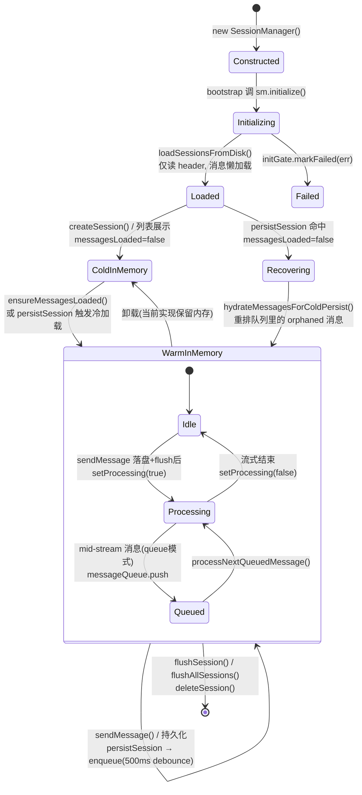
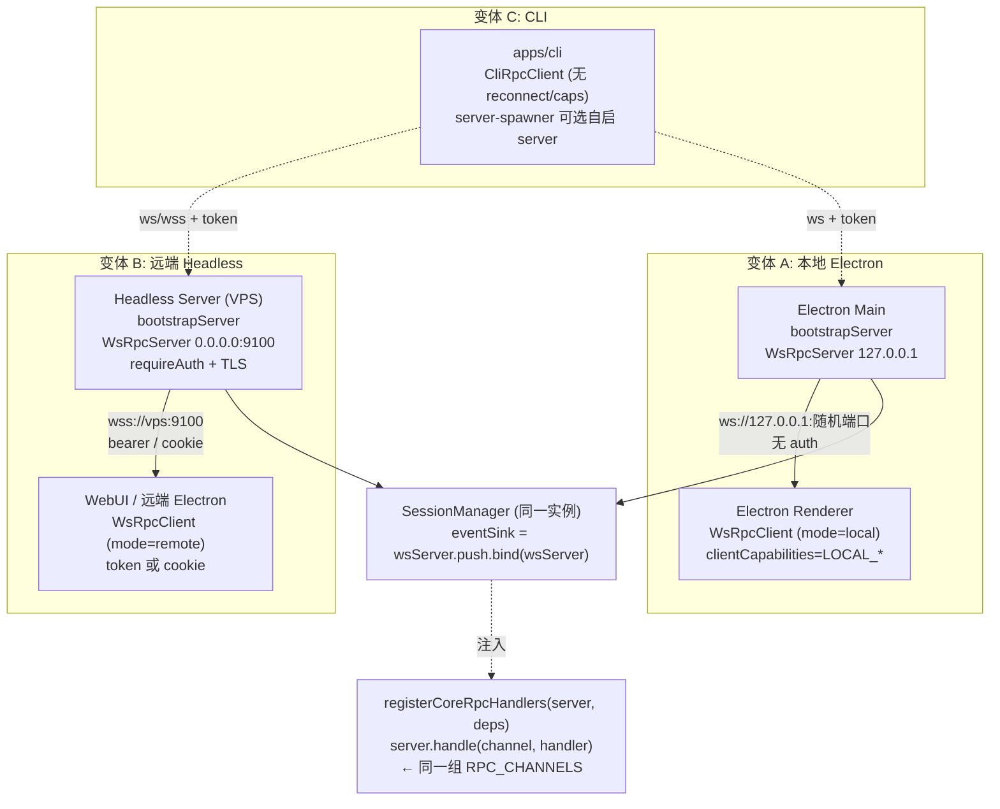
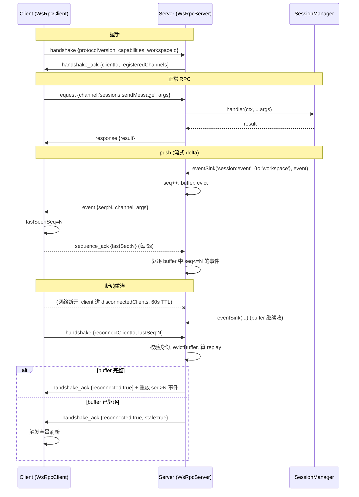

# 核心机制：Session 生命周期与传输协议

> 专题 C（v2.2.1）。研究 Craft Agents 如何用 JSONL 文件作为会话真理源、如何保证崩溃安全、以及三套 transport 如何共用同一组 RPC method。
>
> **代码版本**：`fe5acd4`（main，v0.10.4 之后）。所有引用均给出 `文件路径:行号/符号`。

---

## 这是什么机制

**它是什么**：SessionManager 是 Craft Agents 会话的「内存态 + 持久化态」双重管理者。它把每个会话以 **JSONL 文件**形式落到磁盘（`{workspaceRootPath}/sessions/{id}/session.jsonl`），第 1 行是预计算好的 `SessionHeader`，第 2 行起每行一条 `StoredMessage`。所有前端形态（Electron 桌面、Headless Server、CLI、WebUI）都通过**同一套 WebSocket RPC 协议**调用同一组 `server.handle(channel, handler)` 注册的 method。

**为什么需要它**：
- **真理源单一可分享**：JSONL 是纯文本、自描述、可读、可 diff、可打包传输（`SessionBundle`）。会话不仅是程序状态，更是一份「文档」——能被分享、回放、跨机器迁移。这正是项目「文档为中心」主张的落地。
- **崩溃安全**：Agent 会话动辄几十分钟、上百条消息。一旦落盘中途崩溃，不能整段丢失。atomic 写（tmp→rename）保证「要么旧文件完整、要么新文件完整，绝无半截」。
- **跨形态复用**：同一份 `server-core` 内核要同时驱动 Electron（renderer 与 main 同进程）、Headless Server（远端 VPS）、CLI（终端连远端）。如果每种形态各写一套 method，内核会被 transport 细节污染。

**设计核心**：
1. **JSONL 而非 SQLite/嵌入式 DB**：会话首行只读 8KB header 即可填列表（`readSessionHeader`），消息按需懒加载（`loadMessagesFromDisk`）。文件即数据库，省去 DB 运维，且天然便携。
2. **`{{SESSION_PATH}}` 便携 token**：写盘前把会话目录绝对路径替换成 token，读盘时再还原。这让会话能在不同机器、不同目录结构间无损迁移（远端传输、branch、Windows↔Mac）。
3. **Transport 与 method 解耦**：handler 只认 `RpcServer` 接口的 `handle(channel, handler)`，不关心底下是本地 WS 还是远端 WS。三套 transport 共用同一 envelope 协议与同一组 channel 字符串。

> ⚠️ **对研究计划的一处修正**：计划假设存在「Electron IPC / WS RPC / stdio 三套 transport」。源码核实后，**真正统一的传输介质是 WebSocket RPC**（envelope + codec），三套「transport」实为同一 WS 协议的三个部署变体（见下文「Transport 抽象」一节）。`stdio` 只作为 MCP 子进程传输出现，并非客户端→服务端通道；Electron `ipcMain.handle` 仅用于少数 GUI 对话框桥（`__dialog:showMessageBox` 等），不承载主 RPC。

---

## 关键源码地图

| 关注点 | 文件 |
|--------|------|
| 会话内存管理 + 生命周期 | `packages/server-core/src/sessions/SessionManager.ts`（8090 行） |
| JSONL 读/写/便携 token/atomic 写（同步版） | `packages/shared/src/sessions/jsonl.ts` |
| 持久化队列/atomic 写（异步版）/header 签名 | `packages/shared/src/sessions/persistence-queue.ts` |
| 会话类型定义（`SessionHeader`/`StoredSession`） | `packages/shared/src/sessions/types.ts` |
| 磁盘布局/索引/`.tmp` 清理 | `packages/shared/src/sessions/storage.ts` |
| WS RPC 服务端（连接/握手/心跳/push/replay） | `packages/server-core/src/transport/server.ts` |
| WS RPC 客户端（全功能，renderer+Node） | `packages/server-core/src/transport/client.ts` |
| 精简 CLI 客户端 | `apps/cli/src/client.ts` |
| envelope 序列化/二进制 codec | `packages/server-core/src/transport/codec.ts` |
| 客户端能力（capabilities）协商 | `packages/server-core/src/transport/capabilities.ts` |
| push 类型约束辅助 | `packages/server-core/src/transport/push.ts` |
| transport 接口（`RpcServer`/`RpcClient`/`EventSink`） | `packages/server-core/src/transport/types.ts` |
| RPC channel 名 + push event map | `packages/shared/src/protocol/{channels,events,types}.ts` |
| 核心 handler 注册（按 channel） | `packages/server-core/src/handlers/rpc/{index,sessions}.ts` |
| transport bootstrap（装配 SM + WS server） | `packages/server-core/src/bootstrap/headless-start.ts` |
| Electron 入口（实例化 SM、选 transport 模式） | `apps/electron/src/main/index.ts` |
| runtime-config 签名（决定就地刷新 vs 重建） | `packages/server-core/src/sessions/runtime-config.ts` |

---

## 一、Session 生命周期

### 1.1 SessionManager 是什么 / 不是单例

`SessionManager` **不是单例**：没有 `getInstance()`，构造函数公开，测试直接 `new SessionManager()`（`sessions/*.test.ts`）。它在 **bootstrap 阶段被实例化一次**，由调用方（Electron main / Headless）持有引用：

- `apps/electron/src/main/index.ts:656` —— `createSessionManager: () => { const sm = new SessionManager(); sm.setBrowserPaneManager(...); return sm }`
- 由 `bootstrapServer()`（`headless-start.ts`）在 `options.createSessionManager()` 处构造，随后注入依赖（platform、eventSink、rpcServer）。

核心内存态字段（`SessionManager.ts:1102-1149`）：
- `sessions: Map<string, ManagedSession>` —— 活跃会话表。
- `pendingDeltas` / `deltaFlushTimers` —— delta 批处理，把 50+/秒的流式事件降频到 ~20/秒再 push。
- `messageLoadingPromises` —— 消息懒加载的 promise 去重（防并发加载竞态）。
- `activeViewingSession: Map<workspaceId, sessionId>` —— 用户当前正在看的会话，用于「助手完成时是否标未读」判断。
- `initGate: InitGate` —— 启动初始化门闩，IPC handler 通过 `waitForInit()` 等待磁盘会话加载完。
- `lastTimestamp` —— 单调时钟，保证消息时间戳严格递增（`monotonic()`）。

### 1.2 生命周期状态机



**关键证据**：

- `initialize()`（`SessionManager.ts:1799-1832`）：跑迁移 → `reinitializeAuth()` → 为每个 workspace 预激活 `ConfigWatcher`/`AutomationSystem`（**关键：headless 服务器无 UI 也要让定时器/事件自动化启动**）→ `loadSessionsFromDisk()` → `initGate.markReady()`。
- `loadSessionsFromDisk()`（`SessionManager.ts:1835-1896`）：对每个 workspace 调 `listStoredSessions()` 拿**元数据列表**（`listStoredSessions` 内部用 `readSessionHeader` 只读首行），`createManagedSession(meta, ...)` 但 `enabledSourceSlugs: undefined` —— 消息与延迟字段**不读**，等真正访问时再懒加载。
- `persistSession()`（`SessionManager.ts:1916-1921`）：若 `!managed.messagesLoaded` 先同步 `hydrateMessagesForColdPersist()`（避免把空 `messages: []` 覆盖磁盘真实消息），再 `enqueuePersist()`。
- 冷加载恢复（`SessionManager.ts:1945-1965`）：从磁盘读回消息时，扫描 `role==='user' && isQueued===true` 的「孤儿排队消息」（崩溃/重启留下的），重新塞回 `messageQueue` 并 `setImmediate(processNextQueuedMessage)` —— 这是崩溃恢复的核心。

### 1.3 调用链：打开会话 → 发消息落盘 → push 到 UI → 崩溃恢复

```
用户在 renderer 点「发送」
  → WsRpcClient.invoke('sessions:sendMessage', ...)  [client.ts:177]
    → WsRpcServer.onRequest() 按 channel 分发          [server.ts:642]
      → registerSessionsHandlers 注册的 sendMessage handler [rpc/sessions.ts]
        → SessionManager.sendMessage(sid, msg, ..., onAck)  [SessionManager.ts:5421]
          1. ensureMessagesLoaded(managed)           [懒加载消息, 若需要]
          2. managed.messages.push(userMessage)      [内存态更新]
          3. persistSession(managed)                  [SessionManager.ts:1916]
             → enqueuePersist() → sessionPersistenceQueue.enqueue(stored)  [persistence-queue.ts:73]
                (500ms debounce 后)
                → SessionPersistenceQueue.write()     [persistence-queue.ts:90]
                   → readSessionHeader(disk) 对比签名  [防外部改动被覆盖]
                   → writeFile(filePath+'.tmp', lines)
                   → unlink(filePath) → rename(tmp, filePath)  [atomic]
          4. await this.flushSession(sid)            [#616: 落盘后才回 ack]
          5. onAck?.(userMessage.id)                 [RPC handler 据此同步回 "accepted"]
          6. sendEvent({type:'user_message', ...}, workspaceId)  [SessionManager.ts:7486]
             → this.eventSink('session:event', {to:'workspace', workspaceId}, event)
                ↑ eventSink = wsServer.push.bind(wsServer)  [headless-start.ts:345]
             → WsRpcServer.push() 给匹配 workspace 的所有 client 推送  [server.ts:190]
                → bufferAndMaybeSendEvent() 分配 seq + 存 ring buffer + safeSend
          7. (流式) agent 持续回调 → pendingDeltas 批处理 → sendEvent('assistant_delta'...)
          8. setProcessing(false) → 结束

[崩溃场景: 进程在 step 7 被 kill]
  → 重启后 loadSessionsFromDisk() 读回最后完整落盘的 JSONL
  → 用户重新打开会话 → ensureMessagesLoaded 读消息
  → 若发现 orphaned isQueued 消息 → 重排队重发 (SessionManager.ts:1945)
  → 上次半截写坏的 .tmp 被 storage.ts:363-365 启动时 unlinkSync 清理
  → JSONL 解析对坏行容错 (parseMessagesResilient, jsonl.ts:287)
```

---

## 二、JSONL 持久化与崩溃安全

### 2.1 文件格式

```
{workspaceRootPath}/sessions/{sessionId}/session.jsonl   ← 真理源
  ├── Line 1: SessionHeader (元数据 + 预计算字段)
  ├── Line 2: StoredMessage (JSON)
  ├── Line 3: StoredMessage
  └── ...
session.jsonl.tmp   ← atomic 写临时文件（崩溃残留会被启动清理）
meta/{pi,claude}-turn-anchors.json   ← turn 锚点 sidecar（分支正确性用）
```

- `SessionHeader`（`shared/src/sessions/types.ts:216-302`）：完整 `SessionConfig` + 预计算字段 `messageCount`/`lastMessageRole`/`preview`/`tokenUsage`/`lastFinalMessageId`。
- **8KB header 缓冲**：`readSessionHeader` 一次只 `readSync(fd, buffer, 0, 8192, 0)`（`jsonl.ts:80-84`），注释明确「8KB is plenty for metadata header」。这让「列出一万个会话」只读每个文件首 8KB，不解析消息。
- **预计算的意义**：列表 UI 需要的「最后一条角色」「预览」「未读最后消息 id」都在写盘时算好存 header，列表加载**零消息解析**。

### 2.2 Atomic 写（崩溃安全核心）

存在**两套 atomic 写实现**，对应两种调用路径：

#### 同步版 `writeSessionJsonl`（`jsonl.ts:150-164`）

用于一次性写整份会话（如 branch 复制、import）。

```typescript
const tmpFile = sessionFile + '.tmp'
writeFileSync(tmpFile, lines.join('\n') + '\n')
try { unlinkSync(sessionFile) } catch { /* ignore */ }   // Windows: rename 需先删
renameSync(tmpFile, sessionFile)
```

#### 异步版 `SessionPersistenceQueue.write`（`persistence-queue.ts:90-166`）

用于运行时高频持久化（每次 `persistSession`）。这是**主路径**。

```typescript
// 1. 防 .tmp 并发竞态：签名提前更新
const finalSignature = getHeaderMetadataSignature(header)
this.lastWrittenHeaderSignature.set(sessionId, finalSignature)   // ← 在写之前
// 2. atomic 写
const tmpFile = filePath + '.tmp'
await writeFile(tmpFile, lines.join('\n') + '\n', 'utf-8')
try { await unlink(filePath) } catch {}
await rename(tmpFile, filePath)
```

**为什么原子**：`rename`（POSIX）/「先 unlink 再 rename」（Windows）是文件系统级的原子操作。若进程在 `writeFile(tmp)` 中途崩溃：
- 真正的 `session.jsonl` 完好无损（还是旧版本）；
- 只有 `.tmp` 损坏；
- 下次启动 `storage.ts:363-365` 用 `unlinkSync(tmpFile)` 清理残留 `.tmp`；
- 即便 `.tmp` 残留混入读取，`parseMessagesResilient`（`jsonl.ts:287-299`）逐行 `JSON.parse`，坏行跳过不抛错——「丢一条好过丢全部」。

#### Header 签名：防止外部改动被覆盖

`getHeaderMetadataSignature`（`persistence-queue.ts:24-35`）对 `name/labels/isFlagged/sessionStatus/permissionMode/hasUnread/lastReadMessageId` 这 7 个「易被外部改动」的元数据字段算一个 JSON 签名。

`write()` 在落盘前对比三方签名（`persistence-queue.ts:115-130`）：
- `localSig`（本次要写的）
- `diskSig`（当前磁盘上的）
- `previousSig`（自己上次写的）

若 `diskSig !== previousSig`（说明**别人**改了磁盘，如另一个实例、fs.watch 编辑），则走 `mergeHeaderWithExternalMetadata`：保留磁盘上那 7 个字段的值，只更新自己的部分。这避免了「debounced 队列里的陈旧快照覆盖用户刚在另一个窗口改的标题」。

签名**在 `writeFile` 之前**设置（`persistence-queue.ts:154-155`），是为了让 `unlink`/`rename` 触发的 `fs.watch` 事件能被识别为「自己写的」而非外部改动（参见 `SessionManager.ts` 的 `METADATA_WRITE_GUARD_MS`/`onSessionMetadataChange` 防回滚逻辑）。

#### 串行化：防 .tmp 文件竞态

`flush()`（`persistence-queue.ts:173-194`）用 `writeInProgress: Map` 跟踪正在进行的写，新 flush **等待上一次写完成**才开始。注释（`persistence-queue.ts:55-57`）说明：连续两次快速 flush（如 `clearSessionForRecovery` + `onSdkSessionIdUpdate`）若并发写同一 `.tmp` 会损坏。整个队列是 **per-session 串行**的。

### 2.3 `{{SESSION_PATH}}` 便携 token

**What**：写盘前把会话目录的绝对路径替换成字面量 token `{{SESSION_PATH}}`，读盘时还原成当前实际路径。

**Why**：会话内容里到处埋着会话目录绝对路径——datatable 的 `src`、planPath、附件 `storedPath` 等。如果硬编码绝对路径：
- 会话从 `/Users/alice/.craft-agent/.../sessions/abc/` 拷到 `/home/bob/.../sessions/abc/`，所有路径失效；
- Windows `C:\foo` 与 Mac `/foo` 路径分隔符不同；
- branch 一个会话到新目录，源消息里的路径全错（历史 bug `#782`，见 release-notes/0.7.4.md）。

**How**（`jsonl.ts:23-50`）：

```typescript
const SESSION_PATH_TOKEN = '{{SESSION_PATH}}'

// 写：在 JSON.stringify 之后做替换，覆盖 JSON 字符串里任何位置的路径
export function makeSessionPathPortable(jsonLine, sessionDir) {
  const normalized = normalizePath(sessionDir)
  let result = jsonLine.replaceAll(normalized, SESSION_PATH_TOKEN)
  if (sessionDir !== normalized) {
    const jsonEscaped = sessionDir.replaceAll('\\', '\\\\')   // Windows: C:\foo → C:\\foo
    result = result.replaceAll(jsonEscaped, SESSION_PATH_TOKEN)
  }
  return result
}

// 读：在 JSON.parse 之前还原
export function expandSessionPath(jsonLine, sessionDir) {
  if (!jsonLine.includes(SESSION_PATH_TOKEN)) return jsonLine
  return jsonLine.replaceAll(SESSION_PATH_TOKEN, normalizePath(sessionDir))
}
```

**关键设计**：替换发生在 **stringify 之后 / parse 之前**，作用于整行 JSON 字符串而非结构化字段。这意味着路径无论藏在消息内容的哪个嵌套层（datatable src、tool input、附件元数据），都能被无损处理，无需对每种字段类型写专门逻辑。

`writeSessionJsonl`/`persistence-queue.write` 对 header 和每条 message 都调 `makeSessionPathPortable`；`readSessionJsonl`/`readSessionMessages`/`readSessionHeader` 都调 `expandSessionPath`。配套还有 `toPortablePath`/`expandPath`（`utils/paths.ts`）处理 `workspaceRootPath`/`workingDirectory`/`sdkCwd`（`~` 展开）。

---

## 三、Transport 抽象

### 3.1 三套 transport 的真相

| 维度 | 本地桌面（Electron renderer） | 远端 Headless Server | CLI |
|------|------------------------------|---------------------|-----|
| **传输介质** | WebSocket（同一协议） | WebSocket（同一协议） | WebSocket（同一协议） |
| **Server 绑定** | `127.0.0.1:0`（随机端口，无 auth） | `0.0.0.0:9100`（+ bearer token / cookie auth / 可选 TLS） | 连到上述任一 server |
| **Client 实现** | `WsRpcClient`（全功能：reconnect、capabilities、seq） | `WsRpcClient`（同） | `CliRpcClient`（精简：无 reconnect、无 capabilities） |
| **auth** | 无（localhost 信任） | bearer token 或 web cookie | bearer token |
| **二进制** | envelope codec（`__craftRpcType`+base64） | 同 | 同 |
| **典型来源** | `apps/electron/src/main/index.ts`（`bootstrapServer`，`rpcHost='127.0.0.1'`） | `packages/server` + `bootstrapServer`（`requireAuth:true`） | `apps/cli/src/{client,index,server-spawner}` |

**核心结论**：三套 transport **共用同一份 WS RPC 实现**（`WsRpcServer` + `WsRpcClient`/`CliRpcClient` + 同一 `MessageEnvelope` + 同一 `codec`）。差异仅在**配置**（host/port/auth/TLS）和**客户端能力**（全功能 vs 精简）。这就是「同一组 method」能跨形态复用的根因——根本没有三套独立的 transport 代码。

> **Electron 为何 renderer 也走 WS 而非 ipcMain**：让 renderer 进程的代码与远端 thin-client renderer 完全一致（`routed-client.ts` 包装两个 `WsRpcClient`：一个连本地 embedded server，一个连远端）。这样「本地桌面」与「远端瘦客户端」只是连不同 URL，renderer 业务代码零差异。`ipcMain.handle` 仅残留用于对话框桥（`index.ts:538` `__dialog:showMessageBox`）等少数 GUI-only 能力。

### 3.2 三 transport 对照（连接模型）



### 3.3 `RpcServer` / `RpcClient` 接口（解耦的关键）

`transport/types.ts`：

```typescript
export interface RpcServer {
  handle(channel: string, handler: HandlerFn): void        // 注册 method
  push(channel: string, target: PushTarget, ...args: any[]): void  // server→client 推送
  invokeClient(clientId: string, channel: string, ...args: any[]): Promise<any>  // server→client 反向调用
  hasClientCapability(clientId: string, capability: string): boolean
  findClientsWithCapability(capability: string, opts?): string[]
}

export interface RpcClient {
  invoke(channel: string, ...args: any[]): Promise<any>     // 调 method
  on(channel: string, callback): () => void                  // 订阅 push
  handleCapability(channel: string, handler): void           // 响应 server 的反向调用
}

export type EventSink = (channel: string, target: PushTarget, ...args: any[]) => void
```

**设计要点**：
- handler 只依赖 `RpcServer` 接口，`WsRpcServer` 是其唯一实现。**理论上换 transport（如纯 in-memory / Electron ipcMain）只需新实现这个接口**，handler 零改动。
- `PushTarget`（`protocol/types.ts:140-143`）三态：`all` / `workspace` / `client`。`WsRpcServer.matchesTarget`（`server.ts:801-813`）据此筛选客户端。
- SessionManager 通过 `setEventSink(sink)` 拿到一个 `EventSink`（`SessionManager.ts:1203-1205`），bootstrap 时 `setSessionEventSink(sm, wsServer.push.bind(wsServer))`（`headless-start.ts:345`）把它绑成 WS server 的 push。**SM 因此不知道 transport 是什么**，只知道「调 sink 就能广播」。

### 3.4 Method 注册：按 channel 分域

`RPC_CHANNELS`（`shared/src/protocol/channels.ts`）是**单一字符串常量源**，按命名空间组织（`sessions.*` / `window.*` / `file.*` / `messaging.*` ...）。值（如 `'sessions:sendMessage'`）是**稳定的线上契约**，key 路径可自由重组。

`registerCoreRpcHandlers`（`rpc/index.ts:29-49`）按域分文件注册（`sessions.ts`/`files.ts`/`sources.ts`...），每个文件 `server.handle(RPC_CHANNELS.xxx, handler)`。handler 闭包捕获 `deps.sessionManager`，所以 method 调用最终落到 SM。Electron 额外注册 GUI-only handler（`registerGuiRpcHandlers`：system/workspace/browser/settings），headless 不注册。

---

## 四、协议细节：envelope / codec / handshake / push

### 4.1 MessageEnvelope（线上统一信封）

`protocol/types.ts:20-63`。所有 transport、所有方向共用一个信封类型：

| `type` | 方向 | 用途 |
|--------|------|------|
| `handshake` | client→server | 握手：带 `protocolVersion`/`workspaceId`/`token`/`webContentsId`/`clientCapabilities`/（重连）`reconnectClientId`+`lastSeq` |
| `handshake_ack` | server→client | 回 `clientId`/`registeredChannels`/`serverVersion`/`reconnected`/`stale` |
| `request` | 双向 | RPC 调用（client→server 正常 method；server→client 是 capability 反向调用） |
| `response` | 双向 | 回 `result` 或 `error` |
| `event` | server→client | push 推送，带 `seq` |
| `error` | server→client | 协议级错误（握手拒绝、版本不符） |
| `sequence_ack` | client→server | 确认已处理到 `lastSeq`，触发 server 端 ring buffer 清理 |

协议版本 `PROTOCOL_VERSION = '1.0'`（`protocol/types.ts:149`），握手时按 **major 版本**匹配（`server.ts:420-427`），major 不符直接 `4004` 关闭。

### 4.2 Codec：二进制能力

`transport/codec.ts`。问题：JSON 不支持 `Uint8Array`（图片缩略图、附件字节）。解法是自定的 wire 格式：

```typescript
// 序列化：遇 Uint8Array / ArrayBuffer / TypedArray → 替换成
{ "__craftRpcType": "u8", "base64": "<base64>" }
// 递归处理数组/对象所有层级
serializeEnvelope(env) = JSON.stringify(encodeWireValue(env))

// 反序列化：识别该形状 → base64 解码回 Uint8Array
deserializeEnvelope(raw) = validateEnvelopeShape(decodeWireValue(JSON.parse(raw)))
```

`validateEnvelopeShape`（`codec.ts:122-144`）做结构校验，防畸形信封。`CodedError`（`protocol/types.ts:127-134`）保证错误经 JSON 往返后 `.code` 仍在——接收方**必须按 `err.code === 'X'` 分支，不能用 `instanceof`**（类身份在线上会丢失）。

### 4.3 Handshake 与 Capabilities 协商

**Server 端**（`server.ts:401-600`）：
1. 收 `handshake`，5 秒超时（`server.ts:386-390`）。
2. 校验 `protocolVersion` major。
3. 若 `requireAuth`：先试 bearer token（`validateToken`），失败再试 HTTP upgrade 的 Cookie（`validateSessionCookie`，web UI 用）。
4. **重连分支**（`envelope.reconnectClientId`）：在 `disconnectedClients` 里找，校验 `workspaceId`+`webContentsId` 身份一致，重放 ring buffer 里 `seq > lastSeq` 的事件；buffer 已驱逐则回 `stale:true` 让客户端全量刷新。
5. **新连接**：生成 `clientId`，存 `capabilities: new Set(envelope.clientCapabilities)`，回 `handshake_ack` 带 `registeredChannels`（客户端据此避免调用不存在的 channel）。

**Client 端**（`client.ts:151-171` + 握手逻辑）：构造时传 `clientCapabilities`，握手时一并发出。`handleCapability(channel, handler)` 注册本地能响应的反向调用。

**Capabilities 集合**（`transport/capabilities.ts`）：本地 Electron 客户端广告 `LOCAL_CLIENT_CAPABILITIES`（`client:openExternal`/`openPath`/`showItemInFolder`/`confirmDialog`/`openFileDialog`/`browser:invoke`）。这些是「server 无法自己做的、需要客户端 OS 代劳」的能力。SM 调 `findClientsWithCapability(CLIENT_BROWSER_INVOKE, {workspaceId})` 找一个能托管浏览器面板的桌面客户端（`SessionManager.ts:1296-1303`），把 `browser_*` 工具调用反向 RPC 过去——这就是「远端 Agent 驱动本地浏览器」的能力协商闭环。

### 4.4 Push 通道（delta 推送 + 可靠投递）

**delta 批处理**（SessionManager 侧）：`pendingDeltas: Map<sessionId, PendingDelta>` + `deltaFlushTimers`（`SessionManager.ts:1105-1106`）。流式 token 高频到来时先攒，定时 flush，把 IPC 事件从 50+/秒降到 ~20/秒。

**push 路由**（`server.ts:190-202`）：`push(channel, target, ...args)` 遍历 `clients`（在线）+ `disconnectedClients`（断线但 TTL 内，buffer 还在收），对匹配 target 的每个 client `bufferAndMaybeSendEvent`。

**可靠投递 seq 机制**（`server.ts:747-799`）：
- 每个 client 有 `lastSentSeq`（单调递增）+ `lastAckedSeq` + `eventBuffer`（ring buffer）。
- `bufferAndMaybeSendEvent`：`seq = ++lastSentSeq`，envelope 带 seq，存进 buffer（共享同一份序列化字符串，省内存），在线则立即 `safeSend`。
- client 每 `SEQUENCE_ACK_INTERVAL_MS=5s` 发 `sequence_ack(lastSeq)`，server 据此驱逐 buffer 里已确认的旧事件（`server.ts:613-627`）。
- buffer 有 TTL（`EVENT_BUFFER_TTL_MS=30s`）和容量（`EVENT_BUFFER_MAX_SIZE=500`）双重驱逐（`evictBuffer`，`server.ts:776-799`）。

**断线重连 replay**（`server.ts:716-744`）：client 断开时进入 `disconnectedClients`（保留 `DISCONNECTED_CLIENT_TTL_MS=60s`），期间 buffer 继续收事件。重连时按 `lastSeq` 重放差量；若 `lastSeq < firstBufferedSeq - 1`（说明 buffer 已驱逐中间段），回 `stale:true` 强制客户端全量刷新。



---

## 五、关键设计决策

### 5.1 为什么 JSONL 而不是 SQLite/嵌入式 DB

1. **会话是文档，不是行**：Craft Agents 的核心主张是「文档为中心」。JSONL 让会话天然可读、可 diff、可分享、可打包（`SessionBundle`）、可被外部工具处理。SQLite 是黑盒二进制，丧失这些。
2. **首行 header = 零成本列表**：列表只需 8KB header 读取（`readSessionHeader`），消息懒加载。对「万级会话 + 频繁列表」场景，比「SELECT * 全字段再过滤」更省，且无需 DB 索引调优。
3. **崩溃恢复简单**：append-only 语义 + 按行解析容错（`parseMessagesResilient`）。坏一行丢一条，不会 corrupt 整个 DB。
4. **运维零成本**：无 DB 进程、无 schema 迁移、无并发锁。文件系统就是事务（atomic rename）。
5. **便携性**：`{{SESSION_PATH}}` token 让会话跨机器迁移零摩擦——这是 DB 方案做不到的。

代价：写放大（每次 persist 重写整份文件，非增量 append）。但 debounced 队列（500ms）+ per-session 串行 + 典型会话几百条消息，写量可控。这是「便携/可读」换「写性能」的有意识取舍。

### 5.2 为什么三 transport 共用同一组 method

1. **解耦的极致**：handler 只认 `RpcServer.handle` 接口。本地桌面、远端 server、CLI 三个部署形态用**同一份 handler 代码**，差异全在 bootstrap 配置。
2. **renderer 业务代码零分支**：Electron renderer 用 `WsRpcClient` 连本地 embedded server，远端 thin-client renderer 用 `WsRpcClient` 连 VPS——**两份 renderer 代码完全相同**，只差 URL（`routed-client.ts` 包装切换）。这极大降低了「本地 vs 远端」两套代码路径的维护成本与 bug 面。
3. **单一协议演进**：envelope/codec/handshake 只有一套。新增 capability、改 error code、加重连，所有形态同步受益。
4. **能力协商自然落地**：因为 server 能反向 `invokeClient`，远端 Agent 驱动本地浏览器（`client:browser:invoke`）这种「跨主机能力调用」无需额外机制——就是 capability + 反向 RPC。

### 5.3 为什么签名要「写之前」更新（顺序不变量）

`persistence-queue.ts:154-161` 把 `lastWrittenHeaderSignature` 的更新放在 `writeFile`/`unlink`/`rename` **之前**。原因：`unlink`/`rename` 会触发 `fs.watch` 事件，SM 的 `onSessionMetadataChange` 会比对「自己上次写的签名」判断「这是不是我写的」。若签名在写之后才更新，watch 事件先到，SM 会误判为外部改动并回滚内存元数据——形成抖动。提前更新签名让「自写事件」被正确识别。这是典型的「顺序即不变量」设计，注释（`persistence-queue.ts:150-153`）明确点出。

---

## 待解决疑问

1. **`ManagedSession` 完整字段定义**：本次未读 `ManagedSession` interface（在 `SessionManager.ts` 内部），只看到内存态 Map 的 key 类型。`_metadataWriteGuardUntil`/`messagesLoaded`/`messageQueue`/`wasInterrupted` 等运行时字段的完整形状需另查。
2. **`refreshConnectionRuntime` 完整链路**：runtime-config 的 `buildRestartRequiredSignature`/`buildBackendRuntimeSignature`（`runtime-config.ts:50-70`）已读，但 `tryRefreshAgentRuntime` → 就地刷新 vs `disposeManagedAgentRuntime` 重建的决策树（`SessionManager.ts:2950-3080`）未逐行展开，仅从 CLAUDE.md 旁证理解。
3. **`create-managed-session` 工厂**：`createManagedSession(meta, workspace, opts)`（`sessions/index.ts` 导出）的完整实现未读，只知它从 `SessionMetadata` 构造 `ManagedSession` 且不加载消息。
4. **delta flush 的具体降频策略**：`pendingDeltas`/`deltaFlushTimers` 的 flush 间隔值与合并逻辑未在本次读到的代码段中确认（需定位 flush timer 设置点）。
5. **WebUI cookie auth 全链路**：`validateSessionCookie` 的实现（web UI 会话 cookie 如何签发/校验）在 router worker 层，本次未深入。

---

## 摘要

SessionManager 以 `sessions/{id}/session.jsonl` 为唯一真理源：首行 8KB `SessionHeader`（预计算 messageCount/preview 等）支撑万级会话秒列，消息按需懒加载。崩溃安全靠 atomic 写（`writeFile(.tmp)`→`unlink`→`rename`，两套同步/异步实现）+ 启动清理残留 `.tmp` + 坏行容错解析；header 7 字段签名在「写之前」更新以防外部改动被陈旧快照覆盖。`{{SESSION_PATH}}` token 在 stringify 后/parse 前对整行替换，让会话跨机器/跨平台/branch 无损迁移。三套「transport」实为同一 WebSocket RPC（`WsRpcServer`+`WsRpcClient`/`CliRpcClient`+统一 envelope+codec），差异仅在 host/auth/TLS 与客户端能力；handler 只认 `RpcServer.handle` 接口，故 Electron renderer/远端/CLI 共用同一组 `RPC_CHANNELS` method。SM 的 `eventSink` 绑到 `wsServer.push`，push 经 delta 批处理降频、按 seq 可靠投递、断线 60s 内 ring buffer replay（buffer 驱逐则回 stale 全量刷新）。capabilities 协商（`client:browser:invoke` 等）让远端 Agent 能反向驱动本地客户端 OS 能力。
