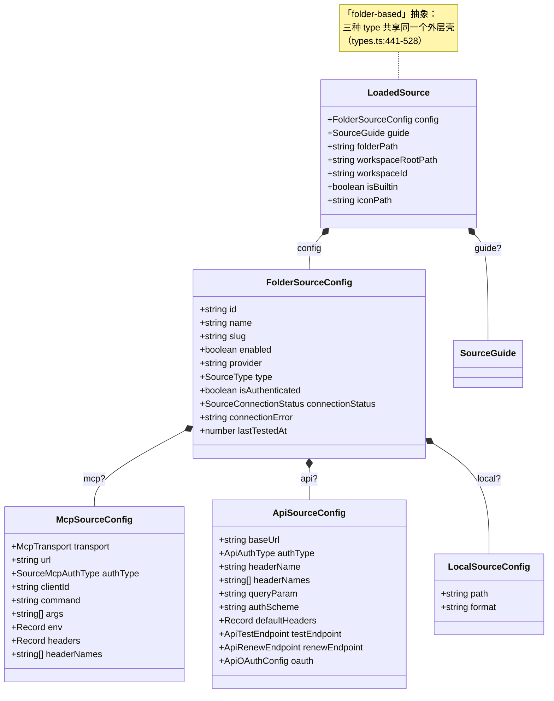
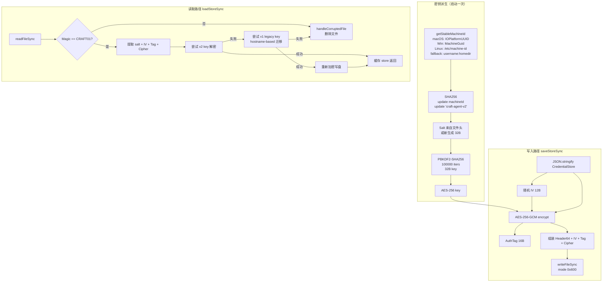
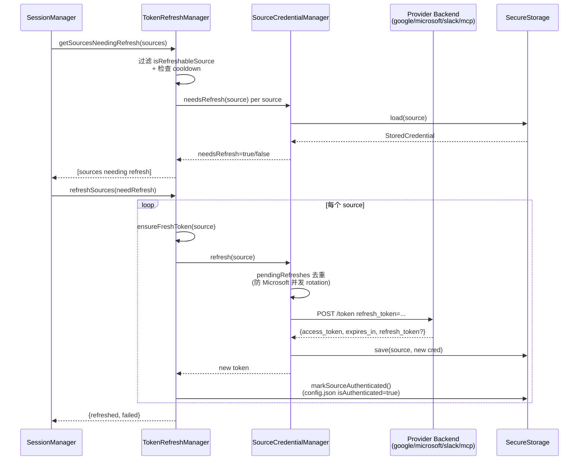
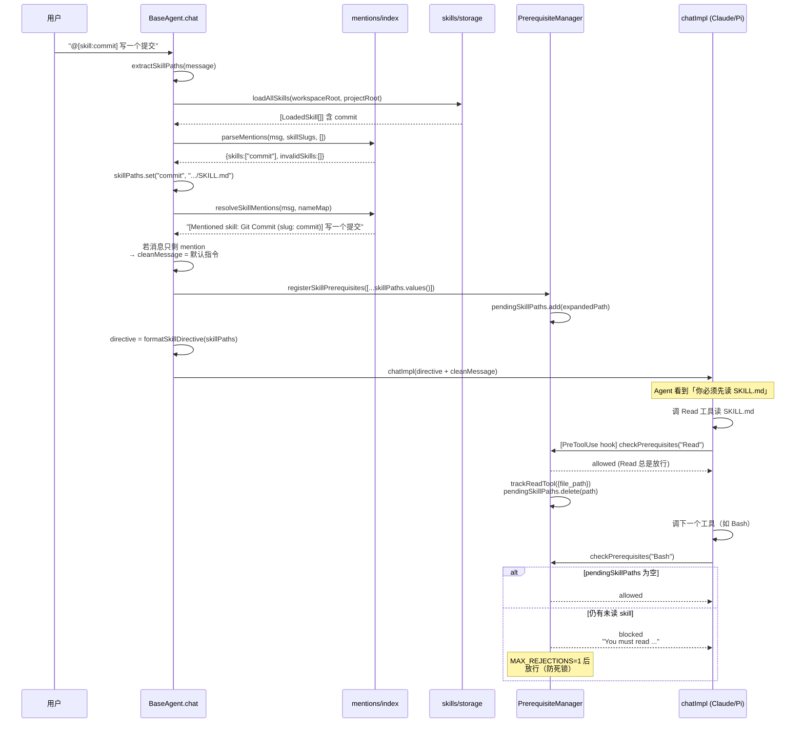
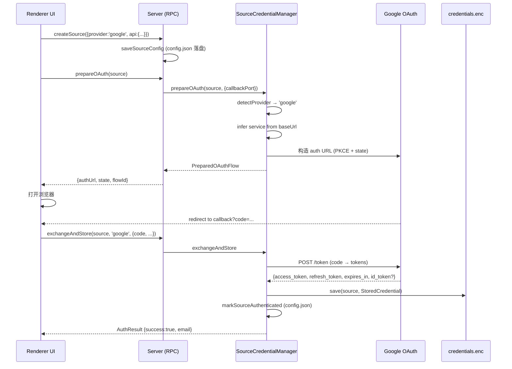

# Sources / Credentials / Skills 系统

> Craft Agents OSS v0.10.4 — 基于代码的子系统研究
>
> 本文档研究三大子系统的设计契约、生命周期、安全边界与不变量。所有结论均基于具体源码行号引用。

## 0. 总览

Craft Agents 把三类「外部能力」抽象到统一的 `LoadedSource` / `LoadedSkill` 模型上，并使用 AES-256-GCM 加密文件落地所有凭据。三者关系如下：

```mermaid
flowchart LR
  User[用户输入<br/>@skill / chat 消息] --> BaseAgent[BaseAgent.chat]
  BaseAgent -->|Mentions 解析| Skills[Skills 子系统]
  BaseAgent -->|加载 enabled sources| Sources[Sources 子系统]
  Sources -->|读取/写入 token| Creds[Credentials 子系统<br/>AES-256-GCM]
  Skills -->|requiredSources 元数据| Sources
  Sources -->|mcpServers + apiServers| Agent[Agent 后端<br/>Claude SDK / Pi]
  Creds -->|process.env 注入| Agent
```

三大子系统各自的「What / Why」如下：

| 子系统 | What（是什么） | Why（存在的理由） |
|---|---|---|
| **Sources** | 工作区目录下三种类型（mcp/api/local）的外部连接，统一抽象为 `LoadedSource` | 让 Agent 以一致的方式调用 MCP server、REST API、本地文件系统，而无需为每种类型写特殊代码 |
| **Credentials** | 单一加密文件 `~/.craft-agent/credentials.enc`（AES-256-GCM + PBKDF2），按 `{type}::{scope}` 键值寻址 | 跨平台稳定、无 OS keychain 弹窗；同时保证「机器迁移即失效」的安全性 |
| **Skills** | 三级目录（global/workspace/project）下的 `SKILL.md`，通过 `[skill:slug]` @mention 触发 | 让用户用 Markdown 文件扩展 Agent 的指令集，而不必修改 Agent 源码 |

---

## 1. Source 三类型：mcp / api / local

### 1.1 What

Source 是工作区范围内的「外部连接」。每个 source 是一个目录：

```
~/.craft-agent/workspaces/{workspaceId}/sources/{sourceSlug}/
  ├── config.json   # FolderSourceConfig
  └── guide.md      # 使用指南，YAML frontmatter + Markdown 正文
```

引用：`packages/shared/src/sources/types.ts:6-11`。

三类型定义在 `packages/shared/src/sources/types.ts:16`：

```ts
export type SourceType = 'mcp' | 'api' | 'local';
```

CLAUDE.md 第 27 行明确写：「Source types are fixed: `mcp`, `api`, `local`」——这是项目级的不变量。

### 1.2 Why

把三类外部资源统一抽象，是为了：

1. **Agent 调用接口统一**：每个 source 都能产出 `mcpServers[slug]` 或 `apiServers[slug]`，丢给 Agent backend（`server-builder.ts:78-152`）。
2. **UI 列表统一**：所有 source 都有 `name/slug/icon/tagline/connectionStatus`，UI 不必为类型分支。
3. **凭据存储统一**：所有 source 凭据都走 `source_oauth/source_bearer/source_apikey/source_basic` 四种 CredentialType（`credentials/types.ts:135-140`）。

### 1.3 三类型对比表

| 维度 | **mcp** | **api** | **local** |
|---|---|---|---|
| **传输方式** | stdio 子进程 / HTTP / SSE（`types.ts:244`） | 进程内 fetch + 动态 MCP tool（`api-tools.ts`） | 文件系统读取 |
| **生命周期** | stdio：Agent backend 拉起子进程；http/sse：长连接 | 每次工具调用独立 fetch，工具本身在 Agent 进程内（`createSdkMcpServer`） | 不持有连接，按需读文件 |
| **认证类型** | `oauth / bearer / none`（`types.ts:22`） | `bearer / header / query / basic / oauth / none`（`types.ts:27`） | 无（不需要认证） |
| **能力边界** | 提供任意 MCP tool | 提供 1 个 `api_{slug}` 动态 tool，参数 `{path, method, params}` | 不直接注册 tool，但可被 Agent 通过 Read/Bash 访问 |
| **隔离级别** | stdio：独立子进程，env 净化（见 §7）；http/sse：网络边界 | 进程内，无沙箱；凭据在内存中 | 完全可信（无隔离） |
| **凭据槽位** | `source_oauth` / `source_bearer` | `source_oauth` / `source_bearer` / `source_basic` / `source_apikey` | 无 |
| **可自动刷新** | 仅 oauth 类型（`isOAuthSource`，types.ts:191-205） | oauth + renewEndpoint（`hasRenewEndpoint`，types.ts:223-225） | 否 |
| **关键文件** | `types.ts:250-303`（McpSourceConfig） | `types.ts:370-399`（ApiSourceConfig） | `types.ts:404-407`（LocalSourceConfig） |

### 1.4 三类型统一抽象的类图



### 1.5 关键不变量

1. **`type` 互斥**：`mcp / api / local` 三选一（CLAUDE.md hard rule）。
2. **slug 即凭据 key 的一部分**：`source_oauth::{workspaceId}::{sourceSlug}`（`credentials/types.ts:191-194`），因此 slug 改名会导致凭据丢失。
3. **`isSourceUsable()` 是唯一过滤入口**（`storage.ts:400-411`）：`enabled && (authType ∈ {none, undefined} || isAuthenticated === true)`。
4. **stdio MCP source 不需要凭据**（`credential-manager.ts:153`：`source.config.mcp?.transport !== 'stdio' && ... authType !== 'none'` 才尝试读凭据）。

---

## 2. Credentials：AES-256-GCM 加密子系统

### 2.1 What

整个项目所有敏感凭据（API key / OAuth token / IAM / Service Account / source token）都存在单一文件：

```
~/.craft-agent/credentials.enc
```

文件格式（`packages/shared/src/credentials/backends/secure-storage.ts:14-25` 注释，行 305-316 实现）：

```
[Header - 64 bytes]
├── Magic:   "CRAFT01\0"  (8 bytes)
├── Flags:   uint32 LE    (4 bytes, 保留)
├── Salt:    32 bytes     (PBKDF2 salt)
└── Reserved: 20 bytes
[Encrypted Payload]
├── IV:        12 bytes   (每次写入重新生成)
├── Auth Tag:  16 bytes   (GCM 完整性标签)
└── Ciphertext: 变长      (JSON.stringify(CredentialStore))
```

文件权限：`0o600`（`secure-storage.ts:315`），目录权限：`0o700`（行 284）。

### 2.2 Why

为什么不使用 OS keychain？源码注释给出明确答案（`credentials/manager.ts:1-6`）：

> Main interface for credential storage. Uses encrypted file storage for cross-platform compatibility without OS keychain prompts.

设计目标：

1. **跨平台一致**：macOS Keychain / Windows DPAPI / Linux libsecret 三套实现复杂；单文件方案所有平台行为一致。
2. **无 UI 弹窗**：Keychain 会触发系统弹窗，对 headless server 部署不友好（README §Remote Server 即用此方案）。
3. **机器绑定**：密钥派生自硬件 UUID，机器迁移即失效（见 §2.4）。
4. **统一 schema**：所有凭据类型（LLM、source、workspace、messaging）共用同一文件，便于备份/导出。

### 2.3 CredentialStore 落盘 JSON 结构

落盘 JSON 是 `CredentialStore` 接口（`secure-storage.ts:101-109`）：

```ts
interface CredentialStore {
  version: 1;                          // 永远是 1（目前）
  credentials: Record<string, StoredCredential>;
  metadata: {
    createdAt: number;                 // Unix ms
    updatedAt: number;                 // Unix ms
  };
}
```

key 格式（`credentials/types.ts:130-207`）：

| 类型 | key 格式 | 示例 |
|---|---|---|
| LLM API key | `llm_api_key::{connectionSlug}` | `llm_api_key::anthropic-default` |
| LLM OAuth | `llm_oauth::{connectionSlug}` | `llm_oauth::openai-codex` |
| LLM IAM | `llm_iam::{connectionSlug}` | — |
| LLM Service Account | `llm_service_account::{connectionSlug}` | — |
| Workspace OAuth | `workspace_oauth::{workspaceId}` | — |
| **Source OAuth** | `source_oauth::{workspaceId}::{sourceSlug}` | `source_oauth::ws-abc::linear` |
| **Source Bearer** | `source_bearer::{workspaceId}::{sourceSlug}` | — |
| **Source API Key** | `source_apikey::{workspaceId}::{sourceSlug}` | — |
| **Source Basic** | `source_basic::{workspaceId}::{sourceSlug}` | — |
| Messaging | `messaging_bearer::{workspaceId}::{platform}` | — |
| Global | `{type}::global` | `anthropic_api_key::global` |

**分隔符 `::`** 的选择是有意为之（`types.ts:14-15, 130-132`）：不能用 `/`，因为 server name / URL 可能含 `/`。

`StoredCredential` 字段（`types.ts:86-128`）：

| 字段 | 用途 |
|---|---|
| `value` | 主秘密（API key / access token / AWS secret key / Service Account JSON） |
| `refreshToken` | OAuth refresh token |
| `expiresAt` | Unix ms 时间戳 |
| `clientId` / `clientSecret` | OAuth client（refresh 必需，Google 同时需要 secret） |
| `tokenType` | 例如 `"Bearer"` |
| `source` | `'native' \| 'cli'`：标识 token 来源 |
| `idToken` | OIDC id_token（OpenAI/Codex 用，与 `value` 中的 access_token 并存） |
| `awsAccessKeyId` / `awsRegion` / `awsSessionToken` | AWS IAM 字段 |
| `gcpProjectId` / `gcpRegion` / `serviceAccountEmail` | GCP 字段 |

### 2.4 加解密流程图



关键实现要点（`secure-storage.ts`）：

- **`getStableMachineId()`（行 65-99）**：优先使用硬件 UUID，因为 hostname 会随网络/DHCP 漂移。
- **`PBKDF2_ITERATIONS = 100000`（行 58）**：在安全与启动延迟之间的折中。
- **每次写入都生成新 IV（行 298）**：GCM 安全要求；同一明文加密两次密文不同。
- **双重 key 尝试（行 232-251）**：v1 key 含 hostname，v2 key 用硬件 UUID。v1 能解开时立即重新加密为 v2，完成无缝迁移。
- **损坏即删除（行 350-362）**：解不开就清空，让用户重新登录——避免反复失败的死循环。
- **`cachedStore` 单例缓存（行 115）**：避免每次 get/set 都解密。

### 2.5 CredentialManager 与 Backends

`CredentialManager`（`manager.ts`）是门面（Facade）。后端列表：

| Backend | priority | isAvailable | 用途 |
|---|---|---|---|
| `SecureStorageBackend` | 100 | 永远 true | 唯一活动后端，文件加密 |
| `EnvironmentBackend` | 110 | **永远 false**（`env.ts:17`）| 故意禁用，强制手动输入 API key |

后端选择策略（`manager.ts:86-91`）：按 priority 降序，第一个 available 的 backend 负责写；读时遍历所有 backend。

`get/set/delete/list` 都通过 `ensureInitialized()`（行 33-48）惰性初始化。`deleteSync` 路径（行 166-187）是为了让 `saveSourceConfig` 这类同步调用立即看到凭据被清理（行 50-65）。

### 2.6 健康检查与机器迁移

`checkHealth()`（`manager.ts:629-699`）在启动时验证：

1. 文件能解密（触发 `list({})`）
2. 默认 LLM 连接有凭据

若解密失败，按错误关键字分类（行 644-663）：

- `'decrypt' / 'cipher' / 'authentication tag'` → `decryption_failed`（通常是机器迁移）
- `'json' / 'parse'` → `file_corrupted`

UI 可据此提示「请重新登录」。

---

## 3. SourceCredentialManager 与 Token Refresh

### 3.1 What

`SourceCredentialManager`（`sources/credential-manager.ts:123-1263`）是 Source 子系统的凭据门面，封装：

1. CRUD：`save / load / delete / getToken / getApiCredential`
2. CredentialType 解析：`getCredentialId(source)` 根据 source 配置决定走哪个槽位（行 304-336）
3. OAuth 流程：`prepareOAuth` / `exchangeAndStore` / `authenticate`
4. Token 刷新：`refresh` + 各 provider 子方法（Google/Slack/Microsoft/Generic/MCP/Renew）

### 3.2 Why

注释（行 7-13）明确说，这个类是为了取代散落在 `SourceService` / `session-scoped-tools` / IPC handler 里的凭据逻辑——单一职责。

### 3.3 getCredentialId 决策树（`credential-manager.ts:304-336`）

```
mcp source:
  authType === 'bearer'      → source_bearer
  否则                       → source_oauth   (oauth 或 'none' 都落到此)

api source:
  provider ∈ {google, slack, microsoft}    → source_oauth
  api.authType === 'oauth'                  → source_oauth
  api.authType === 'bearer'                 → source_bearer
  api.authType === 'basic'                  → source_basic
  其它 (header / query / none)              → source_apikey
```

注意：`'none'` 也会落到 `source_apikey`，所以 `saveSourceConfig` 在切换到 `none` 时主动清理该槽位（`storage.ts:144-152`，注释说明这是为了防止「孤立的凭据」复活）。

### 3.4 MCP source 的 OAuth/bearer 回退（行 180-203）

```
读：先试 source_oauth → 再试 source_bearer → 都没有则 null
```

这是因为历史上 MCP source 可能从 oauth 改成 bearer 或反过来，老凭据留在另一槽位不会自动清理。读取双槽位是为了向后兼容。

### 3.5 Token Refresh 全流程

Token refresh 涉及三层：

1. **`TokenRefreshManager`**（`token-refresh-manager.ts:39-247`）：实例级，负责限流 + 编排
2. **`SourceCredentialManager.refresh()`**（`credential-manager.ts:903-982`）：实际调用 provider
3. **各 provider 的 `refresh*Token()`**：底层 HTTP 调用



### 3.6 Refresh 路由决策（`credential-manager.ts:925-982`）

```
1. hasRenewEndpoint(source)  → refreshApiRenew  (非 OAuth 自定义端点)
2. provider === 'google'      → refreshGoogle
3. provider === 'slack'       → refreshSlack
4. provider === 'microsoft'   → refreshMicrosoft
5. api.authType === 'oauth':
   - 有 oauth.tokenUrl        → refreshGeneric
   - 否则 baseUrl+clientId    → refreshMcp（自动发现端点）
6. mcp + mcp.url              → refreshMcp
```

### 3.7 Renew Endpoint（`credential-manager.ts:988-1067`）

非 OAuth API 也能自动刷新：在 `api.renewEndpoint` 中配置自定义端点。流程：

1. URL 解析（相对路径基于 baseUrl）
2. Header 合并顺序：`Content-Type → defaultHeaders → renewEndpoint.headers(含{{token}}) → Authorization`
3. Body 用 `{{token}}` 占位符递归替换（`substituteTokenInBody`，行 1273-1290）
4. 提取新 token：`tokenField ?? 'access_token'`
5. 提取过期：`expiresInField ?? 'expires_in'`，失败时用 `fallbackTtlSecs`

此类 source **不需要 refreshToken**（`token-refresh-manager.ts:100, 133`）。

### 3.8 防并发刷新：`pendingRefreshes`（行 124, 906-920）

同一 source 的多次 refresh 请求共享同一个 Promise。注释（行 899-902）说明：Microsoft 会轮换 refresh token，并发刷新会导致其中一个失效。

### 3.9 限流：cooldown 5 分钟（`token-refresh-manager.ts:19, 57-61`）

失败的 source 进入 cooldown（`recordFailure`，行 66-68），5 分钟内不再尝试（`isInCooldown`，行 57-61）。成功后清空（`clearFailure`，行 73-75）。这防止了已失效 source 拖累 session 启动。

### 3.10 过期判定逻辑

| 函数 | 文件 | 行为 |
|---|---|---|
| `CredentialManager.isExpired` | `manager.ts:596-612` | 5 分钟提前过期；OAuth 无 `expiresAt` 视为已过期（强制刷新）；API key 无 `expiresAt` 视为永不过期 |
| `SourceCredentialManager.isExpired` | `credential-manager.ts:345-348` | 严格按 `expiresAt`，无 5 分钟提前量 |
| `SourceCredentialManager.needsRefresh` | `credential-manager.ts:353-357` | 5 分钟提前量 |

注意：`CredentialManager.isExpired` 处理「OAuth 无 expiresAt」的特殊情况，是因为历史遗留凭据可能没有 `expiresAt` 字段，强制刷新一次后字段就补全了（注释 `manager.ts:602-607`）。

---

## 4. Skills 子系统

### 4.1 What

Skill 是 Markdown 文件（`SKILL.md`），YAML frontmatter 描述元数据，正文是指令。三级目录（`skills/storage.ts:216-247`）：

| 级别 | 路径 | 优先级 |
|---|---|---|
| **global** | `~/.agents/skills/{slug}/SKILL.md` | 最低 |
| **workspace** | `~/.craft-agent/workspaces/{ws}/skills/{slug}/SKILL.md` | 中 |
| **project** | `{projectRoot}/.agents/skills/{slug}/SKILL.md` | 最高 |

同名 slug，高优先级覆盖低优先级（`storage.ts:224-244`，用 Map 覆盖实现）。

### 4.2 Why

Skill 让用户**不改代码**就能扩展 Agent 行为。例如用户可以写一个 `datadog-api` skill，描述如何调用 Datadog API + 列出工具，然后 `@datadog-api` 触发。

Skill 与 Source 的关系：Skill 元数据 `requiredSources`（`skills/types.ts:28`）声明依赖的 source slug，理论上能在触发时自动启用——但代码中 `requiredSources` 字段只在 `parseSkillFile` 中解析（`storage.ts:88`），目前未在 `extractSkillPaths` 中使用，是预留字段。

### 4.3 SKILL.md frontmatter Schema（`skills/types.ts:11-29`）

```yaml
---
name: Git Commit                    # 必填
description: Brief description      # 必填
globs: ["*.ts"]                     # 可选：文件 glob 模式（预留，未使用）
alwaysAllow: ["Bash", "Read"]       # 可选：always allow 的工具
icon: 🔧                            # 可选：emoji 或 URL（不支持 SVG/相对路径）
requiredSources: [linear, github]   # 可选：依赖的 source slug（预留）
---
正文：Markdown 指令
```

### 4.4 @mention 触发机制

@mention 是用户在 chat 中写 `[skill:slug]` 或 `[skill:workspaceId:slug]` 来调用 skill。

**解析正则**（`mentions/index.ts:88`）：

```js
new RegExp(`\\[skill:(?:${WS_ID_CHARS}+:)?([\\w-]+)\\]`, 'g')
```

其中 `WS_ID_CHARS = '[\\w .-]'`（行 27）——显式用字面空格而非 `\s`，避免匹配换行（注释 行 26）。

#### 4.4.1 完整触发时序图



### 4.5 PrerequisiteManager 的「先读后用」强制

`PrerequisiteManager`（`agent/core/prerequisite-manager.ts:118-274`）有两个独立的 prerequisite 系统：

1. **静态规则**（行 64-112）：
   - `mcp__{slug}__*` → 必须先读 `sources/{slug}/guide.md`（除非 slug 在 `EXEMPT_SLUGS` = `{session, craft-agents-docs}`）
   - `api_{slug}` → 同上
   - `browser_tool` → 必须先读 `~/.craft-agent/docs/browser-tools.md`（strict 模式）

2. **动态 skill prerequisite**（行 138-143, 186-210）：
   - 由 `registerSkillPrerequisites` 注册
   - 阻塞**所有**工具，除了 `Read` 与命中 pending path 的 Bash 命令
   - `MAX_REJECTIONS = 1`（行 120）：阻塞一次后强制放行，防止模型陷入死循环

`trackReadTool`（行 217-231）会在 Read 工具完成后清除对应的 pending path；`trackBashSkillRead`（行 238-252）处理通过 `cat SKILL.md` 这种 Bash 读取的情况——这是必要的，因为 Bash 不走 Read 工具链。

`resetReadState`（行 259-266）在 context compaction 时调用：因为 LLM 上下文被压缩后会丢失已读内容，必须重置 prerequisite 状态让其重读。

### 4.6 Skills 缓存（行 197-203）

`loadAllSkills` 结果按 `(workspaceRoot, projectRoot)` 缓存，TTL 5 分钟。原因（行 192-195 注释）：每次调用要读 3 个目录，约 100ms，而 skill 列表在 session 内极少变化。

`invalidateSkillsCache()`（行 201-203）在工作目录变更或 skill 文件事件时调用。

### 4.7 Skill 与 Claude Agent SDK 的关系

CLAUDE.md 注释（`claude-agent.ts:1355`）：

> // No plugins — skills are handled by BaseAgent.chat() via read-before-execute

也就是说：**Skills 不走 Claude SDK 的 plugin 机制**。Craft Agents 选择自己实现 `[skill:slug]` 解析 + PrerequisiteManager 强制读 SKILL.md，而不是把 SKILL.md 注册成 SDK plugin。这给了项目跨 backend（Claude / Pi）的一致行为。

但 `LoadedSkill.AGENTS_PLUGIN_NAME = '.agents'`（`skills/types.ts:41`）仍保留——SDK 内部 plugin 命名约定基于 `path.basename()`，所以 `{project}/.agents/` 与 `~/.agents/` 都解析为 `.agents:skillSlug`。这是为兼容 SDK 行为留的常量，实际未启用 SDK plugin 注册。

---

## 5. Token Refresh 完整集成

### 5.1 SessionManager 启动时的批量刷新

`packages/server-core/src/sessions/SessionManager.ts:490-511` 的 `refreshExpiredCredentials` 函数：

```ts
async function refreshExpiredCredentials(
  sources: LoadedSource[],
  tokenRefreshManager: TokenRefreshManager
): Promise<RefreshExpiredCredentialsResult> {
  const needRefresh = await tokenRefreshManager.getSourcesNeedingRefresh(sources)
  if (needRefresh.length === 0) return { refreshedCount: 0, failedSources: [] }
  const { refreshed, failed } = await tokenRefreshManager.refreshSources(needRefresh)
  ...
}
```

注释（行 477-489）解释了一个微妙的顺序问题：**必须先刷新再 build servers**——否则一次 build 看到的是旧凭据 + 旧 usable 集合（Issue #710）。

### 5.2 Source 自动激活的 auto-retry（行 7352-7402）

当 source 在 turn 中途被激活（用户在 chat 中切换了 source 启用开关），SessionManager 会：

1. 发送 `source_activated` 事件给 UI
2. 设置 100ms 自动重试定时器，重发原始消息 + `[<slug> activated]` 后缀
3. 若用户在 100ms 内发了新消息，自动重试被取消（行 7394-7397）

这是为了在 headless 部署（WebUI / docker）中模拟桌面客户端的 source 激活链。

---

## 6. 凭据文件落盘格式详解

### 6.1 文件布局

```
偏移   长度   字段                说明
─────────────────────────────────────────────────────────────
0      8      Magic              b"CRAFT01\0"
8      4      Flags (uint32 LE)  保留，目前为 0
12     32     Salt               PBKDF2 salt（首次写入时随机生成）
44     20     Reserved           填充至 64 字节
─────────────────────────────────────────────────────────────
64     12     IV                 每次写入重新随机
76     16     AuthTag            GCM 完整性标签
92     *      Ciphertext         AES-256-GCM(JSON.stringify(store))
```

常量在 `secure-storage.ts:48-58`：

```ts
const MAGIC_BYTES = Buffer.from('CRAFT01\0');
const HEADER_SIZE = 64;
const MAGIC_SIZE = 8;
const FLAGS_SIZE = 4;
const SALT_SIZE = 32;
const IV_SIZE = 12;
const AUTH_TAG_SIZE = 16;
const KEY_SIZE = 32;
const PBKDF2_ITERATIONS = 100000;
```

### 6.2 版本号

- **`CredentialStore.version`**（JSON 内）：固定为 `1`（`secure-storage.ts:103, 138`）。schema 演进靠新增字段（`StoredCredential` 全是 optional 字段）。
- **Magic `CRAFT01`**（文件头）：文件格式版本，未来可以 `CRAFT02` 引入不兼容变更。
- **Key derivation 版本**：`'craft-agent-v2'`（行 327）与 `'craft-agent-v1'`（行 344）——用于密钥派生算法升级时的迁移。

### 6.3 为什么 `StoredCredential` 几乎全是 optional

因为同一个 `StoredCredential` 类型覆盖：纯 API key（只要 `value`）、OAuth（要 `value + refreshToken + expiresAt + clientId`）、AWS IAM（`value=secretKey + awsAccessKeyId + awsRegion`）、Service Account（`value=JSON + gcpProjectId + ...`）。字段全部 optional 是为了用单一 schema 兼容所有凭据类型（注释 `types.ts:78-85`）。

### 6.4 多 Header 凭据的 JSON 存储

某些 API（如 Datadog）需要多个 header（`DD-API-KEY` + `DD-APPLICATION-KEY`）。这类凭据以 JSON 字符串存到 `value` 字段（`credential-manager.ts:259-276`）：

```json
{ "DD-API-KEY": "xxx", "DD-APPLICATION-KEY": "yyy" }
```

读取时按 `api.headerNames` 校验所有 header 都存在（行 264-271）。

---

## 7. 本地 MCP 子进程的隔离与 env 净化

### 7.1 What

`mcp` 类型 source 的 `transport: 'stdio'` 会拉起一个本地子进程。源码位于：

- `packages/shared/src/mcp/client.ts:72-108`（`CraftMcpClient`）
- `packages/shared/src/mcp/validation.ts:304-495`（连接验证）

### 7.2 Why

stdio MCP server 通常是用户安装的第三方 npm 包或脚本。如果它继承了 Agent 主进程的全部 env，就可能在日志里泄漏：

- `ANTHROPIC_API_KEY`（用户 Claude 凭据）
- `AWS_ACCESS_KEY_ID`（云账号）
- `GITHUB_TOKEN`、`STRIPE_SECRET_KEY` 等

README 第 629-637 行明确说明这是安全设计：

> ### Local MCP Server Isolation
>
> When spawning local MCP servers (stdio transport), sensitive environment variables are filtered out to prevent credential leakage to subprocesses.

### 7.3 净化策略

**黑名单方式**（`mcp/client.ts:43-60`）：

```ts
const BLOCKED_ENV_VARS = [
  // Craft Agent auth
  'ANTHROPIC_API_KEY',
  'CLAUDE_CODE_OAUTH_TOKEN',
  // AWS
  'AWS_ACCESS_KEY_ID',
  'AWS_SECRET_ACCESS_KEY',
  'AWS_SESSION_TOKEN',
  // Common tokens
  'GITHUB_TOKEN', 'GH_TOKEN', 'OPENAI_API_KEY',
  'GOOGLE_API_KEY', 'STRIPE_SECRET_KEY', 'NPM_TOKEN',
];
```

构建子进程 env 的逻辑（`client.ts:84-97`）：

```ts
if (config.transport === 'stdio') {
  const processEnv: Record<string, string> = {};
  for (const [key, value] of Object.entries(process.env)) {
    if (value !== undefined && !BLOCKED_ENV_VARS.includes(key)) {
      processEnv[key] = value;
    }
  }
  this.transport = new StdioClientTransport({
    command: config.command,
    args: config.args,
    env: { ...processEnv, ...config.env },  // 用户配置的 env 覆盖
  });
}
```

### 7.4 重要细节

1. **黑名单而非白名单**：保留 `PATH`、`HOME`、`SHELL` 等，否则 MCP server（如 Python/Node 脚本）无法运行。
2. **源配置 `env` 优先级最高**：用户在 source config 中显式配置的 `env` 会覆盖净化后的 processEnv——这样用户可以**故意**把某个 env 变量传给特定 MCP server（README 第 637 行）。
3. **注释要求同步**（行 41）：「This list is duplicated in `packages/session-tools-core/src/handlers/transform-data.ts (BLOCKED_ENV_VARS)`」——黑名单在两处重复，新增条目要同步。
4. **此净化仅适用于 stdio MCP**：HTTP/SSE MCP server 不继承任何 env，因为它们是远程的。
5. **Agent SDK 子进程使用另一套净化**：`packages/shared/src/agent/options.ts:185-204` 的 `buildClaudeSubprocessEnv` 删除 Claude 特定的 Bedrock 路由变量（`CLAUDE_CODE_USE_BEDROCK`, `AWS_BEARER_TOKEN_BEDROCK`, `ANTHROPIC_BEDROCK_BASE_URL`），保留通用 AWS env（CLAUDE.md 第 30 行）——这是为了不破坏 Bedrock 之外使用 AWS 凭据的工具。

### 7.5 Local MCP 启用开关

`workspaces/storage.ts:479` 的 `isLocalMcpEnabled(rootPath)` 控制是否启用 stdio MCP。`mcp-pool.ts:240-245` 在禁用时过滤掉 stdio source：

```ts
if (!isLocalMcpEnabled && source.config.mcp?.transport === 'stdio') {
  this.debug(`Filtering out stdio source "${slug}" (local MCP disabled)`);
  continue;
}
```

禁用时 source 状态会变成 `'local_disabled'`（`types.ts:415-417`）。

---

## 8. OAuth Provider 路由细节

### 8.1 detectProvider（`credential-manager.ts:394-402`）

```
provider === 'google'     → 'google'
provider === 'slack'      → 'slack'
provider === 'microsoft'  → 'microsoft'
api.authType === 'oauth'  → 'generic'
否则                       → 'mcp'
```

### 8.2 Service 推断

Google / Slack / Microsoft 都支持「从 baseUrl 推断 service」（如 `gmail.googleapis.com → gmail`），逻辑在 `types.ts:50-155`：

- 用 `new URL()` 解析（行 56-58），避免字符串匹配误判
- hostname 优先，hostname 不够时回退到 pathname 前缀
- Microsoft Graph 在 hostname 相同情况下根据 path 区分（outlook/calendar/onedrive 等）
- 无法推断时**返回 undefined**而非猜测（行 145-146）——强制用户在 config 中显式声明

### 8.3 Generic OAuth 自动发现（`credential-manager.ts:506-517`）

对没有显式 `oauth` 配置块的 generic OAuth source，复用 MCP OAuth 自动发现（RFC 9728/8414）+ 动态客户端注册（DCR）。`prepareMcpOAuth` 内部完成发现，结果 relabel 为 `'generic'` provider（行 515）。

### 8.4 OAuth Relay（WebUI 支持）

`OAUTH_RELAY_CALLBACK_URL = 'https://agents.craft.do/auth/callback'`（行 31）——为了让 Google 等只允许预注册回调 URL 的 provider 支持 WebUI 部署，所有 WebUI OAuth 都走这个稳定 relay。具体目标服务器 callback URL 通过 outer state envelope 传递（CLAUDE.md `WebUI source OAuth uses a stable relay redirect URI`）。

---

## 9. 关键不变量（Invariants）

### 9.1 类型层不变量

1. **`SourceType` 固定为三种**（CLAUDE.md hard rule）：`mcp | api | local`
2. **`McpTransport` 固定为三种**（`types.ts:244`）：`http | sse | stdio`
3. **stdio MCP source 不需要凭据**（`credential-manager.ts:153`）
4. **`isSourceUsable()` 是唯一过滤入口**（`storage.ts:400`）——任何代码判断「source 能否用」都必须走它
5. **`isRefreshableSource()` 是唯一刷新判定入口**（`types.ts:234`）——注释明确：「Use this as the single guard for "can this source refresh?" instead of sprinkling provider/authType/renewEndpoint checks in multiple places」
6. **`::` 作为凭据 key 分隔符**（`types.ts:130-132`）：因为 server name / URL 含 `/`

### 9.2 安全不变量

7. **stdio MCP 子进程永不拿到主进程凭据 env**（黑名单）
8. **Agent SDK 子进程永不路由到 Claude Bedrock**（`buildClaudeSubprocessEnv` 删除三个变量）
9. **`credentials.enc` 文件权限 0o600，目录 0o700**
10. **AES-256-GCM 每次写入生成新 IV**（GCM 安全要求）
11. **机器迁移即失效**：硬件 UUID 不同 → 解密失败 → 自动删除 → 提示重新登录

### 9.3 行为不变量

12. **`refreshExpiredCredentials` 必须在 buildServers 之前完成**（Issue #710）
13. **同一 source 的 refresh 请求去重**（Microsoft 防止 refresh token rotation 冲突）
14. **失败 source 进入 5 分钟 cooldown**（防止启动雪崩）
15. **Skill prerequisite 在 context compaction 后重置**（LLM 丢失上下文，必须重读）
16. **`MAX_REJECTIONS = 1`**：PrerequisiteManager 阻塞一次后强制放行（防模型死循环）
17. **Skills 不走 Claude SDK plugin 机制**（`claude-agent.ts:1355` 注释）——所有 backend 共用 BaseAgent 的 read-before-execute 实现
18. **`localMcpEnabled` 关闭时 stdio source 全部过滤**（`mcp-pool.ts:240`）

### 9.4 数据完整性不变量

19. **`saveSourceConfig` 切换到 `authType:'none'` 时主动清理 `source_apikey` 凭据**（`storage.ts:144-152`，防止「孤立凭据」复活）
20. **`loadMcpCredential` 双槽位回退**（OAuth→bearer）：向后兼容历史 authType 切换（行 180-203）
21. **`source_oauth` key 包含 workspaceId**：workspace 隔离，删除 workspace 时凭据可一起清理（`manager.ts:309-315` `deleteWorkspaceCredentials`）

---

## 10. 未解决疑问 / 设计张力

### 10.1 `requiredSources` 字段未实现

`SkillMetadata.requiredSources`（`skills/types.ts:28`）声明 skill 依赖的 source slug，但代码搜索显示它只在 `parseSkillFile` 解析（`storage.ts:88`），在 `extractSkillPaths`（`base-agent.ts:930-984`）中未被使用。

**疑问**：是否计划在 @mention skill 时自动启用未启用的 `requiredSources`？目前用户必须手动启用 source，否则 skill 引用的 source 工具不可用。

### 10.2 PrerequisiteManager 的 `globs` 字段

`SkillMetadata.globs`（`skills/types.ts:18`）也是预留字段，目前代码中未发现使用。推测原计划是「当用户附件匹配 glob 时自动 @mention skill」，但未实现。

### 10.3 凭据 key 的 slug 改名问题

凭据 key 是 `source_oauth::{ws}::{slug}`。如果用户重命名 source（slug 变化），新 slug 找不到旧凭据。代码中未发现 slug 改名时的凭据迁移逻辑——`saveSourceConfig` 也不处理。

**疑问**：是否 UI 层禁止改名？或允许改名但接受凭据丢失？

### 10.4 黑名单 vs 白名单的张力

`BLOCKED_ENV_VARS` 是黑名单。新增敏感 env 变量时容易遗漏。注释（`client.ts:41`）要求同步 `session-tools-core`，但仍依赖人工维护。

**疑问**：是否应改为「只允许已知安全变量」的白名单？但白名单会破坏 MCP server 兼容性（Python 需要 `PYTHONPATH`、Node 需要 `NODE_OPTIONS` 等）。

### 10.5 `SourceCredentialManager.isExpired` 与 `CredentialManager.isExpired` 行为不一致

- `CredentialManager.isExpired`（`manager.ts:596`）：无 `expiresAt` + 有 `refreshToken` → 视为已过期
- `SourceCredentialManager.isExpired`（`credential-manager.ts:345`）：无 `expiresAt` → 视为未过期

两者用于不同场景，但行为分歧可能导致边界 bug。

### 10.6 Source CredentialManager 单例 vs 实例化

`getSourceCredentialManager()` 是单例（`credential-manager.ts:1368-1378`），但 `TokenRefreshManager` 接受 `credManager` 作参数（构造函数），且 `pendingRefreshes` 是实例级状态。

**疑问**：单例 `SourceCredentialManager` 的 `pendingRefreshes` 跨 session 共享是否合理？目前看是合理的——同一 source 的 refresh 应该全局去重——但需要明确文档化。

### 10.7 Skills 缓存失效触发点

`invalidateSkillsCache()`（`storage.ts:201-203`）清空全部缓存，但**未在代码搜索中发现调用点**。可能由上层 watcher（config-watcher-manager）触发，但需要进一步验证。如果未触发，5 分钟 TTL 是唯一失效机制。

---

## 11. 跨子系统数据流（端到端示例）

### 11.1 用户输入 `@[skill:datadog-api] 查 CPU 异常` 的完整流程

```mermaid
flowchart TD
  A[用户输入<br/>@[skill:datadog-api] 查 CPU 异常] --> B[BaseAgent.chat]
  B --> C[extractSkillPaths]
  C --> D[loadAllSkills<br/>global+workspace+project]
  D --> E{找到 datadog-api?}
  E -- 否 --> F[yield error<br/>Skill(s) not found]
  E -- 是 --> G[resolveSkillMentions<br/>→ Mentioned skill: Datadog API]
  G --> H[registerSkillPrerequisites<br/>pendingSkillPaths = SKILL.md]
  H --> I[formatSkillDirective<br/>MUST read SKILL.md first]
  I --> J[chatImpl:<br/>directive + cleanMessage]

  J --> K[Agent 调用 Read SKILL.md]
  K --> L[PrerequisiteManager.trackReadTool<br/>清除 pending]
  L --> M[Agent 读取 SKILL.md 内容<br/>理解如何调 Datadog]

  M --> N[Agent 调用 api_datadog-api 工具]
  N --> O{guide.md 已读?}
  O -- 否 --> P[PrerequisiteManager 阻塞<br/>读 sources/datadog-api/guide.md]
  O -- 是 --> Q[执行 fetch]
  Q --> R[buildHeaders 注入凭据]
  R --> S[Credentials 加载 source_apikey]
  S --> T[~/.craft-agent/credentials.enc 解密]
  T --> U[POST https://api.datadoghog.com/...]
  U --> V[返回结果给 Agent]
```

### 11.2 新建 OAuth source 的端到端



---

## 12. 文件路径索引

### Sources 子系统

- `packages/shared/src/sources/types.ts` — 所有类型定义（SourceType, McpSourceConfig, ApiSourceConfig, LocalSourceConfig）
- `packages/shared/src/sources/index.ts` — 公共导出
- `packages/shared/src/sources/storage.ts` — 目录/CRUD/loadSource/isSourceUsable
- `packages/shared/src/sources/credential-manager.ts` — SourceCredentialManager（OAuth/refresh/CRUD）
- `packages/shared/src/sources/server-builder.ts` — SourceServerBuilder（build mcpServers/apiServers）
- `packages/shared/src/sources/token-refresh-manager.ts` — TokenRefreshManager（限流+编排）
- `packages/shared/src/sources/api-tools.ts` — 动态 API tool 工厂（createApiServer, buildHeaders）
- `packages/shared/src/sources/builtin-sources.ts` — 内置 source（已迁移，仅保留 placeholder）
- `packages/shared/src/mcp/client.ts:43-60` — stdio env 净化黑名单
- `packages/shared/src/mcp/mcp-pool.ts:240-245` — localMcpEnabled 过滤
- `packages/shared/src/mcp/validation.ts:304-495` — stdio MCP 连接验证

### Credentials 子系统

- `packages/shared/src/credentials/types.ts` — CredentialType / CredentialId / StoredCredential / credentialIdToAccount
- `packages/shared/src/credentials/manager.ts` — CredentialManager（门面）
- `packages/shared/src/credentials/backends/types.ts` — CredentialBackend 接口
- `packages/shared/src/credentials/backends/secure-storage.ts` — AES-256-GCM 实现（核心）
- `packages/shared/src/credentials/backends/env.ts` — 已禁用的 env backend

### Skills 子系统

- `packages/shared/src/skills/types.ts` — SkillMetadata / LoadedSkill
- `packages/shared/src/skills/storage.ts` — 三级目录加载 + 缓存 + 解析
- `packages/shared/src/mentions/index.ts` — `[skill:slug]` 解析与 resolve
- `packages/shared/src/agent/base-agent.ts:915-1054` — extractSkillPaths / chat 模板方法
- `packages/shared/src/agent/core/prerequisite-manager.ts` — read-before-execute 强制

### SessionManager 集成

- `packages/server-core/src/sessions/SessionManager.ts:477-511` — refreshExpiredCredentials
- `packages/server-core/src/sessions/SessionManager.ts:7352-7402` — source_activated auto-retry

### Agent 子进程 env 净化

- `packages/shared/src/agent/options.ts:185-204` — buildClaudeSubprocessEnv（Claude SDK 子进程）
- `packages/shared/src/config/llm-connections.ts:902-961` — Bedrock 路由变量清理

### 文档

- `README.md:629-637` — Local MCP Server Isolation（用户向）
- `README.md:123-131` — Sources 类型表
- `packages/shared/CLAUDE.md` — 项目约定（不变量来源）

---

## 13. 结论

Craft Agents OSS 的三大子系统设计展现了几个值得学习的原则：

1. **统一抽象 + 类型分支**：`LoadedSource` 三类型共享外层壳，差异隔离在 `mcp/api/local` 子配置；`StoredCredential` 单一 schema 兼容所有凭据类型。
2. **关键路径单点过滤**：`isSourceUsable()` / `isRefreshableSource()` / `getCredentialId()` 各自是唯一决策入口，避免散落的分支逻辑。
3. **安全默认 + 显式逃生口**：stdio MCP 默认净化敏感 env，但允许 source config 显式覆盖；OAuth 默认跨平台统一，但允许用户自定义 Google OAuth client。
4. **跨版本兼容内建**：v1/v2 key 双重尝试 + 自动迁移、`StoredCredential` 全 optional 字段、MCP source OAuth/bearer 双槽位回退——三层兼容机制。
5. **跨 backend 一致性**：Skills 故意不走 Claude SDK plugin，而是在 BaseAgent 层实现 read-before-execute，保证 Claude / Pi 行为一致。

主要的设计张力集中在：黑名单 env 净化的维护成本、skill `requiredSources` 与 `globs` 预留字段未实现、slug 改名时凭据迁移缺失——这些都是未来演进的潜在方向。
