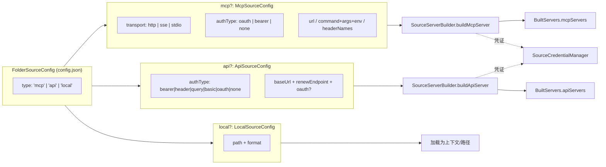
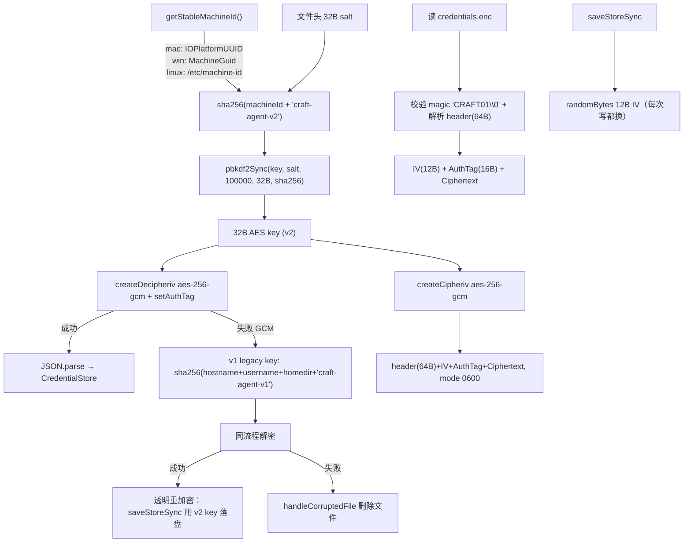
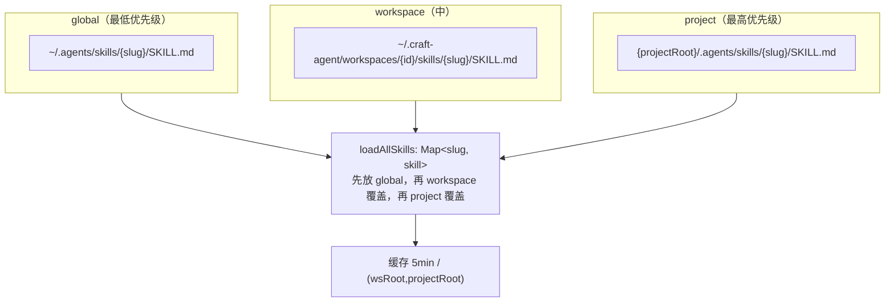

# 核心机制：Sources / Credentials / Skills

## 这是什么机制

**它是什么**：Craft Agents 用三套相互独立但同构的子系统，把「外部数据连接（Sources）」「机密凭证（Credentials）」「可复用指令（Skills）」统一管起来。Sources 负责连什么、Credentials 负责怎么连、Skills 负责连上后怎么用，三者共享同一套 workspace 磁盘布局（`~/.craft-agent/workspaces/{id}/`）与同一套 `@mention` 注入语义。

**为什么需要它**：
- 没有 Sources 的统一契约，每接一个 MCP/API/本地源都得写一套独立的连接、鉴权、prompt 注入逻辑——膨胀且易错。
- 没有加密凭证存储，OAuth token / API key 只能明文落盘或频繁弹系统钥匙串，跨机器迁移和 refresh 都无法实现。
- 没有 Skills 的分级存储，团队/项目级复用指令无法与个人指令区分，Claude Code 生态的 `.agents/skills` 习惯也接不进来。

**设计核心**：
1. **三类 Source 同契约**：`mcp`/`api`/`local` 共用 `FolderSourceConfig`，靠 `type` 字段选择 `mcp?`/`api?`/`local?` 三个互斥子块，凭证类型由 `SourceCredentialManager.getCredentialId()` 按规则映射到统一的 `source_oauth/source_bearer/source_apikey/source_basic` 四个槽。
2. **AES-256-GCM + 双 key fallback**：`credentials.enc` 用机器硬件 UUID 派生密钥加密；v1（hostname）与 v2（硬件 UUID）双 key 顺序尝试，老机器加密的凭证能透明迁移、自动重加密。
3. **Skills 三级覆盖 + plugin 名同构**：global（`~/.agents/skills`）< workspace（`{ws}/skills`）< project（`{project}/.agents/skills`），三者 basename 都是 `.agents`，对 Claude SDK 而言都解析成 `.agents:{slug}`。

---

## 一、三类 Source 的统一契约

### What / Why

`SourceType = 'mcp' | 'api' | 'local'`（`packages/shared/src/sources/types.ts:16`）是固定枚举（`packages/shared/CLAUDE.md` 也把这条列为 hard rule）。三类源的差异仅在「如何连接」，连接产出的「工具」形态对上层一致：MCP 源暴露 stdio/http MCP 工具，API 源被 `api-tools.ts` 包装成 in-process SDK MCP server（`createSdkMcpServer`），local 源提供文件路径上下文。因此 `SourceServerBuilder.buildAll()` 能把三类源统一收敛成 `{ mcpServers, apiServers, errors }`（`server-builder.ts:52-59`）。

### 三类 Source 契约图



### How：注册、激活、@mention 注入

**注册（磁盘即真相）**：每个 source 是一个文件夹 `~/.craft-agent/workspaces/{ws}/sources/{slug}/`，内含 `config.json` 与可选 `guide.md`（`types.ts:7-11`）。`createSource()`（`storage.ts:501`）调用 `generateSourceSlug()` 把名字 slug 化（`storage.ts:461`），建目录、写 config。`loadSource()`（`storage.ts:339`）把 config + guide + iconPath + 路径组装成 `LoadedSource`。

**激活判定**：`isSourceUsable()`（`storage.ts:400`）是统一闸门——`enabled` 为真且（`authType` 为 `none`/`undefined` 或 `isAuthenticated===true`）。`sourceNeedsAuthentication()`（`credential-manager.ts:1329`）是其反函数，用于提示重连。注意 stdio 传输的 MCP 源**永远不需要鉴权**（本地子进程），故返回 `false`（`credential-manager.ts:1335`）。

**@mention 注入 prompt**：用户消息里写 `[source:linear]` / `[skill:commit]` 等括号 mention。`parseMentions()`（`packages/shared/src/mentions/index.ts:62`）用正则提取并校验 slug 是否存在。注入分两条路径：

- **Source 状态**：`SourceManager.formatSourceState()`（`agent/core/source-manager.ts:159`）每轮生成 `<sources>` XML 块，列出 active/inactive 源、首次出现的 tagline、需要重连的 `<source_issue>`；对有 guide 的源强制要求「先 Read guide.md 才能调工具」。
- **Skill 解析**：`BaseAgent.extractSkillPaths()`（`base-agent.ts:930`）调用 `loadAllSkills()` 拿到全部 slug，匹配 mention 后解析出每个 skill 的 `SKILL.md` 绝对路径，并通过 `resolveSkillMentions()` 把 mention 替换成 `[Mentioned skill: Name (slug: ...)]` 保留语义。

---

## 二、AES-256-GCM 凭证存储

### What / Why

凭证存在 `~/.craft-agent/credentials.enc`（`backends/secure-storage.ts:44-45`）。为什么不直接用 OS keychain？因为跨平台（macOS/Win/Linux）一致、无钥匙串弹窗、且能在子进程（session-mcp-server）通过主进程写入的缓存文件读到（见下文）。代价是必须自己保证机密性+完整性——选 AES-256-GCM（带认证标签，防篡改）。

### 加解密流程图



### How：关键实现

**密钥派生**（`backends/secure-storage.ts:65-99, 319-348`）：v2 用硬件 UUID（macOS 的 `IOPlatformUUID` 绑主板、Win 的 `MachineGuid`、Linux 的 machine-id），比 v1 的 hostname 稳定得多（hostname 会随 DHCP/网络变化）。派生链是 `sha256(machineId + 'craft-agent-v2')` → `PBKDF2(100000 轮, sha256, 32B)`。`PBKDF2_ITERATIONS = 100000`（`:58`）。

**双 key fallback**（`loadStoreSync` `:198-256`）：先 v2 key 解，失败再用 `getLegacyEncryptionKey()`（v1，含 hostname）解；一旦 v1 解成功，立即用 v2 key 重写文件（`:248-250`），实现无感迁移。两把 key 都失败才视为损坏删文件（`handleCorruptedFile`）。

**写安全**：每次 `saveStoreSync` 都生成新 IV（`:298`，GCM 安全必需），文件权限 `0o600`（`:315`）。文件格式：64B header（magic `CRAFT01\0` + 4B flags + 32B salt + 20B reserved）+ 12B IV + 16B AuthTag + 密文（`:16-24` 注释）。

**凭证寻址**（`credentials/types.ts:170-207`）：`credentialIdToAccount()` 把 `CredentialId` 拼成 `{type}::{scope...}` 字符串做 key，用 `::` 而非 `/` 是因为 source 名可能含 `/`（如 URL）。四类 source 凭证槽：`source_oauth` / `source_bearer` / `source_apikey` / `source_basic`，scope 形如 `source_oauth::{workspaceId}::{sourceSlug}`。

**`CredentialManager` 抽象**（`credentials/manager.ts`）：单例，封装多 backend（目前仅 `SecureStorageBackend`，priority 100）。`isExpired()`（`:596`）用 5 分钟提前量；OAuth token 无 `expiresAt` 时视为已过期（强制 refresh），API key 无 `expiresAt` 视为永不过期。

### v1/v2 双 key 的设计理由

不是「为了兼容而兼容」，而是**机器迁移的真实场景**：用户把 `~/.craft-agent` 整个拷到新机器，新机器 hardware UUID 不同 → v2 key 解密失败；但 v1 用 hostname+username+homedir，如果这些碰巧相同（同账号同名机器）还能解出来。即便 hostname 不同，至少保证老版本（仅 v1）升级到新版本（仅 v2）的存量用户不会一夜之间丢全部凭证。重加密保证存量凭证只经历一次 fallback。

---

## 三、Source 凭证 + OAuth + 自动 Refresh

### What / Why

`SourceCredentialManager`（`sources/credential-manager.ts`）是 source 凭证的统一入口，把 OAuth prepare/exchange/refresh、bearer/apikey/basic 读写、过期检查、provider 路由全部收敛。`TokenRefreshManager`（`token-refresh-manager.ts`）负责「token 快过期自动换」并做限流，避免每次会话启动都对同一失效源狂刷。

### How：连接新 Source → 存凭证 → refresh → 注入 prompt 调用链

```
用户连新 Source（UI / source_oauth_trigger 工具）
  → SourceCredentialManager.prepareOAuth() [credential-manager.ts:414]
    → detectProvider() 路由 google/slack/microsoft/generic/mcp [:394]
    → PKCE + state + authUrl 生成（WebUI 走 oauth-relay 包一层 state 信封）
  → 浏览器授权 → 回调带回 code
  → exchangeAndStore() [:541]
    → 按 provider 调 exchangeXxxOAuth()
    → save() 写入 credentials.enc（type=source_oauth, scope={ws}::{slug}）
    → markSourceAuthenticated() 改 config.json [storage.ts:93]
  → 会话启动 / 工具调用
    → TokenRefreshManager.ensureFreshToken() [token-refresh-manager.ts:115]
      → needsRefresh()？过期前 5 分钟或无 expiresAt → credManager.refresh()
        → doRefresh() 路由 [credential-manager.ts:925]
          → refreshGoogle/Slack/Microsoft/Generic/Mcp 或 refreshApiRenew
        → 成功 save() 回写新 token；失败 markSourceNeedsReauth() + 5min cooldown
    → SourceServerBuilder.buildMcpServer/buildApiServer 注入 token/credential
    → SourceManager.formatSourceState() 把源状态注入 prompt
```

**Provider 路由**（`doRefresh` `:925-982`）：先判 `hasRenewEndpoint`（自定义续期，不需 refreshToken，用当前 token 调 `api.renewEndpoint`），否则必须有 `refreshToken`；再按 `provider`（google/slack/microsoft）或 `authType==='oauth'`（generic，static config 走 `refreshGenericOAuthToken`，自动发现走 MCP refresh）分支。Microsoft 特殊：refresh 会轮换 refreshToken，所以 `refreshMicrosoft` 用 `result.refreshToken || cred.refreshToken` 兜底（`:1142`）。

**并发去重**（`refresh` `:903-920`）：`pendingRefreshes` Map 按 slug 存 in-flight promise，防多请求并发刷同一源——对 Microsoft 尤其关键（并发刷会让旧 refreshToken 失效）。

**限流**（`TokenRefreshManager` `:57-89`）：失败的源进 5 分钟 cooldown（`DEFAULT_COOLDOWN_MS`），`isInCooldown()` 跳过，避免狂刷被 provider 封。

**Renew endpoint**（`refreshApiRenew` `:988-1067`）：非 OAuth 的自定义 bearer API 续期。当前 token 通过 `Authorization` 头或 `{{token}}` 占位符（body/header 递归替换）发给 `renewEndpoint.path`，从响应 `tokenField`（默认 `access_token`）取新 token。

**WebUI OAuth relay**（`auth/oauth-relay.ts`）：稳定回调 URI `https://agents.craft.do/auth/callback`，把真正的服务端回调目标编码进外层 `state` 信封（`ca1.{base64url({v,r,s})}`），由 router worker 解包。这样 Google 等只需注册一个回调地址。

**子进程读凭证**（`session-mcp-server/src/index.ts:95-145`）：MCP 子进程无 keychain 访问权，主进程把解密后的 token 写到 `{ws}/sources/{slug}/.credential-cache.json`，子进程的 `createCredentialManager()` 只读这个缓存文件；refresh 在子进程里返回 `null`（`:140` 注释「需要主进程」），由主进程侧统一刷新。

---

## 四、Skills 三级存储

### What / Why

Skills 是带 `SKILL.md`（YAML frontmatter + 正文）的可复用指令包，对应 Claude Code 的 `.agents/skills` 生态。三级（global/workspace/project）让用户级、团队级、项目级指令能分层覆盖，同名 skill 高优先级覆盖低优先级。

### 三级存储图



### How

**加载**（`skills/storage.ts:216-247`）：`loadAllSkills(workspaceRoot, projectRoot?)` 用 `Map<slug>` 按 global→workspace→project 顺序覆盖。三个目录常量：`GLOBAL_AGENT_SKILLS_DIR = ~/.agents/skills`（`:33`）、`PROJECT_AGENT_SKILLS_DIR = '.agents/skills'`（`:36`）、workspace 走 `getWorkspaceSkillsPath()`。结果按 `(wsRoot, projectRoot)` 缓存 5 分钟（`:197-198`），`invalidateSkillsCache()` 在工作目录变更或 skill 文件事件时清。

**解析**（`parseSkillFile` `:68`）：用 `gray-matter` 解 frontmatter，必填 `name`+`description`，可选 `globs`/`alwaysAllow`/`icon`/`requiredSources`。`requiredSources` 被 `normalizeRequiredSources()` 归一为去重字符串数组（`:42`），用于技能激活时自动启用对应 source。

**Plugin 名同构**（`skills/types.ts:41`）：`AGENTS_PLUGIN_NAME = '.agents'`。SDK 用 `path.basename()` 推导 plugin 名，project（`{project}/.agents/`）和 global（`~/.agents/`）basename 都是 `.agents`，所以两者解析出的 skill 都叫 `.agents:{slug}`——这是能与 Claude Code 生态互通的关键。

**单 slug 加载**（`loadSkillBySlug` `:257`）：按 project→workspace→global 顺序逐个目录查特定 slug，O(1) 而非 O(N)。

**从 Claude Code 导入**：技能目录结构（`SKILL.md` + `.agents/skills`）与 Claude Code 完全一致，`~/.agents/skills` 即 Claude Code 全局技能目录，故「导入」无需转换——同目录直接被读取。`resources/resource-bundle.ts:759` 的 `importSkills()` 处理资源包批量导入到 workspace。

**注入**：Claude 后端 SDK 原生支持 Skill 工具（`claude-agent.ts:1355` 注释「skills 由 BaseAgent.chat() 经 read-before-execute 处理，不走 plugin」）；Codex/Copilot 后端由 `BaseAgent.extractSkillPaths()`（`base-agent.ts:930`）解析 mention、注入 `SKILL.md` 路径。

---

## 五、MCP 子进程隔离

### What / Why

stdio 传输的 MCP 源会被 spawn 成本地子进程（`StdioClientTransport`）。子进程默认继承父进程全部环境变量——但父进程持有 ANTHROPIC_API_KEY、AWS、GitHub token 等，绝不能泄漏给第三方 MCP server。故 spawn 前必须过滤敏感 env。

### How

`CraftMcpClient` 构造函数（`mcp/client.ts:77-109`）：stdio 分支里遍历 `process.env`，凡 key 在 `BLOCKED_ENV_VARS`（`:43-60`）里的全部跳过，剩余的与 `config.env` 合并后传入。黑名单覆盖：

- Craft 自身鉴权：`ANTHROPIC_API_KEY`、`CLAUDE_CODE_OAUTH_TOKEN`
- 云厂商：`AWS_ACCESS_KEY_ID`、`AWS_SECRET_ACCESS_KEY`、`AWS_SESSION_TOKEN`
- 通用 token：`GITHUB_TOKEN`、`GH_TOKEN`、`OPENAI_API_KEY`、`GOOGLE_API_KEY`、`STRIPE_SECRET_KEY`、`NPM_TOKEN`

要让某个 MCP server 拿到特定 env，用户必须在 source config 的 `env` 字段显式声明（README「Local MCP Server Isolation」段佐证，`README.md:629-637`）。该黑名单在 `session-tools-core` 另有一份镜像（`BLOCKED_ENV_VARS` 注释 `:40-41` 指出需同步）。

**生命周期**：`McpClientPool`（`mcp/mcp-pool.ts:101`）按 slug 管理连接池，`connect(slug, config)` 建 client、`disconnect(slug)` 关闭、`closeAll()`（`:214-217`）并行关闭全部。`sync()`（`:229`）把池对齐到期望的 source 集合。

**session-mcp-server 子进程**（`session-mcp-server/src/index.ts`）：独立 Node 进程，stdio 与主进程通信。它向 Codex 暴露会话级工具（plan/auth/callback），通过 stderr 的 `__CALLBACK__` 前缀 JSON 把 UI 事件（`plan_submitted`/`auth_request`）回传主进程（`:73-76`）。它不能直接读 `credentials.enc`，只能读主进程写入的 `.credential-cache.json`。

---

## 设计决策小结

1. **为什么三类 Source 同契约**：差异只在「连接方式」，连接后的产物（工具）对上层一致；统一契约让 `SourceServerBuilder.buildAll()`、`SourceCredentialManager`、`SourceManager.formatSourceState()` 各写一份即可服务全部类型，新增类型（如未来 git source）只需加 `type` 枚举值 + 对应子块 + credential 映射，不触动上层。

2. **为什么 v1/v2 双 key**：硬件 UUID（v2）比 hostname（v1）稳定，但存量用户和跨机器拷贝场景下 v2 可能解不开；双 key fallback + 透明重加密让升级和迁移零摩擦，是「向后兼容」的工程化落地，而非单纯兼容。

3. **为什么 session-mcp-server 走缓存文件而非直接读 vault**：子进程无 OS 鉴权上下文，无法独立解密 `credentials.enc`；主进程解密后写 `.credential-cache.json`，子进程只读明文缓存——把机密性责任集中在主进程，子进程保持无状态、易隔离。

4. **为什么 skill 三级 basename 都是 `.agents`**：与 Claude Code 生态目录约定对齐，SDK 推导 plugin 名用 `basename`，同 basename 才能让 project/global 技能归到同一 plugin 命名空间（`.agents:{slug}`），实现「放进去就能用」的零配置互通。

---

## 待解决疑问

- `BLOCKED_ENV_VARS` 在 `mcp/client.ts` 与 `session-tools-core/.../transform-data.ts` 两处重复（注释明确要求同步，`:40-41`），未见自动同步机制，存在漂移风险。
- `SecureStorageBackend.clearCache()` 暴露为 public 但无调用方标注，疑似仅测试用。
- `getDocsSource()`（`builtin-sources.ts:36`）返回 placeholder 且 `enabled:false`，但 `craft-agents-docs` 实际作为 always-on MCP server 在 `craft-agent.ts` 直接配置——builtin source 体系已弃用，保留仅为兼容，未来可能移除。
