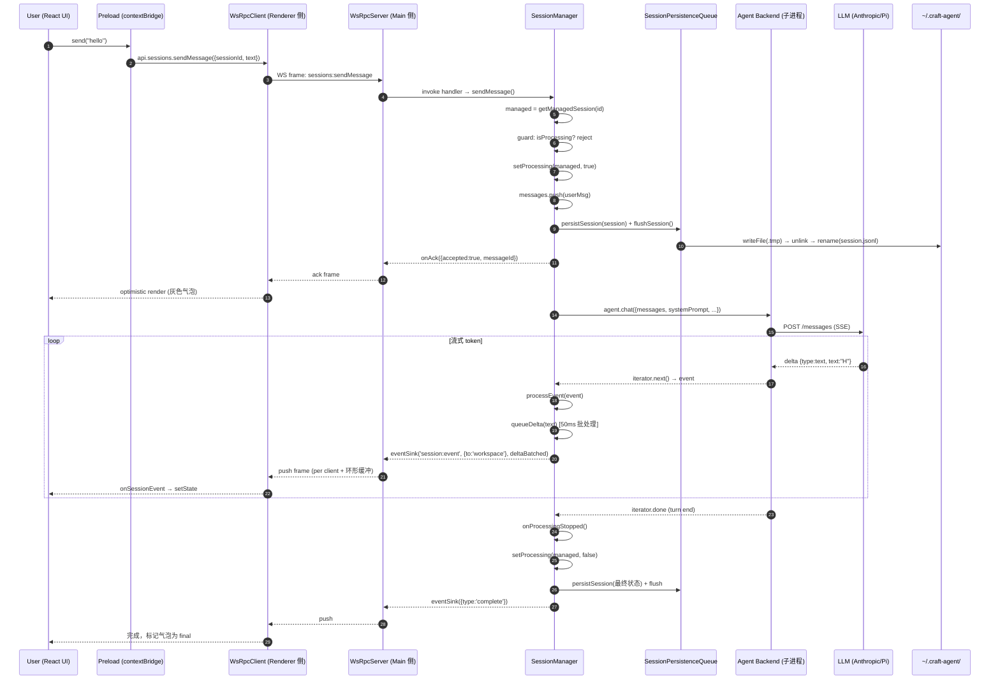
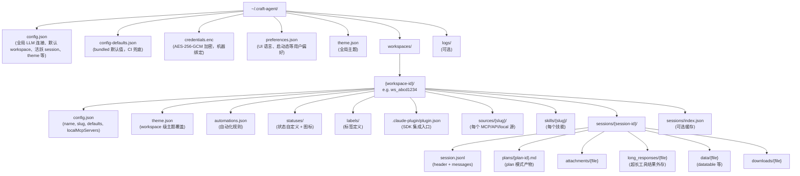
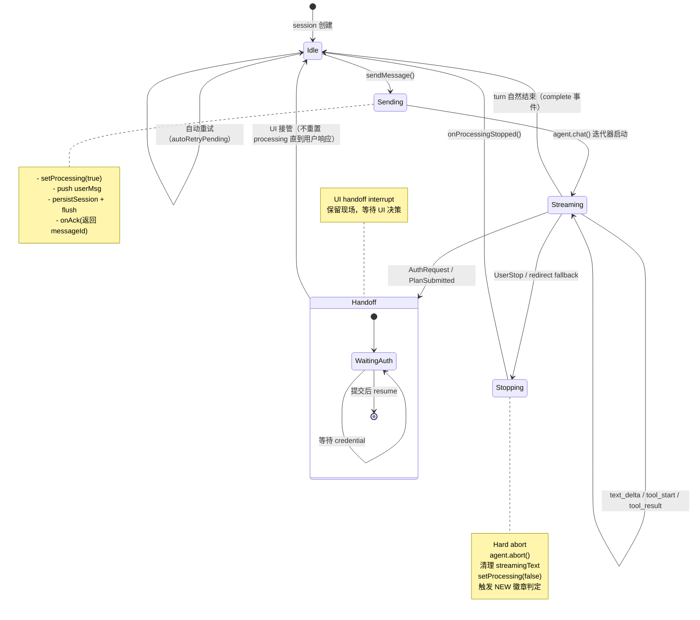
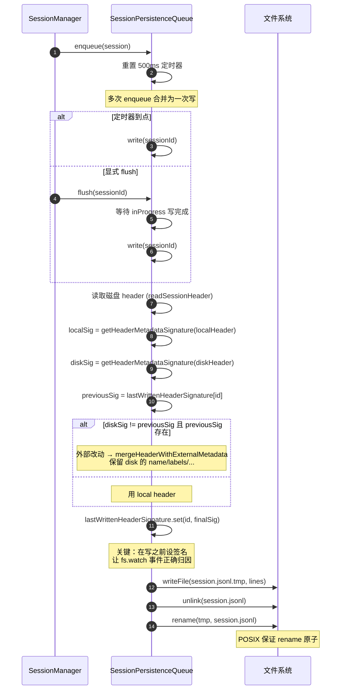
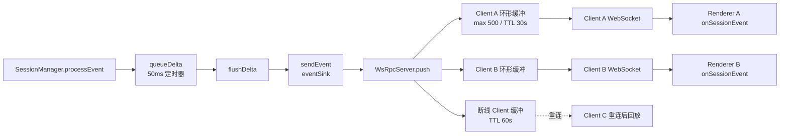
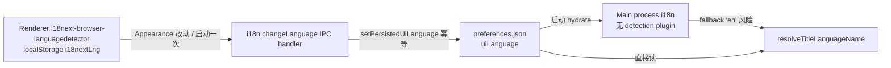
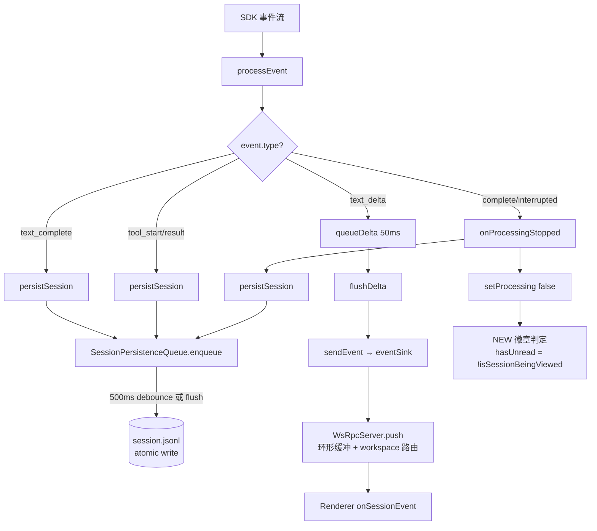

# 数据流与状态

> 代码研究 · Craft Agents OSS v0.10.4 · 2026-06-28
> 研究路径：`/Users/shanquan/code/m_code/fullstack/craft-agents-oss`
> 主题：从 React UI 到 LLM 流式回包，再到磁盘持久化的完整数据路径与状态机。

---

## 目录

1. [端到端调用链时序图](#1-端到端调用链时序图)
2. [磁盘目录树](#2-磁盘目录树)
3. [配置文件 vs 写入方矩阵](#3-配置文件-vs-写入方矩阵)
4. [运行时状态机](#4-运行时状态机)
5. [JSONL 原子性与可恢复性](#5-jsonl-原子性与可恢复性)
6. [中流状态广播：EventSink / PushTarget / 环形缓冲](#6-中流状态广播eventsink--pushtarget--环形缓冲)
7. [关键不变式与悬而未决的问题](#7-关键不变式与悬而未决的问题)

---

## 1. 端到端调用链时序图

### 1.1 是什么

用户在 React Renderer 中按下发送键后，消息依次穿越：
**Renderer (React) → Preload (沙箱) → WebSocket → Main/Node 主进程 → SessionManager → Agent 后端子进程 → LLM SDK → 网络回包 → 反向流式推送回 UI**。

整条链路使用统一的 RPC 信道命名（`RPC_CHANNELS`）和统一的 push 目标路由（`PushTarget`），并配合 fs.watch 文件监听，把"应用层调用"和"文件层变更"统一成同一套事件流。

### 1.2 为什么这样设计

- **Preload 沙箱**：Electron 的 `contextIsolation` 强制 Renderer 无法直接 `require`，必须通过 preload 注入的 `context.api` 才能调用主进程。WebSocket 模式下，preload 进一步变成"协议桥"（`WsRpcClient` / `RoutedClient`），把 Renderer 与物理传输解耦。
- **WebSocket RPC 而非 ipcRenderer**：Craft Agents 既支持本地 Electron（thin-client 模式，`CRAFT_SERVER_URL` 指向远程服务端），也支持纯浏览器访问。`WsRpcServer` + `WsRpcClient` 抽象让两套部署共用一份代码。
- **SessionManager 单点编排**：所有 session 生命周期（创建、发送、流式、停止、持久化）都汇聚到 `packages/server-core/src/sessions/SessionManager.ts`，便于集中处理并发、队列、重试、状态广播。
- **Agent 子进程隔离**：Claude Code SDK（`claude` 原生二进制）与 Pi SDK（Bun 子进程）都在独立进程里跑，避免主进程被 LLM 流阻塞；同时崩溃隔离——子进程 OOM/异常不会带崩主进程。

### 1.3 Mermaid 时序图



### 1.4 关键代码锚点

| 阶段 | 文件 | 行号 | 说明 |
|------|------|------|------|
| Renderer 调用 | `apps/electron/src/transport/build-api.ts` | - | `buildClientApi(channelMap)` 用 Proxy 动态生成 `api.sessions.sendMessage(...)` |
| Preload 路由 | `apps/electron/src/preload/bootstrap.ts` | - | 本地用 `RoutedClient`，thin-client 用 `WsRpcClient`，OAuth 通过 `performOAuth` / `startClaudeOAuth` 编排 |
| 信道常量 | `packages/shared/src/protocol/channels.ts` | - | `RPC_CHANNELS.sessions.SEND_MESSAGE = 'sessions:sendMessage'`，`sessions.EVENT = 'session:event'` |
| WS 服务端 | `packages/server-core/src/transport/server.ts` | 190 | `WsRpcServer.push(channel, target, ...args)` 遍历在线 client + 已断线 client 的环形缓冲 |
| WS 客户端 | `packages/server-core/src/transport/client.ts` | - | `WsRpcClient` 自动重连（指数退避），capabilities handler（`CLIENT_BROWSER_INVOKE` 等） |
| 主入口 | `packages/server-core/src/sessions/SessionManager.ts` | 5421 | `sendMessage()`，通过 `onAck` 钩子同步给 Renderer 返回 messageId |
| Mid-stream 处理 | `packages/server-core/src/sessions/SessionManager.ts` | 5480-5539 | 根据 `resolveMidStreamBehavior(connection)` 决定 `agent.redirect()` (steer) 还是跳过 (queue) |
| 用户消息持久化 | `packages/server-core/src/sessions/SessionManager.ts` | 5568-5570 | `persistSession` + `flushSession` 在 `onAck` **之前**——保证崩溃不丢用户输入（#616） |
| 流式主循环 | `packages/server-core/src/sessions/SessionManager.ts` | 5841 | `for await (const event of chatIterator)` |
| 停止处理 | `packages/server-core/src/sessions/SessionManager.ts` | 6203 | `onProcessingStopped()`——统一的清理与队列推进 |
| 处理态切换 | `packages/server-core/src/sessions/SessionManager.ts` | 6213 | `setProcessing(managed, false)`——唯一处理状态写口 |
| 事件分发 | `packages/server-core/src/sessions/SessionManager.ts` | 6810 | `processEvent` switch：text_delta / text_complete / tool_start / tool_result |
| Delta 批处理 | `packages/server-core/src/sessions/SessionManager.ts` | 7504-7548 | `queueDelta` / `flushDelta` 50ms 合并 |
| 事件推回 | `packages/server-core/src/sessions/SessionManager.ts` | 7486-7498 | `sendEvent` 调 `eventSink(RPC_CHANNELS.sessions.EVENT, {to:'workspace', workspaceId}, event)` |

---

## 2. 磁盘目录树

### 2.1 是什么

所有持久化数据都集中在 `~/.craft-agent/`（由 `process.env.CRAFT_CONFIG_DIR` 或 `os.homedir()/.craft-agent` 决定，见 `packages/shared/src/config/paths.ts:9-12`）。workspaces 下每个工作区一个文件夹，session 下每个会话一个文件夹。

### 2.2 为什么这样设计

- **单根目录**：方便备份、迁移、清理（`rm -rf ~/.craft-agent` 即可恢复初装状态）。
- **工作区分桶**：每个 workspace 自带 `sources/`、`sessions/`、`skills/`、`statuses/`、`labels/`、`automations.json`、`config.json`、`theme.json`，让多个 workspace 互不污染，也方便整包导出/迁移。
- **会话分目录**：每个 session 一个文件夹是为了把该会话相关的 plans/attachments/long_responses/downloads 集中存放，而非把所有会话的附件混在一个全局目录里。

### 2.3 目录树



### 2.4 关键路径来源

- `CONFIG_DIR` 与 `DEFAULT_WORKSPACES_DIR`：`packages/shared/src/workspaces/storage.ts:35-36`
- `CONFIG_FILE` / `CONFIG_DEFAULTS_FILE`：`packages/shared/src/config/storage.ts:100-101`
- `PREFERENCES_FILE`：`packages/shared/src/config/preferences.ts:46`
- `credentials.enc`：`packages/shared/src/credentials/backends/secure-storage.ts:35-46`
- session 子目录：`packages/shared/src/sessions/storage.ts:86-115`（`ensureSessionDir` 创建 plans/attachments/long_responses/data/downloads）
- workspace `.claude-plugin/plugin.json`：`packages/shared/src/workspaces/storage.ts:512-530`（`ensurePluginManifest`）

---

## 3. 配置文件 vs 写入方矩阵

### 3.1 是什么

每个磁盘文件都有一份"谁负责写"的清单。这个矩阵用于回答两个问题：
1. 我改了某个内存状态后，会落到哪个文件？
2. 我看到某个文件被改了，是谁触发的（用于 fs.watch 归因）？

### 3.2 为什么这样设计

- **单一写入方原则**：理想情况下一个文件只有一个写入入口，避免多入口竞争造成"上次写 A 下次写 B"的来回覆盖。`config.json` 的写入都被收口到 `updateLlmConnection` / `setActiveWorkspace` 等几个高阶函数。
- **写时全量替换 vs 增量 patch**：`config.json`、`preferences.json`、`credentials.enc` 都是"全量序列化"（用 `atomicWriteFileSync`），而 `session.jsonl` 是"按行追加+整体重写"。

### 3.3 矩阵

| 文件 | 写入方（函数） | 触发时机 | 原子写 | 备注 |
|------|----------------|----------|--------|------|
| `~/.craft-agent/config.json` | `saveConfigSync` (`config/storage.ts`) | LLM 连接变更、活跃 workspace/session 变更、theme 切换、通知设置、迁移 | `atomicWriteFileSync` | `updateLlmConnection` 用硬编码 allowlist 重建，新字段必须加入 allowlist 否则下次保存被丢（#838） |
| `~/.craft-agent/config-defaults.json` | `syncConfigDefaults` | 应用启动检测到缺失或版本变化 | `atomicWriteFileSync` | 从 bundled assets 同步 |
| `~/.craft-agent/credentials.enc` | `CredentialManager.saveStoreSync` (`credentials/manager.ts:281-299`) | 任何 credential 增删改 | 同步 `writeFileSync`（不是 atomic，但每次新 IV + GCM tag） | AES-256-GCM，PBKDF2 100k 迭代，密钥来自硬件 UUID |
| `~/.craft-agent/preferences.json` | `savePreferences` (`preferences.ts:66-70`) | UI 语言切换、Appearance 改动、启动偏好 | `writeFileSync`（**非原子**） | `setPersistedUiLanguage` 幂等（值未变时跳过） |
| `~/.craft-agent/theme.json` | theme storage | 全局主题切换 | `atomicWriteFileSync` | - |
| `workspaces/{id}/config.json` | `saveWorkspaceConfig` (`workspaces/storage.ts:144-164`) | workspace 创建、rename、defaults 变更、colorTheme 变更、permission mode 变更 | `atomicWriteFileSync` | `defaults.workingDirectory` 经 `toPortablePath` 转可移植形态 |
| `workspaces/{id}/theme.json` | workspace theme writer | workspace 主题覆盖 | - | `getWorkspaceColorTheme` 校验 `[a-zA-Z0-9_-]{1,64}` |
| `workspaces/{id}/automations.json` | automations storage | 自动化规则增删 | - | - |
| `workspaces/{id}/statuses/*` | `saveStatusConfig` + `ensureDefaultIconFiles` | workspace 初始化、状态增删 | - | 默认 5 个内置状态 |
| `workspaces/{id}/labels/*` | `saveLabelConfig` | workspace 初始化、标签增删 | - | 默认两个嵌套组 + valued labels |
| `workspaces/{id}/sources/{slug}/*` | source storage | 源配置变更 | - | 每个源独立目录 |
| `workspaces/{id}/skills/{slug}/*` | skill storage | 技能增删 | - | - |
| `workspaces/{id}/sessions/{id}/session.jsonl` | `SessionPersistenceQueue.write` | 用户消息入队、text_complete、tool_start/result、title 生成、停止处理 | `writeFile(.tmp) → unlink → rename`（async） | debounced 500ms，但 `flushSession` 可强制立即写 |
| `workspaces/{id}/.claude-plugin/plugin.json` | `ensurePluginManifest` (`workspaces/storage.ts:512`) | workspace 创建 / load 时缺失 | `writeFileSync`（一次性） | name 由 workspace 名生成 |

### 3.4 关键证据

- `updateLlmConnection` 重建 allowlist 的硬编码列表：见 `packages/shared/src/config/storage.ts` 中 `updateLlmConnection`，CLAUDE.md 第 46 行强调"任何新持久化字段必须加入该 allowlist 否则下次保存被丢（#838）"。
- `credentials.enc` 文件头格式：64 字节 header（magic `CRAFT01\0` + flags + salt + reserved）+ IV(12) + AuthTag(16) + ciphertext，见 `packages/shared/src/credentials/backends/secure-storage.ts:35-46`。
- 加密 fallback：`tryDecrypt` 先用新密钥（IOPlatformUUID），失败回退 legacy 密钥（hostname）以兼容迁移，见 `secure-storage.ts:233-255`。
- `setWorkspaceColorTheme` 校验非法 theme id 并 warn：`workspaces/storage.ts:447-452`。

---

## 4. 运行时状态机

### 4.1 是什么

Craft Agents 在运行时维护多个层次的状态：
- **Session 处理态**：`isProcessing`、`stopRequested`、`streamingText`、`processingGeneration`
- **Permission 模式**：`safe` / `ask` / `allow-all`（固定集合，CLAUDE.md 第 23 行）
- **Source 类型**：`mcp` / `api` / `local`（固定集合，CLAUDE.md 第 24 行）
- **Mid-stream 行为**：`queue`（anthropic 默认）vs `steer`（pi 默认），通过 `resolveMidStreamBehavior(connection)` 解析（CLAUDE.md 第 43 行）
- **连接锁定**：`connectionLocked`——首条消息后不可换 LLM 连接
- **UI 推送目标**：`PushTarget` 三种：`{to:'all'}` / `{to:'workspace', workspaceId}` / `{to:'client', clientId}`
- **NEW 徽章**：`hasUnread` 在 `assistant 完成且用户未查看` 时置 true

### 4.2 为什么这样设计

- **固定 permission/source 集合**：避免产品形态爆炸。CLAUDE.md 明确"Permission 模式固定：safe、ask、allow-all"、"Source 类型固定：mcp、api、local"。
- **midStreamBehavior 通过 resolver 而非 providerType 判断**：legacy 连接没有该字段，必须 fallback。CLAUDE.md 第 43 行："Read everywhere via `resolveMidStreamBehavior(connection)` — never branch on `providerType` directly"。
- **硬中断 vs UI 移交**：区分真取消（`UserStop`）与暂停点（`AuthRequest`、`PlanSubmitted`），让前者直接拆，后者保留现场等 UI。CLAUDE.md 第 35-38 行。
- **连接锁定**：避免会话中途切换 LLM 导致 SDK session 状态错乱。`getOrCreateAgent` 中 `managed.connectionLocked = true`。
- **`hasUnread` 作为 NEW 徽章单一真源**：替代"比较 lastReadMessageId 与最后消息"的脆弱推导。

### 4.3 Mermaid 状态图



### 4.4 关键代码锚点

| 状态点 | 文件 | 行号 | 说明 |
|--------|------|------|------|
| `ManagedSession` 字段 | `SessionManager.ts` | 761-953 | `isProcessing`、`stopRequested`、`streamingText`、`processingGeneration`、`messageQueue`、`messagesLoaded`、`pendingExternalMetadata`、`_metadataWriteGuardUntil`、`autoRetryPending` |
| 处理态写口 | `SessionManager.ts` | 6213 | `setProcessing(managed, false)`——唯一改 isProcessing 的地方 |
| 停止处理中心 | `SessionManager.ts` | 6203 | `onProcessingStopped()`——清理 + 队列推进 + NEW 徽章判定 |
| NEW 徽章状态机 | `SessionManager.ts` | 6232-6247 | 基于 `isSessionBeingViewed` 决定 `hasUnread` |
| Mid-stream 分支 | `SessionManager.ts` | 5480-5539 | `steer` 调 `agent.redirect(message)`，`queue` 跳过 |
| 连接锁定 | `SessionManager.ts` | 3110-3310 (`getOrCreateAgent`) | `managed.connectionLocked = true` |
| Hard abort vs handoff | `SessionManager.ts` | - | `UserStop` → hard abort；`AuthRequest` / `PlanSubmitted` → handoff interrupt |
| SDK session id 写盘 | `SessionManager.ts` | `onSdkSessionIdUpdate` | `onSdkSessionIdUpdate` 立即 flush，保证 SDK session id 不丢 |
| Branch 策略 | `SessionManager.ts` | `getOrCreateAgent` 内 | `sdk-fork` vs `seeded-fresh-session` |

### 4.5 Mid-stream 行为决策表

| providerType | 默认 midStreamBehavior | 含义 |
|--------------|------------------------|------|
| `anthropic` | `queue` | 让当前 turn 跑完，新消息排队下一 turn |
| `pi` | `steer` | 调 `agent.redirect()` 尝试扭转当前 turn |
| `pi_compat` | `steer` | 同 pi |
| legacy（无字段） | 由 `resolveMidStreamBehavior` fallback | 通过 `defaultMidStreamBehavior(providerType)` |

依据：CLAUDE.md 第 43 行。决策点只在 `SessionManager.sendMessage` 的 mid-stream 分支，**后端代码（`claude-agent.ts` / `pi-agent.ts`）不改**——`queue` 模式只是跳过 `agent.redirect()`。

---

## 5. JSONL 原子性与可恢复性

### 5.1 是什么

每个会话存为一个 `.jsonl` 文件：
- **第 1 行**：`SessionHeader`（预计算的元数据，让会话列表只读 8KB 即可渲染）
- **第 2 行起**：每行一条 `StoredMessage`

文件通过"写入临时文件 → 删除原文件 → 重命名"三步原子替换，并辅以路径可移植化、签名追踪、容错解析等机制保证崩溃安全。

### 5.2 为什么这样设计

- **JSONL 而非单个 JSON**：单条消息一行，追加友好；崩溃只丢最后一行；流式增量可映射到行。
- **原子写**：进程在 `writeFile(.tmp)` 中途崩溃只会留下一个半成品 `.tmp`，原 `session.jsonl` 完整无损；下次启动时 `listSessions` 还会清理孤儿 `.tmp`（`storage.ts:343-384`）。
- **路径可移植化**：所有 session 内嵌的绝对路径（datatable src、planPath、attachment storedPath）都替换为 `{{SESSION_PATH}}` token，跨机器/跨用户目录都能加载。
- **预计算 header**：列表渲染只读首行 8KB（`readSessionHeader`），不必解析全部消息——大会话（几千条）也能秒开。
- **签名追踪**：`getHeaderMetadataSignature` 把易变元数据（name、labels、isFlagged、sessionStatus、permissionMode、hasUnread、lastReadMessageId）做 JSON.stringify，比较"上次写的签名"与"当前磁盘签名"，识别外部写入（watcher 编辑、另一实例）并保留磁盘值，避免队列写入覆盖外部改动。

### 5.3 Mermaid 写流程



### 5.4 关键代码锚点

| 机制 | 文件 | 行号 | 说明 |
|------|------|------|------|
| `SESSION_PATH_TOKEN` | `sessions/jsonl.ts` | 23 | `'{{SESSION_PATH}}'` |
| `makeSessionPathPortable` | `sessions/jsonl.ts` | 30 | 把 sessionDir 替换为 token；Windows 额外处理 JSON 转义的反斜杠 |
| `expandSessionPath` | `sessions/jsonl.ts` | 47 | 读时反向替换 |
| `readSessionHeader`（8KB 快读） | `sessions/jsonl.ts` | 80 | `openSync` + `readSync(8192)` 取首行 |
| `readSessionJsonl`（完整读） | `sessions/jsonl.ts` | 103 | 容错解析所有消息行 |
| `writeSessionJsonl`（同步原子写） | `sessions/jsonl.ts` | 150-164 | `writeFileSync(.tmp)` → `unlinkSync(target)` → `renameSync(.tmp, target)` |
| `createSessionHeader`（预计算） | `sessions/jsonl.ts` | 171-185 | messageCount、lastMessageRole、preview、tokenUsage、lastFinalMessageId |
| `parseMessagesResilient`（容错） | `sessions/jsonl.ts` | 287 | 跳过 `JSON.parse` 失败的行（崩溃截断的最后一行） |
| `getHeaderMetadataSignature` | `sessions/persistence-queue.ts` | 24 | 7 个易变字段的 JSON 签名 |
| `mergeHeaderWithExternalMetadata` | `sessions/persistence-queue.ts` | 37 | 外部改动时保留磁盘元数据 |
| 队列写主流程 | `sessions/persistence-queue.ts` | 90-166 | async writeFile → unlink → rename |
| 签名先设 | `sessions/persistence-queue.ts` | 154-155 | `lastWrittenHeaderSignature.set(id, finalSignature)` 在 writeFile 之前 |
| flush 串行化 | `sessions/persistence-queue.ts` | 173 | 等待 inProgress 写完成，避免共享 `.tmp` 竞争 |
| 单例 | `sessions/persistence-queue.ts` | 241 | `export const sessionPersistenceQueue = new SessionPersistenceQueue()` |
| session id 路径净化 | `sessions/storage.ts` | 70 | `sanitizeSessionId` 防路径穿越 |
| 孤儿 .tmp 清理 | `sessions/storage.ts` | 343-384 | `listSessions` 时清理 |

### 5.5 持久化时机一览

| 触发点 | 是否立即 flush | 代码位置 | 设计动机 |
|--------|----------------|----------|----------|
| 用户消息入队后 | **是**（`flushSession`） | `SessionManager.ts:5568-5570` | 崩溃不丢用户输入（#616） |
| SDK session id 拿到 | **是**（`onSdkSessionIdUpdate`） | `SessionManager.ts` `onSdkSessionIdUpdate` | SDK session id 不丢，分支/恢复依赖 |
| `text_complete` 事件 | 否（debounced 500ms） | `SessionManager.ts:6877` | 流式期间频繁更新，合并写 |
| `tool_start` / `tool_result` | 否（debounced） | `processEvent` 内 | 同上 |
| `onProcessingStopped` | 否（debounced） | `SessionManager.ts:6203` | turn 结束统一落盘 |
| 标题生成完成 | 否（debounced） | `generateTitle` / `refreshTitle` | 异步生成后持久化 |
| 应用退出 | `flushAll()` | `persistence-queue.ts:212` | 关闭前清空队列 |

---

## 6. 中流状态广播：EventSink / PushTarget / 环形缓冲

### 6.1 是什么

LLM 流式输出每个 token 都会触发 `text_delta` 事件。如果不批处理直接推 WS，每秒可能产生 50+ 个 IPC 帧，Renderer 渲染压力极大。Craft Agents 用三层机制缓解：
1. **Delta 批处理**（50ms 合并）
2. **PushTarget 路由**（只推到关注的 workspace 客户端）
3. **环形缓冲 + 重连回放**（断线 30s 内的事件可补发）

`EventSink` 是从 SessionManager 到传输层的**唯一桥**：`eventSink(channel, target, ...args)`。

### 6.2 为什么这样设计

- **单一广播口**：所有 session 事件都走 `RPC_CHANNELS.sessions.EVENT` 信道，配合 `PushTarget` 决定路由，避免每个 feature 各自实现推送逻辑。
- **批处理**：50ms 合并 deltas 把每秒 50+ 帧降到 ~20 帧，UI 渲染跟得上 60fps。
- **环形缓冲**：WebSocket 不保证消息不丢，断线重连时若直接错过事件，UI 会"卡在中间态"。30s 缓冲让重连后能补齐。
- **PushTarget 三态**：`'all'` 广播（如全局通知）、`'workspace'` 工作区定向（大部分 session 事件）、`'client'` 点对点（如 OAuth 回调）。

### 6.3 Mermaid 广播图



### 6.4 关键代码锚点

| 机制 | 文件 | 行号 | 说明 |
|------|------|------|------|
| `EventSink` 类型 | `packages/server-core/src/transport/types.ts` | - | `(channel, target, ...args) => void` |
| `sendEvent` 调 eventSink | `SessionManager.ts` | 7486-7498 | `eventSink(RPC_CHANNELS.sessions.EVENT, {to:'workspace', workspaceId}, event)` |
| `queueDelta` / `flushDelta` | `SessionManager.ts` | 7504-7548 | 50ms 定时器批合并 |
| `PushTarget` 类型 | `packages/shared/src/protocol/types.ts` | - | `{to:'all',exclude?} \| {to:'workspace',workspaceId,exclude?} \| {to:'client',clientId}` |
| `WsRpcServer.push` | `packages/server-core/src/transport/server.ts` | 190 | 遍历在线 client + 断线 client 的环形缓冲 |
| `EVENT_BUFFER_MAX_SIZE` | `packages/shared/src/protocol/types.ts` | - | 500（每客户端环形缓冲上限） |
| `EVENT_BUFFER_TTL_MS` | `packages/shared/src/protocol/types.ts` | - | 30000（30s） |
| `DISCONNECTED_CLIENT_TTL_MS` | `packages/shared/src/protocol/types.ts` | - | 60000（断线 client 保留 60s） |
| `HEARTBEAT_INTERVAL_MS` | `packages/shared/src/protocol/types.ts` | - | 30000 |
| `PROTOCOL_VERSION` | `packages/shared/src/protocol/types.ts` | - | `'1.0'` |
| `SessionEvent` 联合类型 | `packages/shared/src/protocol/dto.ts` | 167-211 | `text_delta` / `text_complete` / `tool_start` / `tool_result` / `error` / `complete` / `interrupted` / `user_message` / ... |
| `BroadcastEventMap` | `packages/shared/src/protocol/events.ts` | - | push 事件类型映射 |
| 客户端能力调用 | `apps/electron/src/preload/bootstrap.ts` | - | `CLIENT_BROWSER_INVOKE` → `ipcRenderer.invoke('__browser:invoke', req)`；OAuth flow |

### 6.5 推送频次降低效果

| 阶段 | 推送频率 | 备注 |
|------|----------|------|
| 未批处理 | ~50 fps（每 token 一帧） | Renderer 卡顿 |
| 50ms 批处理 | ~20 fps | 与 60fps 渲染节拍匹配 |
| PushTarget workspace 过滤 | 仅当前 workspace 客户端收 | 跨 workspace 不相互打扰 |

---

## 7. 关键不变式与悬而未决的问题

### 7.1 关键不变式

| 不变式 | 含义 | 代码依据 |
|--------|------|----------|
| **Permission 模式固定集合** | 只允许 `safe` / `ask` / `allow-all`，写入经 `parsePermissionMode` 校验，非法值丢弃 | CLAUDE.md L23；`sessions/jsonl.ts:57-74`（`normalizeHeaderPermissionModes`） |
| **Source 类型固定集合** | 只允许 `mcp` / `api` / `local` | CLAUDE.md L24 |
| **midStreamBehavior 通过 resolver 读** | 永远 `resolveMidStreamBehavior(connection)`，不直接 `if providerType === ...` | CLAUDE.md L43 |
| **用户消息先持久化再 ack** | `persistSession` + `flushSession` 在 `onAck` 之前 | `SessionManager.ts:5568-5570`（#616） |
| **SDK session id 即时落盘** | `onSdkSessionIdUpdate` 立即 flush | `SessionManager.ts` `onSdkSessionIdUpdate` |
| **连接首条消息后锁定** | `connectionLocked = true` 在 `getOrCreateAgent` 中 | `SessionManager.ts:3110-3310` |
| **session.jsonl 原子写** | 永远 `.tmp` → unlink → rename | `sessions/jsonl.ts:150-164`、`persistence-queue.ts:90-166` |
| **签名先于写** | `lastWrittenHeaderSignature` 在 writeFile 之前设置，让 fs.watch 自写事件正确归因 | `persistence-queue.ts:154-155` |
| **flush 串行化** | 同 session 的 flush 等待 inProgress，避免 `.tmp` 竞争 | `persistence-queue.ts:173-194` |
| **Session 处理态单点写** | `setProcessing(managed, false)` 是唯一改 isProcessing 的位置 | `SessionManager.ts:6213` |
| **Hard abort vs UI handoff 区分** | `UserStop` / redirect fallback → hard abort；`AuthRequest` / `PlanSubmitted` → handoff interrupt | CLAUDE.md L35-38 |
| **Volatile vs Stable 上下文分块** | Volatile（日期/session_state/sources）每 turn 变；Stable（workspace 能力、cwd）不变。Claude 全放 user 尾；Pi 把 stable 折入 system prefix | CLAUDE.md L45 |
| **Volatile 只算一次** | `buildVolatileContextParts` 消费一次性 mode-change 信号，每 turn 仅调一次；不可复算用于 cache-debug hash | CLAUDE.md L45 |
| **OAuth 身份字段走 SETUP 而非 EXCHANGE** | `oauthIdentity` 通过 `SETUP_LLM_CONNECTION` payload 持久化，因为 connection 由 SETUP 创建 | CLAUDE.md L46 |
| **`updateLlmConnection` 用 allowlist** | 新持久化字段必须加 allowlist，否则下次保存被丢 | CLAUDE.md L46（#838） |
| **`uiLanguage` 不可经 `update_user_preferences` 改** | 只能由 Appearance dropdown 写 | CLAUDE.md L151 |
| **标题语言用 `resolveTitleLanguageName`** | 不读 `i18n.resolvedLanguage`，避免主进程异步 hydrate 时回退 'en' | CLAUDE.md L153（#885） |
| **i18n 键必须全 locale 覆盖** | `en.json` / `es.json` / `zh-Hans.json` 都要有，按字母序排 | CLAUDE.md L107 |
| **i18next pluralization** | 用 `_one` / `_other`，禁止手写 `count === 1 ?` | CLAUDE.md L102 |
| **`update_runtime_config` IPC 字段固定** | 只携带 `model, providerType, authType, baseUrl, customEndpoint, customModels`；`piAuthProvider` / `slug` 等 restart-required 字段单独 hash | CLAUDE.md L34 |
| **网络拦截器仅 Pi** | Claude SDK 不再跑在 Bun 下（0.2.113 起切换原生 `claude` 二进制），`--preload` 不可用 | CLAUDE.md L44 |
| **OpenAI SSE 单事件合并** | 每个 tool call 一次性发 `id+name+cleanArgs`，不拆 init+args-only delta | CLAUDE.md L42 |
| **Mythos 思考常开** | `claude-fable-5` 等模型不能 `thinking:disabled`，"off" 映射为 `{adaptive, effort:low}` | CLAUDE.md L47 |
| **`queryLlm` 必须报告有效 model** | 不允许返回捏造的 `LLMQueryResult.model`，UI 视为权威 | `packages/shared/CLAUDE.md` L186-188 |

### 7.2 已知技术债与悬而未决的问题

1. **`preferences.json` 非原子写**（`savePreferences` 用 `writeFileSync`）。如果崩溃发生在写中途，文件可能损坏。考虑改为 `atomicWriteFileSync`。
2. **`credentials.enc` 每次全量重写**（saveStoreSync）。credential 数量很大时性能可能成问题；但 GCM 每次新 IV 保证语义安全，目前规模下可接受。
3. **Volatile context 单次消费约束**（CLAUDE.md L45）。若未来有开发者不知道这点，复算会导致 mode-change 信号被吞。需要更明显的运行时断言或注释。
4. **legacy `think` 兼容代码**（`workspaces/storage.ts:128-132`）。`thinkingLevel` 的旧值 'think' 仍在 normalize，标注 TODO 待旧 workspace 配置 aged out 后删除。
5. **`network interceptor` 仅 Pi**（CLAUDE.md L44）。Claude 路径的 rich tool intent / fast-mode override / MalformedBodyError validation 是 Phase-2 工作，需要迁到 SDK hooks 或本地代理。
6. **跨平台 `unlink → rename`**（Windows 上 rename 失败若 target 存在，所以先 unlink）。这仍然不是完美的原子操作——`unlink` 后到 `rename` 前的窗口里若有读请求会 ENOENT。考虑用 `fs.rename` 在 POSIX 平台直接覆盖，Windows 用 `MoveFileEx` REPLACE_EXISTING。
7. **EventSink 类型签名宽松**（`...args: any[]`）。未来若收紧为 discriminated union，可让编译器保证 channel 与 payload 形状一致。
8. **midStreamBehavior 的 `steer` 模式 vs `queue` 模式**：`steer` 依赖 `agent.redirect()`，但 Pi 后端在 parallel-tool 时 args-only delta 会被错误识别为新 tool call（CLAUDE.md L42）。`sanitizeOpenAiHistoryInPlace` 是事后补救，根因在拦截器层已修，但老 history 仍可能带病。
9. **JSONL 第 1 行 header 大小**：`readSessionHeader` 只读 8KB，理论上 header 超 8KB 会截断。当前 header 字段有限，但若未来给 header 加大对象（如复杂 tokenUsage），需注意。

### 7.3 i18n 三重校验

CLAUDE.md L117-127 强调：

| 脚本 | 抓什么 |
|------|--------|
| `lint:i18n:sorted` | locale 键未按字母序 |
| `lint:i18n:parity` | 非 EN locale 缺失 EN 中存在的键（或反之） |
| `lint:i18n:coverage` | `t('...')` 引用的键不在 `en.json` 里 |

`parity` 单独不够：merge 把同样的 50 个键从所有 locale 一起删掉时 parity 测不出（每个 locale 都一致地缺），但 `coverage` 会抓到调用点。合并冲突解完后跑 `bun run validate:ci` 三项全过即可信。

### 7.4 跨进程语言持久化链



关键：`resolveTitleLanguageName` 直接读 `preferences.json`，**不读 `i18n.resolvedLanguage`**——因为主进程 i18n 异步 hydrate，早期会回退 'en'，导致非英文会话被生成英文标题（#885）。

### 7.5 凭证加密格式（备查）

```
文件：~/.craft-agent/credentials.enc
┌────────────────────────────────────────────────────────────┐
│ 64 字节 Header                                             │
│  ├─ magic: "CRAFT01\0" (8B)                                │
│  ├─ flags (4B)                                             │
│  ├─ salt (16B)                                             │
│  └─ reserved (36B)                                         │
├────────────────────────────────────────────────────────────┤
│ IV (12B)                                                   │
├────────────────────────────────────────────────────────────┤
│ AuthTag (16B)                                              │
├────────────────────────────────────────────────────────────┤
│ Ciphertext (AES-256-GCM(credentials JSON))                │
└────────────────────────────────────────────────────────────┘

密钥派生：PBKDF2(hash=sha256, iterations=100000, keylen=32)
密钥来源（按优先级）：
  1. macOS IOPlatformUUID
  2. Windows MachineGuid (HKLM\Software\Microsoft\Cryptography)
  3. Linux /var/lib/dbus/machine-id
fallback：hostname（legacy，用于迁移解密）
```

依据：`packages/shared/src/credentials/backends/secure-storage.ts:35-46, 233-255, 281-299`。

### 7.6 Workspace 默认目录布局（创建时）

`createWorkspaceAtPath`（`workspaces/storage.ts:292-347`）创建：

```
{rootPath}/
├─ config.json                # saveWorkspaceConfig
├─ sources/                   # mkdir -p
├─ sessions/                  # mkdir -p
├─ skills/                    # mkdir -p
├─ statuses/                  # saveStatusConfig(getDefaultStatusConfig())
│  └─ icons/*                 # ensureDefaultIconFiles
├─ labels/                    # saveLabelConfig(getDefaultLabelConfig())
└─ .claude-plugin/
   └─ plugin.json             # ensurePluginManifest
```

### 7.7 Session 目录布局（首次持久化时）

`ensureSessionDir`（`sessions/storage.ts:86-115`）创建：

```
{workspace}/sessions/{sessionId}/
├─ session.jsonl              # 持久化时由 SessionPersistenceQueue 写
├─ plans/                     # plan 模式产物
├─ attachments/               # 用户上传/工具产生的附件
├─ long_responses/            # 超长工具结果外存（避免 jsonl 行过长）
├─ data/                      # datatable 等
└─ downloads/                 # 工具下载产物
```

### 7.8 写盘与广播的总览



---

## 附录 A：关键文件速查表

| 关注点 | 文件 |
|--------|------|
| Session 总编排 | `packages/server-core/src/sessions/SessionManager.ts` |
| JSONL 格式 | `packages/shared/src/sessions/jsonl.ts` |
| 持久化队列 | `packages/shared/src/sessions/persistence-queue.ts` |
| Session CRUD | `packages/shared/src/sessions/storage.ts` |
| Session 类型 | `packages/shared/src/sessions/types.ts` |
| 全局 config | `packages/shared/src/config/storage.ts` |
| 路径常量 | `packages/shared/src/config/paths.ts` |
| 偏好 | `packages/shared/src/config/preferences.ts` |
| fs.watch | `packages/shared/src/config/watcher.ts` |
| 凭证管理 | `packages/shared/src/credentials/manager.ts` |
| 凭证加密 | `packages/shared/src/credentials/backends/secure-storage.ts` |
| RPC 信道 | `packages/shared/src/protocol/channels.ts` |
| PushTarget/常量 | `packages/shared/src/protocol/types.ts` |
| 事件 DTO | `packages/shared/src/protocol/dto.ts` |
| EventSink 类型 | `packages/server-core/src/transport/types.ts` |
| WS 服务端 | `packages/server-core/src/transport/server.ts` |
| WS 客户端 | `packages/server-core/src/transport/client.ts` |
| Preload 桥 | `apps/electron/src/preload/bootstrap.ts` |
| Renderer API | `apps/electron/src/transport/build-api.ts` |
| Workspace 存储 | `packages/shared/src/workspaces/storage.ts` |
| 原子写工具 | `packages/shared/src/utils/files.ts` |
| 模式类型 | `packages/shared/src/agent/mode-types.ts` |
| 思考级别 | `packages/shared/src/agent/thinking-levels.ts` |
| 模型注册 | `packages/shared/src/config/models.ts` |
| Pi 模型目录 | `packages/shared/src/config/models-pi.ts` |
| Claude OAuth | `packages/shared/src/auth/claude-oauth.ts` |
| 网络拦截器 | `packages/shared/src/agent/backend/internal/unified-network-interceptor.ts` |
| Runtime 配置 | `packages/shared/src/agent/backend/internal/runtime-config.ts` |
| 拦截器 bundle 解析 | `packages/shared/src/agent/backend/internal/runtime-resolver.ts` |
| 自动化匹配 | `packages/shared/src/automations/utils.ts` |

---

## 附录 B：术语表

| 术语 | 释义 |
|------|------|
| **ManagedSession** | SessionManager 内部对每个活跃 session 的运行时包装，含 isProcessing、messageQueue、streamingText 等内存态字段 |
| **SessionHeader** | session.jsonl 第 1 行，含预计算的 messageCount/preview/lastMessageRole，让列表渲染只读 8KB |
| **StoredMessage** | session.jsonl 第 2 行起每行一条，含 role/content/toolCalls/attachments 等 |
| **PushTarget** | 推送目标路由 `{to:'all'\|'workspace'\|'client'}` |
| **EventSink** | 从 SessionManager 到传输层的回调签名 `(channel, target, ...args) => void` |
| **Hard abort** | 真取消（UserStop、redirect fallback），调 agent.abort() 拆现场 |
| **UI handoff interrupt** | 暂停点（AuthRequest、PlanSubmitted），保留现场等 UI 响应 |
| **midStreamBehavior** | 用户在 turn 进行中再发消息时的策略：'queue' 排队下一 turn，'steer' 扭转当前 turn |
| **Volatile context** | 每 turn 都变的上下文块（日期、session_state、sources） |
| **Stable context** | 不变的上下文块（workspace 能力、cwd） |
| **`{{SESSION_PATH}}`** | session 内嵌路径的可移植化 token，落盘时替换为 token，读时还原 |
| **Header signature** | 7 个易变元数据字段的 JSON.stringify，用于追踪"上次写的样子"，识别外部改动 |
| **Connection locked** | 首条消息后 LLM 连接不可换，避免 SDK session 状态错乱 |
| **`resolveMidStreamBehavior`** | 唯一读取 midStreamBehavior 的入口，对 legacy 连接 fallback |
| **NEW 徽章** | `hasUnread` 单一真源，在 `assistant 完成且用户未查看` 时置 true |

---

以上即为"数据流与状态"模块的完整代码研究报告。所有结论均附 file:line 证据，可在源码中复核。
