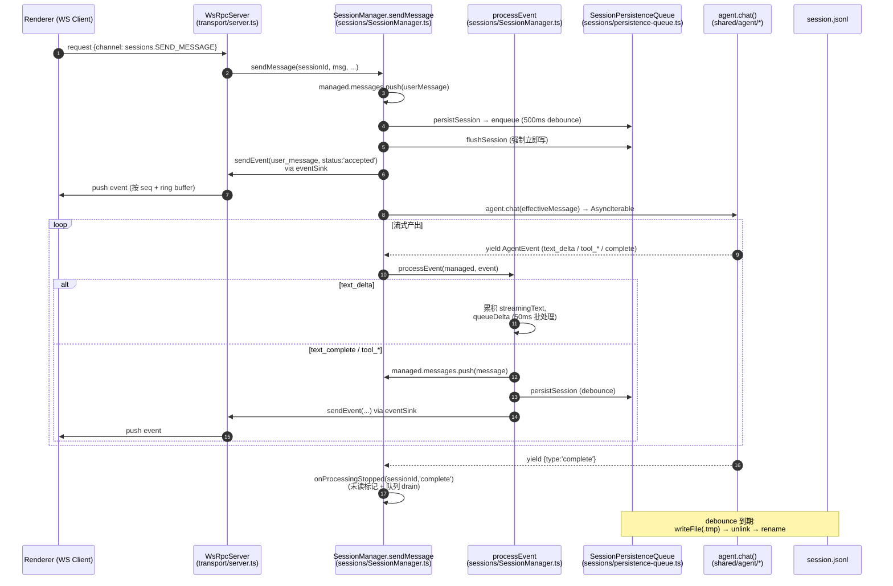
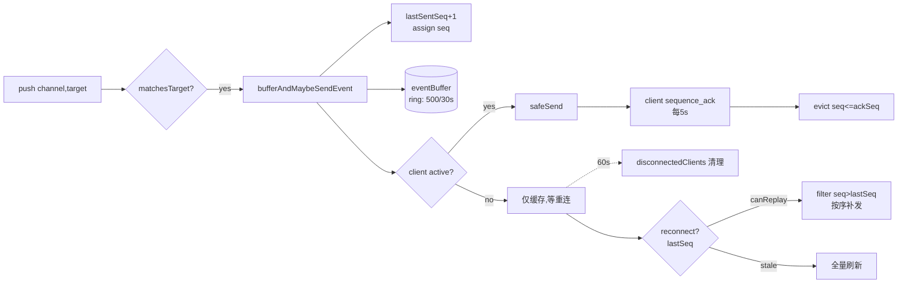
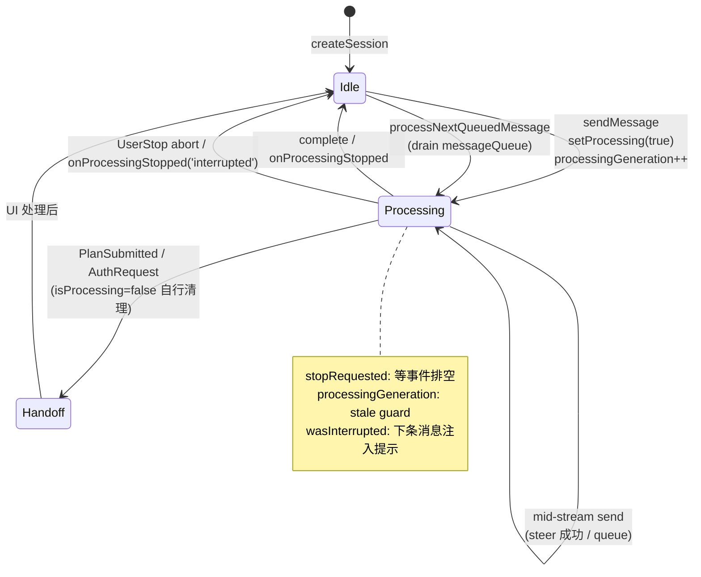
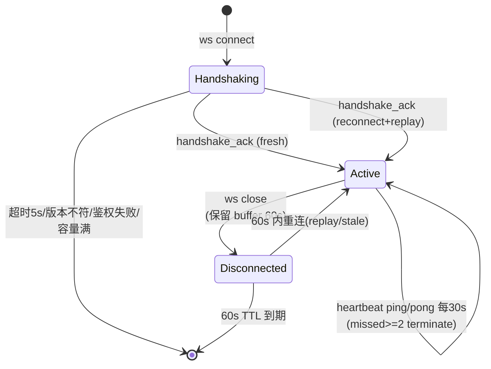

# 05 · 数据流与状态管理

> Craft Agents（craft.do 开源 Agent 工作站，Bun monorepo）数据流与状态专题。
> 所有结论均附源码证据（`文件路径` + 函数/类型/字段/常量）。测试文件、node_modules、dist、lock 已忽略。
> 代码标识符/路径保留原文，其余叙述为中文。

---

## 0. 全景：一条 assistant message 的生命周期

**它从哪里来**：用户在 renderer 输入框敲下消息。
**经历什么转换**：WS RPC → `SessionManager.sendMessage` → 落盘用户消息并 ack → `agent.chat()` 异步迭代器 → `processEvent` 把每个 SDK 事件转成 `Message` 并 push 进 `managed.messages` → 经 `persistSession`（debounce + atomic write）落 JSONL → 经 `sendEvent → eventSink → WsRpcServer.push` 推回 UI。
**到哪里去**：消息最终既持久化在 `{workspace}/sessions/{id}/session.jsonl`，又通过 WS 增量推送给该 workspace 下所有在线客户端。



关键证据锚点：
- 发消息入口与 ack：`packages/server-core/src/sessions/SessionManager.ts:5421` `sendMessage`，`5568-5579`（先 persist + flush 再 emit accepted，注释 #616）。
- 事件循环：`5841` `for await (const event of chatIterator)` → `5854` `processEvent`。
- `processEvent`：`6810`，`text_delta` 分支 `6815`，`text_complete` 分支 `6821`。
- `eventSink` 注入：`1203` `setEventSink`；`sendEvent` 实现 `7486`。

---

## 1. 核心数据结构

### ManagedSession（运行时会话状态）

**它是什么**：SessionManager 内存中每个活跃会话的完整运行时状态（`packages/server-core/src/sessions/SessionManager.ts:761` `interface ManagedSession`）。
**为什么这样建模**：磁盘上只有 JSONL 快照（header + messages），但运行时需要追踪大量瞬态信息（是否在处理、流式缓冲、消息队列、agent 句柄、token 刷新器、分支上下文等）。把这些放在内存对象而非磁盘，避免每次状态变化都触发 IO，同时允许 `messageQueue`、`streamingText` 这类不必持久化的瞬态字段存在。

**关键字段**（`SessionManager.ts:761-953`）：

| 字段 | 含义 | 是否持久化 |
|------|------|-----------|
| `isProcessing` (`766`) | 会话是否正在跑 LLM turn | 否（运行时） |
| `stopRequested` (`768`) | 用户点了 Stop，但等事件循环排空再清 `isProcessing` | 否 |
| `streamingText` (`770`) | 当前 turn 累积的流式文本 | 否 |
| `processingGeneration` (`773`) | 每次 sendMessage 自增；用于检测后续消息是否 supersede 当前 turn（stale-request guard） | 否 |
| `messageQueue` (`863`) | 处理中收到的新消息，FIFO 待 replay | 否 |
| `messages: Message[]` (`765`) | 完整消息历史（含 user/assistant/tool/error/plan） | **是**（JSONL 2+ 行） |
| `sdkSessionId` (`794`) | SDK 侧会话 ID，用于对话续接/分支 | 是 |
| `tokenUsage` (`796`) | input/output/context/cost 等 | 是 |
| `enabledSourceSlugs` (`819`) | 本会话启用的 source slugs | 是 |
| `lastFinalMessageId` (`844`) | 最近一条最终（非 intermediate）assistant 消息 ID，预计算用于未读检测 | 是 |
| `turnStartFinalMessageId` (`846`) | turn 开始时的 lastFinalMessageId（运行时，不持久化），用于判断本 turn 是否产出新最终消息 | 否 |
| `wasInterrupted` (`933`) | 上一 turn 被打断，下一 message 注入 `<system-reminder>` 提示 LLM；一次性，不持久化 | 否 |
| `piSdkMessageToCraftMessage` (`941`) | Pi SDK message id → Craft message id 映射，cap 256（`PI_SDK_MESSAGE_ID_CACHE_LIMIT`，`955`） | 否 |
| `autoRetryPending` (`947`) | source 激活自动重试的去重槽（#804） | 否 |

### SessionHeader（JSONL 首行）

**它是什么**：`session.jsonl` 第一行的元数据头（`packages/shared/src/sessions/types.ts` `SessionHeader`，由 `sessions/jsonl.ts:createSessionHeader` 构造）。
**为什么这样建模**：会话列表加载只需读每个文件首行（`sessions/storage.ts:369` `readSessionHeader`），无需解析全部消息，O(N) 文件数而非 O(总消息数)。这是 sidebar 列表快速加载的关键。

包含 `id/name/labels/sessionStatus/permissionMode/hasUnread/lastReadMessageId/messageCount/createdAt/lastUsedAt` 等可被列表视图消费的元数据；`messageCount` 在 header 中预计算，避免打开会话才能计数。

### SessionEvent（推送事件）

**它是什么**：SessionManager → UI 的增量推送载荷（`packages/shared/src/protocol/dto.ts` `SessionEvent`，经 `RPC_CHANNELS.sessions.EVENT` 通道）。
**为什么这样建模**：UI 不直接读 JSONL，而是订阅事件流；事件携带 `sessionId` + 类型化字段（`text_delta`/`text_complete`/`tool_start`/`tool_result`/`user_message`/`complete`/`error`/`title_generated`/`labels_changed`/`sources_changed` 等），由 `BroadcastEventMap`（`protocol/events.ts:20`）在编译期约束。

### PushTarget（推送路由）

**它是什么**：push 的目标选择器（`packages/shared/src/protocol/types.ts:140`）。
```ts
export type PushTarget =
  | { to: 'all'; exclude?: string }
  | { to: 'workspace'; workspaceId: string; exclude?: string }
  | { to: 'client'; clientId: string }
```
**为什么这样建模**：一个 server 可同时服务多个 workspace、多个客户端窗口。session 事件只应发给"打开了该 workspace"的窗口（`to:'workspace'`），而全局事件（主题、更新、未读摘要）发给所有人（`to:'all'`）。`matchesTarget` 实现：`transport/server.ts:801`。

### BufferedEvent / ClientConnection（可靠投递状态）

**它是什么**：每个 WS 客户端连接的可靠投递状态（`transport/server.ts:34` `BufferedEvent`、`:41` `ClientConnection`）。
**字段**：`eventBuffer: BufferedEvent[]`（ring buffer）、`lastAckedSeq`（客户端已确认的最高 seq）、`lastSentSeq`（已分配的最高 seq）。详见第 4 节。

---

## 2. 数据生命周期：发消息主链路

### 2.1 入口与 mid-stream 行为分发

`sendMessage`（`SessionManager.ts:5421`）首先检查 `managed.isProcessing`（`5480`）。若正在处理，按连接的 `midStreamBehavior`（`resolveMidStreamBehavior`，CLAUDE.md 规定统一经此解析，禁止直接判 providerType）决定：

- **`'steer'`**（Pi 默认）：调用 `agent.redirect(message)`（`5489`）尝试插入正在进行的 turn；返回 `false` 则 backend 已 `forceAbort`，转入队列。
- **`'queue'`**（Anthropic 默认）：完全不打扰当前 turn，消息原样入队 `messageQueue`（`5528`），等本 turn 自然结束后 `processNextQueuedMessage` replay。

两种路径都创建 user message、push 进 `managed.messages`、emit `user_message` 事件（`status` 为 `accepted` 或 `queued`），并 `flushSession` 强制落盘（`5536`，#616 可靠性修复：persistSession 仅 debounce 入队，必须显式 flush 才保证"accepted"前已落盘）。

### 2.2 正常路径（空闲态）

`5541-5613`：创建 user message → `persistSession` + `flushSession` → `onAck(messageId)` 回调（RPC handler 用它同步回客户端 ack）→ emit `user_message status:'accepted'`。若是首条用户消息且无标题，立即设截断标题并异步触发 `generateTitle`（`5611`）。

随后（`5642+`）：`setProcessing(true)` → `processingGeneration++` → 刷新 source token（`5742` `refreshExpiredCredentials`，确保 cold-session build 看到新鲜 token，#710）→ `getOrCreateAgent`（lazy）→ `agent.setAllSources` + `buildServersFromSources`（`5766`）→ `agent.chat(effectiveMessage)` 拿到异步迭代器（`5838`）。

### 2.3 流式产出与 tool 执行回环

`for await (const event of chatIterator)`（`5841`）逐事件处理：

- **`text_delta`**（`processEvent:6815`）：`managed.streamingText += event.text`，调用 `queueDelta` 批处理（见第 4 节）。
- **`text_complete`**（`6821`）：先 `flushDelta` 排空批缓冲，构造 assistant message push 进 `managed.messages`（`6834`），持久化分支锚点（Claude `saveClaudeTurnAnchor` 或 Pi `pi_turn_anchor` 映射），emit `text_complete` 事件，`persistSession`。
- **`tool_start`**（`6902`）：解析 tool 显示元数据，创建/更新 tool message（`push`，`6987`），emit `tool_start`。
- **`tool_result`**（`processEvent` `tool_result` 分支）：更新已有 tool message 的 `toolStatus`/`isError`（`tool_start` 时已创建），或无匹配时新建（`7091`），emit `tool_result`。**tool 执行回环**即：agent 调用工具 → SDK 暂停 LLM、执行 tool → 产出 `tool_start`/`tool_result` 事件 → agent 把结果喂回 LLM → 继续 `text_delta`……直到 `complete`。
- **`complete`**（`5873`）：调用 `onProcessingStopped(sessionId,'complete')`（`5950`），return。

`complete` 是处理的中央收尾点；UI 交接路径（plan 提交、auth 请求）会提前把 `isProcessing=false` 并自行 emit complete，此处用 `!managed.isProcessing` 守卫避免双重清理（`5886`）。

### 2.4 异常与中断

- **abort**（`5971`）：区分 `AbortReason.UserStop`/`Redirect`/`undefined`（UI 交接类）与其它。前者走 `onProcessingStopped('interrupted')`；plan/auth 交接已自行清理。
- **`cancelProcessing`**（`6026`）：`stopRequested=true` + `wasInterrupted=true` + `agent.forceAbort(UserStop)`，清空 `messageQueue`，emit `interrupted` 并带回 `queuedMessages` 供 UI 恢复输入。
- **finally**（`6017`）：仅对"未走 complete 的意外退出"兜底，且校验 `processingGeneration===myGeneration` 防止后续消息的 cleanup 误清。

### 2.5 onProcessingStopped（状态机收尾）

`onProcessingStopped`（`SessionManager.ts` 私有方法）：
1. `setProcessing(false)` + 重置 `stopRequested`（触发 power manager 钩子）。
2. **未读状态机**：仅当 `reason==='complete'` 且本 turn 产出新最终消息（`currentFinalMessageId !== turnStartFinalMessageId`）时：用户正在看 → `markSessionRead`；否则 `hasUnread=true` + 持久化 + `emitUnreadSummaryChanged`。
3. mini agent 会话自动转 `done`。
4. 队列 drain：`processNextQueuedMessage`（`shift` 队首，清 `isQueued`、persist、emit `status:'processing'`、`setImmediate` 递归 `sendMessage`）。

---

## 3. 落盘机制

### 3.1 持久化队列（debounce + atomic write）

**它是什么**：`SessionPersistenceQueue` 单例（`packages/shared/src/sessions/persistence-queue.ts:241`）。
**为什么这样建模**：流式 turn 中每条消息都会触发 `persistSession`，若同步写盘会阻塞主线程；debounce 合并连续写入，atomic write 保证崩溃安全。

- **debounce**：构造默认 `500ms`（`persistence-queue.ts:65`）。`enqueue`（`:73`）若有 pending 则清旧 timer、用新数据重置（合并）。
- **per-session 串行化**：`writeInProgress` Map（`:61`）确保同一 session 的快速连续 flush 不会并发写同一 `.tmp`（`:178-192` `flush` 先 await inProgress 再起新写）。
- **atomic write**（`:157-161`）：`writeFile(filePath+'.tmp')` → `unlink(filePath)`（Windows 跨平台兼容）→ `rename(tmpFile, filePath)`。崩溃只损坏 `.tmp`，原文件完整。`listSessions` 时清理孤儿 `.tmp`（`sessions/storage.ts:363`）。
- **JSONL 格式**（`:141-144`）：`[header, ...messages]` 每行一个 JSON，`join('\n') + '\n'`。`makeSessionPathPortable` 把绝对路径转 portable（跨机器兼容）。
- **header 元数据签名防回退**（`:114-136`）：写前算 `getHeaderMetadataSignature`，若磁盘 header 与本地"上次写入签名"不符（说明外部 watcher/他实例改了），则 `mergeHeaderWithExternalMetadata` 保留磁盘元数据。这是为抑制 fs.watch 在 atomic write（unlink+rename）期间读到陈旧数据并回退内存状态的竞态（`SessionManager.ts:850` `_metadataWriteGuardUntil`、`:1637` Bun Linux 不检测 rename 的 workaround）。

### 3.2 何时落盘

- 每条最终消息（`text_complete`/`tool_*`）后 `persistSession`（debounce 入队）。
- 关键节点强制 `flushSession`：用户消息 accepted 前（`5569`）、标题生成（`5602`）、队列 replay 前（`processNextQueuedMessage` 内 `persistSession`）、SDK session id 捕获。
- `flushAll`（`:212`）在 app quit 时调用。

### 3.3 lazy 加载与冷启动恢复

- `messagesLoaded` 标志（`ManagedSession:876`）：会话列表只读 header（`messagesLoaded=false`）；首次需要消息时 `ensureMessagesLoaded` 才读 JSONL 全文。
- `hydrateMessagesForColdPersist`（`1928`）：若 `persistSession` 时 `messagesLoaded=false`（冷会话被改了元数据），先从盘 hydrate 消息再写，避免空消息覆盖。
- **队列恢复**（`1946`）：启动时发现 `role==='user' && isQueued===true` 的孤儿消息（崩溃/重启遗留），重新入队并 `setImmediate(processNextQueuedMessage)`。

---

## 4. 增量推送机制（核实真实常量）

### 4.1 push 主路径

`WsRpcServer.push`（`transport/server.ts:190`）：遍历 `clients` + `disconnectedClients`，对每个 `matchesTarget` 的客户端调用 `bufferAndMaybeSendEvent`（活跃客户端 `shouldSend=true`，断线客户端 `false` 仅缓存）。

`bufferAndMaybeSendEvent`（`:747`）：分配 `lastSentSeq+=1`，构造带 `seq` 的 envelope，`serializeEnvelope` 一次（多客户端共享同一序列化字符串，`:766`），push 进 `eventBuffer`，`evictBuffer`，活跃则 `safeSend`。

### 4.2 真实常量（`packages/shared/src/protocol/types.ts`）

| 常量 | 值 | 证据 | 作用 |
|------|----|----|------|
| `PROTOCOL_VERSION` | `'1.0'` | `types.ts:149` | 主版本号握手校验（`server.ts:420` major 不符即关连接） |
| `HEARTBEAT_INTERVAL_MS` | `30_000` | `types.ts:152` | 30s 一次 ping |
| `HEARTBEAT_MAX_MISSED` | `2` | `types.ts:155` | 连续 2 次无 pong 即 `terminate`（`server.ts:697`） |
| `EVENT_BUFFER_MAX_SIZE` | `500` | `types.ts:163` | 每客户端 ring buffer 最多 500 条 |
| `EVENT_BUFFER_TTL_MS` | `30_000` | `types.ts:166` | 超过 30s 的事件被驱逐 |
| `DISCONNECTED_CLIENT_TTL_MS` | `60_000` | `types.ts:169` | 断线客户端状态保留 60s 供重连 replay |
| `SEQUENCE_ACK_INTERVAL_MS` | `5_000` | `types.ts:172` | 客户端每 5s 发一次 `sequence_ack` |
| `HANDLER_TIMEOUT_MS` | `60_000` | `server.ts:640` | RPC handler 执行超时 |
| `REQUEST_TIMEOUT_MS` | `30_000` | `types.ts:158` | 默认请求超时 |
| `maxClients` 默认 | `50` | `server.ts:158` | 最大并发客户端；`disconnectedClients` 也硬上限 50（`server.ts:727`） |

> 注：03 报告所述"断线 60s TTL ring buffer replay"属实；ring buffer 容量为 **500 条 / 30s** 双重限制（非单一时长）。

### 4.3 ring buffer 驱逐与重连 replay

- **驱逐** `evictBuffer`（`server.ts:776`）：先按 TTL（`now - timestamp > 30s`）删，再按 size（保留 ≤500）删，单次 `splice` 批量。
- **ack 驱逐**（`server.ts:614`）：收到 `sequence_ack`（`lastSeq`）后，`lastAckedSeq` 前进，splice 掉 `seq <= ackSeq` 的已确认事件。
- **断线保留**（`setupClientHandlers:716`）：close 时 `clients.delete` → 移入 `disconnectedClients`，60s 后自动清；期间 `push` 仍给它缓存事件（`shouldSend=false`）。
- **重连 replay**（`onConnection` `:452-546`）：客户端带 `reconnectClientId`+`lastSeq` 重连。校验身份（workspace+webContentsId）匹配后：
  - `canReplay = lastSeq >= firstBufferedSeq - 1`（`:484`）→ 过滤 `seq > lastSeq` 的事件按序补发，ack 标记 `reconnected:true`。
  - 否则 `stale:true`，客户端走全量刷新。
  - **原子转移**（`:536`）：replay 完成才从 `disconnectedClients` 移入 `clients`，保证 push 不会在 replay 中途插入新事件。



### 4.4 delta batching（核实时间窗）

**它是什么**：`text_delta` 事件的合并发送机制。
**真实常量**：`DELTA_BATCH_INTERVAL_MS = 50`（`SessionManager.ts:1095`，注释明确"Flush batched deltas every 50ms"，"reduces IPC from 50+/sec to ~20/sec"）。

**How**（`queueDelta:7504` / `flushDelta:7529`）：
- `pendingDeltas: Map<sessionId, {delta, turnId}>`（per-session 累积，字符串拼接）。
- 首个 delta 启动 50ms `setTimeout`；期间到达的 delta 追加到同一批次。
- 定时器触发，或 `text_complete`（`6823` `flushDelta`）时，emit 单个 `text_delta` 事件（`delta` 为合并文本）。

> 这是文本流式"看起来连续"但 IPC 不爆量的关键：50ms ≈ 20fps 推送。

---

## 5. 磁盘布局分层

### 5.1 两级地层

```mermaid
graph TD
    HOME[~/.craft-agent/<br/>CONFIG_DIR 全局配置层<br/>paths.ts:19]
    WP[workspace rootPath<br/>工作区数据层<br/>磁盘任意位置,默认 ~/.craft-agent/workspaces/{slug}/]

    subgraph GLOBAL [全局层 — 跨工作区共享]
        HOME --> CFG[config.json<br/>storage.ts:100]
        HOME --> DEF[config-defaults.json<br/>storage.ts:101]
        HOME --> PREF[preferences.json<br/>preferences.ts:46]
        HOME --> TH[theme.json + themes/<br/>storage.ts:1243-1244<br/>app级主题覆盖]
        HOME --> CRED[credentials.enc<br/>AES-256-GCM<br/>credentials/backends/secure-storage.ts:44]
        HOME --> DRAFT[drafts.json<br/>storage.ts:1075]
        HOME --> DOCS[docs/]
        HOME --> ICON[tool-icons/]
        HOME --> WSCACHE[workspaces/{id}/<br/>conversation/plan 缓存<br/>storage.ts:915]
    end

    subgraph WORKSPACE [工作区层 — 每工作区独立]
        WP --> WCFG[config.json<br/>workspaces/storage.ts:99]
        WP --> SRC[sources/{slug}/config.json + guide.md]
        WP --> SESS[sessions/{id}/<br/>见 5.3]
        WP --> SKI[skills/{slug}/SKILL.md]
        WP --> STA[statuses/config.json + icons/]
        WP --> LAB[labels/config.json]
        WP --> AUT[automations.json<br/>文件非目录]
        WP --> PLG[.claude-plugin/plugin.json]
    end

    CFG -. workspaces 数组 .-> WP
```

### 5.2 全局层 `~/.craft-agent/`

`CONFIG_DIR`（`config/paths.ts:19`）= `process.env.CRAFT_CONFIG_DIR || ~/.craft-agent`（多实例开发用 `~/.craft-agent-1`）。

- **config.json**（`config/storage.ts:100`，`StoredSession` 顶层字段 `:55-98`）：`llmConnections?`、`defaultLlmConnection?`、`defaultThinkingLevel?`、`workspaces`（**必填**，`Workspace[]`）、`activeWorkspaceId`、`activeSessionId`、`colorTheme?`、`networkProxy?`、`serverConfig?`、`migrationsApplied?` 等。**注意：config.json 没有 `version` 字段，也没有 `defaults` 字段**——这是对常见假设的纠正。
- **config-defaults.json**（`:101`）：bundled 默认值，`config-defaults-schema.ts:11` 有 `version:'1.0'`（这是 defaults schema 版本，非 config 版本）+ `defaults{}` + `workspaceDefaults{}`。
- **preferences.json**（`preferences.ts:46`）：`UserPreferences`（`:26`）`name?/timezone?/location?/diffViewer?/includeCoAuthoredBy?/uiLanguage?/updatedAt?`。`uiLanguage` 仅由 Appearance 写，不经 `update_user_preferences`（见 CLAUDE.md）。
- **theme.json + themes/**（`storage.ts:1243-1244`）：**app 级主题覆盖**（`ThemeOverrides`，`theme.ts:55`），不是配色主题选择；选中的配色 ID 存 config.json 的 `colorTheme`。
- **credentials.enc**（`credentials/backends/secure-storage.ts:44`）：**文件名确为 credentials.enc**。AES-256-GCM（`:268/:301`），key 从 OS 硬件 UUID 派生（`getStableMachineId` `:65`：macOS `IOPlatformUUID`/Win `MachineGuid`/Linux `machine-id`）→ `sha256 + PBKDF2(100000 轮)`（`:319/:330`）。文件格式：64B Header（`CRAFT01\0` magic）+ IV 12B + AuthTag 16B + ciphertext，权限 `0o600`。
- **drafts.json**（`:1075`）：每 session 输入草稿，全局共享（非 workspace 级）。

### 5.3 工作区层 + session 目录

工作区真正数据目录是其 `rootPath`（`Workspace.rootPath`，`core/workspace.ts:41`，磁盘任意位置，默认 `~/.craft-agent/workspaces/{slug}/`，`workspaces/storage.ts:36`）。workspaces 列表存在**全局 config.json 的 `workspaces` 数组**（`storage.ts:61`），每项含 `id`(UUID)/`name`/`slug`/`rootPath`/`createdAt` 等。

`{rootPath}/sessions/{sessionId}/`（`sessions/storage.ts:70-115` `ensureSessionDir`）下：
```
sessions/{id}/
├── session.jsonl        # header(行1) + messages(行2+), atomic write
├── attachments/         # 文件附件
├── plans/               # Safe Mode 计划 .md
├── data/                # transform_data 输出 (datatable/spreadsheet JSON)
├── long_responses/      # 被摘要的大 tool 结果原文 (可恢复)
└── downloads/           # API source 二进制 (PDF/图片/归档) + assets/
```

> 注意：**没有 workspace 级 `drafts`/`theme`/`config`(settings) 子目录**——drafts 全局、theme app 级、settings 即 workspace 自己的 `config.json`（非子目录）。`getWorkspaceDataPath`（`storage.ts:1006`）名字具误导性，它指 `~/.craft-agent/workspaces/{id}` 缓存目录，非 rootPath。

### 5.4 storage migration（迁移，非版本号升级）

**重要纠正**：config.json **没有 version 字段，也没有统一 `migrate(oldVer→newVer)` 函数**。迁移策略是"每次启动跑一组幂等检查函数 + `migrationsApplied` 标记位"（`storage.ts:97`），编排于 `SessionManager.ts:1802-1809`：
- `migrateLegacyLlmConnectionsConfig`（`storage.ts:2224`）：旧 authType/baseUrl/model → `llmConnections[]`，内含 phase（Codex/Copilot→Pi、Opus 升级、providerType 规范化等）。
- `migrateOrphanedDefaultConnections`（`:2486`）、`migrateLegacyCredentials`（`:2555`，全局凭证→connection-scoped）。
- 损坏恢复：`backupConfigFile`（`:222`）每天一份 `config.json.bak-YYYY-MM-DD`，留 3 份。

---

## 6. 运行时状态机

### 6.1 会话处理状态



`setProcessing`（`SessionManager.ts:1169`）是唯一入口，true→false/false→true 时通知 power manager（`sessionRuntimeHooks.onSessionStarted/onSessionStopped`）。`stopRequested`（`:768`）允许软中断后事件循环排空再清 `isProcessing`，防止丢 in-flight 消息。

### 6.2 连接状态



每客户端维护 `missedPongs`/`alive`（`server.ts:695-707` 心跳）、`eventBuffer`/`lastAckedSeq`/`lastSentSeq`（可靠投递）、`capabilities`（`Set<string>`，决定 `invokeClient` 可调哪些客户端能力如 browser tool）。

### 6.3 source 激活 / automation 触发态

- **source 激活**：会话级 `enabledSourceSlugs`（`ManagedSession:819`），激活时 emit `sources_changed`；source 激活 mid-turn 会触发 `autoRetryPending`（`:947`）延时重发原消息带"[slug activated]"后缀，并由 `claimAutoRetryPending` 去重（#804）。
- **automation 触发态**：automation 匹配（经 `automations/utils.ts` 的 canonical matcher 适配器）后 `executePromptAutomation`（`:7558`）创建带 `triggeredBy`（`:916`）的会话；messaging-gateway 通过 `setAutomationBinder`（`:1196`）把会话绑定到 Telegram topic。automation 会话跳过 AI 标题生成（`5585`）。

---

## 7. 大响应处理（核实真实阈值与 _intent）

### 7.1 阈值（`packages/shared/src/utils/large-response.ts`）

| 常量 | 值 | 证据 | 作用 |
|------|----|----|------|
| `TOKEN_LIMIT` | `12000` | `:42` | 默认 per-result 摘要阈值（约 48KB 纯文本；从 15k 下调，见 `:36-41` 注释，因 56KB base64-heavy Read 污染会话） |
| `tokenLimitFor(contextWindow)` | 模型感知 | `:132` | `max(2000, min(12000, contextWindow*0.10))`；64k 窗口→6400，200k→12000，<20k→2000 floor |
| `MAX_SUMMARIZATION_INPUT` | `100000` | `:45` | 超此（~400KB）只存盘+preview，不摘要 |
| `PER_RESULT_CONTEXT_FRACTION` | `0.10` | `:59` | 单结果占窗口 10% |
| `TOKEN_LIMIT_FLOOR` | `2000` | `:55` | 模型感知下限 |

**How**（`guardLargeResult` `:543`，被 `McpClientPool.callTool`/`api-tools`/`claude-agent` 共用）：
1. 二进制检测 → 存 `downloads/`，返回文件引用。
2. 结构化 JSON 资产抽取（`extractAssetsFromStructuredJson` `:292`）→ 存 `downloads/assets/`，emit linked JSON。
3. inline base64 → 存盘。
4. 文本 size check：`estimateTokensDensityAware(text) <= tokenLimitFor(contextWindow)` 则原样通过；否则 `handleLargeResponse`：原文落 `long_responses/`（`saveLargeResponse` `:161`），`summarize` callback（即 `agent.runMiniCompletion`，`base-agent.ts:1277`）摘要，返回 `[Large response summarized] + 文件引用 + summary`。

**密度感知估算**（`estimateTokensDensityAware` `:110`）：普通文本 4 chars/token；但当文本 ≥20KB 且 ≥70% 字符在 ≥60 长度的 base64-style run 内时，改用 1.5 chars/token（base64 在真实 tokenizer 中更 token-dense）。这修正了"4 chars/token 低估 base64"导致的会话污染。

> 这核实了 07 报告："用 token 阈值（约 12000）而非固定 60KB"——且进一步是**模型感知**的；原文落盘 `long_responses/` 可恢复。

### 7.2 `_intent` 机制（Pi-only 拦截器注入）

**它是什么**：tool input 上由网络拦截器注入的元数据字段，承载模型在调用 tool 前自述的意图，用于大响应摘要时提供上下文。

**注入来源**（`packages/shared/src/unified-network-interceptor.ts`，**Pi-only**，经 Bun `--preload` 注入 Pi 子进程，`pi-agent.ts:419` `--require interceptorPath`）：
- request 阶段：`injectIntentIntoToolSchema`（`interceptor:174-185`）给所有 tool 的 properties 加 `_intent`/`_displayName` 并设为 required。
- response 阶段：从流式 SSE 解析 tool input，提取 `_intent` 存 `toolMetadataStore`（`:218`），并从发给 SDK 的 input 中剥离（`tool-matching.ts:112` `stripInternalMetadata` 删 `_displayName`/`_intent`）。

**消费**：`buildSummarizationPrompt`（`large-response.ts:416`）优先用 `context.intent`（`pi-agent.ts:1165` `preIntent` 读取 `input._intent`），fallback 到 `userRequest`。Claude 后端不跑拦截器（原生二进制 in-process，无 `--preload`），`_intent` 为空——这是 CLAUDE.md 所述"rich tool intent 是 Phase-2 待迁移到 Claude 的工作"。

---

## 8. 关键建模决策

### 8.1 内存状态 vs 磁盘快照分离

`ManagedSession`（运行时）与 `session.jsonl`（持久化）职责分离：瞬态字段（`streamingText`/`messageQueue`/`processingGeneration`/`stopRequested`/`wasInterrupted`/`piSdkMessageToCraftMessage`）只存内存，避免无谓 IO 与持久化语义污染；持久化字段经 `persistSession`（debounce 500ms）+ 关键节点强制 `flushSession`（#616）落盘。这使高频流式更新不阻塞主线程，同时保证用户消息"accepted"前必落盘。

### 8.2 可靠投递：per-client seq + ring buffer + 重连 replay

不依赖 WS 自身的可靠/有序保证，而在应用层为每个客户端维护单调 `seq`、`lastSentSeq`、`lastAckedSeq` 和 ring buffer（500 条/30s）。push 必经 `bufferAndMaybeSendEvent`（即便客户端在线也先入 buffer 再发），断线时 buffer 继续累积 60s，重连时按 `lastSeq` 增量补发或标记 stale 走全量刷新。`reconnect` 的原子状态转移（replay 完才入 `clients`）保证 push 不会插队。

### 8.3 大响应"存盘+摘要+引用"而非截断

`guardLargeResult` 不简单截断超大 tool 结果，而是：原文落 `long_responses/`（可恢复，供 Read/Grep/transform_data）+ 用 mini model 摘要 + 返回"文件引用 + summary"。阈值模型感知（`tokenLimitFor`，10% 窗口）+ 密度感知估算（base64 1.5 chars/token），防止单个大结果撑爆 context。这是"对话不丢信息密度，但 context 不爆"的折中。

---

## 9. 待解决疑问

1. `getWorkspaceDataPath`（`config/storage.ts:1006`）与 `Workspace.rootPath` 的关系文档模糊——前者是 `~/.craft-agent/workspaces/{id}` 缓存目录（conversation.json/plan.json），后者是真正数据目录。两者的写入时机与清理策略未在本次范围内完全 trace，建议后续核实 `conversation.json` 的具体生产者。
2. `eventSink` 在 `server-builder` 中如何被 `WsRpcServer.push` 绑定（即 `setEventSink(wsServer.push.bind(wsServer))` 的确切接线点）未在本次直接读到，03 报告已述，建议复核 `packages/server-core/src/bootstrap` 或 server 启动入口确认。
3. 远程 workspace 场景下 `REMOTE_ELIGIBLE`/`LOCAL_ONLY` 通道分流（`protocol/routing.ts`）如何与 push 的 workspace 路由协同（远程 server 的 push 如何回到本地 client）超出本专题，建议单列。

---

## 附：核心文件索引

| 主题 | 文件 |
|------|------|
| WS server / push / ring buffer / 重连 | `packages/server-core/src/transport/server.ts` |
| PushTarget / 协议常量 | `packages/shared/src/protocol/types.ts` |
| 事件 map / 通道路由 | `packages/shared/src/protocol/{events,routing,channels}.ts` |
| sendMessage / processEvent / 状态机 | `packages/server-core/src/sessions/SessionManager.ts` |
| 持久化队列 / atomic write | `packages/shared/src/sessions/persistence-queue.ts` |
| session 目录 / CRUD | `packages/shared/src/sessions/storage.ts` |
| 全局 config 读写 / migration | `packages/shared/src/config/storage.ts` |
| CONFIG_DIR / preferences / theme | `packages/shared/src/config/{paths,preferences,theme}.ts` |
| 加密凭证 | `packages/shared/src/credentials/backends/secure-storage.ts` |
| workspace 布局 | `packages/shared/src/workspaces/storage.ts` |
| 大响应处理 / _intent 消费 | `packages/shared/src/utils/large-response.ts` |
| 网络拦截器 / _intent 注入 | `packages/shared/src/unified-network-interceptor.ts` |
