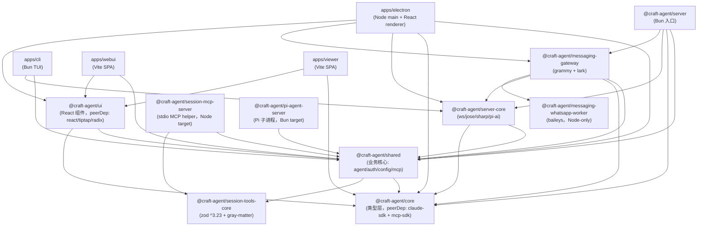

# 依赖与技术栈选型

> Craft Agents OSS `v0.10.4` 的依赖图、运行时分裂、构建脚本与选型取舍的代码级研究。
> 与 `docs/code-research/01_architecture.md` 第 4 节互补：本文聚焦「依赖」视角（什么依赖、为何引入、为何 trusted / optional、Bun 与 Node 的分裂矩阵），架构文档则聚焦「模块/进程」视角。

## 1. 总览：分层与运行时分裂

Craft Agents 是一个由 Bun 主导的 monorepo，但在三个边界上**强制回落到 Node**：

1. Electron 主进程（Chromium 嵌入，必须 Node 主循环）。
2. WhatsApp Worker（Baileys 的 `@whiskeysockets/baileys` 依赖 Node Crypto / AsyncHooks，Bun 跑不起来，见 `scripts/build-wa-worker.ts:13-16`）。
3. Vite/renderer 打包（Vite 的 bin shebang 走 Node，且 `>5k modules` 会撞 V8 默认 2GB 堆上限，见 `Dockerfile.server:88-92`）。

Bun 则覆盖：`packages/server`（headless RPC server）、`apps/cli`、`packages/pi-agent-server`（Pi 子进程，跑 `--preload` 网络拦截器）、所有 dev/test 脚本、构建脚本自身。

`bunfig.toml` 的两项设置塑造了整个 monorepo 的运行时模型：

```toml
preload = ["./packages/shared/src/unified-network-interceptor.ts"]   # 仅对 Bun 生效（Pi 子进程）
[install]
linker = "hoisted"   # Vite/esbuild 需要 top-level node_modules
```

`linker = "hoisted"` 是关键：Bun 默认的 isolated linker会让 renderer 找不到 `i18next / @tiptap/* / pdfjs-dist` 等 transitive 依赖（`bunfig.toml:3-8`）。

## 2. 核心依赖分类（What + Why + 代码证据）

### 2.1 内核 / Agent SDK

| 依赖 | 版本 | What | Why（在本项目的职责） |
|---|---|---|---|
| `@anthropic-ai/claude-agent-sdk` | **`0.3.170`**（精确锁定，根 + `peerDependencies`） | Anthropic 官方 Claude Code TypeScript SDK | 主 Agent 后端之一。`query()` 入口见 `packages/shared/src/agent/claude-agent.ts:1`；`tool()` / `createSdkMcpServer()` 见 `packages/shared/src/agent/session-scoped-tools.ts:18`；`SDKMessage` 类型见 `packages/shared/src/agent/claude-llm-query.ts:8`。 |
| `@earendil-works/pi-ai` / `pi-coding-agent` / `pi-agent-core` | **`0.79.9`**（patch 锁定） | 第三方「Pi」Agent SDK（兼容 OpenAI、DeepSeek、GitHub Copilot 等多 provider） | 第二个 Agent 后端。`packages/shared/src/agent/pi-agent.ts:7` 注释明确写道「subprocess 运行 Pi SDK in-process」。`refreshGitHubCopilotToken` 来自 `@earendil-works/pi-ai/oauth`（`packages/shared/src/agent/backend/internal/drivers/pi.ts:46`）。`pi-coding-agent` 与 `pi-agent-core` 仅由 `packages/pi-agent-server` 与 `packages/shared` 引入。 |
| `@modelcontextprotocol/sdk` | `^1.29.0` | MCP 官方 TS SDK | 同时使用两条传输线：`StreamableHTTPClientTransport`（远程 HTTP MCP server）与 `StdioClientTransport`（本地子进程 MCP server），见 `packages/shared/src/mcp/client.ts:7-8,93,100`。 |
| `@anthropic-ai/sdk` | `^0.100.0` | Anthropic 原始 Messages SDK | 用于 `queryLlm` 直连（绕开 agent loop 的纯补全调用，如标题生成、`llm-validation`）。 |
| `@github/copilot-sdk` | `^0.1.23` | GitHub Copilot token/补全桥 | Pi 路径下走 Copilot 时使用。 |
| `openai` | `^6.18.0`（devDep） | OpenAI 官方 SDK | 仅作为 dev/test 工具；运行时由 Pi SDK 内部承载 OpenAI 调用。 |

**关键技术债**：自 `claude-agent-sdk@0.2.113` 起，SDK 不再是纯 JS，而是 `spawn` 一个原生 `claude` 二进制（per-platform optional dependency，包名形如 `claude-agent-sdk-darwin-arm64`）。这意味着：

- `--preload` 网络拦截器机制**对 Claude 子进程失效**（`packages/shared/src/agent/backend/internal/runtime-resolver.ts:16,242-244`）。
- 拦截器目前**仅 Pi 子进程可用**（`packages/shared/CLAUDE.md` 明确指出）。
- 项目通过 build 脚本注入稳定 alias `@anthropic-ai/claude-agent-sdk-binary/claude`（`runtime-resolver.ts:107-121`），并降级 ripgrep 来源到独立的 `@vscode/ripgrep`（详见 `apps/electron/resources/release-notes/0.9.0.md:5`）。

### 2.2 UI 层（React + TipTap v3 + Radix + Tailwind v4）

| 依赖 | Why |
|---|---|
| `react` / `react-dom` `^18.3.1` | renderer 与 webui 共享。**注意未升 React 19**——`@types/react` 仍是 `^18.3.0`，与 TipTap v3 / Radix 的稳定矩阵绑定。 |
| `@tiptap/react` `^3.20.0` + 9 个扩展（`starter-kit / markdown / image / mathematics / task-list / file-handler / bubble-menu / placeholder / suggestion`） | 富文本编辑器。`packages/ui/package.json` 通过 `peerDependencies` 声明，实际版本由根 `dependencies` 锁定，避免下游版本漂移。 |
| `@radix-ui/react-*`（`dialog / dropdown-menu / select / tabs / tooltip / scroll-area / separator / slot / avatar / collapsible`） | shadcn/ui new-york 风格的 primitives。Electron 端额外引入 `context-menu / popover / switch / label`。 |
| `tailwindcss` `^4.1.18` + `@tailwindcss/vite` + `@tailwindcss/typography` | Tailwind v4 的 Vite 插件模式（不再需要 `tailwind.config.js`，CSS-first 配置）。 |
| `shiki` `^3.19.0` + `tiptap-extension-code-block-shiki` + `prosemirror-highlight` | 代码块语法高亮，markdown 渲染侧统一由 `shiki` 承担。 |
| `motion` `^12.23.26`（即 Framer Motion 12） | 动画库。viewer 端独立锁 `^12.0.0`。 |
| `jotai` `^2.16.0` + `jotai-family` | 原子化状态管理（替代 Redux/Zustand）。 |
| `react-markdown` `^10.1.0` + `remark-gfm` + `remark-math` + `rehype-katex` + `rehype-raw` + `katex` | Markdown + GFM + 数学公式渲染管线。 |
| `react-pdf` `^10.3.0` + `pdfjs-dist` `^5.4.0` | PDF 预览（renderer 端 PDF.js）。 |
| `cmdk` / `sonner` / `vaul` / `lucide-react` / `@dnd-kit/*` | 命令面板、toast、drawer、图标、拖拽。 |
| `@pierre/diffs` / `@paper-design/shaders-react` | diff 视图与 shader 背景（小众但承担核心视觉）。 |

### 2.3 传输层（自实现 ws RPC）

| 依赖 | Why |
|---|---|
| `ws` `^8.19.0`（server） / `^8.16.0`（devDep，server） | **唯一的传输原语**。项目**没有用 socket.io**，而是手写了 `WsRpcServer` / `WsRpcClient`（`packages/server-core/src/transport/server.ts:122`、`packages/server-core/src/transport/client.ts:109`），承载所有 RPC channel + WebUI 静态资源 handler。`apps/electron/package.json` 也直接引 `ws` 用于 IPC 之外的 socket 通信。 |
| `jose` `^6.0.0` | WebUI auth 的 JWT 签发/校验（`packages/server-core/src/webui/auth.ts:10`）。**注意**：argon2id 走 Bun 内建（`Bun.password.hash(plaintext, { algorithm: 'argon2id' })`，`auth.ts:92-102`），因此**没有独立的 argon2 npm 依赖**——只在 Bun 运行时下成立。 |

### 2.4 存储与配置

| 依赖 | Why |
|---|---|
| `electron-store` | （Electron 端持久化偏好，由 `apps/electron` 间接使用，本仓库源码 grep 命中较少，可能内嵌在 dist 产物。） |
| `gray-matter` `^4.0.3` | frontmatter 解析（session/skill 文件头）。 |
| `js-yaml` / `bash-parser` / `shell-quote` / `incr-regex-package` / `glob` / `@isaacs/ttlcache` / `@leeoniya/ufuzzy` | 配置/正则/模糊搜索工具集，全部在 `packages/shared`。 |
| `croner` `^10.0.1` | 自动化调度（automations 的 cron 触发）。 |
| `filtrex` `^3.1.0` | automations 的表达式匹配（`matcherMatches*` 底层）。 |

### 2.5 桥接（消息网关）

| 依赖 | Why |
|---|---|
| `grammy` `^1.35.0` | Telegram bot 框架。**未用 telegraf**（见第 7 节对比）。 |
| `@whiskeysockets/baileys` `^6.7.0` | 非官方 WhatsApp Web 协议反向库。**必须 Node 运行时**（见第 4 节）。隔离在独立的 `@craft-agent/messaging-whatsapp-worker` 包中，构建时由 esbuild `--platform=node --target=node20 --format=cjs` 打成单文件 `dist/worker.cjs`（`scripts/build-wa-worker.ts:86-88`），Baileys 本体**被内联进 bundle**，避免运行时依赖。 |
| `@larksuiteoapi/node-sdk` `^1.62.1` | 飞书官方 SDK。 |

### 2.6 原生模块 / 可观测 / 工具

| 依赖 | Why | 是否 trusted |
|---|---|---|
| `sharp` `0.34.5` | headless server 端的图像处理（缩略图、resize）。**Electron 端用 `nativeImage`，server 端用 sharp**——双轨。证据：`packages/server-core/src/runtime/platform-headless.ts:56-62`（sharp 动态 import）与 `apps/electron/src/main/platform.ts:36-44`（nativeImage）。 | ✅ trusted（postinstall 下载/编译 libvips） |
| `@vscode/ripgrep` `^1.17.1` | Agent 的 `grep` 工具底层。SDK 0.2.113 起从 SDK 自带降级到独立 dep（`runtime-resolver.ts:185`）。 | ✅ trusted（postinstall 下载 rg 二进制） |
| `@sentry/cli`（trusted 列表） | sourcemap 上传（CI 端）。 | ✅ trusted（下载平台二进制） |
| `@sentry/electron` `^7.7.0` / `@sentry/react` `^10.36.0` / `@sentry/vite-plugin` | 客户端 + Vite 构建期错误监控。 | — |
| `koffi`（trusted 列表） | FFI 桥接（Pi 子进程 `--external koffi`，`packages/pi-agent-server/package.json:12`）。Windows 构建特别处理（`apps/electron/resources/release-notes/0.5.0.md:26`）。 | ✅ trusted（编译原生 FFI） |
| `protobufjs`（trusted 列表） | Protocol Buffers 运行时（推测用于某些二进制协议；源码命中较少，可能由 Baileys transitive 引入）。 | ✅ trusted（postinstall 生成 parser） |
| `electron` `^39.2.7` / `electron-builder` `^26.0.12` / `electron-winstaller` / `@electron/packager` | 桌面打包链。 | ✅ trusted（electron 会下载 Chromium + Node 二进制） |
| `esbuild` `^0.25.0` | main/preload/interceptor/worker bundler。 | ✅ trusted（下载平台二进制） |

### 2.7 构建 / dev

| 依赖 | Why |
|---|---|
| `vite` `^6.2.4` + `@vitejs/plugin-react` + `@tailwindcss/vite` | 所有 renderer（electron/viewer/webui/marketing）的 dev/build。Vite bin 走 Node shebang，故打包阶段必须 Node（`Dockerfile.server:88-92`）。 |
| `bun`（runtime 自身） | 所有 `scripts/*.ts`、`bun build`、`bun test`、`bun run`、`packages/server/src/index.ts` 入口。 |
| `typescript` `^5.0.0` | 严格模式 typecheck（`bun run typecheck:all` 串行检查 9 个包）。 |
| `husky` `^9.1.7` + `eslint` `^9.39.2` + `@typescript-eslint/*` | pre-commit hooks + lint。 |
| `tar` `^7.5.2` / `@aws-sdk/client-s3` | server tar 压缩 + 远程产物上传（构建脚本用）。 |

## 3. 内部 monorepo 依赖图

`@craft-agent/*` workspace 之间的依赖关系（剔除外部依赖，仅展示 workspace 边）：



观察要点：

- `@craft-agent/core` 是**纯类型层**（`packages/core/CLAUDE.md` 明确要求「保持依赖极轻」），通过 `peerDependencies` 把 `claude-agent-sdk` / `mcp-sdk` 暴露给上游，避免版本重复。
- `@craft-agent/ui` 大量使用 `peerDependencies`（含 `optional` 标记），让 electron / viewer / webui 三个消费者各自决定要装哪些 Radix / motion。
- `messaging-whatsapp-worker` 是**叶子节点**且无 workspace 入边——它只被 `messaging-gateway` 通过 spawn 子进程方式消费，不参与 import 图。

## 4. trustedDependencies（根 `package.json:8-17`）

```json
"trustedDependencies": [
  "@sentry/cli", "@vscode/ripgrep", "electron", "electron-winstaller",
  "esbuild", "koffi", "protobufjs", "sharp"
]
```

Bun 默认**拦截**所有依赖的 `postinstall` 脚本（安全特性），必须在 `trustedDependencies` 显式放行。每个的原因：

| 依赖 | postinstall 行为 | Why trusted |
|---|---|---|
| `sharp` | 下载/编译本地 `libvips` + 原生 `.node` | 没放行 → sharp 的 `import('sharp')` 直接失败，server 缩略图功能不可用 |
| `@vscode/ripgrep` | 下载 `rg` 二进制（macOS/Linux/Windows） | 0.9.0 起从 SDK 自带改为独立 dep，构建脚本显式校验 `bin/rg` 存在（`apps/electron/scripts/build-dmg.sh:185`） |
| `@sentry/cli` | 下载平台 sentry-cli 二进制 | 用于 sourcemap 上传 |
| `electron` | 下载 Electron + Chromium + Node | 桌面运行时本体 |
| `electron-winstaller` | Windows 安装器原生工具 | Win x64/arm64 打包 |
| `esbuild` | 下载平台二进制 | 不放行则所有 `scripts/electron-build-*.ts` 失败 |
| `koffi` | 编译原生 FFI 模块 | Pi 子进程 `--external koffi`，运行时动态加载 |
| `protobufjs` | 生成 parser | Baileys 的 transitive dep，需要 postinstall 生成动态解码器 |

## 5. Bun vs Node 运行时分裂矩阵

| 场景 | 运行时 | 入口/证据 | Why |
|---|---|---|---|
| Headless server | **Bun** | `packages/server/src/index.ts`（`Dockerfile.server:119` `ENTRYPOINT ["bun", ...]`） | `package.json:engines.bun >= 1.0.0`；`Bun.password.hash` 内建 argon2id；`Bun.spawn` 简洁 |
| CLI（apps/cli） | **Bun** | `apps/cli/src/index.ts` | 顶层脚本是 `bun run`，复用 `@craft-agent/server-core` |
| Pi agent server | **Bun** | `packages/pi-agent-server/package.json:12` `--target=bun --format=esm` | **唯一可以 `--preload` 网络拦截器的子进程**（`bunfig.toml:1`） |
| dev 脚本 / 测试 / 构建 | **Bun** | 所有 `scripts/*.ts` | 原生 TS 执行、快启动 |
| Electron main | **Node**（Electron 内嵌） | `apps/electron/dist/main.cjs`（`apps/electron/package.json:18` `--platform=node --format=cjs`） | Chromium + Node GUI 主循环，必须 Electron |
| session-mcp-server | **Node** | `packages/session-mcp-server/package.json:13` `--target=node --format=cjs` | 由 Claude SDK 原生二进制 spawn，需 stdio + Node 兼容 |
| WhatsApp worker | **Node** | `scripts/build-wa-worker.ts:86-88` `--platform=node --target=node20 --format=cjs` | **Baileys 依赖 Node Crypto / `crypto` 模块、`AsyncHooks`**，Bun 跑不起来（`build-wa-worker.ts:13-16`） |
| Vite build | **Node** | `Dockerfile.server:92` `NODE_OPTIONS="--max-old-space-size=4096" bunx vite build` | Vite bin shebang 是 Node；>5k modules 撞 V8 默认 2GB 堆 |
| Claude SDK 子进程 | **原生二进制**（非 Bun/Node） | `runtime-resolver.ts:16` 「SDK 0.2.113 起 spawn native binary」 | 不再可 `--preload`，拦截器机制对 Claude 失效（`packages/shared/CLAUDE.md`） |

**Baileys 必须用 Node 的根因**：Baileys 内部使用 `node:crypto` 的 `createCipheriv` / `scryptSync`、`AsyncLocalStorage` 等仅 Node 实现完整的 API。Bun 对这些有部分 polyfill 但覆盖率不足以驱动 WhatsApp 的多设备加密协议。Docker 镜像因此**额外安装 Node 20**（`Dockerfile.server:33-40`），并通过 `CRAFT_MESSAGING_NODE_BIN=node`（`Dockerfile.server:115`）告诉 adapter 用系统 `node` 跑 worker。

## 6. optionalDependencies

根 `package.json:203-212`：

```json
"optionalDependencies": {
  "@img/sharp-darwin-arm64": "0.34.5",
  "@img/sharp-darwin-x64": "0.34.5",
  "@img/sharp-linux-arm64": "0.34.5",
  "@img/sharp-linux-x64": "0.34.5",
  "@img/sharp-libvips-darwin-arm64": "1.2.4",
  "@img/sharp-libvips-darwin-x64": "1.2.4",
  "@img/sharp-libvips-linux-arm64": "1.2.4",
  "@img/sharp-libvips-linux-x64": "1.2.4"
}
```

**Why optional**：每个包都是平台特定的原生 libvips + sharp 二进制。npm/bun 会根据宿主平台自动选择**一个**安装，其他静默跳过。这是 sharp 0.34+ 的新打包模型（取代旧的 `prebuild-install`）。

devDependencies 里还有一个 `@rollup/rollup-win32-arm64-msvc ^4.55.1`——这是显式锁定的 Win arm64 rollup 原生包（因为项目需要在 macOS/Linux 上 cross-build Windows arm64 镜像）。

## 7. overrides / resolutions

根 `package.json` **没有** `"overrides"`（npm）或 `"resolutions"`（yarn）字段，Bun 也没有 `"overrides"`。版本对齐通过两个机制：

1. **`peerDependencies` 精确锁定**：`@craft-agent/core` 与 `@craft-agent/shared` 都声明 `"@anthropic-ai/claude-agent-sdk": "0.3.170"` 与 `"@modelcontextprotocol/sdk": ">=1.29.0"`，确保 SDK 版本在所有 workspace 严格一致。
2. **根 `dependencies` 集中声明**：react、tiptap、radix、tailwind 等都集中在根，下游包只通过 `peerDependencies` 声明范围，避免 `bun install` 解析出多版本。

## 8. 技术选型对比（关键 5 处）

### 8.1 自实现 WsRpc vs socket.io

| 维度 | 自实现 ws（选用） | socket.io |
|---|---|---|
| 协议 | 裸 WebSocket + JSON-RPC 风格 | 自研 Engine.IO 协议 |
| 兼容性 | 浏览器原生 WebSocket，无 fallback | HTTP long-polling fallback |
| 体积 | 0 额外 JS（`ws` 服务端 + 浏览器 WebSocket 客户端） | ~50KB client |
| channel/timeout | 内建 `WsRpcServer.HANDLER_TIMEOUT_MS`（`server.ts:666`） | 需自行实现 |
| 选型理由 | WebUI 已是 SPA，不需要 polling fallback；server 同时承担静态资源 handler；JWT/TLS 在 ws 层即可 | — |

### 8.2 grammy vs telegraf（Telegram）

| 维度 | grammy（选用） | telegraf |
|---|---|---|
| API 风格 | middleware/Composer，TS-first | middleware，JS-first |
| 类型完整度 | 一等公民（包内带完整 OpenAPI 类型） | 社区 `@types/telegraf` |
| 长轮询/webhook | 内建抽象 | 内建抽象 |
| 选型理由 | 项目重度 TS，grammy 类型链最短，且 v1.35 已支持 forum topic 路由（automations `telegramTopic` 用到） | — |

### 8.3 Baileys vs WhatsApp Cloud API

| 维度 | Baileys（选用） | 官方 Cloud API |
|---|---|---|
| 协议 | WhatsApp Web 反向 | 官方 Graph API |
| 多账号 | 一个 Baileys session = 一个真实号 | 需 Meta Business 验证 |
| 消息类型 | 全量（含 status、forum） | 受限子集 |
| 风险 | 违反 WhatsApp ToS，可能封号；依赖 Node crypto | 官方支持，无封号风险 |
| 选型理由 | 项目目标是「让 LLM 接管用户自己的 WhatsApp 账号」——官方 API 无法实现「以本人身份收发消息」 | — |

### 8.4 TipTap v3 vs Lexical（Meta）

| 维度 | TipTap v3（选用） | Lexical |
|---|---|---|
| 架构 | ProseMirror wrapper | 全新 React-first |
| 生态 | 9 个扩展直接可用（image/math/task-list/file-handler） | 需自行组装 |
| Markdown 双向 | `@tiptap/markdown` + `tiptap-markdown` 双管 | 需自写 converter |
| 选型理由 | session viewer 既要渲染 markdown 又要可编辑，TipTap 的扩展矩阵最直接；Lexical 在 markdown round-trip 上投入更大 | — |

### 8.5 React 18 vs Solid / React 19

| 维度 | React 18.3（选用） | SolidJS / React 19 |
|---|---|---|
| shadcn/ui 兼容 | 官方支持 | shadcn 仍以 React 18/19 为准；Solid 需 `solid-ui` |
| TipTap v3 React 适配 | 官方 `@tiptap/react` | Lexical/Solid 适配不完整 |
| 选型理由 | 整个 UI 层（shadcn new-york + Radix + TipTap + react-pdf）都依赖 React，迁移 Solid 等于重写 | — |

## 9. 已知技术债与版本偏移

1. **zod 版本分裂**：根 `dependencies.zod = ^4.0.0`，但 `packages/session-tools-core/package.json:17` 仍锁 `zod: ^3.23.0` + `zod-to-json-schema: ^3.25.0`。这是因为 session-tools-core 同时被 Claude（zod 4）和 Codex（`session-mcp-server` 用 zod 4）共享，但内部实现依赖 zod 3 的旧 API。zod 4 是 2025 年的破坏性升级（schema 默认 strict、`z.input`/`z.output` 行为变化），尚未在 session-tools-core 完成 migration。
2. **Pi SDK 固定到 0.79.9 patch**：`@earendil-works/pi-*` 三个包全部精确锁 `0.79.9`（无 `^`）。Pi SDK 是 ESM-only（`packages/pi-agent-server/package.json:12` `--format=esm`），且与 `unified-network-interceptor.ts` 强耦合——任何 minor 升级都可能破坏 SSE 工具调用合并（`packages/shared/CLAUDE.md` #862、DeepSeek 并行工具 bug 修复依赖此版本）。
3. **Claude SDK 0.3.170 的原生二进制分裂**：自 0.2.113 起 SDK 不再是纯 JS。`runtime-resolver.ts:107-121` 通过 build 脚本注入的 alias `@anthropic-ai/claude-agent-sdk-binary/claude` 是项目自定义的稳定层；dev 模式下回落到 per-arch optional dep 包名（`claude-agent-sdk-darwin-arm64`）。`--preload` 拦截器机制对 Claude 失效，所有 Phase-2 功能（rich tool intent、fast-mode override、MalformedBodyError）必须迁移到 SDK hooks 或本地 proxy。
4. **WS 版本双声明**：`packages/server/package.json:36` `ws ^8.16.0`（devDep），`packages/server-core/package.json:30` `ws ^8.19.0`（dep）。Bun hoisted linker 会取最高版本，但版本号不一致是债务。
5. **`@types/node` 多版本**：根 `^25.0.8`，下游包 `^22.0.0`。Node 25 类型与 Node 20 运行时不一致，typecheck 通过 ≠ runtime 行为一致。

## 10. 未解决疑问

1. **`electron-store` 是否真的被使用？** 根 `package.json` 与 `apps/electron/package.json` 都没有声明 `electron-store`，但研究要点提到它。grep 命中极少，可能在 dist 产物或外部资源里——需用 `bun pm ls electron-store` 验证是否是 transitive 依赖或已被替换为 `~/.craft-agent/preferences.json`（手工 JSON 文件，见 `packages/shared/src/config/preferences.ts`）。
2. **`protobufjs` 的实际消费方是谁？** trustedDependencies 列表包含它，但源码 grep 命中极少。推测是 Baileys 的 transitive dep（Baileys 内部用 protobuf 编解码 WhatsApp 的 `Noise` 协议握手），需要 `bun pm why protobufjs` 确认是否仅由 `@whiskeysockets/baileys` 引入。
3. **`@aws-sdk/client-s3` 的实际用途？** 仅在根 devDependencies 出现，源码无 import。推测由 `scripts/build-server.ts` 或 CI/CD 的 release 脚本（`scripts/release.ts`、`scripts/oss-sync.ts`）使用——需要进一步追踪构建脚本是否上传产物到 S3。
