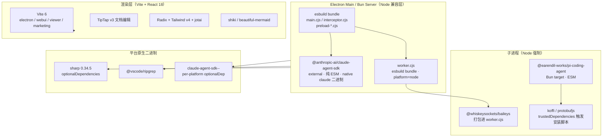
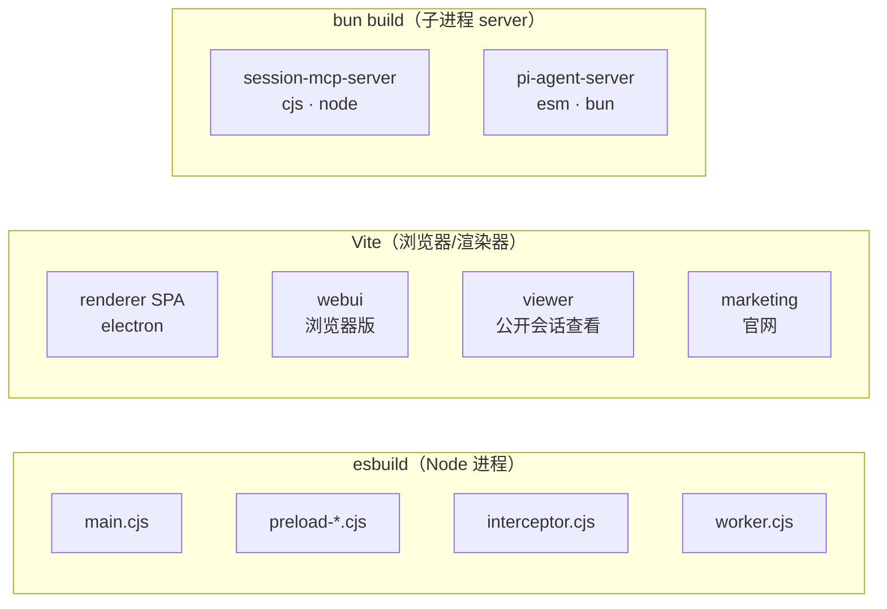
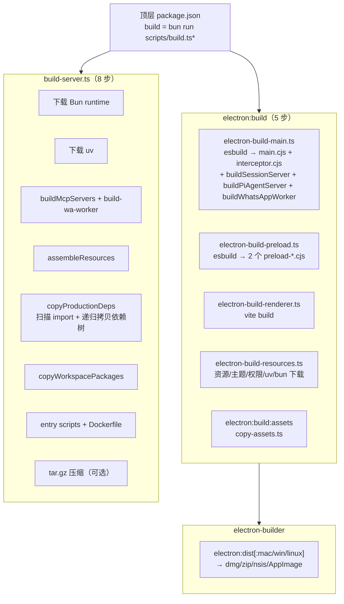

# 依赖与技术栈选型

> 研究对象：Craft Agents（`craft-agent` v0.10.4，craft.do 开源 Agent 工作站，Bun monorepo）。
> 证据来源：顶层 `package.json`、各 `packages/*/package.json` 与 `apps/*/package.json`、`scripts/*.ts`、`apps/electron/electron-builder.yml`、源码注释与实际 import。
> 全部版本号、字段名、脚本名均来自上述文件，臆测归入文末「待解决疑问」。

---

## 0. 全局分层视图

Craft Agents 是一个「多 runtime + 多 backend + 多构建目标」的 Electron + Bun 混合工作站。依赖按运行位置可分为四层：



核心张力在于：**主 runtime 是 Bun，但 Baileys（WhatsApp）与 Claude SDK 的某些路径被强制走 Node**；**双 Agent SDK 并存**（Anthropic 自家 vs Pi 聚合层）；**esbuild 与 Vite 各管一摊**（进程内 bundle vs 渲染器 SPA）。

---

## 1. 核心依赖（dependencies）

### 1.1 双 Agent SDK：`@anthropic-ai/claude-agent-sdk` 0.3.170 + `@earendil-works/pi-*` 0.79.9

**What**

| 包 | 版本 | 角色 |
|---|---|---|
| `@anthropic-ai/claude-agent-sdk` | `0.3.170`（顶层硬锁）| 主线 Agent backend。提供 `query`、`createSdkMcpServer`、`tool`、`AbortError` 等，驱动 Claude 原生会话。 |
| `@earendil-works/pi-ai` | `0.79.9` | LLM provider 聚合层（20+ 厂商），并承担 GitHub Copilot token 刷新（`/oauth` 子路径）。 |
| `@earendil-works/pi-coding-agent` | `0.79.9` | 第二个 Agent backend（`PiAgent`），以子进程形式运行。 |
| `@earendil-works/pi-agent-core` | `0.79.9` | Pi agent 的核心类型（如 `ThinkingLevel`），被 event-adapter 引用。 |

**Why 双 SDK 并存**：源码注释（`packages/shared/src/agent/backend/factory.ts`、`backend/types.ts`）明确分工——`ClaudeAgent` 用 Anthropic 自家 SDK，`PiAgent` 用 Pi SDK，二者通过统一的 `AgentBackend` 抽象（`queryLlm`、事件适配器）并列。Pi 的独特价值是**一个 SDK 接入 20+ provider**（OpenRouter、z.ai、Copilot…），而 Claude SDK 只服务 Anthropic 模型；`config/models-pi.ts` 注释甚至把 `pi-ai` 单独拆分文件，因为它「transitively pulls in `@aws-sdk`」，不能污染 renderer。

**双 SDK 的代价（源码可证）**：
- 两个独立的事件适配器：`backend/claude/event-adapter.ts` vs `backend/pi/event-adapter.ts`，分别映射各自的 `AssistantMessageEvent`。
- 上下文缓存策略被迫分叉：`packages/shared/CLAUDE.md` 记载，Claude 把所有上下文块挂在 user-message 尾部（system prompt 保持可缓存），Pi 则把 stable 块折进 system prefix、volatile 块进 user tail，否则「per-minute re-stamp 会令 pi-ai 缓存的 system prefix 失效」。
- 中流行为（mid-stream）也按 backend 分默认值：anthropic→`queue`，pi→`steer`。
- `pi-agent-server` 必须用 `--target=bun --format=esm` 构建（`pi-coding-agent` 是 ESM-only），而 `session-mcp-server` 用 `--target=node --format=cjs`（Codex 通过 stdio 调用）。同一个 monorepo 里 CJS 与 ESM 子进程并存。

**scope 迁移痕迹**：`apps/electron/resources/release-notes/0.10.4.md` 是铁证——「Pi SDK uplifted to 0.79.9 (scope migration to `@earendil-works`)」，三个 Pi 包从已冻结的 `@mariozechner/*`（0.73.1）整体迁到 `@earendil-works/*`（0.79.9）。早期 release-notes（0.8.12、0.9.1）仍写 `@mariozechner/pi-*`。

**替代方案**：理论上可只保留一个 SDK。但 Claude SDK 无法替代 Pi 的多 provider 聚合，而 Pi 又无法直接驱动 Anthropic 原生会话流（OAuth 身份、thinking 模型适配等），故双 SDK 是「最大化模型覆盖」与「维护成本」之间的权衡。

---

### 1.2 `@anthropic-ai/sdk` ^0.100.0（与 Agent SDK 区分）

**What**：Anthropic 的**底层 Messages API SDK**，区别于上面的 Agent SDK。
**Why**：用于不走 agent 循环的轻量调用（如 `runMiniCompletion` 用 Haiku 跑标题生成）。Agent SDK 适合多轮工具循环，而单次补全用底层 SDK 更省事。两者并存是「按场景分层」而非冗余。

---

### 1.3 `@modelcontextprotocol/sdk` ^1.29.0

**What**：MCP（Model Context Protocol）官方 TS SDK。
**Why**：MCP 是 Craft 的「Source」体系核心——`mcp/client.ts`、`mcp/mcp-pool.ts`、`mcp/validation.ts`、`mcp/pool-server.ts` 全部依赖它。`session-mcp-server` 还作为 stdio MCP server 暴露 `SubmitPlan`、`config_validate` 等会话级工具给 Codex。
**项目角色**：作为 `peerDependencies`（`packages/shared`、`packages/core` 都声明 `>=1.29.0`），保证版本与各子包兼容。

---

### 1.4 TipTap v3 全家桶（`@tiptap/* ^3.20.0`）

**What**：基于 ProseMirror 的富文本编辑框架。项目引入：`react`、`starter-kit`、`markdown`、`extension-{bubble-menu,file-handler,image,mathematics,placeholder,task-item,task-list}`、`suggestion`，外加 `tiptap-extension-code-block-shiki` 与 `tiptap-markdown`。

**Why 选 TipTap v3 而非替代品**：
- 对比 **CodeMirror/Lexical**：TipTap 直接产出 ProseMirror 文档树，可双向转 Markdown（`@tiptap/markdown` + `tiptap-markdown`），契合 Craft「编辑 Craft 文档」的定位。
- 对比 **TipTap v2**：v3 改进了扩展机制与 React 集成，且 `mathematics` 扩展配合 `katex` 可原生渲染数学。
- 项目自定义了 `extensions/MermaidBlock.tsx`、`LatexBlock.tsx`、`TiptapImageBlock.tsx`、`AnimatedTaskItem`、`TiptapCodeBlockView`（`packages/ui/src/components/markdown/`），把 Mermaid（`beautiful-mermaid`）与代码高亮（`shiki` + `prosemirror-highlight`）嵌入编辑器。

**Why**：Craft 的核心场景是「Agent 与用户共同编辑文档」，TipTap 的块级结构与可编程扩展让 Mermaid/LaTeX/图片以自定义 Node 形式存在，而非裸 Markdown 字符串。

---

### 1.5 Radix UI + Tailwind v4 + shadcn 模式

**What**：无样式可访问组件库（`react-avatar/collapsible/dropdown-menu/scroll-area/select/separator/slot/tabs/tooltip` 等）+ Tailwind v4（`tailwindcss ^4.1.18`、`@tailwindcss/vite`、`@tailwindcss/typography`）+ `class-variance-authority` + `clsx` + `tailwind-merge` + `lucide-react`。

**Why**：典型 shadcn/ui 模式——Radix 提供行为与 a11y，Tailwind 提供样式，CVA 做变体。`apps/electron/package.json` 还额外引入 `@radix-ui/react-context-menu/dialog/popover/label/switch` 与 `cmdk`、`vaul`、`sonner`、`motion`。
**为什么是 Tailwind v4 而非 v3**：v4 用 `@tailwindcss/vite` 原生 Vite 插件（无需 PostCSS 配置），构建更快；三个 `vite.config.ts` 都直接 `tailwindcss()`。

---

### 1.6 `jotai` ^2.16.0（状态管理）

**What**：原子化 React 状态库。
**Why 而非 Redux/Zustand**：Craft 的状态高度细粒度（会话流、工具结果、UI 面板），`jotai` 的 atom 组合更自然。`apps/electron/src/renderer` 有 **38 处** `from 'jotai'` import，并配 `jotai-family`。
**特殊集成**：两个 `vite.config.ts`（electron、webui）都注入了 `jotai/babel/plugin-debug-label` 与 `jotai/babel/plugin-react-refresh`（`customAtomNames: ['atomFamily']`），注释解释这是为了「HMR 时缓存 atom 实例，避免重建空 atom 孤立数据」。

---

### 1.7 Markdown / 代码高亮双栈

**What**：
- **渲染**：`react-markdown ^10` + `remark-gfm` + `remark-math` + `rehype-katex` + `rehype-raw` + `marked ^17`。
- **代码高亮**：`shiki ^3.19`（`@shikijs/cli`）+ `prosemirror-highlight`。
- **Mermaid**：`beautiful-mermaid ^1.1.3`（`packages/ui`、`session-tools-core`、`shared` 均用）。

**Why `marked` 与 `react-markdown` 并存**：`react-markdown` 用于 React 组件树渲染（带 KaTeX、GFM），`marked` 用于纯字符串场景（如 system prompt 预处理、快速转 HTML）。`prosemirror-highlight` 把 Shiki 语法高亮接入 ProseMirror/TipTap 的代码块。

---

### 1.8 `@sentry/electron` ^7.7.0 + `@sentry/react` ^10.36.0（+ devDep `@sentry/vite-plugin`、`@sentry/cli`）

**What**：错误监控。`@sentry/cli` 列在 `trustedDependencies`（原生二进制）。
**Why 双 Sentry**：main 进程（Node）用 `@sentry/electron`，renderer 用 `@sentry/react`。`webui/vite.config.ts` 把 `@sentry/electron` 别名到空 shim（浏览器环境不需要）。注释多处标注「source map upload 当前禁用」。

---

### 1.9 `beautiful-mermaid` ^1.1.3

**What**：Mermaid 渲染/校验库。`session-tools-core/src/handlers/mermaid-validate.ts`、`packages/ui/src/components/markdown/MarkdownMermaidBlock.tsx`、`CodeBlock.tsx`、`TiptapCodeBlockView.tsx` 均引用。
**Why**：TipTap 与 react-markdown 两套渲染路径都需要 Mermaid，统一用它避免重复实现。

---

### 1.10 `react-resizable-panels` ^3.0.6 + `@dnd-kit/*`

**What**：可拖拽面板布局（`apps/electron/src/renderer/components/ui/resizable.tsx`）+ 拖拽排序（`@dnd-kit/dom`、`@dnd-kit/helpers`；electron app 额外有 `core/sortable/utilities`）。
**Why**：Agent 工作站需要可调节的多窗格（会话列表 / 编辑器 / 输出），`react-resizable-panels` 是 React 生态最成熟的可调面板方案。

---

## 2. devDependencies（构建链）

### 2.1 Bun（runtime + test + 脚本）

**What**：顶层所有脚本都以 `bun run` / `bun test` / 直接 `bun run packages/.../index.ts` 运行。`@types/bun: latest`、`packages/server` 声明 `"engines": { "bun": ">=1.0.0" }`。
**Why Bun 而非 Node/tsx**：
- **原生 TypeScript**：`server:start` 直接 `bun run packages/server/src/index.ts`，无需 `tsc` 或 `tsx` 中间层。
- **内置打包**：`session-mcp-server`、`pi-agent-server` 都用 `bun build`（见 `electron-build-main.ts:buildSessionServer/buildPiAgentServer`）。
- **内置测试**：`bun test`（顶层 `test` 脚本，含 `.isolated.ts` 串行隔离测试）。
- **内置 fetch / shell**：构建脚本里大量用 `Bun.sleep`、`spawn from "bun"`、`$ from "bun"`。

**为什么不全用 Bun**：Baileys 与 Claude SDK 的 native 路径要求 Node（见第 4 节），这是 runtime 分裂的根因。

---

### 2.2 esbuild ^0.25.0（进程内 bundle）

**What**：esbuild 负责把 TS 源码 bundle 成单一 CJS 文件。
**项目角色**（`scripts/electron-build-*.ts`）：
- `electron-build-main.ts` → `apps/electron/dist/main.cjs`（+ 副产物 `interceptor.cjs`）。
- `electron-build-preload.ts` → `bootstrap-preload.cjs` + `browser-toolbar-preload.cjs`。
- `build-wa-worker.ts` → `packages/messaging-whatsapp-worker/dist/worker.cjs`。

**Why esbuild 而非 bun build / Vite 给进程**：
- **CJS + Node target 精确控制**：`--platform=node --format=cjs --target=node20`，输出给 Electron 内嵌 Node 与系统 `node` 执行。
- **alias 兜底**：main 构建用 `--alias:node-fetch=.../shims/node-fetch.cjs` 与 `--alias:abort-controller=...`，注释解释这是为了「替换 grammY 内置的 polyfill（node-fetch@2 + abort-controller@3），否则 esbuild 会把 polyfill 的 `AbortSignal` 重命名为 `_AbortSignal`，破坏 node-fetch 的 `constructor.name` 检查」。
- **`--external` 精细控制**：`--external:electron`（运行时由 Electron 提供）、`--external:@anthropic-ai/claude-agent-sdk`（见下「关键坑」）。

**关键坑（源码注释铁证）**：`electron-build-main.ts:349-356` 解释了为何 Claude SDK 必须保持 external——它是纯 ESM（`sdk.mjs`），且模块初始化时调用 `createRequire(import.meta.url)`；esbuild 的 CJS bundling 会让内部 ESM 模块合成的 `import_meta.url` 为 `undefined`，导致 `ERR_INVALID_ARG_VALUE`。因此让 Node 原生以 ESM 加载它（带真实 `import.meta.url`）。Electron 39 内置 Node 22.x，支持 `require()` ESM，所以打包后的 `main.cjs` 里 `require('@anthropic-ai/claude-agent-sdk')` 仍能工作。

---

### 2.3 Vite 6（渲染器 SPA）

**What**：四个 `vite.config.ts`——`apps/electron`（renderer + playground + browser-toolbar）、`apps/webui`、`apps/viewer`、`apps/marketing`。
**Why Vite 而非 esbuild 给渲染器**：
- **HMR / dev server**：`electron:dev`、`viewer:dev`、`webui:dev`、`marketing:dev` 都靠 Vite dev server（端口 5173/5174/5175）。
- **多 HTML 入口**：`rollupOptions.input` 配置多个 `.html`。
- **webui 的大量 shim**：`webui/vite.config.ts` 把 `electron-log`、`@sentry/electron`、`ws`、几乎所有 `node:*` 内置模块都别名到浏览器 shim（`src/shims/*`），让同一份 shared 代码能在浏览器跑。

**esbuild vs Vite 分工**：



---

### 2.4 Electron 39 + electron-builder 26

**What**：`electron ^39.2.7`（内置 Node 22.x）、`electron-builder ^26.0.12`、`@electron/packager ^19`。
**Why Electron 39**：Node 22.x 支持 `require()` ESM（无 TLA 时），这是上节「Claude SDK 可被 CJS main require」的前提。
**electron-builder 关键配置**（`apps/electron/electron-builder.yml`）：
- `electronVersion: "39.2.7"`、`asar: false`（注释：「避免解压开销与点击延迟」）。
- **`extraResources` 而非 `files` 放 SDK**：注释引用 electron-builder issue #3104——自 v20.15.2 起 `node_modules` 自动被 `files` 排除，必须用 `extraResources` 绕过。三个平台（mac/win/linux）的 `extraResources` 都单独 `from: node_modules/@anthropic-ai/claude-agent-sdk`、`@anthropic-ai/claude-agent-sdk-binary`、`@vscode/ripgrep`、WhatsApp `worker.cjs`。
- Windows 特例：`vendor/bun` 与 `resources/bin/win32-x64` 移到 `extraResources`，注释引用 issue #8250——electron-builder 的 npm collector 复制 `.exe` 时 EBUSY 锁文件。
- NSIS `perMachine: false`（per-user 安装），注释：「Bun 子进程无法读写 Program Files」。
- `afterPack: scripts/afterPack.cjs`：仅 macOS，注入 macOS 26+ Liquid Glass 图标（`Assets.car`，需本地用 actool + macOS 26 SDK 预编译后提交）。

---

### 2.5 tailwindcss v4 + TypeScript + concurrently + husky

- `@tailwindcss/vite` + `tailwindcss ^4.1.18`：见 1.5。
- `typescript ^5.0.0`：仅用于 `tsc --noEmit` typecheck（`typecheck:all` 串行跑 8 个子包）。
- `concurrently ^9.2.1`：并行 dev 进程（`electron-dev.ts`）。
- `husky ^9.1.7` + `prepare` hook：git pre-commit。

---

## 3. optionalDependencies：sharp 平台二进制

**What**：8 个 `@img/sharp-*` / `@img/sharp-libvips-*`（darwin/linux × x64/arm64，`0.34.5` / libvips `1.2.4`）。
**Why 用 optionalDependencies**：sharp 是带 prebuilt 二进制的 native 模块，npm 安装时只会命中当前平台的一个，其余静默跳过——这是官方推荐的跨平台 sharp 分发方式。
**实际使用**：`packages/server-core/src/runtime/platform-headless.ts` 动态 `import('sharp')` 做图片元数据读取与处理（image-utils）。`packages/server-core/package.json` 直接 `"sharp": "0.34.5"`。`build-server.ts:copyProductionDeps` 显式只拷贝 `@img/sharp-${platform}-${arch}` + libvips + `@img/colour`。

---

## 4. trustedDependencies：为何锁定那些原生模块

顶层 `package.json` 的 `trustedDependencies`（这是 pnpm/npm 对**会执行 install 脚本**的包的白名单）：

| 包 | 为何需要信任（源码/构建证据） |
|---|---|
| `@sentry/cli` | 原生二进制，用于上传 sourcemap（当前注释多处「禁用」，但保留安装能力）。 |
| `@vscode/ripgrep` | 下载平台对应的 `rg` 二进制。`runtime-resolver.ts:resolveRipgrepPath` 注释铁证：「Sourced from `@vscode/ripgrep` since SDK 0.2.113 stopped shipping `vendor/ripgrep/<platform>/rg`」。搜索服务 `packages/server-core/src/services/search.ts` 直接调用它。 |
| `electron` | postinstall 下载 Electron 二进制。 |
| `electron-winstaller` | Windows 打包原生工具。 |
| `esbuild` | postinstall 下载平台 `esbuild` 二进制。 |
| `koffi` | FFI 原生模块（动态调用 C 库）。`pi-agent-server` 构建显式 `--external koffi`，`build-server.ts` 把它列入 `PLATFORM_DEPS` 处理。源码无直接 import，是 **Pi SDK 的传递依赖**。 |
| `protobufjs` | 原生/CLI 工具。源码无直接 import，同样是**传递依赖**（疑来自 Pi/Baileys 链路）。 |
| `sharp` | 见第 3 节，原生 libvips 绑定。 |

**核心逻辑**：这些包的 install 脚本会下载/编译平台二进制，必须显式「信任」才会执行。`koffi` 与 `protobufjs` 之所以上榜，是因为它们虽然不在源码里被直接 import，却是 Pi/Baileys 的传递原生依赖，不装好会导致运行时崩。

---

## 5. WhatsApp worker：为何强制 Node（与 Bun 主 runtime 的分裂）

这是本项目最值得讲的 runtime 分裂点。

**What**：`packages/messaging-whatsapp-worker` 基于 `@whiskeysockets/baileys ^6.7.0`（非官方 WhatsApp API）。构建产物是单一 `dist/worker.cjs`。

**Why 强制 Node**——`scripts/build-wa-worker.ts` 头部注释是直接证据：

> The worker is spawned as a Node subprocess by the WhatsAppAdapter:
> - Electron: re-enters its embedded Node via `ELECTRON_RUN_AS_NODE=1`.
> - Headless/Bun server: spawns a system `node` binary (**Bun cannot run the CJS worker because Baileys' crypto deps depend on Node's runtime**).

`src/worker.ts` 头部注释进一步点名 crypto 依赖：「Baileys' crypto deps (`libsignal`, `curve25519`) resolve correctly」——这些是 libsignal 协议的椭圆曲线原生模块，依赖 Node 的 crypto/runtime，Bun 跑不起来。

**Why 打包成 `.cjs` 而非 `.mjs`/直接 TS**：
- `--platform=node --format=cjs --target=node20`：兼容 Electron 内嵌 Node（经 `ELECTRON_RUN_AS_NODE` 重入）与系统 `node`。
- **Baileys 整体打包进 worker.cjs**（不 external），`build-wa-worker.ts` 注释：「so the packaged app ships a self-contained worker — users don't have to install anything」。
- 仅 4 个 `--external`：`electron`（运行时提供）、`link-preview-js`/`qrcode-terminal`/`jimp`（Baileys 的可选功能，Craft 不用，用 try/catch 容错）。
- 动态 `import('@whiskeysockets/baileys')` 之所以在 bundle 后仍工作，是因为「esbuild 在 bundle 时解析字面量动态 import 字符串」。

**Why 用 NDJSON over stdio 通信**：worker 与主进程用换行分隔 JSON 在 stdin/stdout 通信（`protocol.ts`）。`worker.ts` 实现了一个 `silentLogger`（实现 pino 的 API 子集），注释解释：「Baileys 默认用 pino 写 stdout，会与 NDJSON 协议冲突；日志走 stderr」。这避免了引入第三方 IPC 库。

**实际 spawn**（`packages/messaging-gateway/src/adapters/whatsapp/index.ts:153-164`）：
```ts
const nodeBin = cfg.nodeBin ?? process.execPath
this.proc = spawn(nodeBin, [cfg.workerEntry], {
  env: { ...process.env, ELECTRON_RUN_AS_NODE: '1' },
})
```
默认用 `process.execPath`（Electron 打包后即内嵌 Node；headless server 则需系统 `node`）。注释明确 `nodeBin` 是「Node binary path. Defaults to 'node'」。

**构建产物分发**：`build-server.ts:copyWorkspacePackages` 把 `messaging-whatsapp-worker`（含 `dist/worker.cjs`）整体复制进 server dist；`electron-builder.yml` 三平台的 `extraResources` 都把 `worker.cjs` 复制到 `messaging-whatsapp-worker/worker.cjs`。

**代价**：整个项目唯一必须装系统 `node`（或依赖 Electron 内嵌 Node）的子模块。`build-server.ts:copyProductionDeps` 注释特意说明 `messaging-whatsapp-worker` **被排除在 node_modules 扫描外**——因为 Baileys 及其传递依赖已打包进 `worker.cjs`，再放进 node_modules 会重复。

---

## 6. zod 版本残留：4.0 vs 3.23

**证据**：
| 位置 | zod 版本 |
|---|---|
| 顶层 `package.json` | `^4.0.0` |
| `packages/shared/package.json` (peerDep) | `>=4.0.0` |
| `packages/session-mcp-server/package.json` | `^4.0.0` |
| **`packages/session-tools-core/package.json`** | **`^3.23.0`** |

**Why 双版本**：`session-tools-core` 同时依赖 `zod-to-json-schema ^3.25.0`，而后者长期只兼容 zod 3.x。`session-tools-core` 提供会话级工具（Claude 与 Codex 共用），其 schema 必须经 `zod-to-json-schema` 转成 JSON Schema 喂给 MCP，故被钉死在 zod 3.23。其余全部已升 zod 4。

**代价**：monorepo 内同时存在 zod 3 与 zod 4 两套实例；如果某文件同时引入两个 `zod`，类型不会互通。当前靠「`session-tools-core` 的 schema 不与外部 zod 4 对象混用」隔离。

---

## 7. 构建链总览（多产物）



**关键设计**：
- `build-server.ts` 不用 `bun build` 打包 server 入口，而是**扫描源码 import + 递归拷贝整个依赖树**进 `node_modules`（`scanImports` + `copyDependencyTree`），再配 vendor 的 Bun runtime 直接跑 `.ts`。注释：「This catches everything — declared deps, undeclared deps, transitive imports that happen to work due to hoisting. No more whack-a-mole.」
- 产出的 server dist 自带 `vendor/bun/bun` 与 `resources/bin/uv`（Python doc tools），`bin/craft-server` 用 `exec "$ROOT/vendor/bun/bun" run .../server/src/index.ts` 启动。
- Docker 镜像基于 `oven/bun:1.3-slim`。

---

## 8. 有意不使用的方案

- **不用 Redux/Zustand**：选 `jotai`（细粒度原子，配合 Babel HMR 插件）。
- **不用 Next.js/Remix**：渲染层纯 Vite SPA（electron/webui/viewer/marketing），main 进程是 Electron/Bun，无 SSR 需求。
- **不用 webpack/rollup 直接配置**：进程内 bundle 一律 esbuild（快、CJS/ESM 精确），渲染器一律 Vite（HMR）。
- **不用单一 Agent SDK**：坚持双 SDK（Anthropic + Pi），代价是双事件适配器 + 双缓存策略。
- **不用 pnpm/yarn**：用 Bun 作为包管理器 + runtime（`bun.lock`）。
- **sharp 用 optionalDependencies 而非 devDep**：保证生产 server dist 只装当前平台二进制。

---

## 9. 外部系统集成

**集成点**：
- **LLM 提供商**：通过 Claude SDK（Anthropic）与 Pi SDK（OpenAI/OpenRouter/z.ai/Copilot/Bedrock… 20+）。
- **消息渠道**：WhatsApp（Baileys，非官方）、Telegram（`grammy`）、Lark（`@larksuiteoapi/node-sdk`），均在 `packages/messaging-gateway/src/adapters/`。
- **文档处理**：Python doc tools（PDF/xlsx/docx/pptx/img/ical/doc-diff/markitdown），经 `uv` + `resources/scripts/` 调用（顶层 `test:doc-tools` 跑 Python unittest）。
- **MCP servers**：外部 MCP server（用户配置）+ 内置 `session-mcp-server`/`bridge-mcp-server`。
- **Sentry**：错误上报（main 用 `@sentry/electron`，renderer 用 `@sentry/react`）。
- **自动更新**：`electron-updater`，`publish` 指向 `https://agents.craft.do/electron/latest`。

**为何这样划边界**：Baileys 因 crypto 依赖被隔离成 Node 子进程（进程级隔离）；Pi SDK 因 ESM-only + 重型依赖（`@aws-sdk`）被隔离成 `pi-agent-server` 子进程；MCP 用 stdio 协议天然进程隔离。所有「不可控的重型外部依赖」都被推到子进程边界，主进程保持轻量。

---

## 10. 待解决疑问（证据不足，不臆测）

1. **`scripts/build.ts` 缺失**：顶层 `package.json` 的 `"build": "bun run scripts/build.ts"` 指向的文件**不存在**（`ls` 确认）。可能是历史遗留脚本字段，或仅在内部 CI 环境填充。实际发布走 `electron:dist` / `build-server.ts`。
2. **`@github/copilot-sdk` ^0.1.23 零引用**：仅出现在顶层 `package.json:145`，源码中 `grep` 无任何 import。Copilot 接入实际走 `@earendil-works/pi-ai/oauth` 的 `refreshGitHubCopilotToken`（见 `pi.ts`、`pi-agent.ts`）。疑似冗余依赖或预留。
3. **`apps/marketing` 目录为空**：顶层有 `marketing:dev/build/preview` 脚本指向 `apps/marketing/vite.config.ts`，但目录下未见该配置文件（可能是未同步到 OSS）。
4. **`apps/online-docs` 被 workspaces 排除**（`"!apps/online-docs"`），且 `docs:dev` 单独 `cd apps/online-docs && npm install && npx mintlify dev`——文档站用独立的 npm + Mintlify，不进 Bun workspace。
5. **`@rollup/rollup-win32-arm64-msvc` 列在 devDependencies**：为 Windows ARM64 提供 rollup 原生绑定（Vite 6 依赖 rollup），属跨平台构建兜底。

---

## 11. 关键选型小结（读者带走）

1. **为什么 Bun 而非 Node/tsx**：原生跑 TS、内置打包/测试/shell/fetch，server 直跑 `.ts`。代价是 Baileys（libsignal crypto）必须降级到 Node 子进程，造成 runtime 分裂。
2. **为什么双 SDK**：Claude SDK 只管 Anthropic，Pi SDK 聚合 20+ provider；统一抽象在 `AgentBackend`，但事件适配、缓存策略、mid-stream 行为都得各写一套——这是「模型覆盖最大化」与「双倍适配成本」的权衡。
3. **为什么 TipTap v3**：ProseMirror 文档树 + 双向 Markdown + 自定义块（Mermaid/LaTeX/图片/任务），契合「Agent 与用户共编文档」场景；v3 的扩展与 React 集成优于 v2。
4. **为什么 esbuild 与 Vite 并存**：esbuild 给 Node 进程（CJS、精确 external/alias、规避 ESM `import.meta.url` 坑）；Vite 给渲染器（HMR、多 HTML、浏览器 shim）。各取所长，不互相替代。
5. **为什么 trustedDependencies 锁那 7+1 个**：全是要执行 install 脚本下载/编译平台二进制的包；`koffi`/`protobufjs` 是传递原生依赖，源码不直接 import 但不装会崩。
