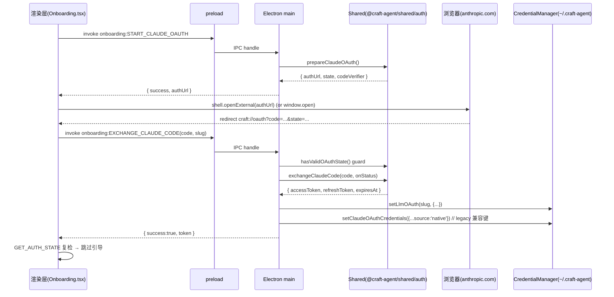
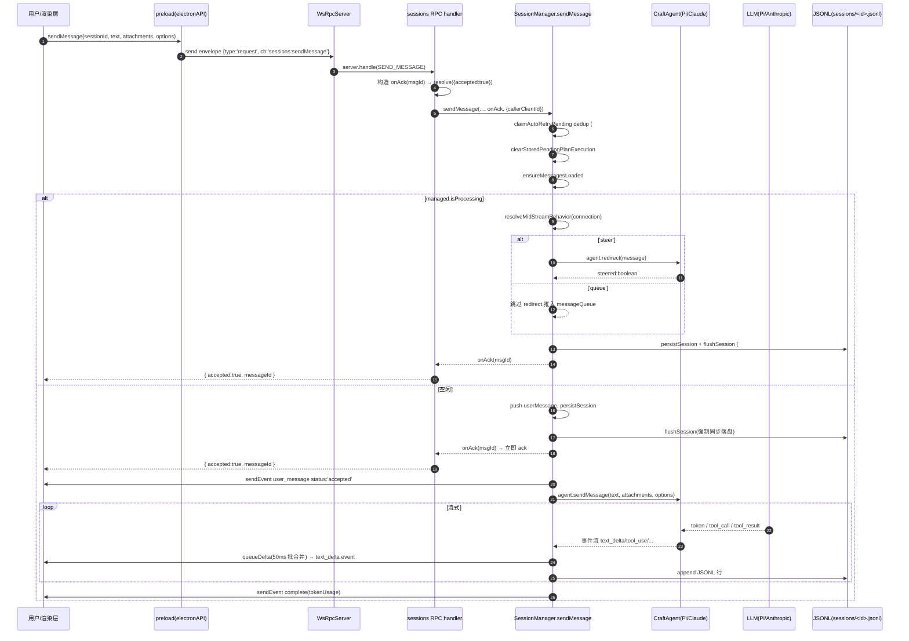
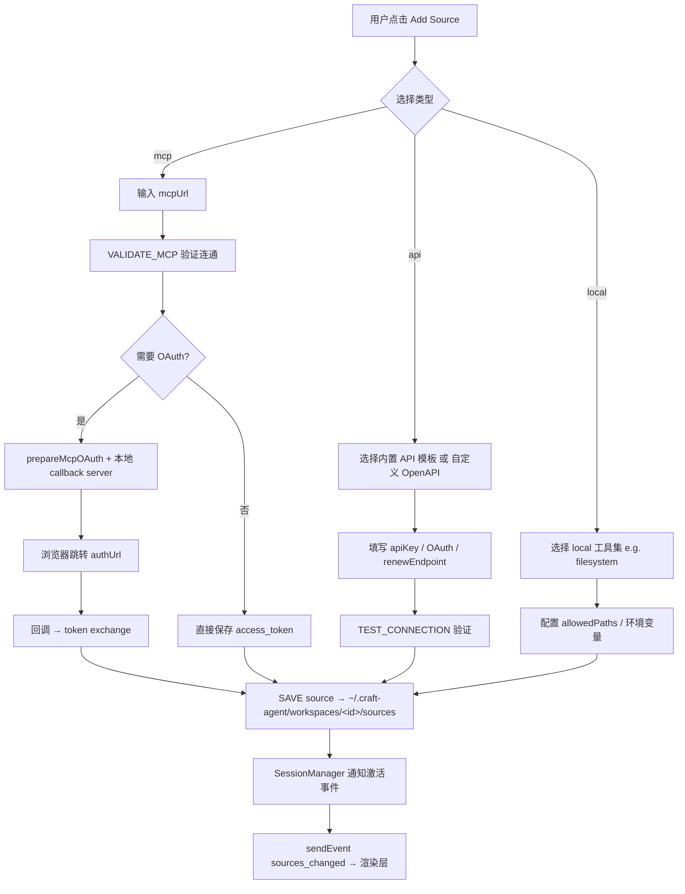
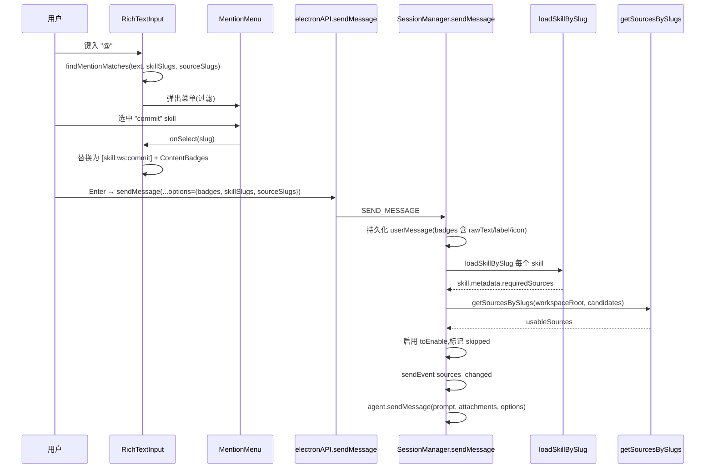
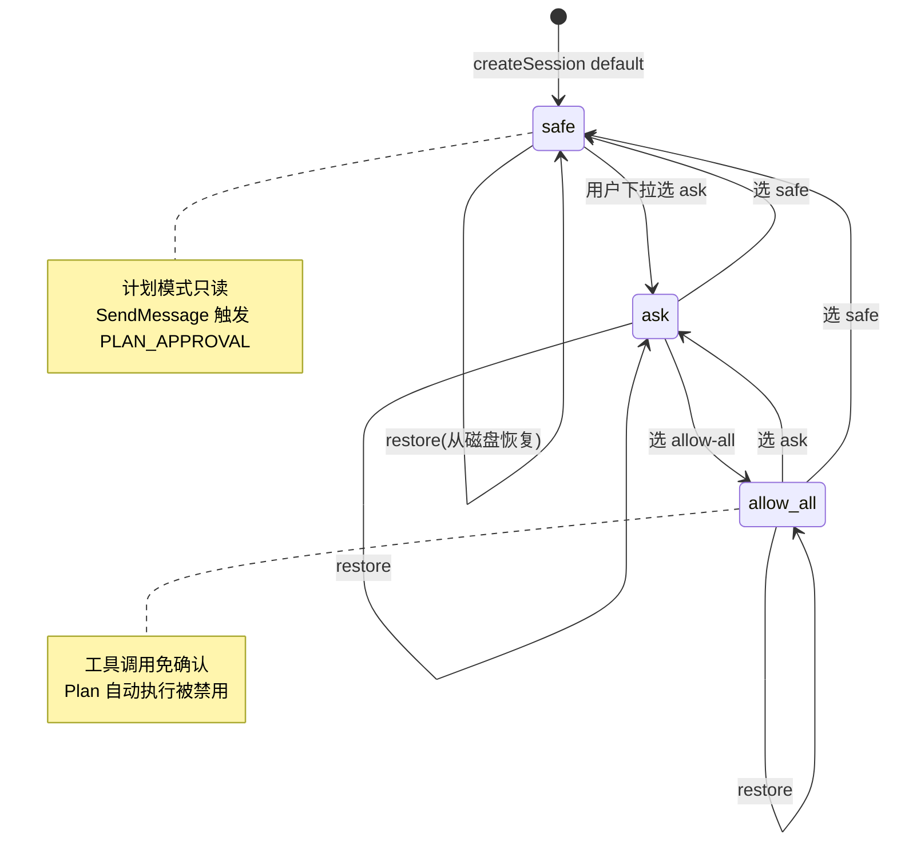
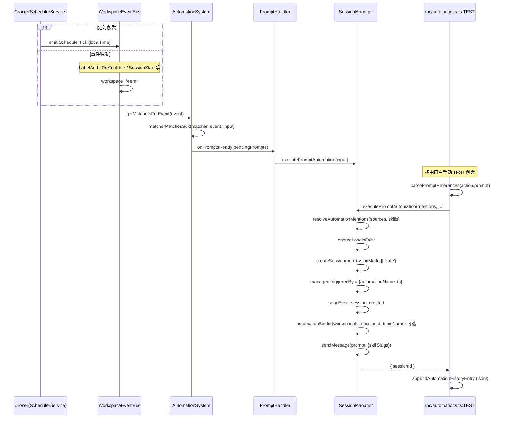
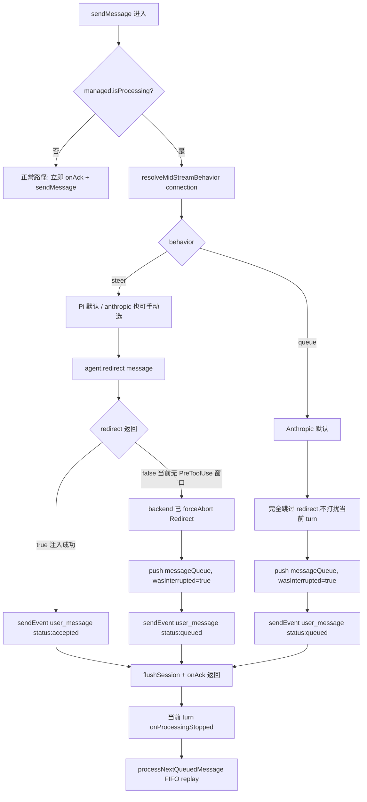

# 核心工作流

> 本文档覆盖 Craft Agents OSS v0.10.4 的 11 条端到端工作流。所有引用形如 `file:line`，便于跳转。机制层的细节（Source 凭证、Agent 子进程内部、传输层编码）已在 02/03/04 文档展开，本文聚焦"用户操作 → 系统响应"的时序与决策。

---

## 0. 总览

| 流程 | 入口 | 核心模块 | 关键方法 |
|---|---|---|---|
| 首启 OAuth | 渲染层 Onboarding 页 | Electron main + `@craft-agent/shared/auth` | `prepareClaudeOAuth` → `exchangeClaudeCode` |
| 消息黄金路径 | 输入框 Enter | WsRpcServer → SessionManager | `sendMessage` (5421) |
| Mid-stream 决策 | 流式中再次发送 | SessionManager | `resolveMidStreamBehavior` |
| @mention | 富文本输入 | `rich-text-input.tsx` | `findMentionMatches` |
| 权限切换 | Header 下拉 | SessionManager | `setSessionPermissionMode` (6546) |
| Automation | cron / 事件总线 | AutomationSystem | `executePromptAutomation` (7558) |
| 远端 server | `CRAFT_SERVER_TOKEN` | `packages/server/src/index.ts` | `bootstrapServer` |
| CLI run | `bun run cli run` | `apps/cli/src/index.ts` | `cmdRun` (628) |
| Viewer 分享 | SessionMenu "Share" | SessionManager | `shareToViewer` (4531) |

---

## 1. 首启 Onboarding 流程

**What**：用户第一次启动 Electron 应用时，引导其完成 Claude（Anthropic）OAuth 授权，把 `access_token / refresh_token / expiresAt` 写入 `~/.craft-agent/credentials.json`，并标注首启已完成。

**Why**：Claude SDK 子进程需要 OAuth Bearer 才能调用 Anthropic API；同时需要在下一次启动跳过引导（`isSetupDeferred()` 或存在有效凭据）。

### 时序图



关键源码：
- 通道声明 `RPC_CHANNELS.onboarding.START_CLAUDE_OAUTH / EXCHANGE_CLAUDE_CODE` — `packages/shared/src/protocol/channels.ts`
- main 端 handler — `apps/electron/src/main/onboarding.ts:96` (START_CLAUDE_OAUTH), `apps/electron/src/main/onboarding.ts:112` (EXCHANGE_CLAUDE_CODE)
- 共享 OAuth 实现 — `packages/shared/src/auth/claude-oauth.ts`（`prepareClaudeOAuth`、`exchangeClaudeCode`、`hasValidOAuthState`、`clearOAuthState`）
- "稍后配置" — `apps/electron/src/main/onboarding.ts:166` `DEFER_SETUP` 写入 `~/.craft-agent/preferences.json` 的 `setupDeferred` 字段
- 渲染层只收到布尔标志（`billing.apiKey` 被打码为 `'••••'`）— `apps/electron/src/main/onboarding.ts:38-48`

> **iOS Safari 兼容（边界 case）**：浏览器回调在 iOS Safari 中必须由同步用户手势触发 `window.open`，否则会被拦截。Onboarding 渲染层使用 `shell.openExternal`（Electron 桌面）或同步 `window.open('about:blank')` 占位（WebUI）再设置 `location.href` 的两步法，绕开 popup blocker。

---

## 2. 消息黄金路径（golden path）

**What**：用户在渲染层输入框敲回车 → preload IPC → main → WsRpcServer → SessionManager.sendMessage → Agent 子进程 → LLM 流式回包 → JSONL 持久化 → UI 增量渲染。

**Why**：这条路径涉及 5 个进程/线程边界（渲染 / main / WS Server / SessionManager / SDK 子进程），每一跳都可能崩溃，因此引入 #616 的 pre-ack flush、#804 的 source-activation dedup，以及 mid-stream 的 queue/steer 决策。

### 完整时序图



关键源码：
- RPC 入口 — `packages/server-core/src/handlers/rpc/sessions.ts:213` `sessions:sendMessage`
- onAck 包装层 — `packages/server-core/src/handlers/rpc/sessions.ts:219-256`（promise + `callerClientId` 错误回流）
- 主实现 — `packages/server-core/src/sessions/SessionManager.ts:5421` `async sendMessage`
- **#804 dedup** — `SessionManager.ts:5451-5459` `claimAutoRetryPending(managed, message) === 'drop'` 直接返回；存档点 `SessionManager.ts:7378-7407`
- **#616 flush before ack** — `SessionManager.ts:5536, 5569, 5602` 三处 `await this.flushSession(managed.id)` 都在 `onAck?.()` 之前
- 计划执行清空 — `SessionManager.ts:5464` `clearStoredPendingPlanExecution`
- mid-stream 决策 — `SessionManager.ts:5480-5539`
- 队列消费 — `SessionManager.ts:1952-1962` `processNextQueuedMessage`（onProcessingStopped 触发）
- delta 批处理 — `SessionManager.ts:7500-7548` `queueDelta / flushDelta`（50ms 节流）

---

## 3. 连接新 Source（mcp / api / local）

**What**：用户从 Settings 或 EditPopover 添加新 Source，三种类型的"用户操作流程"差异显著，详见 04 文档已描述的机制层。本节只展示用户视角流程。

### 流程图



关键源码：
- 通道声明 — `packages/shared/src/protocol/channels.ts` `sources.*` 与 `onboarding.VALIDATE_MCP / START_MCP_OAUTH`
- main 端 MCP 验证 handler — `apps/electron/src/main/onboarding.ts:52-91`
- source 保存通道 — `RPC_CHANNELS.sources.SAVE` / `RPC_CHANNELS.sources.CHANGED`
- 会话激活后回放 — `SessionManager.ts:7370-7407` "Source X activated" 自动重试

---

## 4. @mention 激活 Source/Skill

**What**：用户在输入框键入 `@` 或 `[skill:slug]`，渲染层解析为 badge；发送时把 `sourceSlugs` / `skillSlugs` 放进 `SendMessageOptions.badges`。

**Why**：服务端要在第一轮就把 Skill 需要的 Source 预激活（`#249`），避免两轮 penalty；同时要把 badge 信息写入持久化以便 viewer 显示。

### 时序图



关键源码：
- 富文本解析 — `apps/electron/src/renderer/components/ui/rich-text-input.tsx:363-365` `findMentionMatches`
- badge 构造 — `apps/electron/src/renderer/components/ui/mention-badge.tsx`
- Skill 预激活 — `SessionManager.ts:5668-5720` "Pre-enable sources required by invoked skills"
- @mention 在 automation prompt 中解析 — `SessionManager.ts:7639-7667` `resolveAutomationMentions`

---

## 5. 权限模式切换

**What**：用户从 Header 切换 `safe / ask / allow-all`，SessionManager 同步 managed state、广播事件、通知 Agent 子进程、落盘。

**Why**：模式切换可能正在工具调用中发生，需要 reconcile 三层状态：managed.permissionMode、PermissionModeManager（权威 diagnostics）、Agent 子进程内部模式。详细机制见 02/03 文档。

### 状态转换图



关键源码：
- API — `SessionManager.ts:6546` `setSessionPermissionMode(sessionId, mode)`
- 三层 reconcile — `SessionManager.ts:6555-6577`（同模式 drift 时 warn + heal）
- 事件广播 — `SessionManager.ts:6594-6603` `permission_mode_changed` event
- Agent 回调（reverse 方向）— `SessionManager.ts:3845-3870` `managed.agent.onPermissionModeChange`
- safe 模式强制计划 — `SessionManager.ts:4516-4520` `if (managed.permissionMode === 'safe') ... PLAN_APPROVAL_MESSAGE`
- RPC handler — `packages/server-core/src/handlers/rpc/sessions.ts:322` `case 'setPermissionMode'`
- 查询 — `sessions:GET_PERMISSION_MODE_STATE` (`sessions.ts:392`)

---

## 6. Automation 触发

**What**：cron（SchedulerService）或事件总线（`LabelAdd` / `PreToolUse` / `SessionStart` / `SchedulerTick` 等）触发 `automations.json` 中匹配的 matcher，对 prompt 类动作调用 `executePromptAutomation` 新建会话。

**Why**：把"事件 → 会话"统一为单一入口，便于 history 追踪、Telegram topic 绑定、`triggeredBy` 标注跳过 AI 标题生成。

### 时序图



关键源码：
- 系统 facade — `packages/shared/src/automations/automation-system.ts:65` `class AutomationSystem`
- cron — `automation-system.ts:289-303` `startScheduler` (内部 `croner`，每分钟 tick → `SchedulerTick`)
- 事件 diff — `automation-system.ts:330-425` `updateSessionMetadata` (LabelAdd / LabelRemove / PermissionModeChange / FlagChange / SessionStatusChange)
- prompt 触发入口 — `packages/server-core/src/sessions/SessionManager.ts:7558` `executePromptAutomation`
- mentions 解析 — `SessionManager.ts:7650` `resolveAutomationMentions`
- automation 测试 RPC — `packages/server-core/src/handlers/rpc/automations.ts:98-195` `automations:TEST`
- 历史记录 — `automations-history.jsonl`（`appendAutomationHistoryEntry`）

---

## 7. 远端 server 连接

**What**：CLI / WebUI / 远端桌面 thin client 都通过 WebSocket 连 `packages/server/src/index.ts` 启动的 Bun server。CLI 用 Bearer token；WebUI 用 jose HS256 JWT + argon2id 密码。

**Why**：同一 WsRpcServer 同时承载 RPC 和（可选）HTTP，避免双端口；不同客户端类型走不同鉴权路径，但握手后协议完全一致。

### 时序图

```mermaid
sequenceDiagram
    participant CLI as CLI(CliRpcClient)
    participant W as WebUI 浏览器
    participant HTTP as Bun.serve HTTP
    participant WS as WsRpcServer
    participant SM as SessionManager

    Note over CLI: 启动时 --url ws://host:9100 --token &lt;CRAFT_SERVER_TOKEN&gt;
    CLI->>WS: ws connect + handshake{token}
    WS->>WS: 校验 token (requireToken=true)
    WS-->>CLI: handshake_ack{clientId}
    CLI->>SM: sessions:create / sessions:sendMessage ...

    Note over W: 浏览器访问 /login
    W->>HTTP: GET /login (HTML)
    W->>HTTP: POST /api/auth {password}
    HTTP->>HTTP: argon2id verify (initPasswordHash @startup)
    HTTP->>HTTP: jose SignJWT HS256 (24h)
    HTTP-->>W: Set-Cookie craft_session=&lt;jwt&gt;; HttpOnly; SameSite=Strict
    W->>HTTP: GET /api/config (Cookie)
    HTTP->>HTTP: validateSession → verifyJwt
    HTTP-->>W: { wsUrl }
    W->>WS: ws upgrade (Cookie header)
    WS->>WS: validateSessionCookie (server.ts index.ts:174)
    WS-->>W: handshake_ack
    W->>SM: RPC 调用同 CLI
```

关键源码：
- server 启动 — `packages/server/src/index.ts:166-255` `bootstrapServer({...})`
- Bearer 校验 — `packages/server-core/src/transport/server.ts:84` `requireToken` + handshake
- JWT/argon2 — `packages/server-core/src/webui/auth.ts:24-50` `signJwt/verifyJwt`；`auth.ts:101-112` `initPasswordHash/verifyPassword` (Bun.password argon2id)
- 登录路由 — `packages/server-core/src/webui/http-server.ts:238-275` `POST /api/auth`
- Cookie 升级 WS — `packages/server/src/index.ts:174` `validateSessionCookie`
- CLI 客户端 — `apps/cli/src/client.ts:38` `CliRpcClient`（token 在握手帧发送）

> 边界 case：远端绑定非 localhost + 无 TLS 会被拒绝（`packages/server/src/index.ts:317-336`），强制 `wss://`。

---

## 8. CLI run 子命令

**What**：`bun run apps/cli/src/index.ts run <prompt>` 自动起一个本地 server、跑一个 prompt、流式打印、然后退出。默认 `permissionMode='allow-all'` 以便无人值守执行。

### 流程图

```mermaid
flowchart TD
    A[cmdRun args] --> B[readPrompt 从 argv 或 stdin]
    B --> C[spawnLocalServer 子进程起 server]
    C --> D[client.connect handshake]
    D --> E{args.workspaceDir?}
    E -->|是| F[workspaces:create 注册目录]
    E -->|否| G[resolveWorkspace 默认]
    F --> H
    G --> H[shouldSetupLlmConnection?]
    H -->|是| I[setupLlmConnection 注入 API/OAuth]
    H -->|否| J
    I --> J[sessions:create permissionMode=args.mode \|\| 'allow-all']
    J --> K{args.model?}
    K -->|是| L[session:setModel]
    K -->|否| M
    L --> M[sendAndStream 流式打印 stdout]
    M --> N[cleanup sessions:delete + server.stop]
    N --> O[process.exit exitCode]
```

关键源码：
- 入口 — `apps/cli/src/index.ts:628` `async function cmdRun(args)`
- 默认模式 — `apps/cli/src/index.ts:693` `permissionMode: args.mode || 'allow-all'`
- LLM 自动配置 — `apps/cli/src/index.ts:562-625` `setupLlmConnection`（支持 anthropic / openai / amazon-bedrock / piAuthProvider）
- 信号清理 — `apps/cli/src/index.ts:649-658` SIGINT/SIGTERM → `sessions:cancel` + cleanup + exit 130

---

## 9. Session 分享与 Viewer 上传

**What**：用户在 SessionMenu 点 "Share"，SessionManager 把磁盘上的 `sessions/<id>.jsonl` 直接 POST 到 viewer 服务，得到 `url + id`，写入会话元数据并广播 `session_shared` 事件。Viewer 是纯静态站点，根路径用 drag-drop + `FileReader` 解析 JSON 上传，无 server-side upload 端点（`/s/api` 只接 POST JSON）。

### 数据流图

```mermaid
flowchart LR
    subgraph Electron 客户端
      SM[SessionManager.shareToViewer] -->|loadStoredSession| JSONL[(sessions/&lt;id&gt;.jsonl)]
      SM -->|POST /s/api application/json| NET
    end
    NET[(viewer.craft.agents)] -->|{id,url}| SM
    SM -->|updateSessionMetadata sharedUrl/sharedId| JSONL
    SM -->|sendEvent session_shared| UI[渲染层]

    subgraph Viewer 静态站点
      V1[SessionUpload.tsx] -->|file.text + JSON.parse| V2[setSession]
      V1 -->|drag/drop/paste| V2
      V3[/s/&lt;id&gt; 路由] -->|fetch /s/api/&lt;id&gt;| V4[StoredSession]
    end
```

关键源码：
- Electron 端 share — `packages/server-core/src/sessions/SessionManager.ts:4531-4586` `shareToViewer`
- POST 实现 — `SessionManager.ts:4549-4553` `fetch(`${VIEWER_URL}/s/api`, { method:'POST', body: JSON.stringify(storedSession) })`
- 文件过大保护 — `SessionManager.ts:4557` 413 → `'Session file is too large to share'`
- UI 入口 — `apps/electron/src/renderer/pages/ChatPage.tsx:482` `sessionCommand({type:'shareToViewer'})`
- Viewer 上传组件 — `apps/viewer/src/components/SessionUpload.tsx:24-46` `parseSessionFile` (File.text → JSON.parse → onSessionLoad)
- 支持拖拽 + 点击 + 粘贴 — `SessionUpload.tsx:48-100`

---

## 10. Mid-stream 行为决策树

**What**：用户在 Agent 流式输出过程中又发了一条消息，SessionManager 必须决定：steer（注入到当前 turn）/ queue（等当前 turn 自然结束后作为新 turn 重放）/ interrupt（强制中断再重放）。

**Why**：Anthropic SDK 没有原生 steer，PreToolUse hook 是模拟路径；Pi SDK 原生支持 `agent.redirect()`。`LlmConnection.midStreamBehavior`（用户可在 Settings 改）覆盖默认。

### 决策树



关键源码：
- 决策点 — `SessionManager.ts:5480-5539`
- behavior resolver — `@craft-agent/shared/config` `resolveMidStreamBehavior(connection)`（CLAUDE.md 提示：禁止直接判 `providerType`）
- 默认 — anthropic→`'queue'`，pi/pi_compat→`'steer'`
- 队列结构 — `SessionManager.ts:863-874` `messageQueue: Array<{message, attachments, storedAttachments, options, messageId, optimisticMessageId}>`
- steer 未投递回收 — `SessionManager.ts:7473-7479` `case 'steer_undelivered'` 把消息推回 queue

---

## 11. 已知边界 case

| Case | 表现 | 关键源码/注释 |
|---|---|---|
| **工具权限 rebound** | Agent 内部回调 `onPermissionModeChange` 把 mode 改回，SessionManager 必须判 `if (managed.permissionMode === mode) return` 防止回环 | `SessionManager.ts:3845-3870` |
| **iOS Safari OAuth popup** | Safari iOS 拦截非用户手势触发的 `window.open`，需同步占位 + 改 location | 渲染层 Onboarding OAuth 处理（`shell.openExternal` 桌面 / `window.open('about:blank')` 兼容） |
| **Connection lock after first message** | 第一条 sendMessage 后切换 connection 受限，Pi 子进程的 piAuthProvider/slug 无法热替换，需 dispose+recreate | `runtime-config.ts:buildRestartRequiredSignature`；`tryRefreshAgentRuntime` 走重启路径（CLAUDE.md `shared` 段落） |
| **Source activation 双触发 (#804)** | 服务器调度 + 旧版渲染层 client 自动 retry 同时到达，须由 `autoRetryPending` 槽位 dedup | `SessionManager.ts:5451-5459, 7378-7407` |
| **Pre-ack 崩溃丢失消息 (#616)** | `persistSession` 是 500ms debounce，若 ack 早于落盘，crash 会丢用户消息 | `SessionManager.ts:5536, 5569, 5602` `await flushSession` 在 `onAck` 前 |
| **steer 不可投递** | Claude 当前 turn 没产生 PreToolUse 钩子，steer 消息丢失 → backend emit `steer_undelivered`，SM 把消息推回 queue | `SessionManager.ts:7473-7479` |
| **远端 TLS 强制** | 非 localhost 绑定 + 无 TLS 直接 exit(1)，避免 token 明文 | `packages/server/src/index.ts:317-336` |
| **Viewer 文件过大** | POST /s/api 返回 413，SM 友好提示 `'Session file is too large to share'` | `SessionManager.ts:4557-4559` |
| **Permission mode drift** | managed state 与 mode-manager diagnostics 不一致（多见于 restore race），SM warn + heal | `SessionManager.ts:6559-6568, 6634-6652` |
| **Plan 自动执行安全阀** | 用户发新消息时清空 `pendingPlanExecution`，防止旧 plan 被延迟自动执行 | `SessionManager.ts:5464` |

---

## 附录：关键文件索引

| 文件 | 行数 | 作用 |
|---|---|---|
| `packages/server-core/src/sessions/SessionManager.ts` | 8090 | 会话生命周期、sendMessage、automation、share |
| `packages/server-core/src/handlers/rpc/sessions.ts` | — | sessions:* RPC handler 集中地 |
| `packages/server-core/src/handlers/rpc/messaging.ts` | 196 | messaging 平台（Telegram/Lark/WA）|
| `packages/server-core/src/handlers/rpc/automations.ts` | 315 | automations CRUD/TEST/REPLAY |
| `packages/server-core/src/webui/auth.ts` | 187 | jose HS256 + argon2id |
| `packages/server-core/src/webui/http-server.ts` | — | HTTP 路由（/login /api/auth /api/config /api/oauth/callback）|
| `packages/server-core/src/transport/server.ts` | — | WsRpcServer 握手与 token 校验 |
| `packages/shared/src/automations/automation-system.ts` | 563 | AutomationSystem facade |
| `packages/shared/src/protocol/channels.ts` | — | 所有 RPC 通道常量 |
| `apps/electron/src/main/onboarding.ts` | 171 | OAuth IPC handler |
| `apps/electron/src/transport/channel-map.ts` | 420 | 方法名 → 通道映射 |
| `apps/cli/src/index.ts` | 2075 | CLI 入口（cmdRun @ 628）|
| `apps/cli/src/client.ts` | — | CliRpcClient（无重连简化版）|
| `apps/viewer/src/components/SessionUpload.tsx` | — | drag/drop/paste 上传 JSON |
| `packages/server/src/index.ts` | 353 | 远端 server 装配 |
