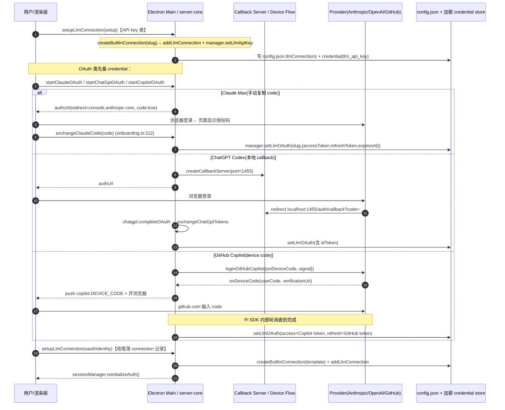
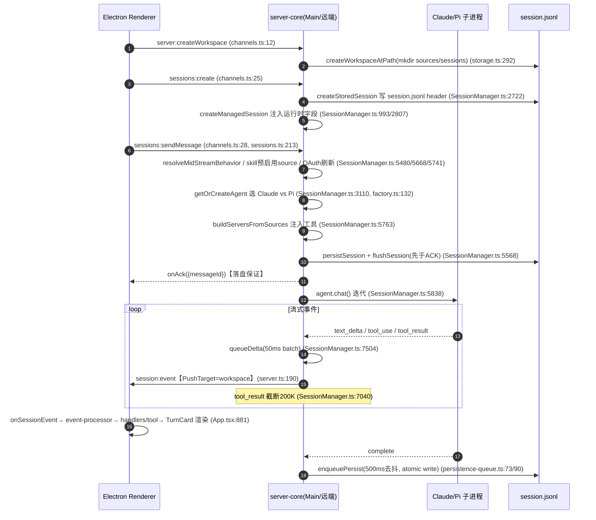
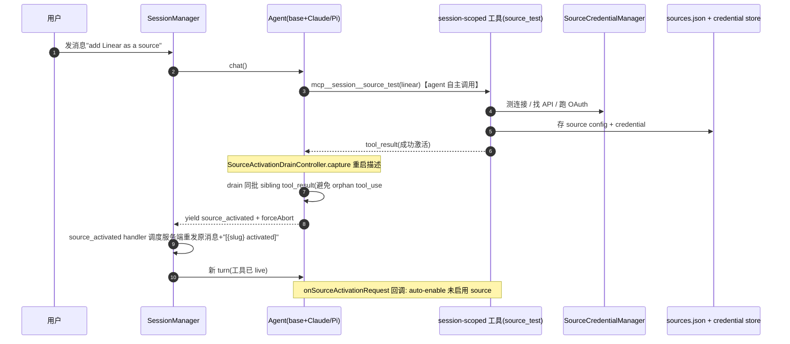
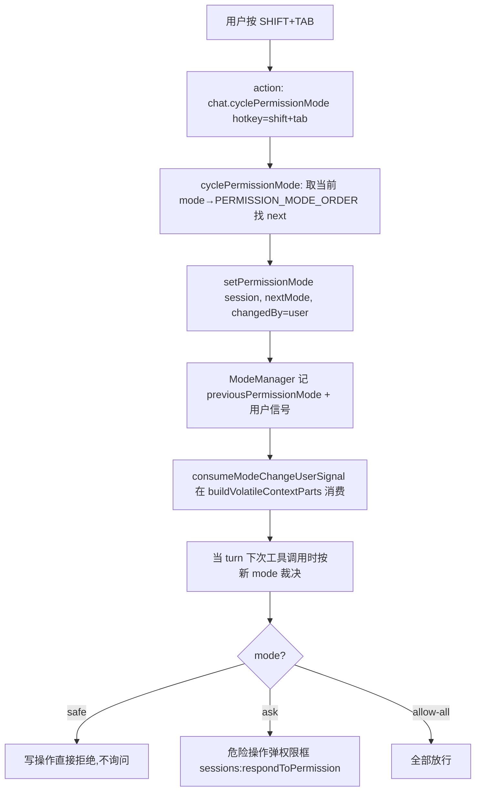
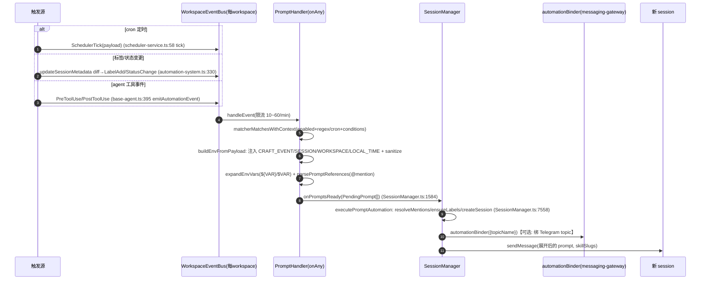
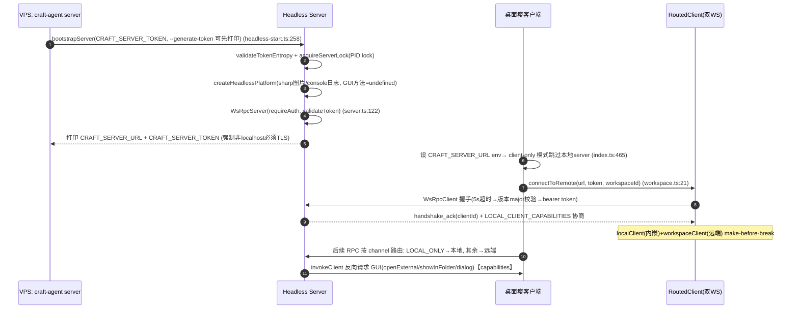
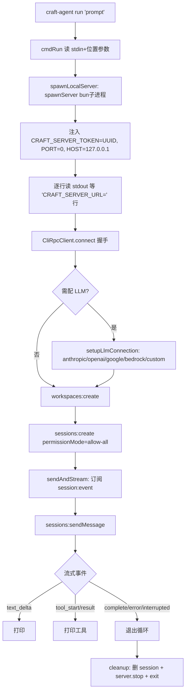
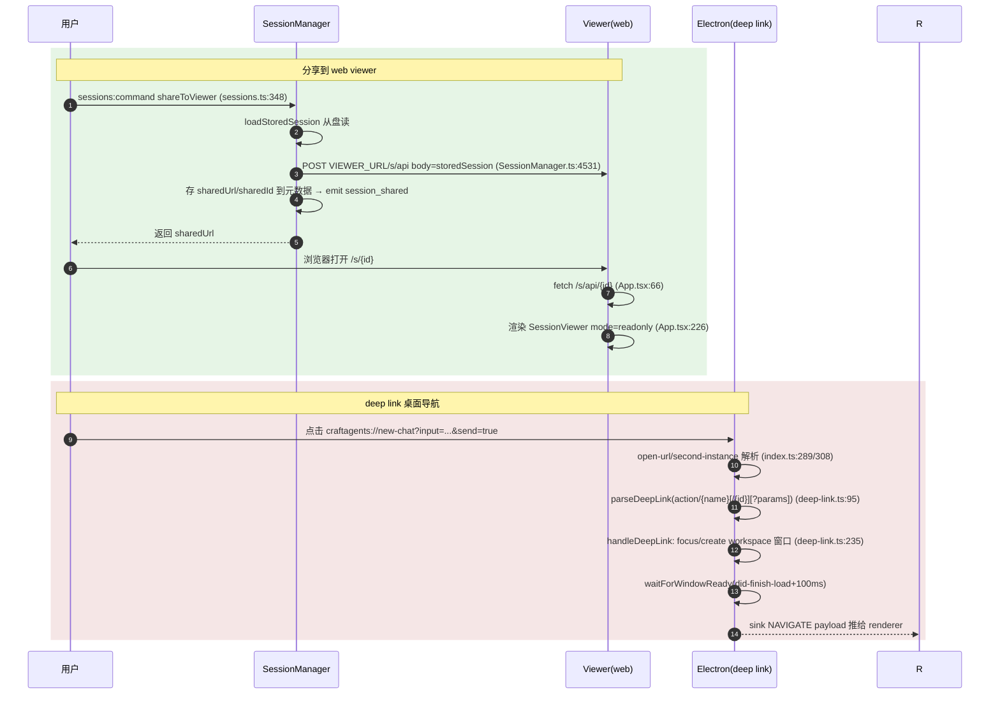
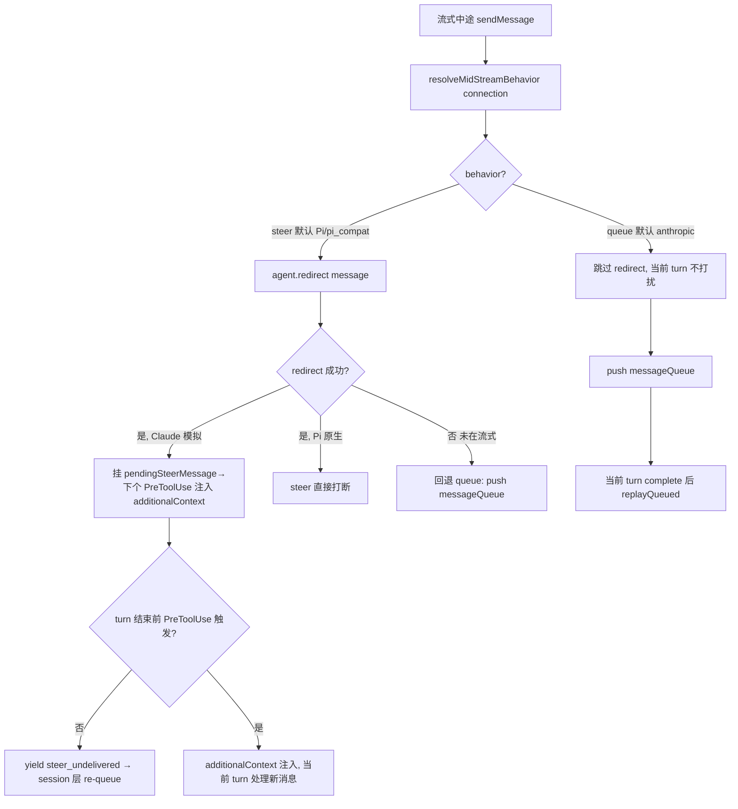
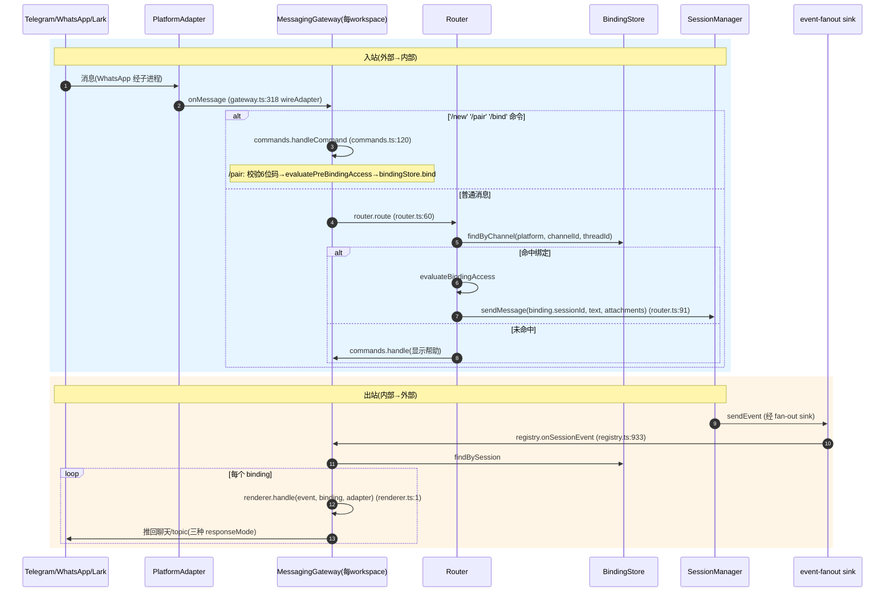

# 核心工作流（端到端业务流程）

> 本篇为 Craft Agents 代码研究「专题 G：核心工作流」。它把前述各机制（agent / session / source / credential / skill / transport / automation / messaging-gateway）**串成用户可感知的操作路径**，追踪 12 条端到端业务流程。每条流程按 **What（用户视角）/ Why（设计动因）/ How（调用链）** 三段式展开，配 Mermaid 时序/流程图，结论附 `文件路径:行号 + 函数/handler/IPC method`。
>
> 证据来源：截至当前工作树。忽略测试文件、node_modules、dist、lock 文件。行号基于本次读取，代码变动后以实际为准。

---

## 阅读约定

- **进程拓扑**贯穿全文：本条链路跨了几个进程？边界在哪？
- **隐式复杂度**：每条流程末尾标注 1-2 处「看起来简单、实则跨多进程/多 transport」的设计点。
- **统一术语**：`connection` = LLM Provider 连接记录（Anthropic/Pi）；`source` = 外部数据/工具来源（mcp/api/local 三类）；`session` = 一次会话，以 `session.jsonl` 为真理源。

---

## 工作流 1：OAuth 登录 / 添加 LLM Connection

### What
用户在 onboarding 或 Settings→AI 里「添加一个 AI 连接」。支持 5 种 Provider，最终都落成一条 `LlmConnection` 记录 + 一份加密 credential：

| Provider | 用户操作 | 落成的 connection |
|---|---|---|
| Anthropic API key | 直接粘贴 key | `providerType='anthropic', authType='api_key'` |
| Claude Max OAuth | 浏览器登录 Anthropic，**复制页面上显示的授权码**回粘 | `providerType='anthropic', authType='oauth'` |
| Google AI Studio | 选 Google + 粘 API key | `providerType='pi', piAuthProvider='google', authType='api_key'` |
| ChatGPT Codex OAuth | 浏览器登录 OpenAI，**本地起 1455 端口收 callback** | `providerType='pi', piAuthProvider='openai-codex', authType='oauth'` |
| GitHub Copilot | **device code**：UI 显示 userCode，用户去 github.com 输入 | `providerType='pi', piAuthProvider='github-copilot', authType='oauth'` |

### Why 这样设计
**5 种 Provider 的差异被收敛在两层**，避免每加一个 Provider 就改 N 处：

1. **渲染层** `apps/electron/src/renderer/hooks/useOnboarding.ts:553-634` 的 `handleStartOAuth` 按 `effectiveMethod`（`claude_oauth` / `pi_chatgpt_oauth` / `pi_copilot_oauth` / `anthropic_api_key` / `pi_api_key`）分支到 5 条不同子流程。
2. **服务层** `packages/server-core/src/domain/connection-setup-logic.ts:84` 的 `BUILT_IN_CONNECTION_TEMPLATES` 把 5 种 slug（`anthropic-api`/`claude-max`/`chatgpt-plus`/`github-copilot`/`pi-api-key`）统一映射成 `LlmConnection`（`providerType` + `authType` + `piAuthProvider`）。

**统一落盘入口**：无论走哪条 OAuth，最终都调同一个 IPC channel `settings:setupLlmConnection`（`packages/shared/src/protocol/channels.ts:204`，handler 在 `packages/server-core/src/handlers/rpc/llm-connections.ts:52`）创建 connection 记录。OAuth 子流程只是先把 credential 准备好，再调 SETUP 落盘。该 channel 在 `packages/shared/src/protocol/routing.ts` 归为 REMOTE_ELIGIBLE——跑在拥有当前 workspace 的 server 上（远端场景下 credential 必须落远端盘）。

### How（调用链）



### 关键步骤说明

| 步骤 | 模块 | 做什么 | 为什么 | 代码位置 |
|---|---|---|---|---|
| 渲染层分发 | useOnboarding | 按 `effectiveMethod` 选 5 条路径 | 多 Provider 差异入口收敛 | `apps/electron/src/renderer/hooks/useOnboarding.ts:553` `handleStartOAuth` |
| Claude OAuth | onboarding handler | 生成 PKCE+state 存**模块级** `currentOAuthState`，返 authUrl | Claude redirect 不回本地，靠页面显示码 | `packages/shared/src/auth/claude-oauth.ts:114` `prepareClaudeOAuth`；handler `packages/server-core/src/handlers/rpc/onboarding.ts:96`(START)/`:112`(EXCHANGE) |
| Claude 回灌 | exchangeClaudeCode | 校验 state+10min 过期→换 token→存 credential | 手动复制码，无 callback server | `claude-oauth.ts:190` `exchangeClaudeCode` |
| ChatGPT 编排 | preload | 起 1455 callback server→start→等 callback→complete | OpenAI 必须本地回跳 | `apps/electron/src/preload/bootstrap.ts:358-411` `performChatGptOAuth` |
| ChatGPT 临时态 | handler | `pendingChatGptFlows: Map<state,flow>`，5min TTL | 跨 IPC 维持 PKCE state | `llm-connections.ts:623` |
| Copilot device code | handler | Pi SDK `loginGitHubCopilot` 内部轮询，`onDeviceCode` 回调推 UI + `invokeClient(OPEN_EXTERNAL)` | 非浏览器回跳 | `llm-connections.ts:761`；取消用 `copilotOAuthAbort`（`:19`） |
| 统一落盘 | SETUP handler | `createBuiltInConnection(slug)`→`addLlmConnection`→`setLlmApiKey/OAuth` | 5 路汇一 | `connection-setup-logic.ts:84`(模板)/`:179`；`storage.ts:2634` `addLlmConnection`；`credentials/manager.ts:338`/`:378` |

### 异常分支

| 场景 | 触发 | 处理 | 用户影响 |
|---|---|---|---|
| Claude state 过期 | `currentOAuthState.expiresAt`(10min) 超时 | `exchangeClaudeCode` 抛错 | 重新点「连接」 |
| ChatGPT flow TTL | state 5min 未消费 | 从 map 删除 | callback 到达时报「flow not found」 |
| Copilot 取消 | 用户点取消 | `copilot.CANCEL_OAUTH`→`abort()` | 流程中断 |
| 机器迁移致解密失败 | credential 文件换机器后 GCM tag 校验失败 | `manager.ts:644` 检测 `decrypt`/`cipher`→抛 `decryption_failed` | 提示重置凭证 |
| 新字段丢失(#838) | `updateLlmConnection` 用硬编码 allowlist 重建对象 | 新增持久化字段未加入 allowlist | 下次 save 丢失该字段 |

### 隐式复杂度
1. **Claude OAuth 是「无 callback」反模式**：redirect 指向 `console.anthropic.com` 并带 `code:true`，Anthropic 直接在页面显示授权码让用户手动复制——这与「标准 OAuth + 本地 redirect」完全不同，导致 `craftagents://auth-callback` 在 `deep-link.ts:112` 被显式 `return null`（deep-link 不处理 OAuth）。
2. **Copilot 的轮询不在 Craft 代码里**：`loginGitHubCopilot` 是 Pi SDK 内部循环，Craft 只提供 `onDeviceCode`/`signal` 回调。失败/超时语义由 SDK 决定，Craft 无法精细控制重试。
3. **落盘两处分离跨进程**：connection 配置进 `~/.craft-agent/config.json`（明文），密钥进加密 credential store（AES-256-GCM）。远端场景下 SETUP 走 REMOTE_ELIGIBLE channel 确保两者落在同一台机器。

---

## 工作流 2：Golden Path（新建 workspace → 新建 session → 发消息 → 流式 + tool 可视化 → 落盘）

### What
用户创建工作区，开一个新会话，发一条消息，看到流式文字回复 + 工具执行卡片，关闭后重开历史仍在。

### Why
这是产品的「主路径」。设计上它要同时满足三个约束：① **流式低延迟**（用户每 50ms 看到新字）；② **崩溃不丢消息**（落盘先于 ACK）；③ **跨形态**（Electron / 远端 server / CLI 走同一套 `server-core` 内核）。

### How（跨 3 进程：Renderer / server-core / SDK 子进程）



### 关键步骤说明

| 步骤 | IPC method | 做什么 | 为什么 | 代码位置 |
|---|---|---|---|---|
| 新建 workspace | `server:createWorkspace` | mkdir + 写 config.json | 工作区隔离 | handler `handlers/rpc/server.ts:38`；落盘 `workspaces/storage.ts:292` |
| 新建 session | `sessions:create` | 解析默认 mode/thinking/model→预解析后端→写 header→构造 ManagedSession | session 即文档 | `handlers/rpc/sessions.ts:188`；`SessionManager.ts:2461 createSession`；`:993 createManagedSession` |
| 发消息 | `sessions:sendMessage` | 持久化 user msg **先于** ACK | 崩溃不丢(#616) | `handlers/rpc/sessions.ts:213`；`SessionManager.ts:5421 sendMessage`；落盘+ACK `:5568-5570` |
| agent 选型 | — | `getOrCreateAgent` 比 runtime 签名，Claude→`ClaudeAgent`，Pi→`PiAgent` | 双 SDK 路由 | `SessionManager.ts:3110`；`agent/backend/factory.ts:132 createBackend`；签名 `sessions/runtime-config.ts:50/65` |
| 流式 push | `session:event` | 50ms 合并 text_delta + PushTarget 路由 + ring buffer | 低延迟 + 断线重连 replay | `transport/push.ts:8 pushTyped`；`transport/server.ts:190 push`/`:746 bufferAndMaybeSendEvent`；batch `SessionManager.ts:7504/7529` |
| tool 可视化 | `session:event` | tool_start/tool_result 事件→UI reducer→卡片 | 工具过程透明 | 事件类型 `protocol/dto.ts:167-171`；处理 `SessionManager.ts:6902/7032`；前端 `renderer/event-processor/handlers/tool.ts:24/75`；渲染 `packages/ui/.../TurnCard.tsx:644/898` |
| 落盘 | — | atomic write-to-temp-then-rename，500ms 去抖，外部元数据保护 | 崩溃只坏 .tmp | `sessions/persistence-queue.ts:73 enqueue`/`:90 write`/`:157 atomic`；格式 `sessions/jsonl.ts:5`(line1=header) |

### 异常分支

| 场景 | 处理 | 用户影响 |
|---|---|---|
| SDK 子进程 crash | agent 流异常→complete 事件带 error | 看到错误，已落盘消息保留 |
| 发消息时崩溃在 ACK 前 | `flushSession` 强制即时写 + 冷加载兜底 `hydrateMessagesForColdPersist` | 重开历史仍在 |
| 外部（watcher）改了 header 元数据 | `getHeaderMetadataSignature` 比对→`mergeHeaderWithExternalMetadata` 保留外部变更 | 不会被 clobber |
| JSONL 损坏行 | `parseMessagesResilient` 跳过坏行 | 只丢该行不丢整会话 |

### 隐式复杂度
1. **流式 push 的 ring buffer 不是真 ring**：是带 TTL + 容量上限的顺序缓冲（`server.ts:746`），靠 `lastSentSeq` 实现**断线重连 replay**——客户端重连时按 seq 补发，期间新 push 不交错。这层在 WS 协议里是隐形的。
2. **agent 选型签名分两份**：`buildBackendRuntimeSignature`（model/baseUrl 等可原地刷新）vs `buildRestartRequiredSignature`（provider/authType/slug 等必须重启）。改 model 走原地 `updateRuntimeConfig`，改 provider 必须 dispose+recreate——`update_runtime_config` IPC 只携带可原地刷新字段。
3. **tool 卡片是「双事件模式」**：SDK 可能先发 input-only 的 tool_start 再补全，前端 `handleToolStart` 按 `toolUseId` 查找已有 message 更新而非新建（`handlers/tool.ts:24`）。

---

## 工作流 3：连接新 Source（「add Linear as a source」）

### What
用户在对话里说「加 Linear 作为来源」，或对某个 source 点「Pair/Activate」。agent 自动探测可用 source、读文档、生成配置、配凭证，最终把 source 的工具注入到当 turn 可用。

### Why
Source 是「让 agent 长出新手」的机制。难点是**激活发生在 turn 中途**——agent 正在跑，新工具要立即生效。Craft 用 `SourceActivationDrainController` 在 tool_result 边界优雅终止当前 turn，再以「[slug activated]」后缀重发原消息，让新工具在下一 turn 生效。

### How



### 关键步骤说明

| 步骤 | 模块 | 做什么 | 为什么 | 代码位置 |
|---|---|---|---|---|
| Source 类型 | types | 固定三类 `mcp`/`api`/`local` | 同契约承载异构来源 | `sources/types.ts:16 SourceType` |
| 自动激活回调 | SessionManager | `activateSourceInSessionFn` 调 `agent.onSourceActivationRequest`→auto-enable | agent 用 source 时按需启用 | `SessionManager.ts:4174` 注入；`:4214 onSourceActivationRequest` 实现 |
| drain 控制 | SourceActivationDrainController | 捕获重启→drain 同批→边界 fire `source_activated`+forceAbort | 避免丢 sibling tool_result 导致 orphan tool_use(#790) | `agent/source-activation-drain.ts:49`；策略 `:47`（Claude=`batch-boundary`，Pi=`fire-on-non-tool-result`） |
| 消费 pending | base/claude/pi agent | tool_result 后 `consumePending` 取重启描述 | 两后端冻结工具时机不同 | `claude-agent.ts:1489/1634`；`pi-agent.ts:2085/2094` |
| 凭证存储 | CredentialManager | `setSourceCredential`→AES-256-GCM | 统一凭证路径，无 ad-hoc | `credentials/manager.ts:14` |
| token refresh | TokenRefreshManager | OAuth / renew endpoint 两条路径 | 长效凭证 | `sources/token-refresh-manager.ts`；`isRefreshableSource` `types.ts:234` |

### 隐式复杂度
1. **激活时机被两后端的「工具冻结点」逼出复杂分支**：Claude SDK 在 `query()` 开始就冻结 `mcpServers`，Pi 只在下一次 `handlePrompt` 取新工具——所以必须**先终止当前 turn 再重发**，不能原地热加载。这是 `source_activated` 事件存在的根本原因。
2. **drain 策略因后端事件模型不同分两套**：Claude 事件适配器会在同一 SDK user message 内**交错合成事件**（`task_backgrounded`/`shell_killed`），必须 drain 整批；Pi 是 1:1，首个非 tool_result 即边界。

---

## 工作流 4：@mention 技能/来源（mid-conversation 注入，免重启）

### What
用户在消息里输入 `[skill:commit]` 或 `[source:linear]`，命中后该 skill/source 在**当 turn** 生效，无需重启会话。

### Why
让用户在不打断当前任务的情况下「临时挂载」能力。与工作流 3（agent 自主激活）不同，这是**用户显式指定**。

### How

```mermaid
flowchart TD
    A[用户输入 '[skill:commit] [source:linear]'] --> B[sendMessage: parseMentions]
    B --> C{skillSlugs 非空?}
    C -->|是| D[loadSkillBySlug: 扫描 requiredSources]
    D --> E[预启用 source 到 enabledSourceSlugs]
    E --> F[emit sources_changed 事件]
    C -->|否| G[跳过 skill 预启用]
    F --> H[getOrCreateAgent: 注入 skill + source 工具]
    G --> H
    B --> I[resolveSkillMentions/resolveSourceMentions]
    I --> J[替换为 'Mentioned skill/source' 语义标记]
    J --> K[消息进 agent: 标记让模型识别显式引用]
    H --> L[agent.chat 当 turn 工具已 live]
```

### 关键步骤说明

| 步骤 | 函数 | 做什么 | 代码位置 |
|---|---|---|---|
| 解析 | `parseMentions` | 正则提取 `[skill:slug]`/`[source:slug]`/`[file:path]`/`[folder:path]`，校验 slug 是否存在 | `shared/src/mentions/index.ts:62` |
| skill 预启用 source | sendMessage 内 | 扫 skill 的 `requiredSources`→预加入 `enabledSourceSlugs`→`sources_changed` | `SessionManager.ts:5668-5724`（消除两 turn 延迟 #249） |
| 语义标记 | `resolveSkillMentions`/`resolveSourceMentions` | `[skill:commit]`→`[Mentioned skill: Git Commit (slug: commit)]` | `mentions/index.ts:154/174` |
| 文件解析 | `resolveFileMentions` | `[file:src/index.ts]`→绝对路径 `[Mentioned file: ... (at /abs)]` | `mentions/index.ts:194` |

### 隐式复杂度
1. **预启用消除两 turn 延迟**：旧实现要等 agent 下一次请求才看到新 source，导致用户 @mention 后第一个 turn 工具不可用（#249）。现在 send 路径里就预注入 `enabledSourceSlugs`。
2. **自动化 prompt 里的 @mention 是另一套解析**：`automations/utils.ts:58 parsePromptReferences` 用不同正则（`@name` 而非 `[skill:slug]`），在自动化 action 文本里展开（见工作流 6）。

---

## 工作流 5：权限切换（SHIFT+TAB 在 safe/ask/allow-all 间循环）

### What
用户按 SHIFT+TAB 在三种权限模式间循环：`safe`（只读，禁止写且不询问）→ `ask`（危险操作询问，默认）→ `allow-all`（全允许）。切换**对当前 turn 立即生效**。

### Why
权限是「当 turn 工具执行的闸门」。固定三模式（`shared/CLAUDE.md` 明确「Permission modes are fixed」）避免配置爆炸。SHIFT+TAB 让用户在跑任务时快速调整风险偏好。

### How



### 关键步骤说明

| 步骤 | 函数 | 做什么 | 代码位置 |
|---|---|---|---|
| 热键注册 | action 定义 | `chat.cyclePermissionMode` 默认 `shift+tab` | `renderer/actions/definitions.ts:190-194` |
| 触发 | AppShell action | `useAction('chat.cyclePermissionMode', ...)` | `renderer/components/app-shell/AppShell.tsx:1091` |
| 循环 | `cyclePermissionMode` | 按 `PERMISSION_MODE_ORDER` 取下一个，支持 `enabledModes` 子集（≥2） | `shared/src/agent/mode-manager.ts:414` |
| 落状态 | `setPermissionMode` | 记 `previousPermissionMode` + `changedBy='user'` | `mode-manager.ts:274/393` |
| 注入 turn | `consumeModeChangeUserSignal` | volatile context **每 turn 恰消费一次** | `base-agent` prompt builder；`shared/CLAUDE.md` 警告必须只调一次 |

### 隐式复杂度
1. **mode 信号是「一次性消费」的**：`consumeModeChangeUserSignal` 必须每 turn 调用恰好一次，否则会泄漏到下一 turn 或被缓存哈希误触发（`shared/CLAUDE.md` 明确警告）。这让 SHIFT+TAB 的「立即生效」依赖严格的消费时序。
2. **三 mode 对工具执行的影响是裁决层逻辑，不是 SDK 原生**：safe 模式靠 bash-validator/powershell-parser 做命令静态分析（`agent/bash-validator.ts`）在工具调用前拦截，而非 SDK permission callback——这是 Craft 自建的防线。

---

## 工作流 6：自动化触发（cron / LabelAdd / PreToolUse → 起 session → prompt action 展开）

### What
用户配一条 automation（如「每天 9 点总结邮件」「给 session 加 #urgent 标签就通知我」）。触发源（cron 定时 / 标签变更 / agent 工具事件）→ 起 session → prompt 文本里展开 `$CRAFT_*` 变量与 `@mention` → 发消息。

### Why
把 agent 从「被动应答」变「主动驱动」。所有触发源汇到统一 `WorkspaceEventBus`，由 `PromptHandler` 订阅、匹配 matcher、起 session 执行——触发源与执行解耦。

### How



### 关键步骤说明

| 步骤 | 函数 | 做什么 | 代码位置 |
|---|---|---|---|
| cron 触发 | `SchedulerService.tick` | 对齐分钟边界，60s 一次，构造 `SchedulerTickPayload` | `shared/src/scheduler/scheduler-service.ts:58`；启动 `automation-system.ts:289 startScheduler`（默认关，SessionManager 传 true） |
| cron 匹配 | `matchesCron` | 用 croner，floor 到 :00，查 `nextRun` 是否落当前分钟，支持 tz | `automations/cron-matcher.ts:25` |
| 元数据 diff | `updateSessionMetadata` | diff labels/permissionMode/flag/status 各自 emit | `automation-system.ts:330`；由 `SessionManager.ts:1560` header 变更时调 |
| 统一匹配门控 | `matcherMatchesWithContext` | 先 base(enabled+regex/cron)再 conditions(time/state/and/or/not) | `automations/utils.ts:167`；`matcherMatchesSdk` `:198` 是 agent 事件适配器 |
| $CRAFT_* 构造 | `buildBaseEventEnv`/`buildEnvFromPayload` | 注 `CRAFT_EVENT/SESSION_ID/WORKSPACE_ID/METADATA`，SchedulerTick 加 `CRAFT_LOCAL_TIME`，spread cleanEnv | `automations/utils.ts:228/267`；展开 `:37 expandEnvVars` |
| @mention 解析 | `parsePromptReferences` | 正则提取 `@name`（自动化专用，区别于 `[skill:]`） | `automations/utils.ts:58` |
| 起 session | `executePromptAutomation` | resolveMentions→ensureLabels→createSession→写 `triggeredBy`→可选绑 topic→sendMessage | `SessionManager.ts:7558`；并发 `Promise.allSettled` `:1584` |
| webhook 重试 | RetryScheduler | 即时重试耗尽→持久化 JSONL 队列，60s 轮询，5min/30min/1h 梯度 | `automations/retry-scheduler.ts:26` |

### 异常分支

| 场景 | 处理 |
|---|---|
| Agent 事件 prompt 执行 | `buildSdkHooks()` 当前返回空对象——**PreToolUse 等的 prompt 执行尚未实现**（`executeAgentEvent` 是 no-op，仅做匹配验证） |
| prompt 失败 | 写历史记录，RetryScheduler 兜底（仅 webhook） |

### 隐式复杂度
1. **command 执行已移除，全是 prompt-based**：`automation-system.ts:503` 明确注释「command execution removed」——所有 action 走「创建 session 发 prompt」，没有直接跑 shell 的自动化。这让自动化天然是「agent 原生」的。
2. **`telegramTopic` 把自动化直连 messaging-gateway**：matcher 声明 `telegramTopic` → `setAutomationBinder` hook（由 messaging-gateway bootstrap 注入）→ `bindAutomationSession` 经 `TopicRegistry.findOrCreate` 建/取 topic 并 bind——automation 输出从第一个 token 起就路由进对应 Telegram topic。

---

## 工作流 7：远端 Server 连接（生成 token → 起 headless server → 桌面瘦客户端连 wss://）

### What
用户在 VPS 上跑一个 headless Craft Agent server，桌面端作为瘦客户端连过去，重算力跑在远端、UI 在本地。

### Why
长会话/重模型任务跑远端，桌面只负责渲染与 GUI 能力（开文件/对话框）。同一份 `server-core` 内核，靠 transport 层 + 客户端能力声明实现「本地无 server / 远端有 server」的透明切换。

### How



### 关键步骤说明

| 步骤 | 函数 | 做什么 | 代码位置 |
|---|---|---|---|
| 生成 token | `generateServerToken` | 24 字节 crypto 随机→48 字符 hex（192 bits） | `bootstrap/headless-start.ts:112`；CLI `--generate-token` `packages/server/src/index.ts:42` |
| 起 server | `bootstrapServer` | 强制 `CRAFT_SERVER_TOKEN` + 熵校验 + PID lock + `createHeadlessPlatform` + WsRpcServer | `headless-start.ts:258`；平台 `runtime/platform-headless.ts:44` |
| 握手 | `WsRpcServer.onConnection` | 5s 超时→版本 major 校验→auth（bearer token 失败回退 session cookie）→支持 reconnect replay | `transport/server.ts:371` |
| TLS 强制 | server/index | 非 localhost 绑定必须配 TLS（除非 `--allow-insecure-bind`），env `CRAFT_RPC_TLS_CERT/KEY/CA` | `packages/server/src/index.ts:98/309` |
| 桌面瘦客户端 | `connectToRemote` | `WsRpcClient`（token/workspaceId，`autoReconnect:false`）建连，10s 超时 | `apps/electron/src/main/handlers/workspace.ts:21` |
| 透明路由 | `RoutedClient` | 两个 WS：localClient（内嵌 server）+ workspaceClient（远端 workspace server），按 channel 类型路由，workspace 切换 make-before-break | `apps/electron/src/transport/routed-client.ts:40` |
| 反向 GUI 请求 | capabilities | 桌面客户端在握手时声明 `LOCAL_CLIENT_CAPABILITIES`（openExternal/openPath/dialog/browserInvoke），server 经 `invokeClient()` 反向请求 | `transport/capabilities.ts:29` |

### 隐式复杂度
1. **同一 `WsRpcServer` 类双用**：本地（127.0.0.1，无 auth）和远端（0.0.0.0，auth+TLS）靠 options 区分。headless 默认 `requireAuth:true`。一套握手代码服务两种部署。
2. **capabilities 是双向 IPC**：不只「客户端调 server」，server 也能经 `invokeClient` 让瘦客户端开文件/弹对话框——GUI 能力被「下放」给客户端声明。这让 headless server 本身不需要 GUI 依赖。
3. **make-before-break 的 workspace 切换**：切 workspace 时先建新 WS 再断旧的，避免切换瞬间丢请求。

---

## 工作流 8：CLI run（自包含：spawn server → session → 发 prompt → 流式 → 退出）

### What
命令行 `craft-agent run "总结这个仓库"`。单条命令完成：起一套 server → 配 LLM → 建 session → 发 prompt → 流式打印 → 清理退出。不依赖 Electron。

### Why
适配 CI / 脚本 / 无 GUI 环境。复用同一 `server-core` 内核，差异仅在「server 是 spawn 出来的子进程」+「客户端是精简 CliRpcClient」。

### How



### 关键步骤说明

| 步骤 | 函数 | 做什么 | 代码位置 |
|---|---|---|---|
| 命令分发 | `main` → `cmdRun` | `run` 命令入口 | `apps/cli/src/index.ts:1981/628` |
| spawn server | `spawnServer` | `Bun.spawn(['bun','run',serverEntry])`，注入 token/port/host，剥离 `CLAUDECODE` 防 SDK 嵌套守卫 | `apps/cli/src/server-spawner.ts:55`（剥 env `:62`） |
| 读 URL | spawnServer | 逐行读 stdout 等 `CRAFT_SERVER_URL=` 行 | `server-spawner.ts`（返回 `{url,token,stop}`） |
| 客户端 | `CliRpcClient` | 精简 WS RPC：handshake→`handshake_ack` 拿 clientId；`invoke` 发请求等 response；`on` 订阅 push。**无自动重连/能力声明** | `apps/cli/src/client.ts:38/61/132/157` |
| 配 LLM | `setupLlmConnection` | 自动配 provider，调 `LLM_Connection:save`+`settings:setupLlmConnection`+`setDefault` | `apps/cli/src/index.ts:561` |
| 流式 | `sendAndStream` | 订阅 `session:event`，调 `sessions:sendMessage`，流式打印，遇 complete/error/interrupted 退出 | `apps/cli/src/index.ts:402` |
| 信号处理 | cmdRun | SIGINT/SIGTERM→`sessions:cancel`→清理 exit 130 | `apps/cli/src/index.ts:650` |

### 隐式复杂度
1. **CLI run 不依赖 Electron 的关键是 `createHeadlessPlatform`**：图片处理用 `sharp`，GUI 方法 undefined，handler 用可选链守卫。整条生命周期不碰任何 Electron API。
2. **`CLAUDECODE` env 剥离**：spawn 子进程时主动删 `CLAUDECODE`，否则 Claude SDK 的嵌套守卫会拒绝子进程启动（`server-spawner.ts:62`）。这是个踩坑后留下的隐式约束。

---

## 工作流 9：会话分享（viewer 只读视图 + deep link craftagents://）

### What
两种「分享」：① 把 session 上传到 web viewer 生成 `https://.../s/{id}` 只读链接；② deep link `craftagents://` 用于桌面端应用内导航/动作（打开特定 session、新建 chat）。

### Why
让会话（JSONL）成为可分享/可回放的「文档」。viewer 是只读 web 视图，deep link 是桌面协议跳转——**二者是不同机制**，常被混淆。

### How



### 关键步骤说明

| 步骤 | 函数 | 做什么 | 代码位置 |
|---|---|---|---|
| 上传 viewer | `shareToViewer` | 读盘→POST 到 `VIEWER_URL/s/api`→存 sharedUrl/sharedId→emit `session_shared` | `SessionManager.ts:4531`；413 表示过大 |
| bundle 序列化 | `serializeSession` | 读 session.jsonl + 收集目录文件（attachments/plans/data/downloads，跳过 tmp/），校验 `MAX_BUNDLE_SIZE_BYTES` | `sessions/bundle.ts:86`；跨 workspace 传输用 `sessions:export/import`（`handlers/rpc/sessions.ts:540`） |
| viewer 加载 | App | 从 `/s/{id}` 提取 id→fetch `/s/api/{id}`→只读渲染 | `apps/viewer/src/App.tsx:40/66/226`；本地文件上传 `SessionUpload.tsx:24` |
| 协议注册 | `setAsDefaultProtocolClient` | 注册 `craftagents://`（macOS 用 execPath+argv） | `apps/electron/src/main/index.ts:208/236` |
| 接收回调 | open-url/second-instance | macOS `open-url`，Win/Linux 解析 commandLine | `index.ts:289/308` |
| 解析路由 | `parseDeepLink` | `auth-callback` 返回 null（交 OAuth）；compound route；`workspace/{id}/...`；`action/{name}` | `deep-link.ts:95/112` |
| 执行 | `handleDeepLink` | focus/create 窗口→`waitForWindowReady`→`sink(NAVIGATE)` 推 renderer | `deep-link.ts:205/235` |
| 支持的 action | — | `new-chat`(可选 `?input=&name=&send=true`)、`resume-sdk-session/{id}`、`delete-session/{id}`、`flag-session/{id}` | `deep-link.ts` |

### 隐式复杂度
1. **viewer 分享 URL 与 deep link 是两套机制**：前者是 web `https://.../s/{id}`（`VIEWER_URL`，只读），后者是桌面 `craftagents://`（应用内跳转/动作）。deep link 的 `auth-callback` 被显式排除（`deep-link.ts:112`），因为 OAuth 回灌另有路径（见工作流 1）。
2. **`waitForWindowReady` 的 100ms 等待**：deep link 推 navigation 给 renderer 前，要等 `did-finish-load` 后再 100ms 让 React mount——这是跨进程时序的隐式协调。

---

## 工作流 10：mid-stream 决策（用户流式中途发消息 → steer vs queue）

### What
agent 正在流式回复，用户中途又发一条消息。系统决定**steer**（打断当前 turn 处理新消息）还是**queue**（排队等当前 turn 结束）。

### Why
不同 Provider 对「中途插话」的原生支持不同：Pi 有原生 `steer()`，Claude 没有。Craft 用 `midStreamBehavior` 字段统一决策，避免后端代码到处 `if providerType`。

### How



### 关键步骤说明

| 步骤 | 函数 | 做什么 | 代码位置 |
|---|---|---|---|
| 决策 | `resolveMidStreamBehavior(connection)` | 读 `LlmConnection.midStreamBehavior`，缺省按 providerType：anthropic→`queue`，pi/pi_compat→`steer` | `config/llm-connections.ts`；`shared/CLAUDE.md` 明确「Read everywhere via resolveMidStreamBehavior」 |
| 决策点 | sendMessage mid-stream 分支 | 仅此处决策，后端代码不改 | `SessionManager.ts:5480-5539`（`behavior` `:5484`，steer 调 redirect `:5489`，queue 跳过 `:5491`） |
| Claude steer | `redirect` override | 挂 `pendingSteerMessage`，下个 PreToolUse hook 注入 `additionalContext` | `claude-agent.ts:2488 redirect`；注入 `:1136-1163` |
| steer 未送达 | `steer_undelivered` | turn 结束无 PreToolUse 触发→yield 事件让 session 层 re-queue | `claude-agent.ts:2136-2142` |
| queue 回放 | `replayQueued` | turn 结束后 shift messageQueue 重发 | `SessionManager.ts:6299/6035` |
| Pi 原生 | `steer()` | 直接打断当前 turn | `pi-agent.ts`（backend 原生） |

### 隐式复杂度
1. **决策只在一个地方**：`shared/CLAUDE.md` 强调「The decision is made in `SessionManager.sendMessage`'s mid-stream branch only — backend code is unchanged」。`queue` 模式根本不调 `agent.redirect()`，让当前 turn 自然跑完——后端零感知。
2. **Claude 的 steer 是「模拟」**：没有原生打断，靠在下个工具调用前注入 `additionalContext`（「用户刚发了新消息，停下当前处理它」）。若 turn 结束前没工具调用，就 `steer_undelivered` 兜底 re-queue——这是 Claude 无原生 steer 的妥协。

---

## 工作流 11：大响应 summarization（token 阈值 → mini 模型 + 原文落盘）

> **澄清**：描述里的「>60KB → Haiku + `_intent`」与代码不完全相符。代码用 **token 阈值（默认 12000）而非字节**；`_intent` 是网络拦截器给工具注入的「模型陈述目标」字段，不是 summary 字段；summary **不存回 session**，而是原文落盘 + 对话内替换为「摘要 + 文件引用」。

### What
agent 调工具返回超大结果（如读巨文件、API 海量响应）。系统用 mini 模型（Anthropic 连接=Haiku，Pi=mini/flash）生成摘要，原文写到 session 目录 `long_responses/`，对话里只留「摘要 + 文件路径」，agent 仍可用 Read/Grep 访问原文。

### Why
防大结果 poisoning 上下文窗口（尤其 base64-heavy 结果）。保留原文可恢复，同时让对话保持精简。

### How

```mermaid
flowchart TD
    A[agent 流式产出 tool_result] --> B[guardLargeResult]
    B --> C{estimateTokensDensityAware <= tokenLimitFor?}
    C -->|是| D[返回 null, 不处理]
    C -->|否| E[handleLargeResponse]
    E --> F[saveLargeResponse 写 long_responses/*.txt]
    E --> G{tokens <= 100000 且有 summarize 回调?}
    G -->|否| H[只留前2000字 preview, 不调模型]
    G -->|是| I[buildSummarizationPrompt: intent→toolName+input 上下文]
    I --> J[agent.runMiniCompletion: miniModel=Haiku/mini/flash]
    J --> K[formatLargeResponseMessage: 摘要+absolutePath+relativePath+用法提示]
    K --> L[yield {result: 替换后消息}]
    L --> M[agent 后续可用 Read/Grep/transform_data 访问原文]
```

### 关键步骤说明

| 步骤 | 函数 | 做什么 | 代码位置 |
|---|---|---|---|
| 阈值 | `TOKEN_LIMIT=12000` / `MAX_SUMMARIZATION_INPUT=100000` | 每结果摘要阈值 ~48KB；超 ~400KB 不调模型 | `shared/src/utils/large-response.ts:42/45` |
| 窗口感知 | `tokenLimitFor(contextWindow)` | `min(12000, contextWindow*10%)`，下限 2000 | `large-response.ts:132` |
| 密度感知估算 | `estimateTokensDensityAware` | base64-heavy（≥20k 且 ≥70% 在长 base64 串）按 `length/1.5`，否则 `/4` | `large-response.ts:110` |
| 触发点 | agent event 流 | Claude 在 `tool_result` 事件循环里调 `guardLargeResult` | `claude-agent.ts:1556`；MCP `mcp-pool.ts:429`；API `sources/api-tools.ts:321` |
| mini 模型 | `runMiniCompletion` | 用 `config.miniModel`（Anthropic→找含 haiku 的；Pi→mini/flash；缺省兜底 Haiku） | `claude-agent.ts:2735`；`config/llm-connections.ts:291 findSmallModel`；`:702` 写 `ANTHROPIC_DEFAULT_HAIKU_MODEL` |
| 原文落盘 | `saveLargeResponse` | 写 `<sessionPath>/long_responses/<ts>_<tool>_<label>.txt` 返回 abs/rel path | `large-response.ts:161` |
| `_intent` 字段 | 网络拦截器 | 给每个 tool schema 注入 `_intent`（模型陈述目标），tool_use 时提取存 `toolMetadataStore` 后删除 | `unified-network-interceptor.ts:167/402` 注入，`:574/924/1307` 删除；**仅 Pi 启用** |
| summary 用 intent | `buildSummarizationPrompt` | `SummarizationContext.intent` 优先用模型陈述 intent，回退 userRequest | `large-response.ts:402/416` |

### 异常分支

| 场景 | 处理 |
|---|---|
| 超 `MAX_SUMMARIZATION_INPUT`(~400KB) | 不调 Haiku，只写盘 + 前 2000 字 preview，仍可恢复 |
| Claude 路径未传 intent | `guardLargeResult` 调用没传 intent（`claude-agent.ts:1557`），prompt 里 intent 常走空，靠 toolName+input |
| 内联 base64/data-url | `extractAssetsFromStructuredJson`/`saveExtractedAsset` 抽到 `downloads/assets/`，linked JSON 用 `assetRef` 占位 | `large-response.ts:292/584` |

### 隐式复杂度
1. **`_intent` 不是 summary 字段，是拦截器注入的工具元数据**：它在 Pi 子进程（`--preload` 注入拦截器）里给每个 tool schema 加 `_intent`/`_displayName`，模型填后提取并 `delete`（否则 API 拒绝）。Claude 用 native binary 不支持 `--preload`，所以 `_intent` 在 Claude 路径基本不生效——这是双 SDK 的不对称能力。
2. **`conversation-summary.ts` 是另一回事**：它是**会话转移**用的全文摘要（remote handoff），注入目标 workspace 第一个 turn 的隐藏上下文（`SessionManager.ts:7729`），与大响应摘要无关。两者都走 `runMiniCompletion` 但用途完全不同。
3. **原文 100% 可恢复**：替换消息显式带 `absolutePath`/`relativePath` + 用法提示，agent 后续用 Read/Grep/transform_data 访问——不是有损压缩。

---

## 工作流 12：messaging-gateway（外部协议 Telegram/WhatsApp/Lark 触发内部会话）

### What
用户把 Craft Agent 接到 Telegram/WhatsApp/Lark。外部聊天消息进→路由到已绑定的内部 session→agent 回复→再推回对应聊天/topic。也支持 `/pair` `/new` `/bind` 命令与 automation 的 `telegramTopic` 路由。

### Why
让 agent 走到用户已经在用的 IM。messaging-gateway 是「每 workspace 一个实例 + 全局 registry」的独立子系统，但通过 `automationBinder` hook 与 SessionManager 的自动化打通。

### How



### 关键步骤说明（每文件职责）

| 模块 | 职责 | 代码位置 |
|---|---|---|
| `MessagingGateway` | 每 workspace 一个，持有 bindingStore/router/commands/renderer/adapters/planTokens | `messaging-gateway/src/gateway.ts:129`；`wireAdapter` `:317` |
| `MessagingGatewayRegistry` | 全局单例，每 workspace 一个 `WorkspaceState`，管平台生命周期/pairing/adapter 启停/`bindAutomationSession` | `registry.ts:94`；`bindAutomationSession` `:505` |
| `Router` | 入站路由：命中绑定→访问控制→`sendMessage`；未命中→commands | `router.ts:46/60/91` |
| `Commands` | `/new /bind /pair /unbind /help /status /stop` + supergroup 绑定 | `commands.ts:120`；`handlePair` `:392` |
| `BindingStore` | workspace 级 `bindings.json`，键含 `threadId`（Telegram topic）；单频道单会话（旧绑定被驱逐） | `binding-store.ts:31` |
| `event-fanout` | 组合 base RPC sink + `registry.onSessionEvent` 挂到 `SessionManager.setEventSink` | `event-fanout.ts:26` |
| `PairingCodeManager` | 6 位码 5min TTL，仅内存；workspace 限频 10/min、sender 5/min | `pairing.ts:58/76` |
| `TopicRegistry` | automation→Telegram topic 缓存（`topic-registry.json`），`findOrCreate` 带并发互斥 | `topic-registry.ts:52` |
| `Renderer` | session 事件转聊天消息（streaming/progress/final_only 三模式） | `renderer.ts:1` |
| `bootstrap` | Electron main 与 Bun server **共用**装配入口 | `bootstrap.ts:66 createMessagingBootstrap` |

### pairing（配对）流程

两种 `PairingKind`（`pairing.ts:26`）：
- **session 配对**：app 内点 Pair→`registry.generatePairingCode`（`registry.ts:333`）→ IM 里发 `/pair <code>`→`handlePair`（`commands.ts:392`）→限频→校验→`evaluatePreBindingAccess`→`pairingConsumer.consume`→`seedOwnerOnFirstPair`（首个 redeem 者 become owner）→`bindingStore.bind`。
- **workspace-supergroup 配对**：`registry.generateSupergroupPairingCode`（`registry.ts:366`）→目标 supergroup 发 `/pair <code>`→`handleSupergroupPair`（`commands.ts:536`）→`getChatInfo` 校验 `supergroup+isForum`→写 config。

### WhatsApp worker 为何单独
WhatsApp 无官方 bot API，用 Baileys 逆向 WA multi-device 协议，**必须独立子进程**（`adapters/whatsapp/index.ts:1-17`）：
1. Baileys 可能 crash/segfault，不能拖垮主进程；
2. 依赖 Node 的 crypto（libsignal/curve25519），主进程可能是 Bun；
3. 内存隔离（auth state/signal ratchets）。

`WhatsAppAdapter`（`:112`）用 `spawn(nodeBin, [workerEntry], {env:{ELECTRON_RUN_AS_NODE:'1'}})`（`:162`）启动 worker，stdin/stdout 走 NDJSON 帧通信。worker 内 `filter.ts:classifyInbound` 做 self-chat 过滤防 echo。构建时 esbuild 把 Baileys 打进 `worker.cjs`（`scripts/build-wa-worker.ts`）。

### automation → 外部协议的连接点
messaging-gateway **不直连 automation event-bus**。automation（`AutomationSystem`）是独立事件系统（见工作流 6）。二者通过 `telegramTopic` 打通：`registry.ts:106` 构造时 `sessionManager.setAutomationBinder(input => this.bindAutomationSession(input))`；`SessionManager.executePromptAutomation:7623` 在 `sendMessage` 前调此 binder→`topicRegistry.findOrCreate` 建 topic→`bindingStore.bind(..., threadId)`——automation 输出从第一 token 起路由进对应 topic。

### 隐式复杂度
1. **gateway 与 automation 是两个独立事件系统，靠一个 hook 桥接**：automation 的 `WorkspaceEventBus` 与 gateway 的入站路由互不感知，唯一连接是 `setAutomationBinder` 注入的回调。这种松耦合让 gateway 可独立演进，但也意味着「automation 触发的 session 如何回推到 IM」这条链路分散在两处。
2. **WhatsApp 是「进程中的进程」**：主进程（Bun/Electron）通过 NDJSON 帧驱动一个 Node 子进程跑 Baileys，self-chat 过滤/auth state/signal ratchets 全在子进程内——跨语言（Bun↔Node）+ 跨进程（spawn）+ 协议逆向（WA multi-device）三层叠加。

---

## 流程间的关联

```mermaid
graph LR
    W1[1 OAuth登录] -->|产出 connection| W2[2 Golden Path]
    W1 -->|connection 决定 midStreamBehavior| W10[10 mid-stream]
    W2 -->|发消息触发| W11[11 summarization]
    W2 -->|@mention| W4[4 @mention]
    W3[3 连接Source] -->|注入工具| W2
    W3 -->|激活回调| W4
    W5[5 权限切换] -->|裁决当turn工具| W2
    W6[6 自动化] -->|起session发prompt| W2
    W6 -->|telegramTopic hook| W12[12 messaging-gateway]
    W7[7 远端Server] -->|transport层| W2
    W8[8 CLI run] -->|自包含版| W2
    W9[9 会话分享] -->|viewer只读| W2
    W12 -->|入站触发sendMessage| W2
```

核心观察：
- **工作流 2（Golden Path）是中枢**：几乎所有其他流程要么产出它的输入（1/3/4/5），要么是它的变体（7/8/12），要么消费它的输出（9/11）。
- **工作流 1 决定 10**：connection 的 `midStreamBehavior` 字段是工作流 10 的决策依据——登录时落盘的 provider 类型，决定了流式中途消息是 steer 还是 queue。
- **工作流 6 与 12 靠一个 hook 桥接**：`setAutomationBinder` 是 automation 子系统与 messaging-gateway 子系统的唯一连接点，让 automation 触发的 session 能路由进 IM topic。

---

## 待解决疑问

1. **`executeAgentEvent` 的 prompt 执行何时落地**：当前 `buildSdkHooks()` 返回空对象，PreToolUse 等 agent 事件的 prompt 执行是 no-op（`automation-system.ts:503`）。用户配的「PreToolUse 触发自动化」目前仅做匹配验证不执行——是 Phase-2 未完成还是有意为之？
2. **Claude 路径的 `_intent` 是否会补齐**：`_intent` 仅 Pi 拦截器启用（Claude 用 native binary 不支持 `--preload`）。大响应 summarization 的 `intent` 上下文在 Claude 路径常走空——CLAUDE.md 提到「Features that used to live in the interceptor for Claude are Phase-2 work」。
3. **远端场景下 Source OAuth 的 callback 如何回灌**：本地场景靠 `localhost:1455`（ChatGPT）或手动复制码（Claude），但远端 headless server 上没有本地浏览器/callback server——`oauth-relay.ts` 的 `agents.craft.do/auth/callback` relay 是为 WebUI source OAuth 设计的，远端桌面连远端 server 时 LLM Provider OAuth 是否走这条 relay，待确认。
