# 源码阅读路径

> Craft Agents（craft.do 开源 Agent 工作站，Bun monorepo，双 SDK：Claude + Pi）的「源码阅读路径」专题。
> 面向想读懂本项目的贡献者：先看哪层、按什么顺序读、哪些前置知识必须补、哪些目录可先跳过、断点该打在哪。
> 所有结论附源码证据（`文件路径` + 关键导出/函数/行号）。臆测归入文末「待解决疑问」。
> 代码标识符/路径保留原文，其余叙述为中文。忽略测试文件、`node_modules`、`dist`、lock 文件。

---

## 目录结构地图（读者视角）

Craft Agents 是 **Bun workspaces monorepo**（`package.json:18-22`）：`packages/*`（共享内核/业务）+ `apps/*`（四种应用形态），外加 `scripts/`（构建脚本）与 `apps/online-docs`（Mintlify 文档站，被 `package.json` 排除在 workspaces 之外）。

**第一性原则：先读 `packages/`，再读 `apps/`**。`apps/` 只是「同一套内核的不同壳」——业务逻辑全在 `packages/`，`apps/` 负责「把内核装进 Electron / Headless / CLI / Web 的进程里」。不理解 `packages/` 直接读 `apps/electron` 会迷失在 GUI 细节里。

| 目录/文件 | 它是什么 | 为什么存在 | 第一轮阅读建议 |
|----------|----------|------------|----------------|
| `packages/core/src/` | 纯类型 + utils，**无运行时业务逻辑**（`index.ts` 注释明确）| 定义跨所有形态/进程的公共契约（`types/session.ts`/`message.ts`/`workspace.ts`），是依赖图最底层 | **先读**（最薄，建立词汇表）|
| `packages/shared/src/` | monorepo 最大、最核心的包，**业务大本营**（agent/sources/sessions/credentials/config/protocol 全在这）| 「内核与宿主解耦」的物理承载，让 Electron main、headless server、子进程共享同一套实现 | **主线必读**（见下文「子目录职责」）|
| `packages/server-core/src/` | **跨形态内核**（bootstrap/transport/sessions/handlers/model-fetchers/webui）| 整个项目最关键的架构落点：泛型 `bootstrapServer()` + WS RPC transport 让 Electron 与 headless server 共用同一段启动代码 | **主线必读**（核心抽象所在）|
| `packages/server/src/index.ts` | Headless server 的**唯一入口**（354 行薄壳）| 把 server-core 装配成可执行进程：env 解析、TLS、webui handler、messaging 接线、安全策略 | **先读**（看一个完整 server 如何启动）|
| `packages/ui/src/` | 共享 React 组件库（SessionViewer/Markdown/代码高亮/终端）| 让 Electron renderer/viewer/webui 复用同一套会话渲染 | **可后读**（纯前端，不影响理解内核）|
| `packages/pi-agent-server/src/` | Pi 后端**子进程**（JSONL over stdio）| 进程隔离 Pi SDK 的重依赖，崩溃不拖垮主进程 | 读到 agent 后端时**精读** |
| `packages/session-mcp-server/src/` | 向 Codex 暴露 session 工具的 MCP server（stdio）| 给 Codex 后端与 Claude 对等的 session 工具 | **可后读** |
| `packages/session-tools-core/src/` | Claude 与 Codex 共用的会话工具逻辑 | 消除两后端的工具实现重复 | 读到工具路由时读 |
| `packages/messaging-gateway/src/` | IM 自动化网关（Telegram/Lark/WhatsApp）+ 事件驱动自动化 | 让 Agent「住」在 IM 里 | **第一轮跳过**（边角，读完内核再看）|
| `packages/messaging-whatsapp-worker/` | WhatsApp worker（强制 Node，Baileys 协议）| WhatsApp 无官方机器人 API，密码学依赖只能跑在 Node | **第一轮跳过** |
| `apps/electron/src/` | Electron 39 桌面主形态（main/preload/renderer/transport/runtime）| 提供 GUI；**main 内嵌一个完整 server-core 内核** | **main 入口先读**，renderer 后读 |
| `apps/cli/src/` | 终端瘦客户端（连任意 server）| 脚本化/CI，`run` 可自启 server 跑单 prompt | **先读**（最简单的客户端，理解 RPC 调用面）|
| `apps/viewer/src/` | 会话只读分享视图（纯前端）| 让会话像文档一样被分享 | **跳过** |
| `apps/webui/src/` | 远端 server 的 Web UI | 远端 Linux server 用浏览器访问 | **跳过**（理解 webui 同端口托管机制即可，无需读 UI）|
| `scripts/` | 构建脚本（electron-build-*、build-server、build-wa-worker、oss-sync）| 多平台构建/分发 | **跳过** |
| `apps/online-docs` | Mintlify 文档站 | 文档，独立 npm | **跳过** |

### `packages/shared/src/` 子目录职责（业务大本营）

| 子目录 | 职责 | 阅读时机 |
|--------|------|----------|
| `protocol/` | **跨形态 RPC 契约层**：`channels.ts`（所有 RPC channel 名）、`dto.ts`（数据结构）、`events.ts`（push 事件 map）、`routing.ts`（LOCAL/REMOTE 分类）、`types.ts`（envelope/常量）。被 server-core/electron transport/cli/webui 共同消费 | **最先读**（建立 RPC 词汇表）|
| `agent/` | **双 Agent 后端**：`base-agent.ts`（抽象基类）、`claude-agent.ts`（Claude SDK）、`pi-agent.ts`（Pi 子进程）、`backend/`（factory + driver registry + runtime-resolver）、`core/`（prompt-builder/mode-manager/session-lifecycle/usage-tracker） | 读完 transport 后**主线精读** |
| `sessions/` | JSONL 持久化：`jsonl.ts`（读写 + `{{SESSION_PATH}}` 便携 token）、`persistence-queue.ts`（atomic write）、`storage.ts`（磁盘布局）、`types.ts`（`SessionHeader`/`StoredSession`） | 读完 transport 后**主线精读** |
| `config/` `credentials/` `auth/` | config 读写、AES-256-GCM 加密凭证、OAuth 流程 | 读完核心三件后读 |
| `sources/` `skills/` `automations/` `prompts/` `statuses/` `labels/` `views/` | 数据源（MCP/API/local）、Skills、事件自动化、系统提示词、状态机、标签、视图 | 按需读（贡献哪个读哪个）|

### `packages/server-core/src/` 子目录职责（跨形态内核）

| 子目录 | 职责 | 阅读时机 |
|--------|------|----------|
| `bootstrap/headless-start.ts` | **核心**：泛型 `bootstrapServer()`（`:258`）按固定顺序：token 校验 → platform → 配置初始化 → 启动锁 → 创建 SessionManager → 起 `WsRpcServer` → 装载 deps → `registerAllRpcHandlers`（`:343`）→ `setSessionEventSink`（`:345`）→ 初始化 SessionManager | **核心入口，必读** |
| `transport/` | **核心抽象**：`types.ts`（`RpcServer`/`RpcClient`/`EventSink` 接口）、`server.ts`（WsRpcServer）、`client.ts`（WsRpcClient）、`codec.ts`（二进制 codec）、`capabilities.ts`（能力协商）、`push.ts` | **核心，必读** |
| `sessions/SessionManager.ts` | **会话编排中枢**（7000+ 行）：agent 创建/销毁、消息收发、`processEvent`、自动化触发、事件 sink、运行时热更新 | **核心，必读**（最大单文件）|
| `handlers/` | RPC handler 注册：`rpc/index.ts`（`registerCoreRpcHandlers`）、各 `*-interface.ts`（依赖接口，便于注入） | 读完 protocol 后读 |
| `model-fetchers/` | 多 provider 模型列表刷新：`registry.ts` 用 `Record<FetchableProvider, ModelFetcher>` 编译期强制每个 provider 必须注册 | 按需读 |
| `runtime/` | `platform.ts`（`PlatformServices` 接口）、`platform-headless.ts`（headless 默认实现） | 读 bootstrap 时一并读 |
| `domain/` `services/` `webui/` | 业务规则/辅助服务/WebUI（JWT 会话）托管 | 可后读 |

---

## 前置基础知识模块

下表按「读本项目为什么需要它」排序，给出项目中的证据与最小补课点。

| 知识模块 | 为什么读本项目需要它 | 项目中的证据 | 需要掌握到什么程度 | 不熟时的最小补课点 |
|----------|----------------------|--------------|--------------------|--------------------|
| **Electron（main/preload/renderer + contextBridge）** | 主形态是 Electron；且**业务 RPC 走 localhost WS 而非传统 IPC**——这是极易误解的点。读 `apps/electron/src/main/index.ts` + `preload/bootstrap.ts` 前必须懂三进程模型与 contextBridge 边界 | `apps/electron/src/main/index.ts:627`（main 调 `bootstrapServer` 内嵌 server）、`preload/bootstrap.ts:447`（`contextBridge.exposeInMainWorld`）、`:103`（renderer 经 `WsRpcClient` 连 `ws://127.0.0.1`）；传统 `ipcRenderer` 仅用于 `openExternal`/`dialog`/`browser:invoke`（`:173-185`）| 懂三进程职责划分 + contextBridge 暴露 API 的安全模型；**不必精通 Electron 全部 API** | Electron 官方「Process Model」+「Context Isolation / contextBridge」两页文档 |
| **Bun & TypeScript ESM** | 整个 monorepo 用 Bun 跑（runtime + test），TS 严格 ESM；多处依赖 `import.meta.url`/`createRequire`，esbuild 把 main 打成 cjs 时要 `external` ESM-only SDK 否则破坏 `import.meta.url` | `trustedDependencies`（`package.json:8-17`，标注需原生编译的包）、`scripts/electron-build-main.ts`（external `@anthropic-ai/claude-agent-sdk`，因 ESM-only）；`package.json` scripts 全用 `bun run` | 懂 ESM vs CJS 互操作坑（`import.meta.url`、动态 import、`.ts` 直接运行）；会跑 `bun run`/`bun test` | Bun 官方「Quickstart」+ ESM/CJS 互操作基础 |
| **WebSocket RPC 设计** | **这是项目最重要的传输抽象**：所有形态（Electron renderer/headless/CLI/WebUI）都走同一套 WS RPC（envelope + codec + handshake + seq 可靠投递）。不懂 WS RPC 就读不懂 `transport/`、`protocol/`、`bootstrap/` | `server-core/src/transport/{server,client,codec,capabilities}.ts`、`shared/src/protocol/types.ts`（`MessageEnvelope`、`PROTOCOL_VERSION='1.0'`、`HEARTBEAT_INTERVAL_MS=30_000`、ring buffer 常量）、`bootstrap/headless-start.ts:345`（`eventSink = wsServer.push.bind(wsServer)`）| 懂「为什么应用层自己维护 seq + ring buffer 做可靠投递」（WS 本身不保证重连不丢）、request/response/event 三种消息方向、能力协商 | 理解 WebSocket 基础 + 「应用层可靠投递」概念（可对照 SSE/WebSocket 推送模式）|
| **Agent/LLM 基础（tool use / streaming / permission）** | 项目核心是「Agent 工作站」。`agent/` 整个大目录都围绕 tool use、流式、权限三档（safe/ask/allow-all）展开 | `shared/src/agent/base-agent.ts:1008`（`chat()` 模板方法）、`SessionManager.ts:5841`（`for await` 流式事件循环）、`agent/mode-types.ts:34`（`PERMISSION_MODE_ORDER=['safe','ask','allow-all']`）、`session-tools-core/src/tool-defs.ts:529`（`SESSION_TOOL_DEFS`，每个工具带 `executionMode`/`safeMode`/`readOnly`）| 懂 LLM tool use 循环（模型决策调工具→执行→喂回→继续生成）、流式 token、权限拦截点（PreToolUse hook） | Claude/Anthropic 官方「Tool use」「Streaming」「Agent loop」概念 |
| **MCP 协议（Model Context Protocol）** | Sources 三种类型之一是 `mcp`（走 stdio/HTTP 子进程）；`session-mcp-server` 包本身就是个 MCP server；`@modelcontextprotocol/sdk` 是核心依赖 | `shared/src/sources/`（mcp/api/local 三种固定类型，见 `packages/shared/CLAUDE.md`）、`packages/session-mcp-server/src/index.ts`（向 Codex 暴露工具，stdio transport）、`packages/shared/CLAUDE.md`（Sources 硬规则）| 懂 MCP 的 client/server 角色与 ListTools/CallTool 原语；不必精通全部 transport 变体 | MCP 官方「Quickstart」+ tools 概念 |
| **TipTap / ProseMirror** | 富文本编辑（bubble-menu/file-handler/image/mathematics/task-*）用 TipTap v3（基于 ProseMirror）。仅当你要读 renderer 的编辑器相关代码时需要 | `package.json` 依赖 `@tiptap/*` v3、`packages/ui/src/components/`（Markdown/annotations）| 懂 ProseMirror 的 schema/transaction 概念即可 | **只在动编辑器时补**，否则可后补 |
| **jotai** | renderer 用 jotai 做原子状态管理。只在读 React UI 时需要 | `packages/ui`/`apps/electron/src/renderer` 依赖 jotai | 懂 atom 概念 | **只在动 UI 时补** |
| **AES-256-GCM / PBKDF2** | 凭证加密：`credentials.enc` 用 AES-256-GCM，key 从 OS 硬件 UUID 派生（`sha256 + PBKDF2 100000 轮`）。读 `credentials/` 时需要懂对称加密基础 | `shared/src/credentials/backends/secure-storage.ts:44`（文件名 `credentials.enc`）、`:268/:301`（AES-256-GCM）、`:319/:330`（`sha256 + PBKDF2(100000)`）、`:65`（`getStableMachineId`：macOS `IOPlatformUUID`/Win `MachineGuid`/Linux `machine-id`）| 懂对称加密（GCM 带 AuthTag 防篡改）+ KDF（PBKDF2 慢函数防暴力）的基本用途，不必会手写 | 理解「对称加密为什么需要 IV + AuthTag」+「为什么密码要经 KDF 派生 key」 |
| **OAuth 流程** | Sources 的 REST API 类型支持自定义 OAuth；LLM 连接的 Claude 后端用 OAuth（`queryLlm` with OAuth）。读 `auth/` 与 `sources/` 的 OAuth/Renew token 刷新时需要 | `shared/src/auth/`、`claude-agent.ts` 的 `queryLlm`（带 OAuth）、`sources/` 的 token refresh（见 `02_mechanism_agent.md`）| 懂 authorization code flow + refresh token 机制 | OAuth 2.0 「Authorization Code」流程 |

### 按背景补齐路线

| 背景 | 优先补齐 | 可以后补 | 直接读源码时的风险 |
|------|----------|----------|--------------------|
| **后端工程师，前端基础薄弱** | Electron 三进程模型、contextBridge、WebSocket RPC 设计 | TipTap/jotai（UI 细节） | 误以为 Electron renderer 用传统 `ipcMain.handle` 跑业务 RPC（实际走 localhost WS）；在 `transport/` 迷路 |
| **前端工程师，Node/系统层弱** | Bun & ESM/CJS、AES-256-GCM/PBKDF2、进程间通信（stdio JSONL） | model-fetchers/构建脚本 | 读不懂 Pi 子进程「JSONL over stdio」协议；对 `credentials.enc` 加密一头雾水 |
| **AI 应用工程师，对 Agent 内核熟** | WebSocket RPC 设计、Electron 进程模型、JSONL 持久化崩溃安全 | IM 网关/构建分发 | 直接冲 `agent/` 而跳过 `transport/`/`protocol/`，会不理解事件如何从 SessionManager 推到 UI |
| **完全新手** | 先补 Electron + WebSocket RPC + Agent/LLM 基础三条主线 | 其余按需 | 试图从 `apps/electron/src/main/index.ts`（1200+ 行）开始读，被 Sentry/i18n/托盘等 Electron 专属代码淹没 |

---

## 快速理解（按顺序阅读这 8 个文件）

这 8 个文件构成一条「从契约到运行」的最短理解链：

1. **`packages/shared/src/protocol/types.ts`** — 先读它，建立 RPC 词汇表（`MessageEnvelope` 的 7 种 type、`PushTarget` 三态、`PROTOCOL_VERSION`/心跳/seq 常量）→ 理解「所有形态共用一套线上协议」
2. **`packages/shared/src/protocol/channels.ts`** — 读 RPC channel 命名表（`RPC_CHANNELS`，按 `sessions.*`/`window.*`/`file.*` 域组织）→ 理解「channel 字符串是稳定线上契约」
3. **`packages/server-core/src/transport/types.ts`** — 读 `RpcServer`/`RpcClient`/`EventSink` 三个接口（`:15-32`）→ 理解「handler 只依赖接口，不感知 transport 实现」是跨形态复用的基石
4. **`packages/server-core/src/bootstrap/headless-start.ts`** — 读 `bootstrapServer()`（`:258`）的固定启动序列 + `setSessionEventSink`（`:345`）→ 理解「同一函数同时驱动 Electron main 与 headless server」
5. **`packages/server/src/index.ts`** — 读一个完整 headless server 如何装配（`:168` 调 `bootstrapServer`，`:317-336` 非 localhost 无 TLS 拒绝启动）→ 理解「进程入口的薄壳职责」
6. **`packages/server-core/src/transport/server.ts`** — 读 `WsRpcServer`（`push`/`handle`/handshake/seq ring buffer/重连 replay）→ 理解「应用层可靠投递」
7. **`packages/shared/src/sessions/jsonl.ts`** — 读 JSONL 格式（首行 header + 消息行）、`{{SESSION_PATH}}` 便携 token（`:23-50`）、atomic write（`:150-164`）→ 理解「文件即数据库 + 崩溃安全」
8. **`packages/shared/src/agent/base-agent.ts`** — 读 `chat()` 模板方法（`:1008`，注释「All skill logic is handled here」）+ `AgentBackend` 接口 → 理解「双后端如何收敛公共逻辑」

读完后你会理解：协议契约 → 内核启动 → server 装配 → 传输实现 → 持久化 → Agent 抽象。下一步即可深入 `SessionManager.ts`（7000+ 行）与两个具体后端 `claude-agent.ts`/`pi-agent.ts`。

---

## 阅读主线

下图是「由浅入深」的推荐阅读顺序（箭头表示「先读 → 后读」）：

```mermaid
graph LR
    A["1. core/types<br/>契约词汇表"] --> B["2. shared/protocol/*<br/>RPC 契约层"]
    B --> C["3. server-core/transport/types.ts<br/>RpcServer/RpcClient 接口"]
    C --> D["4. server-core/bootstrap/<br/>bootstrapServer 泛型工厂"]
    D --> E["5. server/src/index.ts<br/>一个完整 server 装配"]
    E --> F["6. server-core/transport/server.ts<br/>WsRpcServer 实现"]
    F --> G["7. shared/sessions/jsonl.ts<br/>JSONL 持久化 + 便携 token"]
    G --> H["8. shared/agent/base-agent.ts<br/>Agent 三层抽象的基类"]
    H --> I["9. server-core/sessions/<br/>SessionManager.ts 编排中枢"]
    I --> J["10. shared/agent/claude-agent.ts<br/>+ pi-agent.ts 双后端"]
    J --> K["11. shared/{sources,credentials,<br/>auth,skills,automations}<br/>扩展能力"]
    K --> L["12. messaging-gateway<br/>IM 网关 + 自动化"]
```

### 主线分阶段说明

1. **契约层（先读，建立词汇表）**：`packages/shared/src/protocol/{types,channels,dto,events,routing}.ts` + `packages/core/src/types/`。读完后你能看懂所有「`sessions:sendMessage` 这种字符串从哪来」「envelope 长什么样」「哪些 channel 只能本地（LOCAL_ONLY）、哪些可路由远端（REMOTE_ELIGIBLE）」。
2. **内核启动与抽象（理解复用机制）**：`server-core/src/transport/types.ts`（接口）→ `server-core/src/bootstrap/headless-start.ts`（`bootstrapServer` 泛型工厂，`:258`）→ `runtime/platform.ts`（`PlatformServices` 注入式抽象）。
3. **进程入口（看一个 server 怎么跑起来）**：`packages/server/src/index.ts`（headless，最简单）→ `apps/cli/src/index.ts` + `apps/cli/src/client.ts`（最简单的客户端，239 行精简版 `CliRpcClient`，`client.ts:4` 注释「no auto-reconnect, no capabilities」）→ `apps/electron/src/main/index.ts:627`（同一个 `bootstrapServer`，注入 Electron 专属 platform）+ `apps/electron/src/preload/bootstrap.ts:103`（renderer 经 WS 连本地 server，不走传统 IPC）。
4. **传输实现（核心抽象的落地）**：`server-core/src/transport/server.ts`（WsRpcServer：handshake/push/seq ring buffer/重连 replay）、`client.ts`（WsRpcClient）、`codec.ts`（二进制 codec，`__craftRpcType:'u8'` 处理 Uint8Array）、`capabilities.ts`（能力协商，`LOCAL_CLIENT_CAPABILITIES`）。
5. **持久化（文件即数据库）**：`shared/src/sessions/jsonl.ts`（格式 + `{{SESSION_PATH}}` token + atomic write）、`persistence-queue.ts`（debounce + per-session 串行 + header 签名防回退）、`storage.ts`（磁盘布局 + `.tmp` 启动清理）、`types.ts`（`SessionHeader` 8KB 预计算）。
6. **Agent 内核（双后端抽象）**：`shared/src/agent/backend/types.ts`（`AgentBackend` 接口，`:337`）→ `base-agent.ts`（`BaseAgent` 抽象类，`chat()` 模板方法 `:1008`）→ `backend/factory.ts`（`createBackend` 按 provider 选类，`:132`；Driver Registry `:63`）。
7. **会话编排（最大单文件，7000+ 行）**：`server-core/src/sessions/SessionManager.ts`——建议**不要从头读**，按数据流入口切入：`sendMessage`（`:5421`）→ mid-stream 分支（`:5480`）→ `for await` 流式循环（`:5841`）→ `processEvent`（`:6810`，`text_delta`/`text_complete`/`tool_*` 分支）→ `onProcessingStopped`（收尾 + 未读状态机 + 队列 drain）。
8. **具体后端（差异部分）**：`claude-agent.ts`（Claude SDK `query()` 异步生成器，`:1423`；PreToolUse hook 做权限与 emulated steer，`:1140`）→ `pi-agent.ts`（spawn `pi-agent-server` 子进程，`:388`；JSONL over stdio）→ `packages/pi-agent-server/src/index.ts`（子进程协议，`:132-150` 的 stdin 消息类型）。
9. **扩展能力（按贡献目标选读）**：`sources/`（mcp/api/local 三种类型）→ `credentials/`（AES-256-GCM + PBKDF2）→ `auth/`（OAuth）→ `skills/`（per-workspace 指令包，`@mention` 即时生效）→ `automations/`（事件驱动，经 canonical matcher 适配）→ `prompts/system.ts`（系统提示组装，`getSystemPrompt` `:346`，注意 Volatile/Stable 分离保缓存）。
10. **边角（最后读）**：`messaging-gateway/`（IM 网关 + 自动化闭环，`registry.ts` 的 `setAutomationBinder` 反向钩子避免循环依赖）→ `model-fetchers/`（编译期强制完整性的 `Record<FetchableProvider, ModelFetcher>`）。

---

## 按目标索引

### 想理解整体架构
读 `docs/code-research/01_architecture.md` 拿全局图，然后按「快速理解」8 文件清单走一遍。关键认知：**Electron main 与 headless server 共用 `bootstrapServer()`**，差异仅在 platform 注入与 transport 绑定参数。

### 想理解一个消息从输入到落盘的全链路
读 `docs/code-research/05_data_flow.md`（已有完整时序图），源码入口：`SessionManager.ts:5421` `sendMessage` → `:5841` 流式循环 → `:6810` `processEvent` → `persistence-queue.ts:90` `write`（atomic）。

### 想理解「为什么业务 RPC 走 WS 而非 Electron IPC」
读 `apps/electron/src/preload/bootstrap.ts:96-155`（`RoutedClient` 包装两个 `WsRpcClient`：本地 + 可选远端）+ `:317-336`（`packages/server/src/index.ts` 的安全策略对比）。核心动机：**让 renderer 业务代码与远端 thin-client renderer 完全一致**，只差 URL（`01_architecture.md` 进程拓扑段）。

### 想理解双 Agent 后端如何互换
读 `02_mechanism_agent.md`，源码：`backend/types.ts:337`（`AgentBackend` 接口）→ `base-agent.ts:1008`（`chat()` 模板方法，技能/权限/Prompt 横切逻辑收敛在基类）→ `backend/factory.ts:132`（`createBackend` 按 provider 选类）。

### 想扩展 / 贡献代码
- **新增 LLM provider**：优先走 Pi 后端（`providerType:'pi'`），看 `backend/runtime-resolver.ts` + `model-fetchers/registry.ts`（**编译期守卫**：不注册 fetcher 会编译失败）。
- **新增 Source 类型**：看 `shared/src/sources/`，注意三种固定类型 `mcp`/`api`/`local` 是硬规则（`packages/shared/CLAUDE.md`）。
- **新增 RPC method**：在 `shared/src/protocol/channels.ts` 加 channel → 在 `server-core/src/handlers/rpc/` 对应文件 `server.handle(RPC_CHANNELS.xxx, handler)`。
- **新增自动化触发器**：看 `automations/utils.ts` 的 canonical matcher adapter + `messaging-gateway/registry.ts:106-118`（`setAutomationBinder` 反向钩子）。

---

## 第一轮可以先跳过

| 目录/文件 | 为什么可以先跳过 | 什么时候回来读 |
|-----------|------------------|----------------|
| `apps/webui/src/`、`apps/viewer/src/` | 纯前端 UI 渲染，不影响理解内核；webui 的「同端口托管」机制读 `packages/server/src/index.ts:134-152` 的 `createWebuiHandler` 即可，无需读 UI 组件 | 要改 Web UI 或分享视图时 |
| `packages/ui/src/` | 共享 React 组件库（TipTap/Markdown/代码高亮），纯展示层 | 要改会话渲染样式时 |
| `packages/messaging-gateway/src/`、`packages/messaging-whatsapp-worker/` | IM 自动化是边角能力，且依赖 Baileys/grammY 等重 SDK；理解「事件驱动 + fan-out sink + binder 钩子」概念即可 | 要接入 IM 平台或做自动化时 |
| `packages/session-mcp-server/src/` | 仅给 Codex 后端用，Claude 路径不依赖；理解「session-mcp-server 暴露 session 工具给 Codex」即可 | 要做 Codex 对等能力时 |
| `scripts/`（electron-build-*、build-server、build-wa-worker、oss-sync） | 构建分发脚本，与理解运行时无关 | 要改打包/分发流程时 |
| `apps/online-docs` | Mintlify 文档站，独立 npm，被 workspaces 排除 | 要改文档时 |
| 所有 `__tests__/`、`*.test.ts` | 测试文件（按约束忽略）| 验证理解或写测试时 |
| `release-notes/`、`docs/`（非 code-research）| 文档/发布说明 | 需要历史上下文时 |
| `apps/electron/src/renderer/`、`apps/electron/src/main/` 中的托盘/菜单/自动更新/Sentry/i18n 部分 | Electron 专属 GUI 能力，与内核无关 | 要改桌面体验时 |

---

## 调试入口与断点建议

项目提供三条本地调试链路（`package.json` scripts）：

| 命令 | 启动什么 | 适用场景 |
|------|----------|----------|
| `bun run server:dev`（`package.json:30`）| 先构建子进程（`server:build:subprocess`），再以 `CRAFT_DEBUG=true` 跑 `packages/server/src/index.ts`（headless server，本机）| **调试内核/Agent/持久化的首选**——无 Electron 干扰，断点干净 |
| `bun run electron:dev`（`package.json:66`）| 跑 `scripts/electron-dev.ts`，启动 Electron 全形态（main 内嵌 server + renderer）| 调试 Electron 专属能力（窗口/托盘/深度链接/RoutedClient 路由）|
| CLI `run`（`apps/cli/src/index.ts`）| `run` 命令可自启一个 headless server 跑完单 prompt 再退出（`README.md:295`）| 快速验证一条 prompt 的端到端行为，脚本化 |

**断点建议**（按你想追的问题）：

- **追「消息如何流到 UI」**：在 `packages/server-core/src/sessions/SessionManager.ts:5421`（`sendMessage` 入口）、`:5841`（`for await` 流式循环）、`:7486`（`sendEvent`，经 `eventSink` 推出）下断点。用 `server:dev` 起服务，用 CLI 或 webui 发消息触发。
- **追「为什么落盘了/没落盘」**：在 `packages/shared/src/sessions/persistence-queue.ts:90`（`write`，atomic write 主体）、`:154-161`（header 签名「写之前」更新，顺序不变量）下断点。
- **追「Agent 工具执行/权限拦截」**：在 `packages/shared/src/agent/base-agent.ts:1008`（`chat()` 模板方法）、Claude 的 PreToolUse hook（`claude-agent.ts:1140`）、`session-tools-core/src/tool-defs.ts:529`（`SESSION_TOOL_DEFS`）下断点。
- **追「Electron renderer 如何连 server」**：在 `apps/electron/src/preload/bootstrap.ts:99-103`（`ipcRenderer.sendSync('__get-ws-port')` 拿端口 + `new WsRpcClient('ws://127.0.0.1:...')`）下断点，看 main 与 renderer 的 WS 握手。
- **追「WS 重连/丢消息」**：在 `packages/server-core/src/transport/server.ts:452-546`（重连 replay）、`:776`（`evictBuffer`）、`:613-627`（`sequence_ack` 驱逐）下断点。

> **关键提醒**：用 `bun run server:dev` 调试时，server 默认绑定 `127.0.0.1`（无 auth），客户端（CLI/webui）连 `ws://127.0.0.1:9100`。`CRAFT_DEBUG=true` 开启 debug 日志。若要看 webui，用 `bun run server:dev:webui`（`package.json:93`，会构建 webui 并托管在 3100 端口）。

---

## 值得深入学习的代码片段

1. **`bootstrapServer()` 的回调 options 模式**（`server-core/src/bootstrap/headless-start.ts:258`）—— 把「可变部分」（`platformFactory`/`createSessionManager`/`createHandlerDeps`/`registerAllRpcHandlers`/`setSessionEventSink`）全抽成回调，「不变部分」是固定启动序列。这是「同一段代码服务 Electron + headless 两种宿主」的根本机制，值得学的是「泛型 + 回调注入」如何让差异下沉到调用方而不污染内核。
2. **`RpcServer`/`RpcClient` 接口设计**（`server-core/src/transport/types.ts:15-32`）—— handler 只依赖接口而非具体 transport 实现。学到「接口即边界」：理论上换 transport（in-memory / Electron ipcMain）只需新实现接口，handler 零改动。
3. **`{{SESSION_PATH}}` 便携 token**（`shared/src/sessions/jsonl.ts:23-50`）—— 在 `JSON.stringify` 之后 / `JSON.parse` 之前对**整行字符串**做替换，覆盖路径无论藏在哪个嵌套层级（datatable src/planPath/附件元数据）。学到「不侵入数据结构的全局字符串替换」如何让会话跨机器/跨平台/branch 无损迁移。
4. **Volatile/Stable Prompt 分离**（`shared/src/agent/core/prompt-builder.ts:105/146` + `02_mechanism_agent.md` Prompt 段）—— 把每 turn 易变上下文（时间/session_state）与稳定上下文（工作区能力/工作目录）分离，前者走 user 尾、后者走 system 前缀以保 prompt cache。学到「缓存友好」的 prompt 构造思维（issue #862 的核心）。
5. **header 签名「写之前」更新的顺序不变量**（`shared/src/sessions/persistence-queue.ts:154-161`）—— 把 `lastWrittenHeaderSignature` 的更新放在 `writeFile`/`unlink`/`rename` **之前**，让 `fs.watch` 事件能正确识别「自己写的」而非外部改动，避免内存元数据抖动回退。学到「顺序即不变量」的精细并发设计。

---

## 令人困惑的地方

1. **「Electron renderer 为什么不走传统 `ipcMain.handle`？」** —— 第一眼会以为 Electron 应用必然用 `ipcMain`/`ipcRenderer`。但本项目**业务 RPC 全走 localhost WS**（`preload/bootstrap.ts:103`），传统 IPC 仅残留给 `dialog`/`openExternal` 等纯客户端能力（`:161-186`）。**原因**：让 renderer 业务代码与「连远端 VPS 的 thin-client renderer」**完全一致**，只差 URL（`RoutedClient` 包装两个 `WsRpcClient` 切换）。这极大降低了「本地 vs 远端」两套代码路径的维护成本。

2. **「为什么有三个看起来像 transport 的东西？」** —— 读 `server-core/src/transport/` 会看到 `server.ts`/`client.ts`/`codec.ts`，又看到 Electron 的 `transport/`、CLI 的 `client.ts`。容易误以为「有三套独立 transport」。**真相**：所有形态共用**同一份 WS RPC 实现**（同一 `WsRpcServer` + 同一 `WsRpcClient`/精简版 `CliRpcClient` + 同一 envelope + 同一 codec），差异仅在配置（host/port/auth/TLS）与客户端能力（全功能 vs 精简）。详见 `03_mechanism_session_transport.md`。

3. **「为什么 `claude-agent.ts` 里有 `pendingSteerMessage` 但 Pi 直接 `send({type:'steer'})`？」** —— 两套 SDK 的「中途插入」能力不对称：Pi 有原生 `.steer()`（非破坏性，当前工具跑完后投递），Claude 没有原生 steer，只能靠 PreToolUse hook **模拟**（把消息作为 `additionalContext` 在下次工具调用前注入）。若本 turn 没有工具调用就结束，模拟 steer 失败（`steer_undelivered`）。所以 Claude 默认 queue、Pi 默认 steer。详见 `02_mechanism_agent.md` Mid-Stream 段。

4. **「`packages/shared/src/protocol/` 既在 shared 又被 server-core 用，到底属于谁？」** —— 它是**跨形态共享的契约层**，物理上放在 `shared`（业务大本营，依赖图底层），被 `server-core`（内核）+ 所有 app（electron transport/cli/webui）共同消费。把它放 shared 而非 server-core，是因为客户端（CLI/Electron renderer）也需要这套类型来发请求，而客户端不一定依赖 server-core。

5. **「为什么 WhatsApp worker 要单独成一个包且强制 Node？」** —— WhatsApp 无官方机器人 API，Baileys 重实现协议，其密码学依赖（libsignal/curve25519）**只能跑在 Node，Bun 跑不了**。子进程化还带来崩溃隔离与内存隔离（`messaging-gateway/src/adapters/whatsapp/index.ts:6-9` 注释）。Spawn 方式因宿主而异：Electron 用 `process.execPath` + `ELECTRON_RUN_AS_NODE=1`，Bun 宿主必须显式传 `node`（`:153-214`）。

---

## 待解决疑问

1. `apps/marketing`（根 `package.json:94-96` 有 `marketing:*` 脚本）与 `apps/online-docs` 在仓库当前快照下未出现在 `apps/` 目录列表中——推测为独立仓库或被 `scripts/oss-sync.ts` 排除。本次未深入验证其归属，贡献者若要改营销站或文档站需先确认仓库位置。
2. `SessionManager.ts`（7000+ 行）是单文件，本次学习路径建议「按数据流入口切入而非从头读」，但未验证是否存在更细的模块拆分计划（如未来重构为多文件）。贡献者读到该文件时建议先看顶部 `interface ManagedSession`（`:761`）建立字段心智模型。
3. `scripts/electron-dev.ts` 的具体热重载机制（main/preload/renderer 分别如何 watch/rebuild）未在本次逐行展开，调试 Electron 时若断点不生效需复核该脚本。

---

## 摘要

本文档为想读懂 Craft Agents 的贡献者规划了源码阅读路线：先建立「先读 `packages/`、后读 `apps/`（apps 只是同一内核的不同壳）」的认知；定位四个入口（`packages/server/src/index.ts` headless、`apps/electron/src/main/index.ts` 桌面内嵌 server、`server-core/src/index.ts` 内核导出、`apps/cli/src/index.ts` 瘦客户端）；给出由浅入深的 12 步主线（types→protocol→transport 接口→bootstrap→server 入口→WsRpcServer→jsonl 持久化→base-agent→SessionManager→双后端→sources/credentials/auth/skills/automations→messaging-gateway）；标注 9 个前置知识模块（Electron 进程模型/Bun ESM/WebSocket RPC/Agent tool use/MCP/TipTap/jotai/AES-GCM+PBKDF2/OAuth）及其「读本项目为什么需要」与最小补课点；明确第一轮可跳过的目录（webui/viewer/ui/messaging-*/scripts/renderer GUI 部分/online-docs）；并提供 `server:dev`/`electron:dev`/CLI `run` 三条调试链路与按问题分类的断点建议。读完应能拿到清晰的「按什么顺序读哪些文件」清单，区分核心代码与边角，并能针对前端弱/系统层弱等不同背景找到补课路径。
