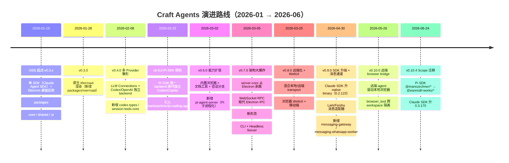
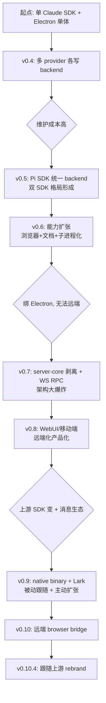

# 系统演进历史

## 这一节解决什么问题

Craft Agents 的当前代码里埋着大量"历史化石"：`claudeCliPath` 字段名指向的不再是 CLI 而是 native binary；`backend/` 下同时存在 `claude/` 与 `pi/` 两套驱动；依赖锁定从 `^` 全线退化为精确版本号；某些目录（`messaging-whatsapp-worker`、`pi-agent-server`）以独立子进程形态存在却共用一套协议。仅凭当前代码倒推，会把它们误读为"一开始就这么设计"。

本节基于真实 git commit 与每个版本附带的 release notes（`apps/electron/resources/release-notes/*.md`，远比 commit message 详细），还原这个项目从 **2026-01-19 单 SDK 桌面应用** 到 **2026-06-24 多后端、多形态、多通道远端 Agent 平台**的真实演进路线，区分"commit/release notes 显式说明"与"从 diff 顺序推断"。

> **仓库现状**：总共 95 个提交，OSS 起点 `0fe831b`（2026-01-19），当前 HEAD `fe5acd4`。无 git tag，版本号写在 commit message 中（如 `fd76c9d v0.2.30`）。**11 个提交（11.6%）是 `Sync from internal repository`**——这是内部闭源仓库向 OSS 镜像同步的快照提交，单次同步可达 1.1 万行改动（`011e75e`），意味着 OSS 仓库的提交粒度远粗于真实开发粒度，**不能用 commit 数衡量开发节奏**。

## 演进路线总览

| 阶段 | commit 范围 | 核心变化 | 解决的问题 | 演进原因 |
|------|-------------|----------|------------|----------|
| OSS 起点 | `0fe831b` - `fd76c9d` | 单 Claude SDK + Electron 单体 | 建立开源基线 | 内部产品开源（craft.do） |
| Mermaid | `4368205` (v0.3.0) | 原生 Mermaid SVG 渲染 | AI 生成图表无法可视化 | 自研 `beautiful-mermaid` 引擎 |
| 多 Provider 雏形 | `36a5c9d` (v0.4.0) | LLM Connections + Codex 独立 backend | 只能连 Claude | 用户要接 OpenAI |
| **Pi SDK 转折** | `8e4104d` (v0.5.0) | Pi SDK 统一 backend 取代 Codex/Copilot | 多 provider 各写一套 backend | 用 Pi SDK 做统一多模型抽象 |
| 能力扩张 | `9e0b8fb` (v0.6.0) | 内置浏览器 + 文档工具 + 分支 | Agent 无法"行动" | 从问答升级到端到端自动化 |
| **架构大爆炸** | `24ab785` (v0.7.0) | server-core 剥离 + WS RPC + CLI/Headless | 强绑 Electron，无法远端/无头 | 让 Agent 逻辑可复用、可远端部署 |
| 远端化 | `6ba3719` (v0.8.0) | 混合 transport + WebUI + 移动端 | 只有桌面客户端 | 浏览器/手机也能用 |
| **SDK 升级 + 消息** | `acb0884` (v0.9.0) | Claude native binary + Lark/Feishu | SDK 旧 CLI 形态；只能 Telegram/WhatsApp | 跟随上游 SDK；扩展消息生态 |
| 远端 browser | `215910d` (v0.10.0) | 远端 agent 桥接本地浏览器 | 远端 agent 无 GUI 可驱动 | 远端会话也能用浏览器工具 |
| Scope 迁移 | `556c59a` (v0.10.4) | Pi SDK 换 scope + Claude 0.3.x | 上游 Pi scope 冻结 | 跟随上游 rebrand |

---

## 阶段拆解

### 阶段 0：OSS 起点（v0.2.x，2026-01-19 ~ 2026-01-26）

**历史证据**：
- 首个提交 `0fe831b`（2026-01-19）`Sync from internal repository`，无 parent，是 OSS 仓库起点。
- `0fe831b:package.json`：`"name": "craft-agent"`（**单数**）、`"version": "0.2.19"`、`"description": "Claude Code-like agent for Craft documents"`、`"@anthropic-ai/claude-agent-sdk": ">=0.1.0"`。
- `0fe831b:README.md`：「A powerful AI assistant desktop app built on the Anthropic Claude Agent SDK.」
- 模块边界：`packages/{core,shared,ui}` + `apps/{electron,viewer}`。
- `fd76c9d`（v0.2.30）：SDK 锁到 `>=0.2.19`，根 package.json 升到 `0.2.29`。

**当时的系统形态**：单 SDK（Claude Agent SDK）、单形态（Electron 桌面应用）。`viewer` 是"上传/分享会话记录的 Web 查看器"，属于配套工具而非核心 Agent。核心逻辑在 `packages/core`，UI 在 `packages/ui` + `apps/electron`，跨端共享类型在 `packages/shared`。IPC 走 Electron 原生 IPC。

**暴露的问题**：强依赖单一 LLM 厂商（Anthropic）；强绑定 Electron 运行时；无法在服务器/CI 无头运行。

**引入的变化**：奠定了 monorepo（`packages/*` + `apps/*`）骨架与 `core/shared/ui` 三层切分——这个骨架一直延续至今。

**为什么这样演进**：这是内部产品（craft.do 的 Craft Agents 桌面版）的开源起点，commit message 全是 `Sync from internal repository`，表明 OSS 仓库是内部仓库的镜像。

**留下的影响**：`packages/{core,shared,ui}` 三件套是后续所有扩张的"地基"；Electron 中心化的早期设计在 v0.7.0 才被打破，但 `apps/electron` 至今仍是功能最全的形态。

---

### 阶段 1：Mermaid 渲染（v0.3.0，2026-01-28）

**历史证据**：`4368205` (v0.3.0)，release notes `0.3.0.md`：「Beautiful Diagrams — Render Mermaid diagrams as beautiful SVGs」，自研开源引擎 `beautiful-mermaid`。新增 `packages/mermaid`。此版本 diff 高达 318 文件 / 3.2 万行（含依赖与生成产物）。

**引入的变化**：把 Mermaid 代码块渲染为原生 SVG，支持全屏预览、缩放、主题。这是首个"体验增强型"能力，与 Agent 内核无关。

**留下的影响**：`packages/mermaid` 作为独立包存在；后续 `mermaid_validate` 工具与渲染器共用同一解析配置（见 v0.9.0 release notes 的对齐修复）。

---

### 阶段 2：多 Provider 雏形（v0.4.0，2026-02-08）

**历史证据**：`36a5c9d` (v0.4.0)，release notes `0.4.0.md`：「LLM Connections (Multiple Providers)」+「Codex / OpenAI Support」。新增 `packages/codex-types`、`packages/session-tools-core`。此版本 diff 极大：758 文件 / 10 万行。

**当时的系统形态**：用户可添加多个 LLM 连接（Anthropic、OpenRouter、Codex/OpenAI），会话首条消息后锁定连接。**此时 Codex/Copilot 是独立的 backend 实现**（`codex-types` 即其类型定义）。

**暴露的问题**：每个非 Anthropic provider 都要单独实现一套 backend，重复且易漂移。

**为什么这样演进（推断）**：v0.4.0 的"独立 backend"路线只活了一个版本，v0.5.0 立刻被 Pi SDK 统一取代——说明多 provider 抽象自己造轮子成本太高。

**留下的影响**：`session-tools-core` 包延续至今（工具定义跨 backend 共享）；`codex-types` 后来被 Pi SDK 路线吸收。

---

### 阶段 3：Pi SDK 转折（v0.5.0，2026-02-25）⭐

**历史证据**：
- `8e4104d` (v0.5.0)，根 `package.json` 首次出现 `"@mariozechner/pi-coding-agent": "^0.53.0"`。
- release notes `0.5.0.md` **Breaking Changes** 明确：「The standalone Codex and Copilot backends have been replaced by a unified **Pi SDK backend**.」同时「Removed Claude OAuth via Pi ... for Anthropic ToS compliance.」
- 此版本引入 Codex/ChatGPT Plus、GitHub Copilot、Google AI Studio、OpenRouter/Ollama 等多 provider。
- 新增 `packages/session-mcp-server`（MCP 工具代理给非 Anthropic backend）。

**当时的系统形态**：从此系统里有**两个 Agent SDK**——Claude Agent SDK（Anthropic 原生）与 Pi SDK（多 provider 统一抽象）。今天代码里的 `packages/shared/src/agent/backend/{claude,pi}/` 双驱动结构就此诞生。

**引入的变化**：
- 用 Pi SDK 统一承载所有非 Anthropic provider（OpenAI、Copilot、Gemini、OpenRouter、Ollama…）。
- MCP sources 通过 `session-mcp-server` 代理给非 Anthropic backend，保证工具跨 provider 可用。

**为什么这样演进**：release notes 直接说明——独立 Codex/Copilot backend 重复且难维护，Pi SDK 提供了现成的多模型抽象。同时为遵守 Anthropic ToS，移除了"通过 Pi 用 Claude 订阅"的灰色路径。

**留下的影响（关键化石）**：
- **双 SDK 并存**：`backend/claude/` 与 `backend/pi/` 两套驱动，由 `backend/factory.ts` 派发。这是后续所有"两套实现要同步"维护负担的源头（见 v0.6.0「Aligned tool listing across all backends to prevent drift」、v0.9.2「Pi backend silently dropped the Craft system prompt … Anthropic backend was unaffected」）。
- **Pi scope 化石**：`@mariozechner/*` 依赖从此埋下，直到 v0.10.4 才迁移。

---

### 阶段 4：能力扩张（v0.6.0，2026-03-02）

**历史证据**：`9e0b8fb` (v0.6.0)，release notes `0.6.0.md`：「Built-in Browser」「Document Tools」「Branching & Multi-Panel」。新增 `packages/pi-agent-server`（`@craft-agent/pi-agent-server`：「Out-of-process Pi agent server communicating via JSONL over stdio」）。diff 3.9 万行/567 文件，但删除也近 3.7 万行——大重构。

**引入的变化**：
- 内置浏览器（Agent 可浏览/填表/截图，无需扩展）。
- 文档工具集（markitdown/pdf/xlsx/docx/pptx/img/doc-diff/ical，免 Python 依赖）。
- 会话分支（fork 对话探索不同路径）+ 多面板布局。
- **Pi 子进程化**：`pi-agent-server` 作为独立 stdio JSONL 子进程运行——为后续 server-core 剥离埋下伏笔（Agent 内核可脱离 Electron 进程）。

**为什么这样演进**：release notes 明确目标是"end-to-end automation"——从"问答"升级到"行动"（填表单、提交报告、多步工作流）。

**留下的影响**：浏览器能力后来成为 v0.10.0「远端 browser bridge」的基础；`pi-agent-server` 的子进程模式验证了"Agent 逻辑可独立进程化"，直接支撑了 v0.7.0 的 server-core 剥离。

---

### 阶段 5：架构大爆炸（v0.7.0，2026-03-05）⭐⭐

**历史证据**：`24ab785` (v0.7.0)，release notes `0.7.0.md` 标题即「Craft CLI, Headless Server & **Architecture Overhaul**」。新增 `packages/{server-core,server,pi-agent-server}` + `apps/cli`。diff 392 文件 / 3.4 万行。

release notes **Transport & Architecture** 段落明确：
- 「WebSocket-only RPC — replaced Electron IPC with WebSocket RPC for all communication, enabling remote operation」
- 「Server-core extraction — 14 core handlers, session management, services, and domain utilities extracted into `@craft-agent/server-core` for reuse across Electron and headless」
- 「Protocol formalization — channels, DTOs, and event maps extracted to `@craft-agent/shared/protocol` with wire-format stability tests」

**暴露的问题**：Agent 逻辑与 Electron 进程强耦合（Electron IPC），无法在服务器/CI/远端无头运行；UI、传输、内核三层混在一起。

**引入的变化**：
- **server-core 剥离**：14 个核心 handler + session 管理 + 服务层抽到独立包，可被 Electron 与 headless 共用。
- **WebSocket RPC 取代 Electron IPC**：所有通信走 WS，这是"可远端"的物理基础。
- **协议形式化**：channels/DTO/event map 落到 `shared/protocol`，并有 wire-format 稳定性测试。
- **新形态**：`apps/cli`（`craft-cli run`，终端跑 Agent）+ Headless Server（独立 Bun 服务器，无需 Electron，支持 TLS）。

**为什么这样演进**：release notes 原文——「the foundation that makes CLI, headless server, and future remote/mobile clients possible. The architecture is now cleanly split between reusable server-core logic and platform-specific shells (Electron, Bun server, CLI).」

**留下的影响（最重要的架构遗产）**：
- 三形态（Electron / Headless Server / CLI）共用 server-core 的格局延续至今。
- `shared/protocol` 成为跨形态契约层（专题 03 的核心）。
- Electron 从"唯一宿主"降级为"多种 shell 之一"，但仍是功能最全的（如本地浏览器 pane）。

---

### 阶段 6：远端化 + WebUI（v0.8.0，2026-03-25）

**历史证据**：`6ba3719` (v0.8.0)，release notes `0.8.0.md`：「Hybrid Transport, WebUI & Mobile」。新增 `apps/webui`。根 `package.json`：Claude SDK `^0.2.78`、新增 `@mariozechner/pi-ai`（Pi 拆出 AI 子包）、Pi coding-agent 升 `^0.56.3`。

**引入的变化**：
- 混合本地/远端 transport（统一 workspace 连接态、健康检查、CloudOff 指示器、跨服务器会话转移）。
- 多远端 workspace 选择器。
- **WebUI**：headless server 在同端口提供完整 Web UI，浏览器登录即可建会话/管 workspace/走 OAuth——无需桌面应用。
- 移动端 WebUI（触控放大、iOS Safari 防缩放、container query 响应式）。
- 会话导出/导入（Send to Workspace）。

**为什么这样演进**：v0.7.0 打通了"可远端"的管道，v0.8.0 把远端做成可用的产品形态（浏览器/手机）。

**留下的影响**：`apps/webui` 成为第三种客户端 shell；"Send to Workspace"在 v0.9.2 暴露了跨机器 cwd 问题（见化石段）。

---

### 阶段 7：SDK 升级 + 消息通道（v0.9.0，2026-04-30）⭐⭐

**历史证据**：`acb0884` (v0.9.0)，release notes `0.9.0.md`：「Claude Agent SDK runtime uplift, Lark / Feishu messaging, Telegram supergroup topics」。新增 `packages/{messaging-gateway,messaging-whatsapp-worker}`。根 `package.json`：Claude SDK 从 `^0.2.78` **改为精确锁定 `0.2.123`**；Pi 升 `^0.70.2`。

release notes 明确：
- 「Claude Agent SDK uplifted to the native-binary distribution (0.2.123) — SDK 0.2.113 split the package into a thin core plus a per-platform optional dependency carrying the native `claude` binary. … Bundle size grows ~210 MB per platform — intrinsic to the new SDK packaging model.」
- 「Lark / Feishu messaging adapter (Phase 1 + Phase 2) — A third messaging platform alongside Telegram and WhatsApp.」

**暴露的问题**：
- Claude SDK 上游在 0.2.113 把分发模型从 `cli.js` 脚本改为 per-platform native binary，旧路径全部失效。
- 消息通道只有 Telegram/WhatsApp，缺企业 IM（Lark/Feishu）。

**引入的变化**：
- **Claude native binary 适配**：通过 build-script 别名 `@anthropic-ai/claude-agent-sdk-binary/claude` 解析 binary，dev 模式回退 per-arch 包；`electron-builder.yml` 把 thin core + binary alias + `@vscode/ripgrep` 作为 extraResources 打包；bundle 膨胀 ~210MB/平台。
- **Lark/Feishu 适配器**：第三条消息通道，长连接 WebSocket transport（无需公网 webhook），支持交互卡片（plan accept / Allow / Deny 按钮）、双向图文附件、Markdown。
- **bunfig.toml 锁 `hoisted` linker**：Bun 1.3 默认改 `isolated`，但 Vite+esbuild 依赖 hoisted 布局。

**为什么这样演进**：跟随上游 SDK 分发模型变更（被动）；扩展企业消息生态（主动）。

**留下的影响（核心化石）**：
- **`claudeCliPath` 命名化石**：`runtime-resolver.ts` 注释明确——「Field is named `claudeCliPath` for back-compat — semantically it is the SDK executable, JS or native.」字段名保留了 CLI 时代，实际指向 native binary。
- **`--preload` 失效化石**：同文件注释——「the new native SDK binary doesn't accept `--preload`」，interceptor 只剩 Pi subprocess 用，Claude 不再用。
- **精确版本锁定化石**：Claude SDK 从 `^0.2.x` 退化为 `0.2.123` 精确锁定，标志 SDK 升级频繁冲突，无法信任 caret。
- **bundle 体积**：+210MB/平台成为永久成本。

---

### 阶段 8：远端 browser bridge（v0.10.0，2026-05-26）

**历史证据**：`215910d` (v0.10.0)，release notes `0.10.0.md`：「Remote `browser_tool` bridging, per-workspace browser tab isolation」。Pi SDK 精确锁 `0.73.1`。

**引入的变化**：
- 远端 workspace（headless/docker/WebUI）上的 agent 可端到端驱动用户**本地** Electron 浏览器——新增 `client:browser:invoke` WS 能力（server 反向 invoke client），`server-core` 新增 `RemoteBrowserPaneManager`。
- 浏览器 tab 按 workspace 隔离（`BrowserInstance` 带 `workspaceId`）。
- 一系列跨 workspace 窗口劫持/复用安全修复（release notes 列了 5+ 个相关 bugfix）。

**为什么这样演进**：远端 agent 缺 GUI，无法用浏览器工具；通过桥接把本地浏览器能力"借"给远端会话。

**留下的影响**：`browser_tool` 现在有"本地直驱"和"远端桥接"两条路径，能力声明（`hasClientCapability`/`findClientsWithCapability`）成为 transport 层的常驻机制。

---

### 阶段 9：Scope 迁移（v0.10.4，2026-06-24）

**历史证据**：`556c59a` (v0.10.4)，release notes `0.10.4.md`：「Pi SDK uplifted to 0.79.9 (scope migration to `@earendil-works`)」。根 `package.json`：Pi 三包（`pi-ai`/`pi-coding-agent`/`pi-agent-core`）从 `@mariozechner/*`(0.73.1) 迁到 `@earendil-works/*`(0.79.9)；Claude SDK 升 `0.3.170`；新增 `@anthropic-ai/sdk ^0.100.0`。

release notes 明确：「the three Pi packages move from the now-frozen `@mariozechner/*` scope at 0.73.1 to the rebranded `@earendil-works/*` scope at 0.79.9, across all manifests and the lockfile.」

**引入的变化**：跟随上游 Pi SDK rebrand 换 scope；GLM-5 家族（z.ai）随 models.dev 目录自动可用；启动时自动备份 `config.json`（保留最近 3 份）。

**留下的影响**：`@mariozechner/*` scope 在代码里应已清零（迁移声明"across all manifests and the lockfile"），但 v0.5.0~v0.10.0 长达 4 个月的 `@mariozechner/*` 依赖历史是 SDK 供应商 rebrand 风险的真实案例。

---

## 关键转折点

| 转折点 | 之前的设计 | 之后的设计 | 转向原因（证据） | 当前影响 |
|--------|------------|------------|------------------|----------|
| **Pi SDK 统一 backend**（v0.5.0） | 每个 provider 独立 backend（Codex/Copilot 各一套） | Pi SDK 作为统一多 provider backend，与 Claude SDK 并存 | release notes Breaking Changes：独立 backend 被统一 Pi backend 取代 | 双 SDK 并存，`backend/{claude,pi}` 需持续同步防漂移 |
| **server-core 剥离**（v0.7.0） | Agent 逻辑绑 Electron + Electron IPC | server-core 独立包 + WebSocket RPC + CLI/Headless shell | release notes：为 CLI/headless/remote 复用内核 | 三形态格局；`shared/protocol` 成跨形态契约 |
| **Claude native binary**（v0.9.0） | SDK 是 `cli.js` 脚本，可 `--preload` | per-platform native binary，不支持 `--preload` | release notes：上游 SDK 0.2.113 改分发模型 | `claudeCliPath` 命名化石；bundle +210MB；精确版本锁定 |
| **远端 browser bridge**（v0.10.0） | 浏览器工具只在本地 Electron 可用 | server 反向 invoke client，远端 agent 驱动本地浏览器 | release notes：远端 agent 缺 GUI | `browser_tool` 双路径；capability 路由常驻 |
| **Pi scope 迁移**（v0.10.4） | `@mariozechner/*`（frozen 0.73.1） | `@earendil-works/*`（0.79.9） | release notes：上游 Pi SDK rebrand | 依赖供应商 rebrand 风险案例 |

## 演进思路总结

**主线判断**：Craft Agents 的演进是「**生态适配**」驱动的——每一次大转折几乎都是对外部约束的响应：多 provider 需求催生 Pi SDK（v0.5）、远端/无头需求催生 server-core 剥离（v0.7）、上游 SDK 分发模型变更催生 native binary 化石（v0.9）、上游 rebrand 催生 scope 迁移（v0.10.4）。功能扩展（浏览器、文档工具、消息通道）是顺势叠加，而非演进主驱动。维护性治理（v0.7 协议形式化、v0.9 linker 锁定、版本精确化）是被复杂度倒逼的被动补强。系统最大的长期包袱是**双 SDK 并存**带来的同步成本，这在多个 release notes（"prevent drift"、"Anthropic backend was unaffected"）中反复显形。

## 事实与推断边界

**明确事实（commit / release notes 直接证明）**：
- OSS 起点为单 Claude SDK + Electron，`craft-agent` 单数命名（`0fe831b:package.json`）。
- v0.5.0 Pi SDK 取代独立 Codex/Copilot backend（`0.5.0.md` Breaking Changes）。
- v0.7.0 server-core 剥离 + WS RPC 取代 Electron IPC（`0.7.0.md` Transport & Architecture）。
- v0.9.0 Claude SDK 升 native binary 0.2.123（SDK 0.2.113 分发模型变更），新增 Lark/Feishu（`0.9.0.md`）。
- v0.10.4 Pi scope `@mariozechner/*` → `@earendil-works/*`（`0.10.4.md`）。
- Claude SDK 版本线：`>=0.1.0` → `>=0.2.19` → `^0.2.37` → `^0.2.78` → `0.2.123` → `0.3.170`（各版本根 package.json）。
- 11/95 提交为 `Sync from internal repository`，单次最高 1.1 万行（`011e75e`）。
- `claudeCliPath` 命名保留 CLI 时代、native binary 不支持 `--preload`（`runtime-resolver.ts` 注释）。

**合理推断（基于 diff 顺序/代码结构）**：
- v0.4.0 的"独立 Codex backend"路线只活一个版本就被 Pi SDK 取代，推断为多 provider 抽象自造成本过高（release notes 未直述动机，仅 Breaking Changes 说明替换事实）。
- `pi-agent-server` 的子进程化（v0.6）为 v0.7 server-core 剥离做了技术验证（时间相邻 + 都是"Agent 逻辑可脱 Electron 进程"主题）。
- Claude SDK 从 caret 退化为精确锁定，推断为 SDK 升级频繁冲突（无直接 commit 说明，但版本字符串变化是硬证据）。

**仍不确定**：
- 内部闭源仓库的真实开发节奏与分支策略（OSS 仓库只有 Sync 快照）。
- v0.2.x 之前（`0.2.19` 以下）的内部形态——`0fe831b` 已是 `0.2.19`，更早历史不在 OSS 仓库。
- Pi SDK 与 Claude SDK 的长期战略关系（是否会收敛为单 SDK）——需作者/路线图确认。
- `viewer` app 的产品定位演变（起点就有，但 release notes 几乎未提）。
