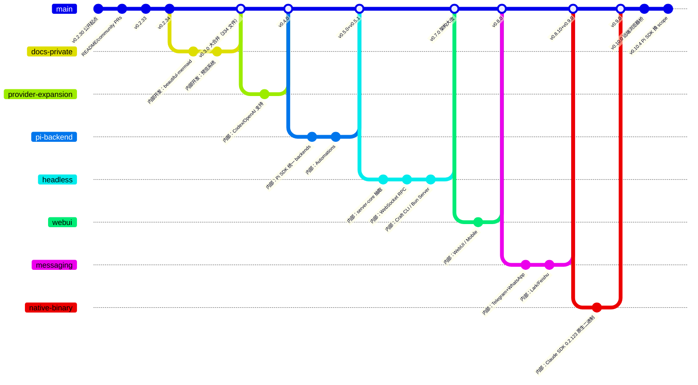

# 演化历史

Craft Agents OSS 从 2026 年 1 月首次开源（v0.2.30）到 2026 年 6 月当前版本（v0.10.4），共发布 **65 个公开版本**。本报告基于 `apps/electron/resources/release-notes/` 与 git 历史，复盘其演化主线。注意：仓库中有大量 `Sync from internal repository` 提交，说明项目长期采用"内部仓库 → OSS 镜像"的双仓模式，git diff 是阶段性 sync，单次 commit 粒度不能完全还原开发节奏，因此**证据以 release notes 为主、commit hash 为辅**。

---

## 总体演化时间线

```mermaid
timeline
    title Craft Agents OSS 版本演化主线（2026-01 ~ 2026-06）
    section 单后端时代（仅 Claude）
        2026-01 : v0.2.30 : 公开起点
                 : Electron 桌面壳
                 : Claude OAuth 单一后端
                 : Skills 三层（global/workspace/project）
                 : Sources 早期形态（MCP/API/local）
        2026-01 : v0.3.0 : beautiful-mermaid 原生渲染
                 : 统一预览系统（PDF/Image/Code）
        2026-02 : v0.3.5 : Opus 4.6 + electron-updater 6.8
    section 第二个后端（Codex）与多 Provider 萌芽
        2026-02 : v0.4.0 : 多 LLM Connection
                 : Codex/OpenAI 首次接入
                 : 每个 workspace 默认 Connection/Theme
        2026-02 : v0.4.2~0.4.6 : 事件适配器层（BaseEventAdapter）
                 : HTML/PDF 内联预览块
                 : TodoState → SessionStatus 重命名
    section Pi SDK 统一 & 任意 LLM Provider
        2026-02 : v0.5.0 : Pi SDK 后端统一接管 Codex/Copilot
                 : ChatGPT Plus / GitHub Copilot / Gemini / Ollama / OpenRouter
                 : Web-fetch 安全加固（SSRF）
                 : 探索模式 find -exec 封堵
        2026-02 : v0.5.1 : Automations（hooks.json → automations.json）
                 : 计划性配置 v2、移除自动迁移
        2026-03 : v0.6.0 : 内置浏览器（BrowserPaneManager）
                 : 文档工具集（markitdown/pdf/xlsx/docx/...）
                 : Session 分支与多面板
    section 远端化架构（CLI / Headless Server / server-core）
        2026-03 : v0.7.0 : Craft CLI（craft-cli run）
                 : Headless Bun Server（无 Electron）
                 : WebSocket RPC 替换 Electron IPC
                 : 抽出 @craft-agent/server-core、@craft-agent/shared/protocol
                 : 强制 wss://（TLS）
        2026-03 : v0.7.5 : Network Proxy（undici ProxyAgent）
                 : Webhook automations
        2026-03 : v0.7.8 : Amazon Bedrock（IAM）、1M 上下文
    section WebUI & 移动 & 供应链加固
        2026-03 : v0.8.0 : 混合本地/远端传输层
                 : 浏览器访问的 WebUI（同端口）
                 : 移动端 WebUI（container queries）
                 : trustedDependencies 白名单 + frozen-lockfile
        2026-04 : v0.8.10 : Messaging Gateway
                 : Telegram + WhatsApp（Baileys 子进程）
                 : Opus 4.6 回归为可选项
                 : xhigh 思考档位
        2026-04 : v0.8.12 : GPT-5.5 默认 / DeepSeek
                 : Pi SDK 0.70.0 工具注册回归修复
                 : Claude Agent SDK 回退到 0.2.111（避免 0.2.113 原生二进制破坏）
        2026-04 : v0.8.13 : 自动化 prompt action 可设 thinkingLevel
                 : OpenAI-compatible tool-call 流式重组（DeepSeek）
    section 原生二进制迁移 & 第三个通讯平台
        2026-04 : v0.9.0 : Claude Agent SDK 0.2.123 原生二进制
                 : 包体 +210MB/平台
                 : Lark / Feishu 通讯平台
                 : Telegram supergroup topic 路由
        2026-04~05 : v0.9.1~v0.9.6 : 远端浏览器桥修复
                 : 1M context opt-in
                 : API source 中途刷凭据
                 : 多窗口标题/状态恢复
    section 远端浏览器桥 & Pi SDK 换 scope
        2026-05 : v0.10.0 : 远端 browser_tool 桥接到本地 Electron
                 : 浏览器 tab 按 workspace 隔离
                 : source_test 修复 basic-auth base64
        2026-06 : v0.10.4 : Pi SDK 从 @mariozechner/* 迁移到 @earendil-works/*
                 : GLM-5.x on z.ai
                 : config.json 启动备份
```

---

## 关键分支/合并演化（gitGraph）

仓库主线非常线性（无 release 分支），但有三条**并行演化的内部支线**通过 sync 提交合并入主线：

> 说明：上述分支仅用于可视化"内部仓库的并行支线"，在公开 git 历史里它们都是被 `Sync from internal repository` 折叠为单条主线的合并提交。

---

## v0.2.30 ~ v0.2.34 — 项目公开起点（2026-01）

- **时间**：2026-01-25（v0.2.30）~ 2026-01-26（v0.2.34）
- **代表性 commit**：`fd76c9d v0.2.30`、`7dc1910 v0.2.34`
- **What（这一阶段做了什么）**
  - 首批 OSS 公开发布版本，已经具备完整的 Electron 桌面壳、Skill 三层目录（global/workspace/project）、Source 系统（含 `authType: none/basic/oauth`）、JSONL 会话持久化、Icon Cache、CI/CD（2-step release）。
  - 默认仅 Claude 后端，并支持 Claude CLI/Desktop token 导入。
  - v0.2.32 引入"async queue 持久化"和"processing generation counter"，从源头解决并发写入竞态（见 release-notes/0.2.33.md 的 "Session Persistence" 段）。
- **Why（为什么这么做）**
  - v0.2.30 的 release notes 显式说明："Simplified OAuth Authentication — Craft Agent now **exclusively uses its own OAuth flow**"，证据是这条主线一上来就走自己的 OAuth relay，而不是依赖 Claude SDK 的 token，目的是为后续多 provider 留扩展点。
  - v0.2.33 的"Build System Modernization — Build scripts migrated from shell commands to TypeScript"，说明在 v0.2 时代就完成了一次构建系统从 shell → TS 的迁移，原因是"Windows compatibility"。
- **影响模块**
  - `apps/electron/src/main/sessions.ts`、`apps/electron/src/renderer/components/app-shell/AppShell.tsx`、`apps/electron/scripts/*`（TS 构建脚本）。
- **依赖关系**
  - 所有后续阶段都建立在这一阶段的 Skills/Sources/JSONL 三大基础件上。

---

## v0.3.0 — Mermaid 原生渲染与预览系统（2026-01-28）

- **时间**：2026-01-28
- **代表性 commit**：`4368205 v0.3.0`（334 文件变更、+38000 行）
- **What**
  - 引入 [beautiful-mermaid](https://github.com/lukilabs/beautiful-mermaid)，所有 Mermaid 代码块直接渲染为 SVG，点击进入 Figma 风格查看器（缩放/拖拽/键盘快捷键）。
  - 引入"统一预览系统"：PDF（pdf.js）、Image（png/jpg/gif/webp/svg/...）、Markdown、JSON 树视图，以及 Smart File Detection。
- **Why**
  - release notes 原文："Diagrams are essential for AI-assisted programming. Claude generates Mermaid diagrams constantly... Previously these were just code blocks. Now they're beautiful, professional visualizations."
  - 同时**移除 Gmail source**，原因是同期主线决定走"Google OAuth sources"通用机制（v0.3.2 进一步把"硬编码 Google OAuth 凭据"从构建里移除）。
- **影响模块**
  - 新增 `apps/electron/src/renderer/hooks/useLinkInterceptor.ts`（+244 行）、`apps/electron/src/main/thumbnail-protocol.ts`（+199 行）。
- **依赖关系**
  - 这个渲染基座为后续 v0.4.6 的 HTML/PDF 内联预览、v0.9.6 的 `markdown-preview` 块铺平了道路。

---

## v0.3.2 — 安全里程碑：路径穿越与 OAuth 元数据（2026-01-31）

- **代表性 commit**：`5562c85 v0.3.2`
- **What**
  - 修复 `STORE_ATTACHMENT` IPC handler 的**路径穿越漏洞**（CVE 级，issue #142，外部报告 @xeloxa）—— 恶意 sessionId 可逃逸出 workspace 写任意文件。
  - 实现 RFC 8414 progressive OAuth metadata discovery（修 Ahrefs MCP 等 URL 多段路径的服务器）。
  - 移除构建里 baked-in 的 Google OAuth 凭据，改由用户自带。
- **Why**
  - 这是仓库里**第一个被外部研究者报告并修复的高危漏洞**，直接奠定后续"凭据加密 + 服务端 OAuth relay + server-owned token"路线的必要性。

---

## v0.3.5 — Opus 4.6 与 auto-update 可靠性（2026-02-04）

- **代表性 commit**：`0737a93 v0.3.5`
- **What**
  - 加入 Claude Opus 4.6 模型（`claude-opus-4-6`）。
  - 升级 `electron-updater` 到 v6.8.0+，修复 macOS 下载进度事件不触发；删掉约 150 行 workaround。
  - 图片超 8000px 自动缩放而不是报错。
  - Husky pre-commit hook + 提取 Claude Code system prompts 做版本追踪。
- **影响模块**
  - 模型枚举层、auto-updater 集成层、image validation 层。

---

## v0.4.0 — 第二个后端：Codex/OpenAI 与多 Connection（2026-02-08）

- **时间**：2026-02-08
- **代表性 commit**：`36a5c9d v0.4.0`
- **What**
  - **首次引入第二个 LLM 后端**：Codex/OpenAI via OAuth。Anthropic 不再是唯一选择。
  - 多 LLM Connection 管理（Anthropic / OpenRouter / Codex），会话首条消息后锁定到该 Connection。
  - 每个 workspace 可设置默认 Connection 和默认 Theme。
- **Why**
  - release notes 标题就是 "Multi-connection AI setup"——这是从"单一 Claude 客户端"转向"通用 Agent 桌面"的关键一步，为 v0.5.0 的 Pi SDK 统一铺路。
- **依赖关系**
  - 直接催生了 v0.4.6 的 `BaseEventAdapter` 架构（处理多后端流式事件）。

---

## v0.4.6 — 事件适配器架构与内联预览块（2026-02-19）

- **代表性 commit**：`88f28c7 v0.4.6`
- **What**
  - 引入 `BaseEventAdapter` + 后端特定 adapter（Claude / Codex / Copilot）+ 新 `EventQueue` 有序派发。这是为"任意 LLM 后端"准备的**抽象层**。
  - `html-preview` / `pdf-preview` 代码块内联渲染。
  - Mustache 模板引擎 + SourceTemplates + `render_template` 工具（让 Source 输出 HTML 视图）。
  - **`TodoState` → `SessionStatus` 全局重命名**，覆盖 54+ 文件并保留向后兼容。
  - 动态 Codex 模型发现（30 分钟周期刷新）。
- **Why**
  - release notes："Extracted common streaming/event logic into `BaseEventAdapter`"——这是 v0.5.0 把 Codex/Copilot 全部交给 Pi SDK 之前的"自己实现多后端"尝试。
- **影响模块**
  - `packages/shared/.../event-adapters/*`（事件适配器层）、`packages/shared/.../render-template`、source templates。

---

## v0.5.0 — Pi SDK 统一接管所有非 Anthropic 后端（2026-02-25）

- **时间**：2026-02-25
- **代表性 commit**：`8e4104d v0.5.0`
- **What（最关键的转折点）**
  - **引入 Pi SDK**（`@mariozechner/pi-{coding-agent,agent-core,ai}`）作为统一中间层，接管所有非 Anthropic 后端。
  - 一次性接入 ChatGPT Plus / GitHub Copilot / Google AI Studio / OpenRouter / Ollama / 自定义 OpenAI 兼容端点。
  - **Breaking Change**："The standalone Codex and Copilot backends have been replaced by a unified Pi SDK backend. Existing Codex and Copilot connections will need to be re-configured."
  - **Breaking Change**：移除通过 Pi 后端使用 Claude 订阅（Anthropic ToS 合规）。
  - MCP sources 现在被代理到非 Anthropic 后端（之前只有 Claude 能用）。
- **Why**
  - release notes 标题 "Use Any LLM Provider"。引入 Pi SDK 的动机很清楚：自己写 N 个后端（v0.4.6 那套）维护成本太高，Pi SDK 已经统一了 OpenAI 系/Codex/Copilot 的协议差异。
  - 同时 release notes 列出了 Pi SDK 0.55.0 的关键修复（流式卡顿、OpenAI partial chunk JSON 损坏）—— 说明 Pi SDK 是**外部维护的依赖**，而不是项目内部代码。
- **影响模块**
  - 新增 `packages/pi-agent-server/`、`packages/server-core/.../pi-event-adapter`、`apps/electron/.../auth/pi/`。
- **依赖关系**
  - 从此 Claude SDK 和 Pi SDK 成为两条平行的 backend 主干（详见 v0.8.12 / v0.9.0 的 SDK 升级冲突）。

---

## v0.5.1 — Automations 系统（替代 hooks.json）（2026-02-27）

- **代表性 commit**：`7c5d9d4 v0.5.1`
- **What**
  - Automations（前身是 hooks/tasks）从手编 JSON 升级为完整管理 UI：侧栏、启用/禁用、复制/删除、执行历史、Test runner。
  - Prompt Action 可指定 `llmConnection` + `model`。
  - 配置文件从 `hooks.json` 迁移到 `automations.json`（version 2）。
- **Why（破坏性迁移的动机）**
  - release notes："Legacy `hooks.json` is no longer loaded — rename and update to continue using your existing automations. **There is no automatic migration.**"
  - 显式选择不做自动迁移，是因为 v2 schema 与 v1 差异太大，自动迁移失败率高于让用户重做。建议用户"用自然语言让 agent 帮你重建"。
- **影响模块**
  - `packages/server-core/.../automations/*`、`automations.json` schema。
- **依赖关系**
  - v0.7.5 在此基础上加入 webhook action；v0.8.13 加入 per-action thinkingLevel。

---

## v0.6.0 — 内置浏览器与文档工具集（2026-03-02）

- **代表性 commit**：`9e0b8fb v0.6.0`
- **What**
  - **内置浏览器**（`BrowserPaneManager`）：BrowserWindow 真实并行运行，agent 可导航/点击/截图/取数据/填表单/执行 JS。
  - **文档工具集**：markitdown（docx/xlsx/pptx/pdf/html/ipynb → md）、pdf-tool、xlsx-tool、docx-tool、pptx-tool、img-tool、doc-diff、ical-tool。无需 Python 依赖。
  - Session 分支（fork conversation）+ 多面板视图。
  - 自动把所有 Sonnet 4.5 迁移到 Sonnet 4.6。
- **Why**
  - release notes 解释："This unlocks true end-to-end automation. Connect any data source and let the agent act on it... The browser closes the gap between data and action."—— 即从"读"到"写"的闭环。
- **影响模块**
  - 新增 `packages/server-core/.../browser-pane-manager/`、`packages/session-tools-core/`（文档工具包）。
- **依赖关系**
  - 这套浏览器基础设施在 v0.10.0 被扩展为"远端 browser_tool 桥接到本地 Electron"。

---

## v0.7.0 — 架构大改：CLI / Headless Server / server-core（2026-03-05）

- **时间**：2026-03-05
- **代表性 commit**：`24ab785 v0.7.0`
- **What（最重要的架构里程碑）**
  - **Craft CLI**：`craft-cli run`，无 GUI 跑 agent，支持多 Connection、CI workspace、`--validate-server`。
  - **Headless Bun Server**：脱离 Electron 的独立服务器入口，TLS 支持、跨平台分发脚本、env var 配置。
  - **WebSocket RPC 替换 Electron IPC**：所有进程间通信改为 WebSocket，typed push events，**server-owned OAuth token management**。
  - **抽出 `@craft-agent/server-core`**：14 个核心 handler、session 管理、services、domain 工具，可在 Electron / Bun Server / CLI 三处复用。
  - **抽出 `@craft-agent/shared/protocol`**：channels、DTOs、event map，附带 wire-format 稳定性测试。
  - 强制远端 `wss://`（拒绝明文 `ws://`）。
- **Why**
  - release notes："This is the foundation that makes CLI, headless server, and future remote/mobile clients possible. The architecture is now cleanly split between reusable server-core logic and platform-specific shells."
  - 关键判断：把 OAuth token **从客户端迁到服务端**管理，是后续 v0.8.0 WebUI / 移动端 / docker 部署的必要前置——浏览器无法安全保存 OAuth refresh token。
- **影响模块**
  - 新增 `packages/server-core/`（14 个核心 handler + SessionManager + services）、`packages/shared/src/protocol/`、`apps/cli/`（craft-cli）、`apps/server/`（headless server）。
- **依赖关系**
  - 直接解锁 v0.8.0 的 WebUI 与移动端。

---

## v0.7.5 — Network Proxy & Webhook automations（2026-03-12）

- **代表性 commit**：`139c62d v0.7.5`
- **What**
  - **Network Proxy**：通过 undici ProxyAgent 路由流量，支持 NO_PROXY 规则，同时配置 Node 和 Electron 浏览器 session。
  - **Webhook Action**（automations）：HTTP webhook + 可配置 auth + form payload + response capture + replay + 指数退避重试。
  - Dismiss 工作目录历史项。
- **Why**
  - 企业部署的强制需求：内网/代理出口。Webhook 则是 automations 从"会话生成"扩展到"外部系统调用"。
- **影响模块**
  - `packages/server-core/.../proxy/*`、`packages/server-core/.../automations/webhook-action.ts`。

---

## v0.7.8 — Amazon Bedrock 与 1M 上下文（2026-03-18）

- **代表性 commit**：`7fbd727 v0.7.8`
- **What**
  - Amazon Bedrock provider：IAM 凭据、预注册 provider 模块避免打包动态 import 失败、scoped subprocess env vars、强制 HTTP/1.1（Bun/Electron 兼容）。
  - Opus 4.6 / Sonnet 4.6 启用 1M token 上下文窗口。
  - **Automation history 上限**：每 automation 20 条、全局 1000 条，带 runtime compaction—— 防止无限增长（issue #439）。
  - 引入 `history-store` 模块（compaction + periodic persistence + tests）。
- **Why**
  - Bedrock 是企业 AWS 客户的强需求；1M 上下文修复 issue #424；history cap 修复"长期运行 server 磁盘爆掉"的实际运维问题。
- **依赖关系**
  - 1M 上下文后续在 v0.8.10 因为 "Tier 1–3 用户 400 错误"被迫改为 opt-in（`enable1MContext` 默认 false）。

---

## v0.8.0 — WebUI、移动端、供应链加固（2026-03-25）

- **时间**：2026-03-25
- **代表性 commit**：`6ba3719 v0.8.0`
- **What**
  - **混合本地/远端传输层**：thin client 与 hybrid mode 行为一致；workspace 切换器打开时健康检查；`CloudOff` 指示器；跨 server 会话转移（`invokeOnServer` + resume-first）。
  - **浏览器可达 WebUI**：headless server 在同端口提供完整 Web UI，用 server token 登录即可创建 session / 管理 workspace / OAuth Claude 和 Copilot。**桌面 App 不再是必需品**。
  - **移动端 WebUI**：120% 默认缩放、1.3× 触摸目标、iOS Safari 自动缩放防护、container queries 响应式重写。
  - Session export/import（workspace 间转移）。
  - **供应链安全**：`trustedDependencies` 白名单封堵未授权 install 脚本；`--frozen-lockfile` 在所有 CI workflow 强制。
- **Why**
  - release notes 用 `Partially addresses #419` 暗示这是社区反复要求的"mobile/desktop-less"形态。供应链加固是对 npm 生态供应链攻击频发的直接回应。
- **影响模块**
  - 新增 `apps/webui/`（独立包）、`packages/server-core/.../transport/*`（hybrid transport）。

---

## v0.8.10 — Messaging Gateway（Telegram + WhatsApp）（2026-04-21）

- **代表性 commit**：`6194bf5 v0.8.10`
- **What**
  - **Messaging Gateway**：workspace-scoped 网关，把外部 chat（Telegram DM / WhatsApp 联系人）绑定到 Craft Agent session。入站消息驱动 agent，agent 输出渲染回 chat。
  - 三种响应模式：`progress`（默认，单气泡演进）/ `streaming`（实时编辑）/ `final_only`（完成前沉默）。
  - Telegram 支持照片/文档/语音/视频/音频附件（20MB 上限）。
  - WhatsApp 跑在 Baileys 子进程 worker，与主进程全局状态隔离。
  - Opus 4.6 重新作为可选模型（v0.8.x 前被 4.7 替换）。
  - 新增 `xhigh` 思考档位（介于 `high` 与 `max`）。
- **Why**
  - release notes 把它列为"New workspace-scoped gateway"—— 即把 Craft Agent 从"桌面/浏览器"扩展到"IM 客户端"，覆盖移动场景。
  - WhatsApp 用子进程隔离是因为 Baileys 库有大量全局状态、容易污染主进程。
- **影响模块**
  - 新增 `packages/server-core/.../messaging-gateway/`、`packages/messaging-worker-whatsapp/`。
- **依赖关系**
  - v0.9.0 在此基础上加 Lark/Feishu（第三个平台）；v0.9.5 修复 progress/final_only 模式的 fallback 行为。

---

## v0.8.12 — Claude SDK 0.2.113 的原生二进制破坏 & 回退（2026-04-28）

- **代表性 commit**：`d9c585b v0.8.12`
- **What（关键转折）**
  - **Claude Agent SDK 强制回退到 0.2.111**（精确版本）。
  - 原因：0.2.113 开始，Anthropic 把 SDK 从 JS `cli.js` 入口**换成按平台/架构打包的原生二进制**（`@anthropic-ai/claude-agent-sdk-{platform}-{arch}`）。
  - Craft Agent 当时的运行时 resolver、构建脚本、CI verify-bundles 步骤、基于 `--preload` 的统一网络拦截器（`packages/shared/src/unified-network-interceptor.ts`）都**假设 `cli.js` 存在**，原生二进制直接打破这套假设。
  - 同时把 peer-dep 范围从 `^0.2.19` / `>=0.2.19` 收紧到精确 `0.2.111`，防止下次破坏被当作 patch bump 静默溜进来。
  - 同版本还把 Pi SDK uplift 到 0.70.2，并修了一连串 0.70.0 引入的工具注册回归（`tools: AgentTool[]` → `tools: string[]` 名字 allowlist）。
- **Why（破坏性影响为什么这么大）**
  - release notes 原文："Starting at 0.2.113 the SDK replaced its JS `cli.js` entry point with platform-scoped native binaries... which our runtime resolver, build scripts, CI verify-bundles steps, and `--preload`-based unified network interceptor all assume does not exist."
  - 这是 Claude Agent SDK 自身的 breaking change，Craft Agent 必须先重构**整个工具链和拦截器**才能升级。
- **依赖关系**
  - 直接催生 v0.9.0 的完整原生二进制迁移工程（bundle size +210MB）。

---

## v0.9.0 — Claude SDK 原生二进制迁移 & Lark/Feishu（2026-04-30）

- **时间**：2026-04-30
- **代表性 commit**：`acb0884 v0.9.0`
- **What（两个大工程同时落地）**
  1. **Claude Agent SDK 升级到 0.2.123（原生二进制）**
     - 通过构建脚本别名 `@anthropic-ai/claude-agent-sdk-binary/claude` 解析二进制，dev 模式有 per-arch 包 fallback。
     - ripgrep 从 SDK 自带 vendor 拷贝迁到顶层 `@vscode/ripgrep`。
     - `electron-builder.yml` 把 thin core、binary alias、ripgrep 都作为 extraResources 打到 macOS / Linux / Windows；构建脚本在 host arch 不同时通过 `npm pack` 跨架构抓取二进制包。
     - **包体增长约 210MB / 平台**——原生二进制本身的代价。
  2. **Lark / Feishu 通讯适配器（Phase 1+2）**
     - 第三个 messaging 平台，长连接 WebSocket 传输，无需公网 webhook URL。
     - Phase 1：DM 文本进出、@提及、session pairing。
     - Phase 2：实时消息编辑、交互式卡片（schema 2.0，最多 10 按钮、30 字标签）、双向图片/文件附件、Markdown 渲染。
  3. **Telegram supergroup topic 路由**：pairing 要求 `chat.type === 'supergroup' && is_forum === true`；automations matcher 可加 `telegramTopic` 字段。
- **Why**
  - 原生二进制迁移是 v0.8.12 留下的债；Lark/Feishu 是亚太市场（尤其中国）的强需求（issues #583/#639/#584）。
  - 同时为了配合 Bun 1.3 默认 linker 从 `isolated` 改 `hoisted`，在 `bunfig.toml` 里固化（Vite + esbuild 在 hoisted layout 下才能正常打包）。
- **影响模块**
  - `packages/shared/src/unified-network-interceptor.ts`（重写）、`apps/electron/scripts/.../claude-sdk-binary.ts`（新构建脚本）、`packages/server-core/.../messaging/lark/`。

---

## v0.9.1 ~ v0.9.6 — 远端化补丁与凭据刷新（2026-05）

- **代表性 commit**：`b31904c v0.9.1`、`c310624 v0.9.3`、`96454c2 v0.9.5`、`d0e674f v0.9.6`
- **What（精选关键修复）**
  - v0.9.6：**多窗口状态在 auto-update 后存活**——electron-updater（Squirrel.Mac）在 `quitAndInstall` 和 `before-quit` 之间销毁所有 BrowserWindow，旧代码用空快照覆写 `~/.craft-agent/window-state.json`。新 `setBeforeUpdateQuitHook` 在窗口还存在时保存。
  - v0.9.6：**API source 凭据中途刷新**——之前 bearer/header/query/basic 在工具创建时把凭据固化为静态字符串，token 刷新后 in-process 工具仍发旧值（401 直到重启）。改为每次调用从 vault 读取（与 OAuth / renew-endpoint 路径对齐）。
  - v0.9.6：**DANGEROUS_SCHEMES 加 reason 解释**——`Map<scheme, reason>`，错误消息里告诉用户为什么这个 URL scheme 被拦截（如 `file:` 在 Windows 上能启动本地可执行）。
  - v0.9.6：**markdown-preview 块**——新增第 4 种内联预览块（继 html/pdf/image 之后）。
- **Why**
  - 这些都是远端化 + 多窗口 + 长会话场景下的"长期运行稳定性"问题，release notes 显示每个都有 issue 编号追踪。
- **依赖关系**
  - v0.9.6 的 `source_activated` auto-retry 迁到 SessionManager（之前在 Electron renderer）是 v0.10.0 远端浏览器桥的必要前置。

---

## v0.10.0 — 远端 browser_tool 桥接 & workspace 隔离（2026-05-26）

- **代表性 commit**：`215910d v0.10.0`
- **What**
  - **远端 agent 可以驱动本地 Electron 浏览器**：新增 `client:browser:invoke` WS capability（server 反向 invoke client），完整覆盖 BrowserPaneManager 接口。
  - 桥接带 per-method owner-key 授权、no-manual-window-reuse（防跨 workspace hijack）、session-scoped `listInstances`、screenshot `Buffer`↔`Uint8Array` 跨网线转换。
  - `uploadFile` 在桥上被禁用；`evaluate` 受本地 `allowRemoteEvaluate` 设置门控。
  - 新增 `RemoteBrowserPaneManager`（session-bound IBPM 实现）+ `SessionManager.getBrowserPaneManagerForSession`（capability-aware host-client fallback）。
  - **Browser tab 按 workspace 隔离**：每个 `BrowserInstance` + `BrowserInstanceInfo` DTO 带可空 `workspaceId`，`STATE_CHANGED` 按 workspace 路由（向后兼容 `{ to: 'all' }`）。
  - `source_test` 修复 basic-auth 凭据未 base64 编码（issue #824）。
- **Why**
  - release notes："Agents running on a remote workspace (headless server, docker, WebUI) can now drive the user's local desktop BrowserPaneManager end-to-end."—— 把"算力在云端、浏览器在本地"的混合形态跑通。
  - workspace 隔离修复的是 issue：A workspace 的 chat 能看到 B workspace session 的浏览器 tab。
- **影响模块**
  - `packages/server-core/.../browser/remote-browser-pane-manager.ts`、`packages/shared/src/protocol/browser.ts`、`apps/electron/src/main/__browser-invoke-dispatcher.ts`。

---

## v0.10.4 — Pi SDK 换 scope & GLM-5.x（2026-06-24）

- **代表性 commit**：`556c59a v0.10.4`（HEAD）
- **What**
  - **Pi SDK 从 `@mariozechner/*` scope（0.73.1）迁移到 `@earendil-works/*` scope（0.79.9）**—— 原作者把包改名了。所有 manifest 和 lockfile 同步更新。
  - GLM-5.2 / GLM-5.1 / GLM-5-turbo 自动出现在 z.ai provider（通过 models.dev catalog 重新生成）。
  - GitHub Copilot device-code 登录改用 SDK 的结构化 `onDeviceCode` 回调（替代脆弱的 free-text regex）。
  - **`config.json` 启动备份**：每次启动快照，保留最近三份，避免坏写入不可恢复。
- **Why**
  - 上游换 scope 是被动跟随；启动备份是 release notes 反复提到的"corrupted config.json 不可恢复"运维痛点的对策。
- **依赖关系**
  - 这意味着未来 Pi SDK 的版本号会换命名空间（`@earendil-works/pi-*`），任何引用旧 scope 的代码都会断。

---

## 关键演化轴的"首次出现"对照表

| 演化轴 | 首次版本 | 证据 |
|---|---|---|
| Skills 三层 | v0.2.30 | release-notes/0.2.30.md "Session Persistence"；SkillsListPanel 在 v0.3.0 已存在 |
| Sources（mcp/api/local） | v0.2.30 | release-notes/0.2.30 "source_test for MCP, API, and local sources" |
| JSONL 持久化 | v0.2.30 | release-notes/0.2.33 "Async queue-based persistence for reliable writes" |
| 第二个 LLM 后端（Codex） | v0.4.0 | release-notes/0.4.0 "Codex/OpenAI Support" |
| BaseEventAdapter 抽象 | v0.4.6 | release-notes/0.4.6 "Unified event adapter architecture" |
| Pi SDK 引入 | v0.5.0 | release-notes/0.5.0 Breaking Change "unified Pi SDK backend" |
| Automations UI（替代 hooks.json） | v0.5.1 | release-notes/0.5.1 "formerly hooks/tasks" |
| 内置浏览器 | v0.6.0 | release-notes/0.6.0 "full built-in browser" |
| 文档工具集 | v0.6.0 | release-notes/0.6.0 "markitdown / pdf-tool / ..." |
| server-core 抽出 | v0.7.0 | release-notes/0.7.0 "Server-core extraction" |
| Headless Bun Server | v0.7.0 | release-notes/0.7.0 "Standalone Bun server" |
| Craft CLI | v0.7.0 | release-notes/0.7.0 "craft-cli run" |
| WebSocket RPC 替换 IPC | v0.7.0 | release-notes/0.7.0 "WebSocket-only RPC" |
| Webhook automations | v0.7.5 | release-notes/0.7.5 "Webhook actions for automations" |
| Network Proxy | v0.7.5 | release-notes/0.7.5 "Network proxy support" |
| Bedrock provider | v0.7.8 | release-notes/0.7.8 "Amazon Bedrock provider" |
| 1M context | v0.7.8 | release-notes/0.7.8 "1M context window" |
| 浏览器 WebUI | v0.8.0 | release-notes/0.8.0 "Browser-accessible WebUI" |
| 移动端 WebUI | v0.8.0 | release-notes/0.8.0 "Mobile WebUI" |
| trustedDependencies 白名单 | v0.8.0 | release-notes/0.8.0 "Supply chain security hardening" |
| Messaging Gateway（Telegram+WhatsApp） | v0.8.10 | release-notes/0.8.10 |
| xhigh 思考档位 | v0.8.10 | release-notes/0.8.10 |
| Claude SDK 0.2.113 原生二进制破坏 | v0.8.12（回退到 0.2.111） | release-notes/0.8.12 Dependency Changes |
| Claude SDK 原生二进制完整迁移 | v0.9.0 | release-notes/0.9.0 Feature 1 |
| Lark / Feishu messaging | v0.9.0 | release-notes/0.9.0 Feature 2 |
| Telegram supergroup topic | v0.9.0 | release-notes/0.9.0 Feature 3 |
| 远端 browser_tool 桥接 | v0.10.0 | release-notes/0.10.0 Feature 1 |
| Pi SDK 换 scope | v0.10.4 | release-notes/0.10.4 "Pi SDK uplifted to 0.79.9 (scope migration)" |

> 关于 **AES-256-GCM 凭据加密 / OAuth relay 的引入时机**：release notes 没有显式"我们引入了 AES-256-GCM"的条目，但从 v0.2.30 "exclusively uses its own OAuth flow"、v0.3.2 "remove baked-in Google OAuth credentials"、v0.7.0 "server-owned OAuth token management" 可以推断 OAuth relay 自 v0.2.30 就存在、token 管理在 v0.7.0 明确迁到服务端；AES-256-GCM 加密的具体引入点未在 release notes 中单独列出（详见末尾"未解决疑问"）。

---

## 总结：四个关键判断

1. **后端演化有两次大转向**：v0.4.6 自己实现多后端（BaseEventAdapter）→ v0.5.0 全部交给 Pi SDK。这是"自研 vs 上游"的明确取舍。
2. **架构演化是一次性大爆炸**：v0.7.0 一个版本同时引入 CLI / Headless Server / server-core / WebSocket RPC / wss-only 五件事—— 这是项目从"Electron 桌面 App"转向"多形态 Agent 运行时"的转折点，且**之后再没做过同等量级的架构重构**。
3. **SDK 升级冲突是最大破坏源**：Claude SDK 0.2.113 的原生二进制迁移导致 v0.8.12 紧急回退、v0.9.0 大动干戈；Pi SDK 0.70.0 的工具签名变更导致 v0.8.12 修了一连串回归。任何 SDK 升级都是高风险事件。
4. **远端化是 2026 年的主旋律**：v0.7.0 抽 server-core → v0.8.0 WebUI/移动 → v0.9.6 source-activated 迁到 server → v0.10.0 远端 browser 桥接 —— 整条线在持续把"客户端独占能力"搬向"服务端可远程调用"。

---

## 未解决疑问

1. **AES-256-GCM 凭据加密（vault）的确切引入版本**：release notes 中没有任何条目显式声明"我们引入了 AES-256-GCM 加密"。最早的间接证据是 v0.2.30 "exclusively uses its own OAuth flow" 和 v0.3.2 "Remove baked-in Google OAuth credentials"。需要从 git diff 里直接搜 `createCipheriv.*aes-256-gcm` 找到首次提交（受限于"Sync from internal repository"折叠，可能定位不准）。
2. **权限模式（safe/ask/allow-all）三级稳定化的时点**：release notes 里只在 v0.6.0 提到 "Explore mode safety baseline"、v0.7.0 提到 "Permission mode handling — Improved session-state tracking"，但都没有明确说"这是三级模式"。需要从 `packages/shared/src/.../permission-mode.ts` 的 git blame 推断。
3. **Pi SDK 的"换 scope"（@mariozechner → @earendil-works）背后是否伴随维护权变更**：v0.10.4 release notes 只说"the now-frozen `@mariozechner/*` scope at 0.73.1 to the rebranded `@earendil-works/*` scope at 0.79.9"，没说为什么换、谁是新维护者—— 这是上游生态的事实，但 OSS 用户需要知道后续 SDK 升级要走哪个 scope。

---

**报告生成日期**：2026-06-28
**数据来源**：`apps/electron/resources/release-notes/*.md`（共 65 个版本）、git history（`556c59a v0.10.4` 为 HEAD）。
