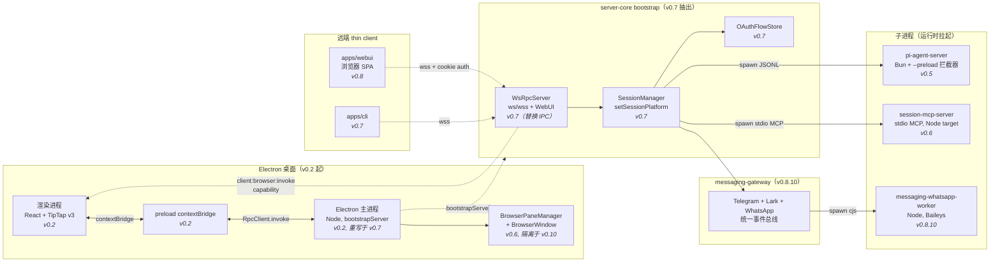

# 实现地图

> Craft Agents OSS `v0.10.4` 的「实现地图」研究：把历史演化阶段（v0.2 起步 → v0.10.4 当前）映射到当前的代码模块、接口、数据结构、运行时组件与存储/状态布局。
>
> **前置说明（与 09 对齐）**：本文阶段划分基于两条主证据链：（1）`apps/electron/resources/release-notes/` 下 v0.2.30 → v0.10.4 全量 release notes；（2）当前代码里的版本注释、迁移函数与兼容代码（如 `runtime-resolver.ts:107-121`、`secure-storage.ts:336-348`、`storage.ts:2213-2463`）。与 `09_evolution_history.md` 互相对齐。
>
> 交叉引用：与 `01_architecture.md`（包/进程拓扑）、`02_mechanism_agent.md`（Agent 内核）、`03_mechanism_session_transport.md`（Session/传输）、`04_mechanism_sources_credentials_skills.md`（Sources/Credentials/Skills）、`05_data_flow.md`（数据流）、`06_dependencies.md`（依赖矩阵与历史包袱）、`07_workflow.md`（开发工作流）、`08_learning_path.md`（学习路径）互补。

## 1. 模块/接口映射表（What / Why）

**这个映射揭示什么**：把「这个能力是什么时候有的」与「现在由哪些代码承载」对应起来。每一行是一个**能力的化石层**——同一份 v0.10.4 源码里同时存在 v0.2 的 session JSONL 与 v0.10 的 RemoteBrowserPaneManager，理解它们各自的引入时刻是定位「为什么这段代码长这样」的唯一钥匙。

| 阶段 | 引入的模块 / 包 | 关键类 / 接口 | 当前代码锚点（file:line） |
|---|---|---|---|
| **v0.2 起步**（Electron-only） | `apps/electron`、`packages/shared`（雏形） | Electron 主进程、`StoredConfig`、JSONL session | `apps/electron/src/main/index.ts`；`packages/shared/src/config/storage.ts:100`（`CONFIG_FILE`）；`packages/shared/src/sessions/jsonl.ts:5`（JSONL 格式注释） |
| **v0.3 美化期**（Mermaid/Preview） | `packages/ui`、`beautiful-mermaid` | `SessionViewer`、`TurnCard`、Markdown 渲染 | `packages/ui/`；根 `package.json:dependencies`（`beautiful-mermaid ^1.1.3`） |
| **v0.4 多连接**（LLM Connections） | `llm-connections.ts`、`LlmConnection` schema、`connectionLocked` 字段 | `StoredConfig.llmConnections`、`SessionHeader.llmConnection` | `packages/shared/src/config/llm-connections.ts`；`packages/shared/src/config/storage.ts:2074-2463`（legacy provider 迁移函数）；`packages/shared/src/sessions/types.ts`（`connectionLocked` 持久化字段） |
| **v0.5 任意 provider**（Pi 后端引入） | `packages/pi-agent-server`、`PiAgent`、`PiEventAdapter` | `BaseAgent`、`BackendConfig`、`spawnSubprocess()` | `packages/pi-agent-server/src/index.ts:14`；`packages/shared/src/agent/pi-agent.ts:153,390,451`；`packages/shared/src/agent/backend/pi/event-adapter.ts` |
| **v0.6 内置浏览器 + 文档工具** | `BrowserPaneManager`、`IBrowserPaneManager`、Python `doc-tools` | `IBrowserPaneManager` 接口、`BrowserInstance`、`browserPane.*` 通道 | `packages/shared/src/protocol/channels.ts:344`（`browserPane`）；`apps/electron/resources/release-notes/0.6.0.md`；`apps/electron/src/main/browser/...`（实现）；`apps/electron/resources/scripts/`（markitdown/pdf-tool/xlsx-tool/docx-tool/pptx-tool/img-tool/doc-diff/ical-tool） |
| **v0.7 架构大改**（远端 Server + CLI + WS-only） | `packages/server-core`、`packages/server`、`apps/cli`、`WsRpcServer`、`SessionManager` | `bootstrapServer()`、`WsRpcServer`、`SessionManager`、`RPC_CHANNELS` | `packages/server-core/src/transport/server.ts:122`（`class WsRpcServer`）；`packages/server/src/index.ts:168`（`bootstrapServer` 调用）；`packages/shared/src/protocol/channels.ts`（全量通道定义）；`apps/cli/src/index.ts` |
| **v0.7 后续**（Island、Thinking Levels、Automations 条件） | `@craft-agent/ui` Island 原语、`ThinkingLevel` tuple、`automation-system` | `Island`、`ThinkingLevel = 'off'\|...\|'max'`、`AutomationConfig.conditions` | `packages/shared/src/agent/thinking-levels.ts`；`packages/shared/src/automations/automation-system.ts:7`（`automations.json` 加载）；release-notes/0.7.7.md（5 级 thinking + conditions） |
| **v0.8 混合传输 + WebUI + Mobile** | `packages/server-core/src/webui/`、`apps/webui`、`transfer:*` 通道 | `WebUiHttpHandler`、`browser-accessible` 模式、`ActiveWorkspace.remoteServer` | `packages/server-core/src/webui/http-server.ts:164`；`packages/server-core/src/webui/auth.ts:92-102`（argon2id）；`packages/shared/src/protocol/channels.ts:51-55`（`transfer.*`） |
| **v0.8.10 消息桥** | `packages/messaging-gateway`、`packages/messaging-whatsapp-worker` | `MessagingGateway`、`WhatsAppWorker` 子进程、`messaging:wa:*` 通道 | `packages/messaging-gateway/src/bootstrap.ts:76`（worker entry）；`packages/messaging-gateway/src/adapters/whatsapp/index.ts:155-218`（worker lifecycle 事件）；`packages/shared/src/protocol/channels.ts:381-410`（messaging channel block） |
| **v0.9 Claude SDK 原生二进制 + Lark + Telegram 论坛** | `runtime-resolver.ts`（native binary 解析）、`@vscode/ripgrep`、`@craft-agent/session-tools-core`、Lark adapter | `resolveClaudeBinaryPath()`、`SessionToolsCore`、`telegramTopic` 字段 | `packages/shared/src/agent/backend/internal/runtime-resolver.ts:107-135`（binary 解析）；同 `:185`（ripgrep）；`packages/session-mcp-server/src/index.ts:1`；release-notes/0.9.0.md |
| **v0.10 远端 browser 桥 + 工作区隔离** | `RemoteBrowserPaneManager`、`client:browser:invoke` capability、`workspaceId` 路由 | `CLIENT_BROWSER_INVOKE`、`hasClientCapability()`、`filterInstancesForWorkspace()`、`BrowserInstanceInfo.workspaceId` | `packages/server-core/src/transport/capabilities.ts:26`（`CLIENT_BROWSER_INVOKE`）；`packages/server-core/src/sessions/RemoteBrowserPaneManager.ts:55`；`packages/shared/src/protocol/dto.ts:586`（`BrowserInstanceInfo`）；release-notes/0.10.0.md |
| **v0.10.4 GLM-5 + Pi 0.79.9 + config backup** | Pi 包 scope 迁移（`@mariozechner/*` → `@earendil-works/*`）、`config.json.bak-{date}` 快照 | `snapshotConfig()`、`getStableMachineId()`、`craft-agent-v2` 密钥派生 | `packages/shared/src/config/storage.ts:217-228`（`config.json.bak-` 快照）；`packages/shared/src/credentials/backends/secure-storage.ts:319-330`（`craft-agent-v2` 标签）；release-notes/0.10.4.md |

## 2. 数据结构演化（What / Why）

**这个映射揭示什么**：四种核心数据结构（session JSONL / credentials.enc / sources / skills / automations）各自的「定型时刻」并不一致。session JSONL 与 credentials.enc 是 v0.2 就有、之后只增字段的「活化石」；sources/skills/automations 是 v0.4-0.7 之间陆续落地的「后辈」；`workspaceId` 路由则是 v0.10 才叠加上去的「外挂层」。识别这种「同心圆」结构可以解释为什么很多 DTO 字段是 `optional`——它们要兼容历史版本。

```mermaid
classDiagram
  class SessionHeader {
    +string id
    +string workspaceRootPath
    +string? sdkSessionId
    +number createdAt
    +PermissionMode? permissionMode
    +string? llmConnection
    +boolean? connectionLocked
    +string[]? labels
    +string? triggeredBy
    +string? branchFromSessionPath
    +string? transferredSessionSummary
  }
  class StoredMessage
  class CredentialStore {
    +Buffer magic CRAFT01
    +Buffer salt 32B
    +Buffer iv 12B
    +Buffer authTag 16B
    +Buffer ciphertext
  }
  class StoredCredential {
    +string value
    +string? refreshToken
    +number? expiresAt
    +string? source native|cli
  }
  class SkillMetadata {
    +string name
    +string description
    +string[]? globs
    +string[]? alwaysAllow
    +string? icon
    +string[]? requiredSources
  }
  class AutomationConfig {
    +string matcher
    +AutomationAction[] actions
    +AutomationCondition[]? conditions
    +string? telegramTopic
    +boolean enabled
  }
  class SourceConfig {
    +SourceType type
    +McpSourceConfig mcp
    +ApiSourceConfig api
    +LocalSourceConfig local
  }
  class BrowserInstanceInfo {
    +string ownerSessionId
    +string ownerType
    +string? workspaceId
    +string? title
    +string? currentUrl
  }

  SessionHeader --> StoredMessage : jsonl line N
  CredentialStore --> StoredCredential : keyed by "type::scope"
```

### 2.1 session.jsonl

- **格式**（`packages/shared/src/sessions/jsonl.ts:4-6`）：第 1 行 = `SessionHeader`，第 2+ 行 = `StoredMessage`。
- **持久化字段清单**（`packages/shared/src/sessions/types.ts:30-79`，`SESSION_PERSISTENT_FIELDS`）：v0.2 起有 id / workspace / timestamps / model / permissionMode；v0.4 加 `llmConnection` + `connectionLocked`；v0.6 加 `branchFrom*`（branching）；v0.8 加 `transferredSessionSummary`（远端 transfer）；v0.8.10 加 `triggeredBy`（automation 起点）。
- **可移植化**（`jsonl.ts:13-50`）：`{{SESSION_PATH}}` token 替换让 session JSON 在不同机器间可移植（v0.8 session export/import）。
- **快加载优化**：`readSessionHeader()` 用 `openSync + readSync` 只读首行（`jsonl.ts:80`），list 视图无需解析整文件。

### 2.2 credentials.enc

- **文件位置**：`~/.craft-agent/credentials.enc`（`packages/shared/src/credentials/backends/secure-storage.ts:45`）。
- **二进制布局**（注释 `:8-25`）：64 字节 header（`CRAFT01\0` magic + flags + 32B salt + 20B reserved）+ 12B IV + 16B GCM tag + 密文。
- **派生算法**：PBKDF2(`sha256`, 100000 iters, 32B key)（`:30, 312-316`）。
- **两代密钥**：
  - v1（已弃用，保留迁移）：`sha256(hostname + username + homedir + 'craft-agent-v1')`（`getLegacyEncryptionKey`, `:336-348`）。
  - v2（当前）：`sha256(IOPlatformUUID | MachineGuid | /etc/machine-id + 'craft-agent-v2')`（`getEncryptionKey`, `:319-330`）。
- **迁移路径**（`loadStore`, `:230-248`）：先试 v2 密钥，失败再试 v1，v1 成功则立即 re-save 成 v2，实现透明迁移。
- **CredentialType enum**（`packages/shared/src/credentials/types.ts:19-32`）：12 种 type，分层为 `anthropic_api_key`（legacy global）→ `claude_oauth` / `llm_*`（v0.4 多连接）→ `workspace_oauth` / `source_*`（v0.4 sources）→ `messaging_bearer`（v0.8.10 消息桥）。

### 2.3 sources / skills / automations

- **sources**（`packages/shared/src/sources/types.ts`）：v0.4 引入，`SourceType = 'mcp' | 'api' | 'local'`（`:16`），`McpTransport = 'http' | 'sse' | 'stdio'`（v0.9 后 stdio 用 `StdioClientTransport`，详见 `04_mechanism_sources_credentials_skills.md`）。每个 source 一个目录：`sources/{slug}/{config.json, guide.md, permissions.json}`（`config/watcher.ts:13`）。
- **skills**（`packages/shared/src/skills/types.ts:11-30`）：v0.5 「Skill metadata」release notes 提到 `requiredSources` / `icon`，存储为 `skills/{slug}/SKILL.md` + YAML frontmatter（`skills/storage.ts:109` `loadSkillFromDir`）。三层来源 `global | workspace | project`（`:32`）。
- **automations**（`packages/shared/src/automations/constants.ts:2-12`）：v0.7.7 引入 conditions（`automation-system.ts:7`），v0.7.5 引入 webhook 动作，v0.9 引入 `telegramTopic` 字段。文件：`automations.json` + `automations-history.jsonl` + `automations-retry-queue.jsonl`（持久化重试队列）。

### 2.4 「字段的可选性」原则

所有跨版本共享的接口（`SessionHeader`、`StoredCredential`、`BrowserInstanceInfo`）大量使用 `?` optional 字段，**这是有意的兼容契约**：v0.10.0 引入的 `BrowserInstanceInfo.workspaceId` 是 optional，旧 renderer 会把它当 `null` 处理（release-notes/0.10.0.md：「older renderers tolerate missing values」）。

## 3. 运行时组件地图（What / Why）

**这个映射揭示什么**：v0.10.4 的运行时是「七进程拓扑」——但每个进程都不是同时间引入的。Electron main / renderer / preload 是 v0.2 起步；Pi subprocess 是 v0.5；Session MCP subprocess 是 v0.6（Pi 后端用）；WsRpcServer 是 v0.7 重写传输；WhatsApp worker 是 v0.8.10；远端 Headless server 是 v0.7 但 capability 路由是 v0.10。理解每个组件的「引入版本」可以判断哪条进程边界是「老朋友」、哪条是「新交界」。



| 组件 | 引入版本 | 角色 | 代码锚点 |
|---|---|---|---|
| Electron 主进程 | v0.2 | bootstrapServer 宿主、GUI/shell/文件拖拽 | `apps/electron/src/main/` |
| 渲染层（renderer） | v0.2 | React + TipTap + `@craft-agent/ui` | `apps/electron/src/renderer/`、`packages/ui/` |
| preload | v0.2 | contextBridge（隔离渲染层与 Node） | `apps/electron/src/preload/` |
| WsRpcServer | v0.7（替换 Electron IPC） | 唯一 RPC 传输，承载所有 channel + WebUI 静态资源 | `packages/server-core/src/transport/server.ts:122` |
| SessionManager | v0.7 | session 生命周期、子进程编排、permission/capability 路由 | `packages/server-core/src/sessions/SessionManager.ts` |
| Pi subprocess（pi-agent-server） | v0.5 | OpenAI/Google/Copilot/Codex 等 non-Anthropic 路由，JSONL over stdio | `packages/pi-agent-server/src/index.ts:14`、`packages/shared/src/agent/pi-agent.ts:451`（`spawn()`） |
| Session MCP subprocess | v0.6 | 向 Pi 暴露 `SubmitPlan` 等 session-scoped 工具，与 Claude 内置工具对齐 | `packages/session-mcp-server/src/index.ts:1`、`packages/session-tools-core/` |
| BrowserPaneManager | v0.6 | 内置 Electron `BrowserWindow` 浏览器面板 | `apps/electron/src/main/browser-pane-manager.ts` |
| RemoteBrowserPaneManager | v0.10 | session-bound `IBrowserPaneManager` 桥接到客户端 capability | `packages/server-core/src/sessions/RemoteBrowserPaneManager.ts:55` |
| Headless server | v0.7 | Bun 独立部署，含 TLS/WebUI/Messaging 装配 | `packages/server/src/index.ts:168` |
| messaging-gateway | v0.8.10 | Telegram + Lark + WhatsApp 统一事件总线 | `packages/messaging-gateway/src/bootstrap.ts` |
| WhatsApp worker | v0.8.10 | Baileys Node-only 子进程，打成单文件 `worker.cjs` | `packages/messaging-whatsapp-worker/`、`scripts/build-wa-worker.ts:86-88` |
| WebUI | v0.8 | Vite SPA，cookie 鉴权，复用 Electron 渲染层 | `apps/webui/src/App.tsx` |
| CLI | v0.7 | Bun TUI，WebSocket 连任意 server | `apps/cli/src/index.ts` |

## 4. 存储 / 状态地图（What / Why）

**这个映射揭示什么**：`~/.craft-agent/` 是个**叠加地层**。最底下的 `config.json` + `credentials.enc` + `workspaces/` 是 v0.2 起步层；中间的 `preferences.json` / `theme.json` / `config-defaults.json` 是 v0.3-v0.6 强化期层；`automations*.json*` / `statuses/` / `labels/` 是 v0.7-v0.8 业务扩展层；最上面的 `logs/auto-update.log` / `config.json.bak-{date}` 是 v0.10.4 才引入的「可观测 + 自我恢复」层。读懂这张图，就能预测「升级会改哪个文件、回滚要恢复哪个文件」。

```mermaid
graph TD
  Root["~/.craft-agent/<br/><i>v0.2 起步</i>"]

  Root --> Config["config.json<br/>主配置 / llmConnections<br/><i>v0.2, v0.4 扩字段</i>"]
  Root --> Bak["config.json.bak-YYYY-MM-DD<br/>启动快照 ×3<br/><i>v0.10.4 引入</i>"]
  Root --> Defaults["config-defaults.json<br/>bundled 同步产物<br/><i>v0.6.5 统一初始化</i>"]
  Root --> Prefs["preferences.json<br/>用户偏好<br/><i>v0.2.30 引入</i>"]
  Root --> Theme["theme.json<br/>app-level 主题覆盖<br/><i>v0.4 workspace defaults</i>"]
  Root --> Themes["themes/*.json<br/>预设主题<br/><i>v0.4+</i>"]
  Root --> Enc["credentials.enc<br/>AES-256-GCM<br/><i>v0.2, v0.10.4 改密钥派生</i>"]
  Root --> Logs["logs/auto-update.log<br/><i>v0.10.4 引入</i>"]
  Root --> WS["workspaces/<br/><i>v0.2</i>"]

  WS --> WsRoot["{workspaceId}/"]
  WsRoot --> WsConfig["workspace config<br/>defaults/permission/workingDir<br/><i>v0.4 per-workspace</i>"]
  WsRoot --> WsSources["sources/{slug}/<br/>config.json, guide.md, permissions.json<br/><i>v0.4 sources</i>"]
  WsRoot --> WsSkills["skills/{slug}/<br/>SKILL.md + frontmatter, icon.*<br/><i>v0.5 skills</i>"]
  WsRoot --> WsSessions["sessions/{id}/<br/>session.jsonl + 附件<br/><i>v0.2, v0.6 加 branching, v0.8 加 transfer</i>"]
  WsRoot --> WsPerms["permissions.json<br/><i>v0.4</i>"]
  WsRoot --> WsAuto["automations.json<br/><i>v0.7 conditions, v0.9 telegramTopic</i>"]
  WsRoot --> WsAutoHist["automations-history.jsonl<br/><i>v0.7.5 webhook 历史</i>"]
  WsRoot --> WsAutoRetry["automations-retry-queue.jsonl<br/><i>v0.7.5 持久化重试</i>"]
  WsRoot --> WsStatuses["statuses/<br/>config.json, icons/<br/><i>v0.7 statuses</i>"]
  WsRoot --> WsLabels["labels/<br/>label 配置<br/><i>v0.7 labels</i>"]

  Enc -.->|v1 密钥已废<br/>透明迁移到 v2| Enc
  Config -.->|每次启动快照| Bak
```



### 4.1 关键替换关系（迁移断层）

| 旧 | 新 | 引入版本 | 迁移代码 |
|---|---|---|---|
| `credentials.enc`（hostname-based key） | `credentials.enc`（hardware-UUID-based key） | v0.10.4（基于 release notes 的「machine migration」注释推断；具体版本等 09 确认） | `secure-storage.ts:230-248, 336-348`（双密钥 fallback + re-save） |
| `authType` + `anthropicBaseUrl` + `customModel` + `model` | `llmConnections[]` | v0.4 | `storage.ts:2213-2463`（`migrateLegacyAuthConfigToConnections`），迁移后**删除** legacy 字段 |
| `providerType = 'bedrock' \| 'vertex' \| 'anthropic_compat'` | `providerType = 'pi' \| 'pi_compat' \| 'anthropic'` | v0.5（Pi 后端引入） | `storage.ts:2074-2192`、`storage.ts:2342-2365` |
| `preferences.language`（free-text） | 内部 `uiLanguage` 字段 + Appearance 下拉 | v0.8.5（i18n）→ v0.10.1（彻底删除） | `packages/shared/src/config/preferences.ts:54`（「Scrub legacy free-text `language` field on read」） |
| Electron IPC（`ipcRenderer.invoke`） | WebSocket RPC（`ws`） | v0.7 | 详见 `03_mechanism_session_transport.md`；lint 规则 `scripts/check-raw-sends.sh` 强制不写 raw IPC |
| Claude Agent SDK `cli.js`（JS） | 原生 `claude` 二进制（per-platform optional dep） | v0.9 | `runtime-resolver.ts:107-135`；副作用见第 5 节 |

## 5. 跨模块依赖的演化断层（历史包袱）

**这个映射揭示什么**：v0.10.4 的代码里散落着至少 3 处「**没法干净删掉的历史包袱**」——它们都是某个版本切换时为了「平滑迁移」而保留的兼容层，但反过来又约束了新版本的能力。理解这些包袱，才能理解为什么有些「看起来应该简单」的修改实际上做不到。

### 5.1 zod 双版本（v3 在 `session-tools-core`、v4 在 `shared`）

- **现状**：`packages/session-tools-core/package.json:17-18` 锁 `zod ^3.23.0 + zod-to-json-schema ^3.25.0`，而 `packages/shared/package.json:87` 用 `zod >=4.0.0`、`packages/session-mcp-server/package.json:19` 用 `zod ^4.0.0`、根 `package.json` 也锁 `zod ^4.0.0`。
- **引入时刻**：v0.7 抽出 `session-tools-core`（共享 session 工具处理器）时锁了当时的 zod 3.x；v0.8+ 整体升到 zod 4 时，`session-tools-core` 因为 `zod-to-json-schema` 依赖链未跟随升级。
- **当前代码痕迹**：`session-tools-core/src/validation.ts:8` 与 `tool-defs.ts:14` `import { z } from 'zod'` 解析到 zod 3，而 `shared/src/agent/claude-agent.ts:9` 解析到 zod 4。两边的 schema 对象**不能互相喂**——这迫使 session-tools-core 只导出**纯数据**（`SESSION_TOOL_REGISTRY`），调用方在 shared 里自行用 zod 4 重建 schema。
- **release notes 旁证**：0.7.5 的「Zod/JSON Schema passthrough」修复（`cf4b6ac1`）就是为了弥合两边 `.passthrough()` 默认行为差异。

### 5.2 Claude SDK 0.2.113 native binary 切换 → preload 失效

- **现状**：`packages/shared/CLAUDE.md` 明确指出 `--preload` 网络拦截器**仅 Pi 子进程可用**，Claude 路径走不了拦截器。
- **引入时刻**：v0.9.0 把 Claude Agent SDK 从 0.2.113（JS `cli.js`）切到 0.2.123+（原生 `claude` 二进制）。SDK 不再是「在 Bun/Node 进程里跑 JS」，而是「spawn 一个原生进程」——Bun 的 `--preload` 只对 Bun 进程内的模块生效，对外部二进制无效。
- **当前代码痕迹**：
  - `packages/shared/src/agent/backend/internal/runtime-resolver.ts:107-135`：`resolveClaudeBinaryPath()` 三段查找（build alias `@anthropic-ai/claude-agent-sdk-binary` → per-platform package → dev walk-up）。
  - 同 `:185`：ripgrep 从 SDK 自带降级到独立 `@vscode/ripgrep`（trusted dependency）。
  - `packages/shared/src/unified-network-interceptor.ts` 仍由 `bunfig.toml:1` 全局 preload，但实际只对 pi-agent-server 生效。
- **bundle size 代价**：release-notes/0.9.0.md「Bundle size grows ~210 MB per platform」——原生二进制 per-platform 必须独立打包。

### 5.3 Pi SDK 0.79.9 patch 锁定 + scope 迁移

- **现状**：根 `package.json:dependencies` 把三个 Pi 包固定到 **exact `0.79.9`**（不是 `^0.79.9`）：`@earendil-works/pi-ai`、`@earendil-works/pi-coding-agent`、`@earendil-works/pi-agent-core`。
- **引入时刻**：v0.10.4 一次大迁移——把 scope 从已冻结的 `@mariozechner/*@0.73.1` 重命名到 `@earendil-works/*@0.79.9`（release-notes/0.10.4.md，commit `694d4b1c`）。
- **patch 锁定原因**：Pi SDK 内部多次 breaking（v0.5 升级 0.55.0 修 streaming 冻结、v0.8.5 升 0.66.1 修 GLM/Minimax、v0.9.4 升 0.73.1 修 Codex WebSocket `1011` 超时），每次升级都是 hotfix 性质，所以锁到精确 patch 避免意外。
- **当前代码痕迹**：`packages/shared/src/agent/backend/internal/drivers/pi.ts:46` `import { refreshGitHubCopilotToken } from '@earendil-works/pi-ai/oauth'`——这个 import 路径在 `0.73.1 → 0.79.9` 切换时**全仓库批量替换**。

### 5.4 legacy `setClaudeOAuthCredentials` + `source: 'native' | 'cli'`

- **现状**：`packages/shared/src/credentials/manager.ts:263-285` `setClaudeOAuthCredentials` 接受一个 `source?: 'native' | 'cli'` 字段；`packages/shared/src/auth/state.ts:120,167` 是两个写入点。
- **引入时刻**：v0.4 之前用 Claude CLI 导入 OAuth（`source: 'cli'`）；v0.5 之后改用项目自己的 OAuth 流程（`source: 'native'`），但 legacy 'cli' 路径保留兼容。
- **当前代码痕迹**：`StoredCredential.source` 字段（`credentials/types.ts:107`）注释明确写「Where the token came from: 'native' (our OAuth), 'cli' (Claude CLI import), or undefined (unknown)」。`'cli'` 分支在 v0.10.x 仍在被读取以决定 token refresh 策略，**不能删**。

## 6. 「如果删除某个阶段会怎样」（反事实分析）

**这个映射揭示什么**：选两个**承前启后**的阶段做反事实——如果当初没做那个决定，现在的代码会缺失哪些模块、哪些工作流会断。这是验证「阶段 → 模块」映射是否准确的最终手段。

### 6.1 反事实 A：如果 v0.7 没拆出远端 Server

**删除的影响**：
- **消失的包**：`packages/server`、`packages/server-core`、`packages/server-core/src/transport/server.ts`（WsRpcServer）、`packages/server-core/src/webui/`、`apps/cli`、`apps/webui`。
- **退化的传输**：回到 v0.6 的 Electron IPC 模型——所有渲染层调用都走 `ipcRenderer.invoke`，**无法**支持远端 thin client、WebUI、CLI、Docker 部署、移动端访问。`scripts/check-raw-sends.sh` lint 规则会消失。
- **断掉的工作流**：
  - 远端长会话：CI runner / 云 VM 上跑 agent → 不存在。
  - 多端共享：手机浏览器打开 WebUI → 不存在。
  - 消息桥（v0.8.10）：Telegram/Lark/WhatsApp 触发会话 → 没有 server 容器，gateway 无处挂载。
  - session transfer（v0.8）：跨服务器迁移 session → 没有远端服务器，transfer 通道（`channels.ts:51-55`）无意义。
- **保留的能力**：Electron 桌面所有功能（v0.2-v0.6 累积的能力）都不受影响。这就是「server-core 是上层附加，不是核心」的设计证据。

### 6.2 反事实 B：如果 v0.5 没引入 Pi 后端

**删除的影响**：
- **消失的包**：`packages/pi-agent-server`、`packages/session-mcp-server`（这个存在的理由就是给 Pi 后端暴露 session-scoped 工具，与 Claude 对齐）、`packages/session-tools-core`（共享处理器的需求来自「两个后端用同一份工具」）。
- **退化的能力**：
  - 只能用 Anthropic 直连（API key 或 OAuth），**无法**接 OpenAI/Codex、Google AI Studio、GitHub Copilot、OpenRouter、Ollama、自定义 endpoint（v0.5 release notes 列出的全部 provider）。
  - `LlmConnection.providerType` enum 从 `'anthropic' | 'pi' | 'pi_compat'` 退化为只有 `'anthropic'`（`storage.ts:2074-2192` 整段迁移代码消失）。
  - `--preload` 网络拦截器（`unified-network-interceptor.ts`）失去唯一可用宿主——拦截器本来就只对 Pi 子进程生效，Pi 没了，整个 `bunfig.toml:1` 的 preload 配置无意义。
- **断掉的工作流**：
  - 非 Anthropic model 的 thinking/reasoning_effort（v0.10.4 GLM-5 在 z.ai） → 不存在。
  - LLM connection test（`llm-connections.ts`）的 Pi 路径 → 消失。
  - GitHub Copilot device-code login（`refreshGitHubCopilotToken from '@earendil-works/pi-ai/oauth'`）→ 消失。
- **保留的能力**：Claude 后端完整保留（`packages/shared/src/agent/claude-agent.ts`）——这反过来说明 **Pi 是平行的第二个后端，不是 Claude 的依赖**。

## 7. 未解决疑问

1. **credentials.enc 密钥派生切换的确切版本**：`secure-storage.ts:336-348` 的 v1 → v2 迁移代码注释只说「machine migration」，没标版本号。release-notes 在 v0.10.4 才提到「corrupted file recovery」，但 v2 密钥派生（hardware UUID）很可能更早引入（推测 v0.4-v0.6 之间）。**待 09_evolution_history.md 用 git blame 确认**。
2. **session-mcp-server 的引入版本**：它的存在理由是「让 Pi 后端用 SubmitPlan」，所以理论上和 Pi（v0.5）同时或稍晚。但 release notes 里没有任何一期明确提到「Session MCP Server」——它可能是在 v0.5-v0.6 之间悄悄引入的内部基础设施。**需要查 git log** `packages/session-mcp-server/`。
3. **`config-defaults.json` 的同步逻辑**：v0.6.5 release notes 说「unified docs initialization, removed version-based update logic」——但 `storage.ts:107-172` 现在的 `syncConfigDefaults()` 还有「source of truth: apps/electron/resources/config-defaults.json」逻辑，v0.6.5 删的是哪个版本分支？**需要查 0.6.5 commit diff**。
