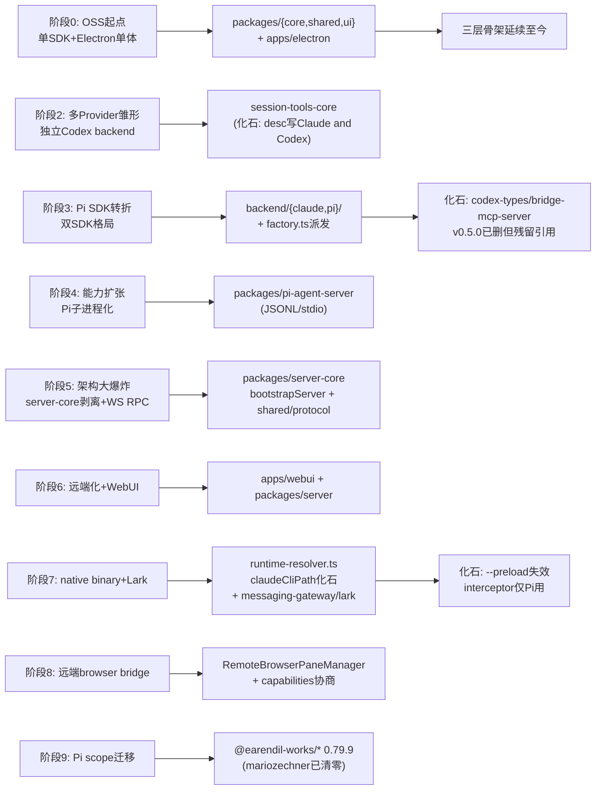
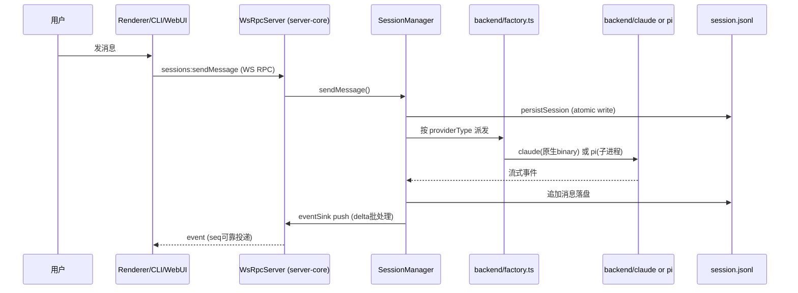
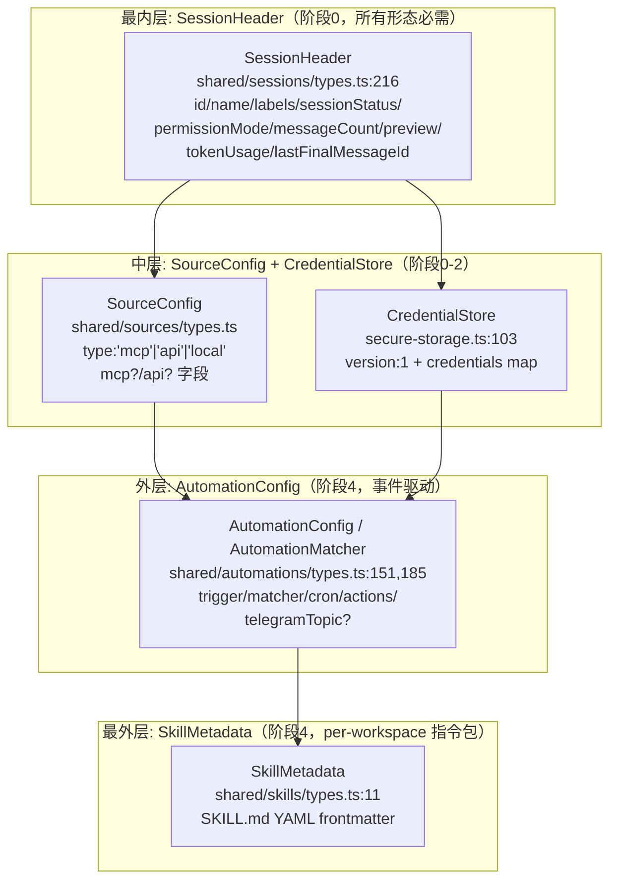
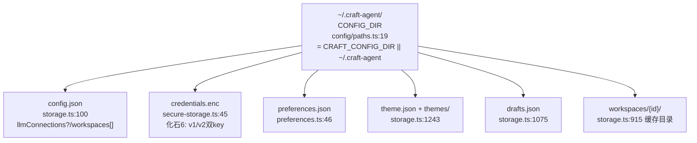
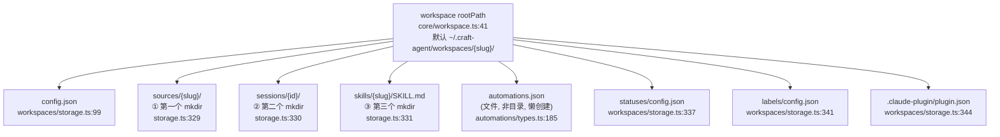

# 实现地图：历史演进到当前代码的映射

> 专题 J。把 `09_evolution_history.md` 的每个版本阶段（OSS 起点 → Pi SDK 接入 → server-core 剥离/WS RPC → native binary/Lark → 远端化/Pi scope 迁移）映射到当前代码（HEAD `fe5acd4`）里的具体模块、接口、数据结构、运行时组件、存储路径，并指出「化石层」与历史包袱。
>
> 全部结论附源码证据：`文件路径:符号/行号` +（如适用）commit。臆测归入文末「待解决疑问」。代码标识符/路径保留原文。

---

## 这一节解决什么问题

Craft Agents 的当前代码里埋着大量「历史化石」：`claudeCliPath` 字段名指向的不再是 CLI 而是 native binary；`runtime-resolver.ts` 仍在 resolve 一个在 v0.5.0 就被删掉的 `bridge-mcp-server` 包；`session-mcp-server` 的 package.json 描述写「暴露给 Codex」，但 Codex 后端早已在 v0.5.0 被 Pi SDK 取代；`session-tools-core` 被钉死在 zod 3.23，而 monorepo 其余部分已升 zod 4；`credentials.enc` 同时维护 v1（hostname）与 v2（hardware UUID）两套解密 key。

仅凭当前代码倒推，会把这些误读为「一开始就这么设计」。本节按地层叠加的逻辑，把 09 的每个历史阶段落到当前代码的具体锚点，让读者「看着当前代码就能说出这块是哪个版本阶段留下的、为什么」。

---

## 能力到实现的总览



| 历史阶段 | 当前实现位置 | 核心抽象 | 运行时入口 | 为什么落在这里 |
|----------|--------------|----------|------------|----------------|
| 阶段0 OSS起点（v0.2.x） | `packages/{core,shared,ui}` + `apps/electron` | monorepo 三层骨架 | `apps/electron/src/main/index.ts:627` `bootstrapServer()` | 内部产品开源基线，骨架延续至今 |
| 阶段1 Mermaid（v0.3.0） | `packages/mermaid`（已被吸收进 `beautiful-mermaid` 依赖） | `MarkdownMermaidBlock.tsx` | `mermaid_validate` 工具 | 体验增强，与 Agent 内核解耦 |
| 阶段2 多Provider雏形（v0.4.0） | `packages/session-tools-core` | 共享会话工具逻辑 | `session-mcp-server`（仍描述「to Codex」） | 独立 Codex backend 被 v0.5.0 取代，仅工具共享层留存 |
| **阶段3 Pi SDK转折（v0.5.0）** | `packages/shared/src/agent/backend/{claude,pi}/` | `AgentBackend` 接口（`backend/types.ts:641`） | `backend/factory.ts` 按 provider 派发 | 双 SDK 并存是后续所有「两套实现要同步」的源头 |
| 阶段4 能力扩张（v0.6.0） | `packages/pi-agent-server` | Pi 子进程（JSONL over stdio） | `pi-agent.ts:390` `spawnSubprocess()` | 子进程化验证了「Agent 逻辑可脱 Electron」 |
| **阶段5 架构大爆炸（v0.7.0）** | `packages/server-core` + `packages/shared/src/protocol/` | `bootstrapServer<T>()` 泛型（`headless-start.ts:258`） | Electron/headless 共用同一段启动代码 | 让内核可远端/无头复用 |
| 阶段6 远端化+WebUI（v0.8.0） | `apps/webui` + `packages/server` | JWT cookie auth + 同端口托管 | `packages/server/src/index.ts:168` | 把「可远端」做成可用产品形态 |
| **阶段7 native binary+Lark（v0.9.0）** | `runtime-resolver.ts` + `messaging-gateway/src/adapters/lark/` | `claudeCliPath` 字段（命名化石） | `applyAnthropicRuntimeBootstrap()` | 被动跟随上游 SDK 分发模型变更 |
| 阶段8 远端browser（v0.10.0） | `sessions/RemoteBrowserPaneManager.ts` + `transport/capabilities.ts` | `client:browser:invoke` capability | `findClientsWithCapability()` | 远端 Agent 缺 GUI，借本地浏览器 |
| 阶段9 scope迁移（v0.10.4） | `package.json` `@earendil-works/* 0.79.9` | Pi 三包整体换 scope | 各 `package.json` manifests | 跟随上游 Pi SDK rebrand |

---

## 当前实现分层（按历史地层叠加）

### 内核地基层（承接阶段0 OSS起点）

**它承接了哪段历史演进**：v0.2.x 的单 Claude SDK + Electron 单体（`0fe831b`）。当时的 `packages/{core,shared,ui}` + `apps/{electron,viewer}` 骨架。

**它现在负责什么**：`core`（纯类型+utils，依赖图最底层）、`shared`（业务逻辑大本营）、`ui`（React 组件库）。这三层是后续所有扩张的地基。

**关键代码位置**：
- `packages/core/src/index.ts`（注释明确：「currently only exports types and utilities」）
- `packages/shared/package.json:1`（「Shared business logic … agent, auth, config, credentials, MCP integration」）
- `apps/viewer/package.json:5`（「Web viewer for Craft Agents sessions - upload and share session transcripts」——起点就有的配套工具，至今 release notes 几乎未提，是「静默延续」的化石）

**为什么边界这样划分**：`core` 不含运行时业务逻辑，避免循环依赖；`shared` 承载所有宿主无关逻辑，是「内核与宿主解耦」的物理承载（阶段5 的伏笔在阶段0 就埋下）。

### 双后端层（承接阶段3 Pi SDK 转折）

**它承接了哪段历史演进**：v0.5.0（`8e4104d`），Pi SDK 统一 backend 取代独立 Codex/Copilot backend。从此系统里有两个 Agent SDK。

**它现在负责什么**：按 provider 路由到 `backend/claude/`（Claude Agent SDK，in-process 异步流）或 `backend/pi/`（Pi SDK，`pi-agent-server` 子进程，JSONL over stdio）。

**关键代码位置**：
- `packages/shared/src/agent/backend/factory.ts`（派发逻辑）
- `packages/shared/src/agent/backend/types.ts:641`（`AgentBackend` 接口，`'pi' → PiAgent`）
- `packages/shared/src/agent/claude-agent.ts`（ClaudeAgent 主类）+ `pi-agent.ts`（PiAgent）
- `packages/shared/src/agent/backend/{claude,pi}/event-adapter.ts`（两套事件适配器，双 SDK 同步成本源头）

**为什么边界这样划分**：release notes 0.5.0.md Breaking Changes 明确——独立 Codex/Copilot backend 重复且难维护，Pi SDK 提供现成多模型抽象。但 Claude SDK 无法被 Pi 取代（Anthropic OAuth 身份、thinking 模型适配），故双 SDK 并存是「模型覆盖最大化」与「维护成本」的权衡。

### 跨形态内核层（承接阶段5 架构大爆炸）

**它承接了哪段历史演进**：v0.7.0（`24ab785`），server-core 从 Electron 剥离 + WebSocket RPC 取代 Electron IPC。

**它现在负责什么**：把「server 生命周期 + RPC + session 编排 + handler 注册」抽成泛型 `bootstrapServer<TSessionManager, THandlerDeps>()`，让 Electron、Headless Server、CLI、WebUI 四种形态共用同一段启动代码、同一个 WS transport、同一套 handler。

**关键代码位置**：
- `packages/server-core/src/bootstrap/headless-start.ts:258`（`bootstrapServer()` 泛型工厂）
- `packages/server-core/src/transport/{server,client,types}.ts`（`WsRpcServer`/`WsRpcClient`/`RpcServer` 接口）
- `packages/shared/src/protocol/{channels,dto,events,routing,types}.ts`（跨形态 RPC 契约层）
- `packages/server-core/src/handlers/rpc/index.ts`（`registerCoreRpcHandlers` 按 channel 注册）

**为什么边界这样划分**：release notes 0.7.0.md 原文——「the foundation that makes CLI, headless server, and future remote/mobile clients possible」。Electron 从「唯一宿主」降级为「多种 shell 之一」，但仍是功能最全的。

### 消息网关层（承接阶段7 SDK 升级+消息通道）

**它承接了哪段历史演进**：v0.9.0（`acb0884`），新增 Lark/Feishu 消息适配器（第三条通道，继 Telegram/WhatsApp 之后）。

**它现在负责什么**：把 Agent 会话接入 IM 平台，并实现事件驱动自动化闭环。

**关键代码位置**：
- `packages/messaging-gateway/src/adapters/{telegram,lark,whatsapp}/`（三平台 adapter）
- `packages/messaging-gateway/src/registry.ts`（`MessagingGatewayRegistry.registerAdapter`）
- `packages/messaging-whatsapp-worker/`（强制 Node 的 WhatsApp 子进程）

**为什么边界这样划分**：Baileys 的 crypto 依赖（libsignal/curve25519）只能跑在 Node，故 WhatsApp 被隔离成独立子进程——这是 monorepo 内 runtime 分裂（Bun 主 + Node 子进程）的根因。

---

## 核心能力落点



| 能力 | 用户入口 | 内部路径 | 状态/数据 | 关键失败点 |
|------|----------|----------|-----------|------------|
| 发消息 | `sessions:sendMessage` | WS→SM.sendMessage→factory派发→backend.chat() | `ManagedSession`（内存）+ `session.jsonl`（磁盘） | mid-stream 行为分发（queue/steer） |
| 会话持久化 | 自动（每条消息后） | `persistSession`→`SessionPersistenceQueue`→atomic write | header 7字段签名防外部改动覆盖 | `.tmp` 并发竞态（per-session 串行） |
| 跨形态复用 | 任意客户端连 WS | `bootstrapServer` 装配→`registerCoreRpcHandlers` | 同一组 `RPC_CHANNELS` | Electron/headless deps 装配差异 |
| 远端browser | agent 调 `browser_tool` | SM→`findClientsWithCapability`→`invokeClient` | capability 协商（`client:browser:invoke`） | 无可用本地客户端时降级 |
| 凭证存储 | 添加 LLM 连接 | `secure-storage`→AES-256-GCM→`credentials.enc` | v2(hardware UUID)/v1(hostname) 双 key | v1 key 失败→判定 corrupted |

---

## 化石层（Fossil Layer）：历史演化的物理证据

这是本节的核心。下表逐一列出代码里的历史化石，每条附源码位置与来源阶段。

### 化石 1：`claudeCliPath` 命名化石（阶段7，v0.9.0）

字段名保留了 CLI 时代，实际指向 SDK 0.2.113+ 的 native binary。

**源码证据**：
- `packages/shared/src/agent/backend/internal/runtime-resolver.ts:19-22`
  ```
  * Field is named `claudeCliPath` for back-compat — semantically it is
  * the SDK executable, JS or native.
  claudeCliPath?: string;
  ```
- `runtime-resolver.ts:105-107`（`resolveClaudeBinaryPath` 注释）：「Replaces the old `cli.js` lookup (SDK ≥ 0.2.113)」
- `runtime-resolver.ts:258-259`（`applyAnthropicRuntimeBootstrap`）：`setPathToClaudeCodeExecutable(paths.claudeCliPath)`

**为什么还保留**：字段名是跨模块的稳定契约（被 `options.ts`、base-agent、测试引用），重命名牵连面广；语义已由注释说明。

### 化石 2：`--preload` 失效化石（阶段7，v0.9.0）

网络拦截器（`unified-network-interceptor.ts`）曾经同时注入 Claude 与 Pi 子进程；native binary 不接受 Bun 的 `--preload`，故 interceptor 只剩 Pi 用。

**源码证据**：
- `runtime-resolver.ts:24-28`（`interceptorBundlePath` 字段注释）：「Source/bundle path for the network interceptor preloaded into the **Pi** subprocess. Not used for Claude anymore — the new native SDK binary doesn't accept `--preload`.」
- `runtime-resolver.ts:242-246`（`applyAnthropicRuntimeBootstrap` 注释）：「The Bun executable / `--preload` interceptor mechanism that used to live here no longer applies — the binary doesn't accept Bun-specific flags.」
- `packages/shared/CLAUDE.md`（interceptor 段）：「The network interceptor is currently **Pi-only**... Features that used to live in the interceptor for Claude (rich tool intent, fast-mode override, MalformedBodyError validation) are Phase-2 work — they'll need to move to SDK hooks or a local proxy.」
- `pi-agent.ts:414-419`（实际注入点）：`args.unshift('--require', interceptorPath)` —— 注意 Pi 用的是 `--require`（Bun 支持），非 `--preload`

**留下的影响**：Claude 后端的 `_intent`（rich tool intent）至今为空（`large-response.ts` 的摘要上下文 fallback 到 `userRequest`）——这是显式标注的「Phase-2 待迁移」技术债。

### 化石 3：`bridge-mcp-server` 引用已删包（阶段2→3，v0.5.0）

`runtime-resolver.ts` 仍在 resolve 一个在 v0.5.0 就被删除的包。

**源码证据**：
- `runtime-resolver.ts:30`（字段定义）：`bridgeServerPath?: string;`
- `runtime-resolver.ts:226`：`bridgeServerPath: resolveServerPath(hostRuntime, 'bridge-mcp-server'),`
- 但 `packages/` 下**没有** `bridge-mcp-server` 目录（`ls packages/` 仅 `session-mcp-server`）
- git 证据：`git show 8e4104d --stat` 显示 v0.5.0 删除了 `packages/bridge-mcp-server/{package.json,src/index.ts,tsconfig.json}`（共 641 行）
- `base-agent.ts:867` 注释自圆其说：「Default: no-op for backends that don't use bridge-mcp-server (Claude, Pi).」
- `backend/types.ts:429` 注释：「Claude/Pi: no-op (they don't use bridge-mcp-server)」
- `driver-types.ts:19`：`bridgeServer?: string;`（驱动类型仍保留可选字段）

**为什么还保留**：`resolveServerPath` 在包不存在时返回 `undefined`，调用方 `SessionManager.ts:514` 注释「Apply bridge-mcp-server updates for backends that use it」实际是 no-op。整条链路是「死代码但安全」——保留是为未来可能重新引入 bridge backend 预留接口。

### 化石 4：`session-mcp-server` 与 `session-tools-core` 的 Codex 描述（阶段2→3）

package.json 描述仍写「暴露给 Codex」，但 Codex 后端在 v0.5.0 已被 Pi 取代。

**源码证据**：
- `packages/session-mcp-server/package.json:5`：`"description": "MCP server that provides session-scoped tools (SubmitPlan, config_validate, etc.) to Codex via stdio transport"`
- `packages/session-mcp-server/src/index.ts:5`：「This MCP server provides session-scoped tools to Codex via stdio transport.」
- `packages/session-mcp-server/src/index.ts:148-506`：`createCodexContext`、`createCodexContext(config)` 函数名仍用 Codex
- `packages/session-tools-core/package.json:5`：`"description": "Shared utilities for session-scoped tools (Claude and Codex)"`
- `packages/session-tools-core/src/index.ts:5`：「Claude (in-process) and Codex (subprocess) implementations.」

**为什么还保留**：函数名/描述是内部约定，重命名收益低；实际该子进程当前主要给 Pi 后端用（Codex 作为 Pi 的 providerType 之一）。

### 化石 5：zod 3.23 vs 4.x 双版本共存（依赖层）

`session-tools-core` 被钉死在 zod 3.23，monorepo 其余已升 zod 4。

**源码证据**：
| 位置 | zod 版本 |
|---|---|
| `package.json:148`（顶层） | `^4.0.0` |
| `packages/shared/package.json`（peerDep） | `>=4.0.0` |
| `packages/session-mcp-server/package.json` | `^4.0.0` |
| **`packages/session-tools-core/package.json`** | **`^3.23.0`** + `zod-to-json-schema ^3.25.0` |

**为什么还保留**：`session-tools-core` 的工具 schema 必须经 `zod-to-json-schema` 转成 JSON Schema 喂给 MCP，而 `zod-to-json-schema` 长期只兼容 zod 3.x。当前靠「`session-tools-core` 的 schema 不与外部 zod 4 对象混用」隔离，若某文件同时引入两个 `zod`，类型不会互通。

### 化石 6：`credentials.enc` v1/v2 双 key（凭证层）

文件用 v2（hardware UUID）加密，但读取时仍尝试 v1（hostname）解密以兼容旧版本数据。

**源码证据**：
- `packages/shared/src/credentials/backends/secure-storage.ts:232-251`（`loadStoreSync` 读取逻辑）：
  ```
  // Try new stable key first (v2 - hardware UUID based)
  const newKey = this.getEncryptionKey(salt);
  let store = this.tryDecrypt(encryptedData, newKey);
  ...
  // Try legacy key for migration (v1 - included hostname)
  const legacyKey = this.getLegacyEncryptionKey(salt);
  store = this.tryDecrypt(encryptedData, legacyKey);
  if (store) {
    // Migration: re-save with new stable key
    this.saveStoreSync(store);
  }
  ```
- `secure-storage.ts:319-333`（v2 key 派生）：`getStableMachineId()`（macOS `IOPlatformUUID`/Win `MachineGuid`/Linux `machine-id`）→ `sha256 + 'craft-agent-v2'` → `PBKDF2(100000轮)`
- `secure-storage.ts:336-348`（v1 key 派生）：`hostname() + userInfo().username + homir() + 'craft-agent-v1'` → `PBKDF2`

**为什么还保留**：v1→v2 迁移靠「读取时双 key 尝试 + 成功后用 v2 重写」实现透明升级。只要还有用户没升级过一次，v1 路径就不能删。

### 化石 7：`CraftAgent` 类名向后兼容别名（阶段0→命名重构）

主类已从 `CraftAgent` 重命名为 `ClaudeAgent`，但保留旧名导出。

**源码证据**：
- `packages/shared/src/agent/index.ts:1`：「Export ClaudeAgent (renamed from CraftAgent) and backward-compatible aliases」
- `packages/shared/src/agent/claude-agent.ts:2896-2903`：
  ```
  // These aliases allow gradual migration from CraftAgent to ClaudeAgent.
  export { ClaudeAgent as CraftAgent };
  export type { ClaudeAgentConfig as CraftAgentConfig };
  ```
- `claude-agent.ts:1038`（debug 日志仍用 `[CraftAgent]` 前缀）

**为什么还保留**：渐进式迁移，避免一次性破坏所有外部引用。

### 化石 8：根 package.json 精确版本锁定（阶段7，v0.9.0）

Claude SDK 从 `^0.2.x` caret 退化为 `0.3.170` 精确锁定。

**源码证据**：
- `package.json:141`：`"@anthropic-ai/claude-agent-sdk": "0.3.170"`（无 caret）
- `package.json:146-147`：`@earendil-works/pi-ai`/`pi-coding-agent` 同为 `0.79.9` 精确锁

**为什么还保留**：09 报告推断——SDK 升级频繁冲突，无法信任 caret（版本字符串变化是硬证据，但无 commit 直述动机）。

---

## 数据结构同心圆

越内层越早加入、越通用（所有形态必需）；越外层越晚加入、越特化。



**地层含义**：
- **最内层 SessionHeader**：阶段0 就有，是 `session.jsonl` 首行（8KB），列表加载零消息解析。所有形态（Electron/headless/CLI/WebUI）都必须能读写它。预计算字段（`messageCount`/`preview`/`tokenUsage`/`lastFinalMessageId`）是后续叠加的，但 `id/name/labels/sessionStatus` 是地基。
- **中层 SourceConfig / CredentialStore**：SourceConfig 的 `mcp`/`api`/`local` 三态是硬规则（CLAUDE.md），对应阶段0 的 MCP 集成与阶段2 的 LLM Connections。CredentialStore 的 `version:1` 字段是凭证格式的版本号（与化石6 的 v1/v2 key 派生版本不同——后者是 key 派生算法版本）。
- **外层 AutomationConfig**：阶段4 引入的事件驱动自动化。`telegramTopic?` 字段（`automations/types.ts:172`）是阶段7 IM 深度集成的叠加层。
- **最外层 SkillMetadata**：阶段4 的 per-workspace Agent 指令包，从 `SKILL.md` 的 YAML frontmatter 解析（`skills/storage.ts:68` `parseSkillFile`）。

---

## 运行时组件映射：七进程拓扑 × 版本阶段

七进程拓扑（详见 `01_architecture.md`）每个对应哪个版本阶段引入：

| 进程 | 引入阶段 | 证据 |
|------|----------|------|
| ① 内核进程（Electron Main / Headless Server） | 阶段0（Electron）/ 阶段5（headless 剥离） | `apps/electron/src/main/index.ts:627` / `packages/server/src/index.ts:168` |
| ② Claude 后端（原生 `claude` 二进制，in-process 流） | 阶段0（SDK `query()`）/ 阶段7（native binary 形态） | `shared/agent/claude-agent.ts:1423`；`runtime-resolver.ts:105`「SDK ≥ 0.2.113」 |
| ③ Pi 后端（`pi-agent-server` 子进程，JSONL/stdio） | 阶段3（Pi SDK 接入）/ 阶段4（子进程化） | `shared/agent/pi-agent.ts:390` `spawnSubprocess()`；`packages/pi-agent-server/package.json`（v0.6.0 引入） |
| ④ Session MCP 子进程（`session-mcp-server`，MCP stdio） | 阶段2（v0.4.0，给 Codex）/ 阶段3（v0.5.0，给 Pi） | `packages/session-mcp-server/src/index.ts:5`；`base-agent.ts:413` 接线 |
| ⑤ WhatsApp Worker 子进程（`worker.cjs`，NDJSON/stdio，强制 Node） | 阶段4 前后（IM 自动化）/ 阶段7（worker 形态稳定） | `messaging-gateway/src/adapters/whatsapp/index.ts:153`；`build-wa-worker.ts` 注释 |
| ⑥ Renderer 进程（Electron 浏览器进程，React） | 阶段0 | `apps/electron/src/preload/bootstrap.ts:103`（WS 客户端） |
| ⑦ 远端客户端（CLI / Thin-client / WebUI） | 阶段5（CLI）/ 阶段6（WebUI + thin-client） | `apps/cli/src/client.ts`；`apps/webui/`；`CRAFT_SERVER_URL` 模式 |

**关键演进节点**：
- **阶段4（v0.6.0）**：Pi 子进程化（进程③）验证了「Agent 逻辑可脱 Electron 进程」，为阶段5 的 server-core 剥离做技术验证。
- **阶段5（v0.7.0）**：进程①分裂成 Electron 与 headless 两种宿主；WS RPC 让进程⑥/⑦ 能跨主机接入。
- **阶段7（v0.9.0）**：进程②从「SDK `cli.js` 脚本」变成「per-platform native binary」（化石1/2 的根源）。

---

## `~/.craft-agent/` 地层叠加

> **重要修正**：任务线索假设目录创建顺序为 `sessions/ → sources/ → automations/ → skills/`。源码核实后，**workspace 初始 mkdir 顺序是 `sources/ → sessions/ → skills/`**，`automations` 不在初始 mkdir（它是懒创建的单文件 `automations.json`，非目录）。

### 全局层 `~/.craft-agent/`（跨工作区共享）

创建入口：`config/storage.ts:245` `ensureConfigDir()` → `mkdirSync(CONFIG_DIR, {recursive:true})`。



### 工作区层（每工作区独立，磁盘任意位置）

创建入口：`workspaces/storage.ts:327-344` `createWorkspaceFolder()`（注意实际顺序）。



**地层含义修正**：
- 初始 mkdir 顺序（`storage.ts:329-331`）：`sources/` → `sessions/` → `skills/`。这反映 v0.4.0（LLM Connections + Sources）先于 v0.6.0（Skills + 文档工具）上线，与 09 报告的阶段顺序一致。
- `sessions/{id}/` 子目录（`sessions/storage.ts:70-115` `ensureSessionDir`）：`session.jsonl` + `attachments/` + `plans/` + `data/` + `long_responses/` + `downloads/`。其中 `long_responses/`（大响应原文，可恢复）与 `data/`（datatable 输出）是阶段4 文档工具引入的叠加层。
- `automations.json` 是单文件（`automations/types.ts:185` `AutomationsConfig`，`automation-system.ts:41`「where automations.json lives」），不在初始 mkdir——它在首次创建 automation 时懒写入。

---

## 阶段 → 代码锚点对照表

| 阶段 | commit | 当前代码锚点 | 化石/包袱 |
|------|--------|-------------|-----------|
| 0 OSS起点 | `0fe831b` | `packages/{core,shared,ui}` + `apps/electron` + `apps/viewer` | `viewer` 静默延续；`CraftAgent` 别名（化石7） |
| 1 Mermaid | `4368205` | `beautiful-mermaid` 依赖 + `MarkdownMermaidBlock.tsx` | （已无独立 `packages/mermaid`） |
| 2 多Provider雏形 | `36a5c9d` | `packages/session-tools-core` | desc 写「Claude and Codex」（化石4）；zod 3.23 锁定（化石5） |
| **3 Pi SDK转折** | `8e4104d` | `backend/{claude,pi}/` + `factory.ts` | `codex-types`/`bridge-mcp-server` 已删但残留引用（化石3）；双 SDK 同步成本 |
| 4 能力扩张 | `9e0b8fb` | `pi-agent-server` + 文档工具 + `long_responses/` | （子进程模式延续） |
| **5 架构大爆炸** | `24ab785` | `packages/server-core` + `shared/protocol/` + `apps/cli` | （最重要的架构遗产） |
| 6 远端化+WebUI | `6ba3719` | `apps/webui` + `packages/server` + JWT cookie auth | （Send to Workspace 跨机器 cwd 问题，见 0.9.2） |
| **7 native binary+Lark** | `acb0884` | `runtime-resolver.ts` + `messaging-gateway/adapters/lark/` | `claudeCliPath`（化石1）；`--preload`失效（化石2）；精确锁定（化石8） |
| 8 远端browser | `215910d` | `RemoteBrowserPaneManager.ts` + `transport/capabilities.ts` | capability 路由常驻 |
| 9 scope迁移 | `556c59a` | `package.json` `@earendil-works/* 0.79.9` | `@mariozechner/*` 在代码已清零（仅 release-notes/前置报告残留） |

---

## 历史包袱与当前约束

| 当前复杂点 | 来源阶段 | 为什么还保留 | 如果重做可以怎样简化 |
|------------|----------|--------------|------------------------|
| 双 SDK（Claude + Pi）事件适配器/缓存策略/mid-stream 行为各写一套 | 阶段3 | Claude SDK 无法替代 Pi 的多 provider 聚合，反之亦然 | 收敛为单 SDK（需上游 Pi 支持 Anthropic 原生流，或 Claude SDK 支持多 provider） |
| `claudeCliPath` 字段名 vs native binary 语义 | 阶段7 | 跨模块稳定契约，重命名牵连面广 | 整体重命名为 `claudeExecutablePath`（机械替换 + 测试） |
| `--preload` 失效导致 Claude 后端缺 `_intent` | 阶段7 | native binary 不接受 Bun flags | 把 interceptor 能力迁到 SDK hooks 或 local proxy（CLAUDE.md 标注为 Phase-2） |
| `bridge-mcp-server` 死引用 | 阶段2→3 删除残留 | 调用方 no-op，安全 | 删除 `runtime-resolver.ts:226` 与 `driver-types.ts:19` 字段（需确认无其他引用） |
| zod 3.23 vs 4 双实例 | 阶段2 | `zod-to-json-schema` 只兼容 zod 3 | 等 `zod-to-json-schema` 升级支持 zod 4 后统一 |
| `credentials.enc` v1/v2 双 key 解密 | 凭证层迁移 | 兼容未升级用户 | 设迁移截止日期，N 版本后移除 v1 路径 |
| Bun 主 runtime + Node 子进程（WhatsApp worker） | 阶段4/7 | Baileys crypto 只能跑 Node | 等待 Bun 支持 libsignal crypto，或换官方 WhatsApp API |
| `session-mcp-server`/`session-tools-core` 描述仍写 Codex | 阶段2→3 | 重命名收益低 | 机械替换描述（不影响功能） |

---

## 继续改代码的入口

| 修改目标 | 先读哪里 | 需要理解的历史原因 | 风险 |
|----------|----------|--------------------|------|
| 改 Claude SDK binary 解析 | `runtime-resolver.ts:119` `resolveClaudeBinaryPath` | 化石1：字段名是 back-compat 契约；化石2：native binary 不接受 `--preload` | 重命名 `claudeCliPath` 牵连 `options.ts`/base-agent/测试 |
| 加新 LLM provider | `backend/factory.ts` + `config/models-pi.ts` | CLAUDE.md 硬规则：优先走 Pi 路径（`providerType:'pi'` + `piAuthProvider`） | 直接加独立 backend 会重蹈 v0.4 Codex 覆辙 |
| 加新 IM 平台 | `messaging-gateway/src/registry.ts` `registerAdapter` | 阶段7 三通道格局；WhatsApp 必须 Node 子进程 | 循环依赖：用 `setAutomationBinder` 钩子避免 SM 反向 import |
| 改会话持久化 | `persistence-queue.ts` + `sessions/jsonl.ts` | 阶段0 的 JSONL 真理源；`{{SESSION_PATH}}` 便携 token；header 7字段签名 | 改格式会破坏跨机器迁移与万级会话秒列 |
| 加新客户端形态 | `bootstrapServer` 回调 options（`headless-start.ts:258`） | 阶段5 的泛型工厂；差异仅在 platform 注入与 transport 配置 | 必须复用 `shared/protocol` 契约，否则版本漂移 |
| 删 `bridge-mcp-server` 死引用 | `runtime-resolver.ts:226` + `driver-types.ts:19` + `base-agent.ts:867` | 化石3：v0.5.0 已删包，当前 no-op | 低风险（调用方已是 no-op），但需全局确认无运行时依赖 |
| 迁 v1 credentials | `secure-storage.ts:241` `getLegacyEncryptionKey` | 化石6：v1 key 含 hostname，迁移靠读时双 key 尝试 | 删除前需确认所有用户已触发过一次 v2 重写 |

---

## 待解决疑问

1. **`bridge-mcp-server` 是否真的可安全删除**：当前 `resolveServerPath` 返回 undefined、调用方 no-op，但 `backend/types.ts:429` 注释暗示「backends that need it」——是否存在计划中的 bridge backend 会重新启用？需作者确认。
2. **`codex-types` 包的完整内容**：v0.5.0 删除了 `codex-types/src/{AbsolutePathBuf,AgentMessageContent,...}.ts`（git show 可见），但其在 v0.4.x 的实际用途（独立 Codex backend 的类型定义）与被 Pi SDK 吸收的具体映射未逐文件 trace。
3. **`packages/mermaid` 的消失时点**：阶段1（v0.3.0）新增 `packages/mermaid`，但当前 `packages/` 下不存在——已被 `beautiful-mermaid` npm 依赖取代。具体在哪个版本内部化未核实（09 报告未提及删除）。
4. **`apps/marketing` 与 `apps/online-docs` 缺失**：根 `package.json` 有 `marketing:*` 脚本指向 `apps/marketing/vite.config.ts`，但 `apps/` 下仅有 `cli/electron/viewer/webui`。06 报告推测为「独立仓库或被 oss-sync 排除」，本次未深入验证 `scripts/oss-sync.ts`。
5. **`@github/copilot-sdk` 零引用**：`package.json:145` 声明 `^0.1.23` 但源码无 import（06 报告已记录），Copilot 实际走 `@earendil-works/pi-ai/oauth`。是冗余依赖还是预留未确认。

---

## 摘要

本节把 Craft Agents 的十个版本阶段映射到当前代码：阶段0 的 `packages/{core,shared,ui}` 骨架延续至今；阶段3 的 Pi SDK 转折留下 `backend/{claude,pi}/` 双驱动与 `codex-types`/`bridge-mcp-server` 已删包的残留引用；阶段5 的 server-core 剥离是跨形态复用的基石；阶段7 的 native binary 升级留下 `claudeCliPath` 命名化石、`--preload` 失效（interceptor 仅 Pi 用）、Claude SDK 精确锁定三处证据。共定位 8 处化石：命名化石（claudeCliPath/CraftAgent 别名）、死引用（bridge-mcp-server）、过时描述（session-mcp-server 写 Codex）、双版本（zod 3.23/4）、双 key（credentials v1/v2）。数据结构同心圆为 SessionHeader（最内）→ SourceConfig/CredentialStore（中）→ AutomationConfig/SkillMetadata（外）。`~/.craft-agent/` workspace 初始 mkdir 顺序为 sources→sessions→skills（automations 是懒创建单文件），对应 v0.4 Sources 先于 v0.6 Skills 上线。最大长期包袱是双 SDK 并存的同步成本。
