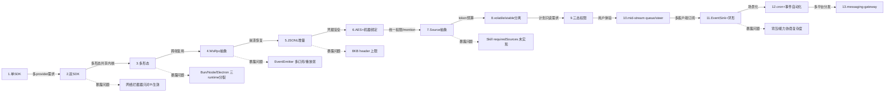
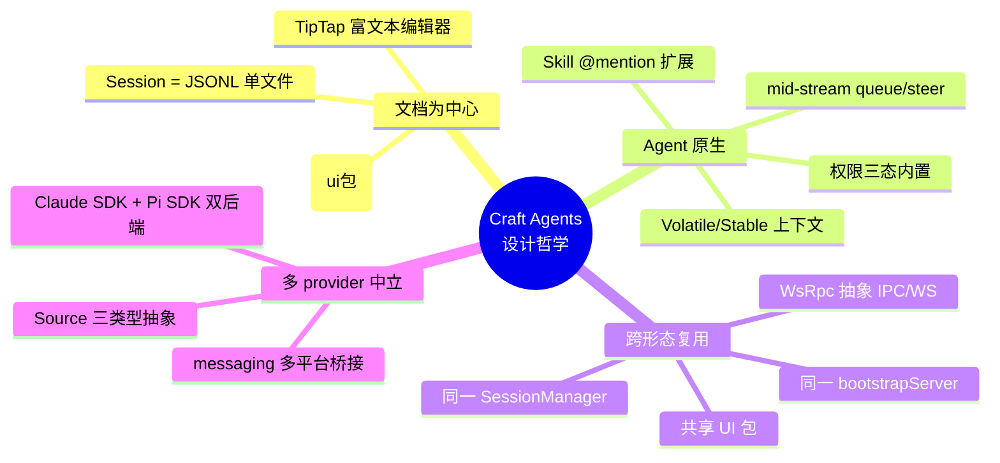
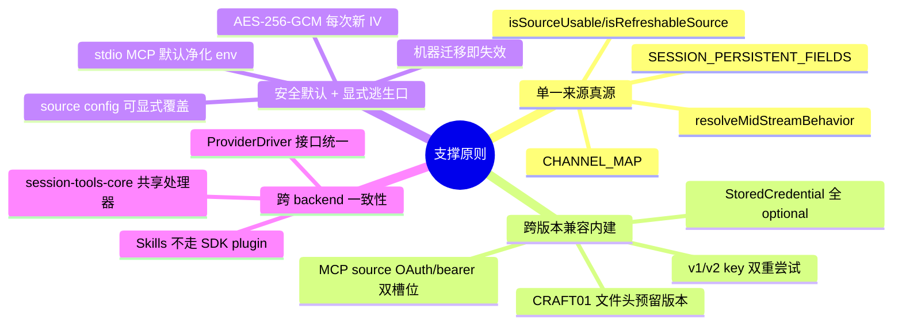

# 第一性原理设计演化

> Craft Agents OSS v0.10.4 · 代码研究 · 第 11 章
> 范围：基于 docs/code-research/ 下已完成的事实型报告（01 架构、02 Agent 内核、03 会话传输、04 Sources/Credentials/Skills、05 数据流），从第一性原理重组设计决策链。
> 重要声明：本章忽略按时间顺序的 commit 流，把每个设计决策视为"为了解决前一个设计的某个问题而引入"。引用格式 `relative-path:line`。

## 0. 总览：把 12 个设计决策串成一条演化链

---

## 一、单 SDK → 双 SDK（Claude + Pi）

### 设计 1：单一 Claude SDK 后端

- **要解决的问题**：理论上最少需要一个能跑 Anthropic Messages API 的后端就够了。
- **最小方案**：直接调用 `@anthropic-ai/claude-agent-sdk`，把所有 Agent 行为收口到 Claude。
- **实际选择**：项目引入了第二条 Pi SDK 后端，承载 Google/OpenAI/Copilot/ChatGPT 等非 Anthropic 路由。
- **复杂度代价**：
  - 多了一个独立子进程 `pi-agent-server`（JSONL over stdio）
  - 多了一个向 Codex 暴露 session 工具的 `session-mcp-server`（stdio MCP）
  - 网络拦截器 `unified-network-interceptor.ts` 仅对 Pi 生效（Claude 自 0.2.113 起改原生二进制，不再接受 Bun `--preload`）
  - 同一份 session-scoped 工具（如 SubmitPlan）需要 `session-tools-core` 共享处理器以避免漂移
- **当前代码锚点**：
  - `packages/shared/src/agent/backend/factory.ts:132` `createBackend` 按 `provider` 分发
  - `packages/shared/src/agent/backend/factory.ts:63` `DRIVER_REGISTRY` 持有 `anthropicDriver / piDriver`
  - `packages/shared/src/agent/claude-agent.ts` vs `packages/shared/src/agent/pi-agent.ts` 两条并行实现
  - `packages/pi-agent-server/src/index.ts:14` 注释明确「将 Pi SDK 的 ESM + 重依赖隔离到独立进程」
  - `packages/shared/CLAUDE.md`：「网络拦截器当前 Pi-only，Claude 路径的 rich tool intent 是 Phase-2 工作」

---

## 二、单形态 → 多形态（Electron / Server / CLI / WebUI / Viewer）

### 设计 2：多产品形态共享同一内核

- **要解决的问题**：单一 Electron 桌面应用无法满足三类需求——长会话常驻、跨机器访问、脚本化、浏览器分享。
- **最小方案**：保留 Electron 桌面 + 写一个独立的远端 server，两套代码分别维护。
- **实际选择**：抽出 `server-core` 包作为「bootstrapServer + WsRpcServer + SessionManager + PlatformServices」的共享底座，让 Electron main 与远端 Bun server 共用同一份入口。形态列表：
  - `apps/electron`：主形态桌面
  - `packages/server`：headless 服务器
  - `apps/cli`：终端客户端
  - `apps/webui`：浏览器 thin client
  - `apps/viewer`：只读会话分享
- **复杂度代价**：
  - 需要一套 `PlatformServices` 抽象，让 `createElectronPlatform`（nativeImage/shell）与 `createHeadlessPlatform`（sharp + 子进程退出）形态无关
  - 三种 runtime 分裂：Bun（server/CLI/subprocess）、Node（WhatsApp worker）、Electron 39（桌面）
  - 构建/打包链复杂：`scripts/electron-build-{main,preload,renderer,resources}.ts` + `scripts/build-server.ts`（跨平台）+ `scripts/build-wa-worker.ts`
- **当前代码锚点**：
  - `apps/electron/src/transport/server.ts:1` re-export `@craft-agent/server-core/transport`
  - `packages/server/src/index.ts:168` 调用同一 `bootstrapServer`
  - `packages/server-core/src/runtime/platform.ts:39` `PlatformServices` 接口
  - `apps/electron/src/main/platform.ts:21` vs `packages/server-core/src/runtime/platform-headless.ts:44`
  - `apps/webui/src/App.tsx:24` 直接 `import('@/App')` 复用 Electron 渲染层

---

## 三、纯 IPC → WsRpc 抽象

### 设计 3：把 Electron IPC 与 WebSocket 统一成同一个 RpcServer/RpcClient

- **要解决的问题**：如果 Electron 用 `ipcMain/ipcRenderer`、远端用 WebSocket，两套调用代码会大幅漂移。
- **最小方案**：在 Electron 内部用 IPC，在跨进程时再写一层 WS 适配。
- **实际选择**：**所有入口都跑在 WsRpcServer + WsRpcClient 之上**，Electron main 也内嵌一个 `WsRpcServer.listen()`，渲染层通过 preload 暴露的 `buildClientApi(client, CHANNEL_MAP)` 把 `RpcClient.invoke(channel, ...args)` 包装成与原 `ElectronAPI` 同形的代理对象。
- **复杂度代价**：
  - 需要能力协商（`CLIENT_OPEN_EXTERNAL / CLIENT_CONFIRM_DIALOG / CLIENT_BROWSE_INVOKE` 等），缺失能力时直接返回 `CAPABILITY_REQUIRED` 而不是降级执行
  - 需要环形缓冲 + 重连回放（`EVENT_BUFFER_MAX_SIZE=500`、TTL 30s）
  - Electron 多工作区需要 `RoutedClient` make-before-break 切换
  - 协议版本、心跳、握手都必须形式化
- **当前代码锚点**：
  - `packages/server-core/src/transport/types.ts` `RpcServer / RpcClient / EventSink` 接口
  - `packages/server-core/src/transport/server.ts:122-365` `WsRpcServer.listen()`
  - `packages/server-core/src/transport/server.ts:746-799` `bufferAndMaybeSendEvent` 缓冲回放
  - `apps/electron/src/transport/channel-map.ts:19-420` ~200 项的 RPC 通道映射表
  - `apps/electron/src/transport/build-api.ts:25-65` `buildClientApi` Proxy 动态代理
  - `apps/electron/src/transport/routed-client.ts:40-255` 多工作区 make-before-break

---

## 四、会话 = 单文件 JSON → JSONL 增量

### 设计 4：JSONL 单文件 + 原子写 + 8KB 头读取

- **要解决的问题**：单 JSON 整体重写有三大痛点——大会话写慢、崩溃时截断风险、列表渲染要解析全部消息。
- **最小方案**：用 SQLite，每次消息一个事务。
- **实际选择**：每个会话一个 `session.jsonl` 文件：
  - 第 1 行 `SessionHeader`（含 `messageCount / preview / lastMessageRole / tokenUsage / lastFinalMessageId` 预计算字段）
  - 第 2 行起每行一条 `StoredMessage`
  - 写入用 `writeFileSync(.tmp) → unlinkSync(target) → renameSync(.tmp, target)` 三步原子替换
  - 列表只读首 8KB
- **复杂度代价**：
  - 需要 `SessionPersistenceQueue` 做 500ms 防抖 + 元数据签名比对（避免 UI 频繁刷新触发无效 IO）
  - 需要 `{{SESSION_PATH}}` 可移植 token 让跨机器加载可行
  - 8KB header 上限是隐式约束（未来 header 加大对象需注意）
  - Windows 上 `unlink → rename` 仍不是完美原子（`unlink` 后到 `rename` 前的窗口里若有读请求会 ENOENT）
- **当前代码锚点**：
  - `packages/shared/src/sessions/jsonl.ts:150-164` `writeSessionJsonl` 原子写
  - `packages/shared/src/sessions/jsonl.ts:80-97` 8KB 头读取
  - `packages/shared/src/sessions/jsonl.ts:23-50` `{{SESSION_PATH}}` token
  - `packages/shared/src/sessions/types.ts:26-56` `SESSION_PERSISTENT_FIELDS` 单一来源
  - `packages/shared/src/sessions/persistence-queue.ts:59-241` 500ms 防抖 + 签名比对
  - `packages/shared/src/sessions/slug-generator.ts:49-78` YYMMDD-adjective-noun slug

---

## 五、凭据明文 → AES-256-GCM + 机器绑定

### 设计 5：单一加密文件 `~/.craft-agent/credentials.enc`

- **要解决的问题**：明文 JSON 存凭据不可接受；OS keychain 三套实现（macOS Keychain / Windows DPAPI / Linux libsecret）复杂且会触发系统弹窗，对 headless server 部署不友好。
- **最小方案**：用 OS keychain，按平台分支。
- **实际选择**：单一加密文件 + AES-256-GCM + PBKDF2 100k 迭代，密钥派生自硬件 UUID（`getStableMachineId`）。
  - 文件布局：64B Header（magic `CRAFT01\0` + flags + salt + reserved）+ IV(12) + AuthTag(16) + Ciphertext
  - 文件权限 `0o600`、目录 `0o700`
  - 每次写入重新生成 IV（GCM 安全要求）
- **复杂度代价**：
  - 需要双重 key 尝试（v2 硬件 UUID / v1 hostname）完成无缝迁移
  - 损坏即删除的兜底策略（解不开就清空让用户重登）
  - `StoredCredential` 全字段 optional 以兼容 API key / OAuth / AWS IAM / GCP Service Account
  - 多 header 凭据（如 Datadog 双 key）只能 JSON 字符串塞进 `value` 字段
  - 机器迁移即失效：解密失败 → 自动删除 → 提示重新登录（这是设计而非缺陷）
- **当前代码锚点**：
  - `packages/shared/src/credentials/backends/secure-storage.ts:14-25` 文件格式注释
  - `packages/shared/src/credentials/backends/secure-storage.ts:35-58` 常量定义
  - `packages/shared/src/credentials/backends/secure-storage.ts:65-99` `getStableMachineId`
  - `packages/shared/src/credentials/backends/secure-storage.ts:233-255` v1/v2 双 key
  - `packages/shared/src/credentials/backends/secure-storage.ts:281-316` `saveStoreSync` 写路径
  - `packages/shared/src/credentials/manager.ts:1-6` 注释明确「避免 OS keychain 弹窗」
  - `packages/shared/src/credentials/types.ts:130-207` key 格式

---

## 六、无 Source → 三类型 Source（mcp/api/local）

### 设计 6：统一 `LoadedSource` 外壳 + mcp/api/local 三类型互斥子配置

- **要解决的问题**：Agent 要调用三类外部资源——MCP server、REST API、本地文件系统——若各写一套集成代码，权限/UI/凭据管理都会分裂。
- **最小方案**：每类资源一个独立子系统，互不共享。
- **实际选择**：抽出 `LoadedSource` 抽象：
  - 三类型共享 `name/slug/icon/tagline/connectionStatus` UI 字段
  - 凭据 key 统一格式 `source_{oauth|bearer|apikey|basic}::{workspaceId}::{sourceSlug}`
  - `isSourceUsable()` / `isRefreshableSource()` 是唯一过滤/刷新判定入口
  - 类型固定不变量：「Source types are fixed: mcp, api, local」（CLAUDE.md hard rule）
- **复杂度代价**：
  - 三类型的传输方式、生命周期、隔离级别都不同，子配置必须互斥
  - `getCredentialId` 决策树需要分 mcp/api 两套规则
  - `loadMcpCredential` 需要双槽位回退（OAuth→bearer）兼容历史 authType 切换
  - slug 改名会导致凭据丢失（key 含 slug，无迁移逻辑）
  - stdio MCP source 必须 env 净化（黑名单 `BLOCKED_ENV_VARS`），且黑名单要在 `mcp/client.ts` 与 `session-tools-core/handlers/transform-data.ts` 两处同步
- **当前代码锚点**：
  - `packages/shared/src/sources/types.ts:16` `SourceType = 'mcp' | 'api' | 'local'`
  - `packages/shared/src/sources/types.ts:441-528` `LoadedSource` 外壳
  - `packages/shared/src/sources/credential-manager.ts:304-336` `getCredentialId` 决策树
  - `packages/shared/src/sources/storage.ts:400-411` `isSourceUsable` 唯一过滤入口
  - `packages/shared/src/mcp/client.ts:43-60` stdio env 净化黑名单
  - `packages/shared/src/mcp/mcp-pool.ts:240-245` `localMcpEnabled` 过滤

---

## 七、固定 prompt → volatile/stable 上下文分离

### 设计 7：把每 turn 都变的内容与会话内不变的内容分块

- **要解决的问题**：若把时间戳、模式状态、Source 状态等每轮都变的内容塞进系统前缀，会反复 re-stamp 上游 prompt-cache 前缀，让所有下游历史命中失败（issue #862）。
- **最小方案**：所有上下文都放用户消息尾部。
- **实际选择**：分两块：
  - **Volatile**（每轮可能变化）：日期时间（分钟精度）、`<session_state>`（权限模式、`plansFolderPath`、`dataFolderPath`）、Source 状态
  - **Stable**（会话内不变）：`<workspace_capabilities>`（local-mcp 启停）、工作目录上下文
  - Claude：全部拼到用户消息尾部
  - Pi：Stable 折进系统前缀，Volatile 路由到用户尾部（Pi 系统前缀缓存对每分钟时间戳极敏感）
- **复杂度代价**：
  - `buildVolatileContextParts` 消费一次性 `consumeModeChangeUserSignal`，**每 turn 只能调用一次**——再次调用会吞掉信号
  - cache-debug hash 必须哈希产出的字符串，不能重新调用 builder
  - Claude/Pi 拼装位置不同，需要两套 prompt 装配逻辑
- **当前代码锚点**：
  - `packages/shared/src/agent/core/prompt-builder.ts:75-159` `buildContextParts`
  - `packages/shared/src/agent/core/prompt-builder.ts:115` `consumeModeChangeUserSignal` 注释
  - `packages/shared/src/agent/mode-manager.ts:318` `consumeUserModeSignal`
  - `packages/shared/CLAUDE.md` L45 不变量：「Volatile 只算一次」

---

## 八、无权限 → 三级权限模式（safe/ask/allow-all）

### 设计 8：固定三态权限 + Bash/PowerShell AST 校验

- **要解决的问题**：Agent 自主调工具需要安全阀；简单的 yes/do-not-ask 二态无法满足「计划模式只读」与「危险操作询问」两个独立需求。
- **最小方案**：两态——全部允许 / 全部拒绝。
- **实际选择**：三态固定（不可扩展，CLAUDE.md hard rule）：
  - `safe`（UI: explore）：只读，Bash 走 AST 校验，MCP/API 走只读模式匹配
  - `ask`（UI: ask to edit）：全部允许，危险操作 PreToolUse 触发弹窗
  - `allow-all`（UI: auto）：全部放行
- **复杂度代价**：
  - 需要 `shouldAllowToolInMode`（`mode-manager.ts:1803`）作为唯一权威判定函数
  - 需要 `bash-validator.ts` 按 AST 分支处理 pipeline/redirect/process_substitution 等 10+ reason
  - 需要 `powershell-validator.ts` 复用 .NET `System.Management.Automation` 解析器
  - `hasDangerousSubstitution`（`mode-manager.ts:579`）检测 `$()`、反引号、`<(`，单引号内的 `$(` 要豁免
  - `normalizeWindowsPathsForBashParser`（`:983`）专门修复 bash-parser 把 `"C:\path\"` 中 `\"` 误当转义引号的 bug
  - `isPathWithinDirectory` 必须做 `realpathSync.native` 防 symlink 逃逸
- **当前代码锚点**：
  - `packages/shared/src/agent/mode-types.ts` `PermissionMode`
  - `packages/shared/src/agent/mode-manager.ts:1775` `ALWAYS_ALLOWED_TOOLS`
  - `packages/shared/src/agent/mode-manager.ts:1803` `shouldAllowToolInMode`
  - `packages/shared/src/agent/mode-manager.ts:1083` `getBashRejectionReason`
  - `packages/shared/src/agent/bash-validator.ts` `validateBashCommand`
  - `packages/shared/src/agent/powershell-validator.ts`

---

## 九、同步发送 → mid-stream queue/steer

### 设计 9：根据 provider 默认走 queue 或 steer，且后端代码不感知差异

- **要解决的问题**：用户在 LLM turn 进行中再发消息时，简单 lock 会拒绝用户（差体验），简单 abort 会浪费已生成 token（差成本）。
- **最小方案**：全局 lock，turn 期间所有新消息排队。
- **实际选择**：分两种语义：
  - `queue`（默认 anthropic）：当前 turn 跑完，新消息排队下一 turn
  - `steer`（默认 pi/pi_compat）：调 `agent.redirect()` 把新消息作为重定向注入当前 LLM turn
  - **后端代码（claude-agent.ts / pi-agent.ts）完全不感知 queue/steer 差异**——queue 模式只是跳过 `agent.redirect()`
  - `resolveMidStreamBehavior(connection)` 是唯一读取入口，禁止业务代码 `connection.midStreamBehavior ?? ...` 直接 fallback
- **复杂度代价**：
  - Claude 后端无原生 `.steer()`，硬中断浪费 token；Pi 后端的 steer 在 parallel-tool 时 args-only delta 会被错误识别为新 tool call（已由 `sanitizeOpenAiHistoryInPlace` 事后补救）
  - Claude 在 `steer` 模式失败时需自行 `forceAbort(Redirect)` 并返回 false 进入 queue 重放
  - Claude 事件适配器会在同一 SDK user message 的 tool_result 之间穿插合成事件（`task_backgrounded / shell_backgrounded / shell_killed`），需 `SourceActivationDrainController` 用 `'batch-boundary'` 策略在批末触发；Pi 用 `'fire-on-non-tool-result'` 策略在第一个非 tool_result 事件触发
- **当前代码锚点**：
  - `packages/shared/src/config/llm-connections.ts:487` `resolveMidStreamBehavior`
  - `packages/shared/src/config/llm-connections.ts:475` `defaultMidStreamBehavior`
  - `packages/server-core/src/sessions/SessionManager.ts:5480-5539` mid-stream 决策点
  - `packages/shared/src/agent/source-activation-drain.ts:49` `SourceActivationDrainController`
  - `packages/shared/src/unified-network-interceptor.ts:1503` `sanitizeOpenAiHistoryInPlace`

---

## 十、单后端处理 → EventSink + ring buffer 广播

### 设计 10：单一广播口 + 50ms 批合并 + PushTarget 三态路由 + 30s 缓冲回放

- **要解决的问题**：流式输出每个 token 都触发 IPC 帧，每秒可能 50+ 帧，UI 卡顿；多客户端订阅（同 workspace 多窗口）+ 断线重连场景下，原生 EventEmitter 不够用。
- **最小方案**：用 Node EventEmitter 直接广播。
- **实际选择**：三层机制叠加：
  1. **Delta 批处理**：`queueDelta / flushDelta` 50ms 合并，把每秒 50+ 帧降到 ~20 帧
  2. **PushTarget 路由**：`'all'` / `'workspace'` / `'client'` 三态，避免跨 workspace 互相打扰
  3. **环形缓冲 + 重连回放**：每客户端 500 条 / 30s TTL，断线 client 保留 60s
- **复杂度代价**：
  - `EventSink` 类型签名 `...args: any[]` 较宽松，无法让编译器保证 channel 与 payload 形状一致（已知技术债）
  - 需要握手协议携带 `protocolVersion: '1.0'` + `reconnectClientId` + `lastSeq`
  - 客户端发现 seq gap 立即告警并触发重放请求，需要 `__transport:reconnected` 特殊事件通知上层
  - 心跳 30s ping，连续两次未收到 pong 即 terminate
  - 服务端 60s `HANDLER_TIMEOUT_MS` 防 request 挂死
- **当前代码锚点**：
  - `packages/server-core/src/transport/types.ts` `EventSink` 类型
  - `packages/server-core/src/sessions/SessionManager.ts:7486-7498` `sendEvent` 调 eventSink
  - `packages/server-core/src/sessions/SessionManager.ts:7504-7548` `queueDelta / flushDelta`
  - `packages/shared/src/protocol/types.ts` `EVENT_BUFFER_MAX_SIZE=500` / `EVENT_BUFFER_TTL_MS=30000`
  - `packages/server-core/src/transport/server.ts:190` `WsRpcServer.push`
  - `packages/server-core/src/transport/server.ts:746-799` `bufferAndMaybeSendEvent`

---

## 十一、无自动化 → cron + event-bus automation

### 设计 11：自带 SchedulerService（cron）+ 事件总线 + matcher 适配器

- **要解决的问题**：手动触发 Agent 太笨重；只支持 cron 又太死板——很多场景是「当某事件发生时跑 Agent」（如 PreToolUse、PermissionModeChange、SessionStart）。
- **最小方案**：只支持 cron 定时触发。
- **实际选择**：事件总线 + cron 调度双驱动：
  - 事件：`LabelAdd / LabelRemove / PermissionModeChange / FlagChange / SessionStatusChange / SchedulerTick / PreToolUse / PostToolUse / SessionStart / SessionEnd`
  - matcher 统一走 `utils.ts` 的 `matcherMatches*` 适配器
  - 可经 `telegramTopic` 把自动触发的会话落到 Telegram 论坛 topic
- **复杂度代价**：
  - 事件总线 + 调度器两套触发源需要统一匹配逻辑
  - 自动触发的会话需要带 `triggeredBy: {automationName, event, timestamp}` 元数据，要进 `SESSION_PERSISTENT_FIELDS`
  - 与 messaging-gateway 集成需要 `setAutomationBinder` 钩子注入 SessionManager
- **当前代码锚点**：
  - `packages/shared/src/automations/automation-system.ts` SchedulerService + event-bus
  - `packages/shared/src/automations/utils.ts` `matcherMatches*` 适配器
  - `packages/shared/src/sessions/types.ts:26-56` `triggeredBy` 字段
  - `packages/messaging-gateway/src/registry.ts` `MessagingGatewayRegistry.bindAutomationSession`

---

## 十二、无消息桥 → messaging-gateway（Telegram/WhatsApp/Lark）

### 设计 12：统一 gateway + 三适配器 + 独立 WhatsApp Node worker

- **要解决的问题**：用户在哪里，Agent 就要能在哪里被触达——Telegram、WhatsApp、Lark/飞书三平台都要支持；但 WhatsApp 用 Baileys（非官方、长连接、Node-only），Bun 和 Electron 都跑不了。
- **最小方案**：只支持 Telegram（grammy）。
- **实际选择**：三层架构：
  - `messaging-gateway` 本体：负责统一事件总线与会话绑定，适配器分 `telegram / whatsapp / lark`
  - `messaging-whatsapp-worker`：独立 `worker.cjs` 子进程承载 Baileys（必须 Node）
  - `TopicRegistry / MessagingGatewayRegistry.bindAutomationSession` 负责会话绑定
- **复杂度代价**：
  - 三种 runtime 分裂在这里达到顶点：Bun（gateway 主进程）+ Node（WhatsApp worker）+ Electron（桌面）
  - Baileys 长连接的 pair/rehydrate 状态需要独立 `pairing.ts / binding-store.ts`
  - 凭据 key 需要新增 `messaging_bearer::{workspaceId}::{platform}` 类型
  - OAuth relay `https://agents.craft.do/auth/callback` 是为了让 Google 等只允许预注册回调 URL 的 provider 支持 WebUI 部署
- **当前代码锚点**：
  - `packages/messaging-gateway/src/adapters/{telegram,whatsapp,lark}/`
  - `packages/messaging-gateway/src/gateway.ts` 统一入口
  - `packages/messaging-whatsapp-worker/package.json:5` 描述明确「Baileys-based, unofficial API」
  - `packages/messaging-whatsapp-worker/src/worker.cjs` Node-only 子进程
  - `packages/messaging-gateway/src/topic-registry.ts` 会话绑定
  - `packages/messaging-gateway/src/registry.ts` `bindAutomationSession`

---

## 北极星：Craft Agents 的核心设计哲学

> **「文档为中心、Agent 原生、跨形态复用」三位一体。**

一句话拆解：

- **文档为中心**：TipTap 富文本编辑器是一等公民，会话本身就是 JSONL 单文件（可分享、可移植、可外包），Markdown 渲染在 ui 包共享给所有形态。
- **Agent 原生**：权限三态、Skill @mention、Volatile/Stable 上下文、mid-stream queue/steer、PrerequisiteManager read-before-execute——这些都不是「外挂功能」，而是内核基础设施，任何 backend 都自动获得。
- **跨形态复用**：同一 `bootstrapServer` + 同一 `SessionManager` + 同一 `WsRpcServer` 在 Electron / headless server / CLI / WebUI / Viewer 五种形态下共用，差异仅折叠在 `PlatformServices` 与客户端包装方式上。

支撑这条北极星的次级原则：

---

## 未解决的设计张力

### 张力 1：native binary 与 preload 的不兼容

- **现状**：Claude SDK 自 0.2.113 起改用 per-platform 原生 `claude` 二进制（`@anthropic-ai/claude-agent-sdk-binary/<binary>`），不再接受 Bun `--preload` 标志。
- **后果**：曾经依赖拦截器实现的功能（rich tool intent、fast-mode override、MalformedBodyError 校验、OpenAI SSE 剥离）对 Claude 失效，目前只对 Pi 生效。
- **代码锚点**：`packages/shared/CLAUDE.md` L44；`packages/shared/src/unified-network-interceptor.ts:857` 仅在 Pi 子进程通过 `args.unshift('--require', interceptorPath)` 加载（`pi-agent.ts:419`）。
- **未来**：Phase-2 计划迁到 SDK hooks 或本地代理，但研究树中未见进展。

### 张力 2：zod 双版本

- **现状**：`packages/shared` 声明 `zod: ">=4.0.0"`，`packages/session-mcp-server` 声明 `zod: "^4.0.0"`。两套版本范围不完全一致，存在 transitive 漂移风险。
- **后果**：如果某个 transitive 依赖锁到 zod 3.x，可能在运行时出现 schema 不兼容（zod 4 的 discriminatedUnion 与 3.x 不互通）。
- **代码锚点**：`packages/shared/package.json:87`；`packages/session-mcp-server/package.json:19`。
- **风险**：MCP schema 与 SDK schema 必须严格对齐，否则 Pi 后端通过 `session-mcp-server` 调用 SubmitPlan 等工具时会失败。

### 张力 3：Bun vs Node 的 runtime 分裂

- **现状**：项目同时存在三种 runtime：
  - **Bun**：`packages/server` 入口、CLI、`pi-agent-server` 子进程、`session-mcp-server` 子进程
  - **Node**：`messaging-whatsapp-worker`（Baileys 必须 Node）、Electron main（Electron 39 内嵌的 Node）
  - **Electron**：渲染层（Chromium）
- **后果**：
  - 构建脚本必须区分：`scripts/build-server.ts`（Bun 跨平台编译）+ `scripts/build-wa-worker.ts`（Node 单独打 worker.cjs）+ `scripts/electron-build-{main,preload,renderer,resources}.ts`
  - `bunfig.toml:9` 必须用 hoisted linker 而非 isolated，否则 Vite/esbuild 的传递依赖（i18next / tiptap / pdfjs-dist）会被破坏
  - Bun 不支持 Baileys 的某些 Node-only API（如 `crypto.createCipheriv` 的某些 legacy 行为）
- **代码锚点**：`bunfig.toml:9`；`packages/messaging-whatsapp-worker/package.json:16`；`package.json:8-15` `trustedDependencies`（含 electron、koffi、sharp 等原生模块）。
- **未来**：如果 Bun 完全兼容 Baileys 或 Baileys 出官方 Node 替代品，可消除一条 runtime；目前看是长期债务。

---

## 附录：跨设计的「问题 → 设计 → 新问题」演进矩阵

| # | 旧设计遗留痛点 | 新设计 | 新设计引入的新债务 |
|---|---|---|---|
| 1 | 单 Claude SDK 无法接 Google/OpenAI/Copilot | 双 SDK（Claude+Pi） | 网络拦截器只对 Pi；session-tools-core 防漂移 |
| 2 | 单 Electron 无法常驻/跨机/脚本化 | 多形态（Electron/Server/CLI/WebUI/Viewer） | 三 runtime 分裂；构建链复杂 |
| 3 | IPC vs WS 两套调用代码 | WsRpc 抽象统一 | 能力协商、环形缓冲、握手协议复杂度 |
| 4 | 单 JSON 整体重写慢/崩溃截断 | JSONL + 原子写 + 8KB 头 | 8KB 上限；Windows unlink-rename 非完美原子 |
| 5 | OS keychain 弹窗/跨平台不一致 | AES-256-GCM 单文件 | 双 key 迁移；机器迁移即失效 |
| 6 | MCP/API/local 各写一套 | Source 三类型统一抽象 | getCredentialId 决策树；slug 改名丢凭据 |
| 7 | 每轮 re-stamp 破坏 prompt cache | Volatile/Stable 分离 | 每 turn 只能调一次；cache-debug 不能复算 |
| 8 | 二态权限无法表达计划只读 | 三态 safe/ask/allow-all | AST 校验 + Windows 路径修复；不可扩展 |
| 9 | 简单 lock 拒绝用户/浪费 token | mid-stream queue/steer | Claude 无原生 steer；parallel-tool args-only 漂移 |
| 10 | EventEmitter 多订阅/重放弱 | EventSink + 环形缓冲 | 类型签名宽松；心跳/超时/握手协议全套 |
| 11 | 手动触发太笨重 | cron + 事件总线自动化 | 自动触发会话需 trigger 元数据；binder 钩子 |
| 12 | 单 Telegram 不够 | messaging-gateway 多平台 | Baileys Node-only；三 runtime 顶点；OAuth relay |

---

## 未解决疑问

1. **网络拦截器迁移到 Claude SDK hooks 的具体方案**：CLAUDE.md 明确列为 Phase-2 工作但研究树中未见设计文档。是否计划用 SDK 的 `onBeforeRequest` 钩子（如果 SDK 提供）还是写本地代理？关键挑战是 rich tool intent（如 `_intent / _displayName` 抽取）需要在响应流中处理，hooks 是否足够表达力未确认。

2. **zod 双版本是否会随 SDK 升级而崩**：`@anthropic-ai/claude-agent-sdk` 内部用的 zod 版本（推测 3.x，因为 0.3.170 发布时 zod 4 仍在 RC）与项目强制要求的 zod 4.x 在 discriminatedUnion API 上不兼容。如果 SDK 在某次小版本升级后开始用 zod 4 的 API，是否会破坏 `packages/shared` 现有的 schema？目前类型检查通过，但隐藏的运行时漂移未覆盖。

3. **远端 server 的「remote workspace」与本地 workspace 的会话所有权边界**：`packages/server/src/index.ts:266` 显式过滤 `!ws.remoteServer` 来初始化 messaging，提示存在 remote-owned workspace；其在桌面 thin client 下的会话同步、权限边界、凭据隔离如何在第一性原理下统一仍是开放问题——这关系到北极星「跨形态复用」是否真的无懈可击。
