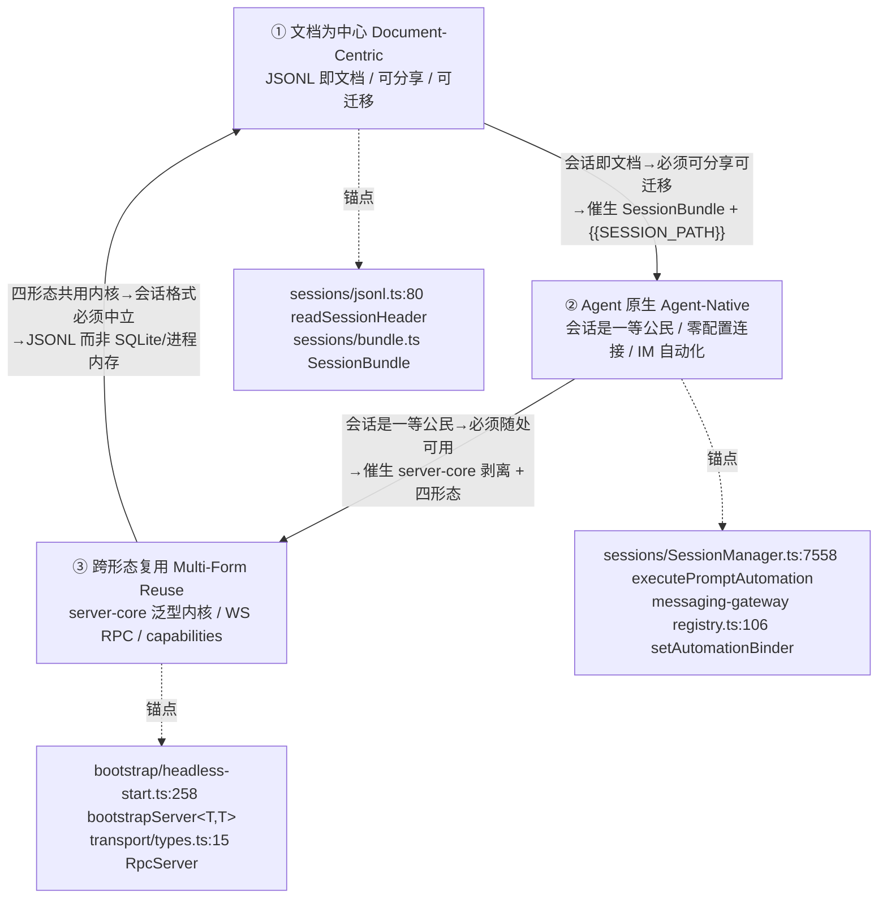
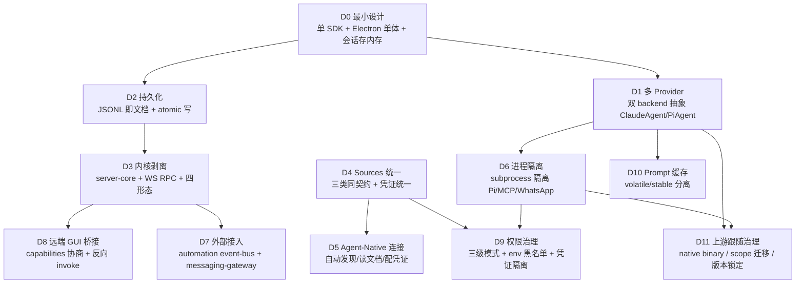
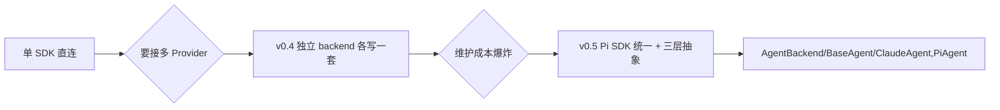
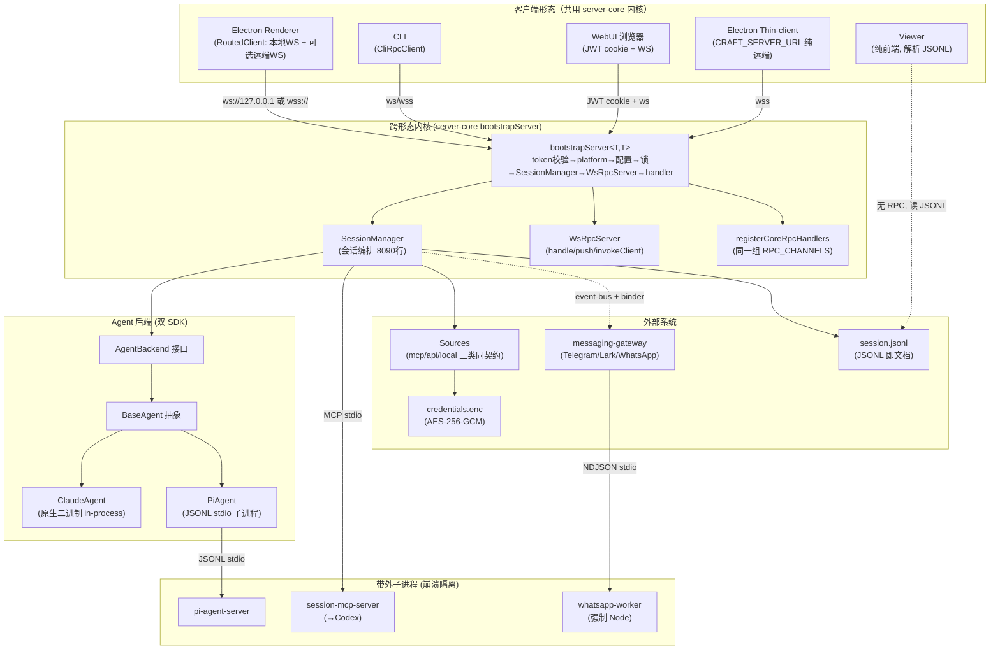

# 从 0 设计：Craft Agents 工作站：一步一步演进

> 本文档从第一性原理推演 Craft Agents（craft.do 开源 Agent 工作站，Bun monorepo，双 SDK）的设计演化链。**刻意忽略 commit 时间顺序**，回答："如果今天从零设计这套系统，最小方案是什么？为什么会被一步步逼成今天的样子？"所有结论附源码锚点（`文件路径` + 函数/类型），推断明确标注。
>
> 前置参考：`01_architecture.md`（架构全景）、`02_mechanism_agent.md`（Agent 内核三层抽象）、`03_mechanism_session_transport.md`（会话与传输）、`04_mechanism_sources_credentials_skills.md`（Sources/凭证/技能）、`05_data_flow.md`（数据流）、`09_evolution_history.md`（commit 史）。

---

## 这一节解决什么问题

本节不复述源码，也不复述提交历史。它要做的是：**抛开时间线，用一条"问题→决策→代价"的因果链，解释 Craft Agents 为何长成今天这样**——为什么是双 SDK 而不是单 SDK？为什么 JSONL 而不是 SQLite？为什么 Electron renderer 也走 WS 而不是 IPC？为什么会有 `claudeCliPath` 这种"指鹿为马"的字段名？

读完应能：用一句话解释任何一个"奇怪设计"是被什么问题逼出来的；说出 3 个尚未解决的设计张力及现状。

---

## 第一性原理

**系统要解决的根本问题**：让人类以"管理文档"的方式与多家最强 AI Agent（Claude、Pi/Gemini/GPT/Copilot 等）协作——会话是一等公民（可收件、可状态流转、可标签、可归档、可分享），且能零配置接入任意 MCP/REST API/本地源、被 IM 自动化事件驱动、跨桌面/远端/CLI/Web 四形态复用同一内核。

**最小可行设计**：一个进程 + 一个 SDK（Claude Agent SDK）+ 一个 Electron 窗口 + 会话存内存。这正是 OSS 起点（`0fe831b`，v0.2.x，`package.json` 名为单数 `craft-agent`，`description: "Claude Code-like agent for Craft documents"`）的形态——它够用，但只够用一瞬。

**不可违背的约束**：
- **崩溃安全**：Agent 会话动辄几十分钟、上百条消息，落盘中途崩溃不能整段丢失。
- **跨形态复用**：同一份业务逻辑必须同时驱动 Electron / Headless Server / CLI / WebUI，否则四份代码迅速漂移。
- **多 Provider 中立**：不能强绑单一 LLM 厂商（Anthropic），否则一个上游变更就瘫痪。
- **机密性**：OAuth token / API key 不能明文落盘，也不能频繁弹系统钥匙串。
- **进程隔离**：第三方 MCP server、Pi SDK、WhatsApp 协议栈崩溃不能拖垮主进程。
- **可观测/可分享**：会话必须可读、可 diff、可跨机器迁移——它是"文档"。

**主要权衡轴**：
- 简单性 vs 可靠性（atomic write 的写放大 vs SQLite 的运维）
- 灵活性 vs 学习成本（双 backend 抽象 vs 单 SDK 直连）
- 便携性 vs 性能（JSONL 文件 vs 嵌入式 DB）
- 上游跟随 vs 自主控制（native binary 化石 vs 自管 CLI）

---

## 北极星三角：三位一体的取舍标准是否成立？

研究目标要求核实「**文档为中心（Document-Centric）+ Agent 原生（Agent-Native）+ 跨形态复用（Multi-Form Reuse）**」三位一体是否真是贯穿全局的取舍标准。**结论：成立，且三条轴互为因果**——下面给源码锚点逐一论证。

### ① 文档为中心（Document-Centric）—— 锚点坐实

**JSONL 即文档**：会话以 `{workspaceRootPath}/sessions/{id}/session.jsonl` 落盘，首行 `SessionHeader`（预计算 messageCount/preview/tokenUsage），第 2 行起每行一条 `StoredMessage`（`packages/shared/src/sessions/jsonl.ts:5` 注释「Line 1 = SessionHeader, Lines 2+ = StoredMessage」）。`readSessionHeader` 只读首行 8KB（`jsonl.ts:80-84`，`Buffer.alloc(8192)` 注释「8KB is plenty for metadata header」）——这是"会话是文档"的物理体现：列表 UI 像翻文件柜抽屉卡片，零消息解析。

**可分享**：`SessionBundle`（`packages/shared/src/sessions/bundle.ts:4` 注释「portable representation of a session directory」）把整个会话目录打包成可传输形态，`apps/viewer` 是纯前端只读分享视图（`agents.craft.do/s/<id>`）——会话像 Google Doc 一样可发链接。

**可迁移**：`{{SESSION_PATH}}` 便携 token（`jsonl.ts:23`）在 stringify 后/parse 前对整行 JSON 替换绝对路径，让会话从 Mac 拷到 Linux、从 `/Users/alice` 拷到 `/home/bob` 无损迁移。**这条决策直接排除了 SQLite**——黑盒二进制 DB 做不到便携、可读、可 diff（详见决策链 D2）。

### ② Agent 原生（Agent-Native）—— 锚点坐实

**会话是一等公民**：`SessionManager`（`packages/server-core/src/sessions/SessionManager.ts`，8090 行）是业务核心，会话有完整生命周期状态机（Idle→Processing→Handoff→Idle）、收件箱语义（`hasUnread`/`lastReadMessageId`/未读摘要）、状态工作流（`sessionStatus`）、标签（`labels`）、归档。**这不是"聊天记录"，而是"待办文档"**。

**零配置连接任意服务**：三类 Source 同契约（`SourceType = 'mcp' | 'api' | 'local'`，`packages/shared/src/sources/types.ts:16`），靠 `type` 字段选互斥子块，连接产出的"工具"对上层一致——接新服务只需声明 config，不写代码（决策链 D4）。

**IM 自动化驱动**：`executePromptAutomation`（`SessionManager.ts:7558`）让 cron/标签变化/工具调用等事件自动 spawn 会话；`messaging-gateway` 通过 `setAutomationBinder`（`registry.ts:106`）把会话绑定到 Telegram topic / Lark 群——Agent "住"在 IM 里，这是"Agent Native"的产品化。

### ③ 跨形态复用（Multi-Form Reuse）—— 锚点坐实

**泛型内核**：`bootstrapServer<TSessionManager, THandlerDeps>()`（`packages/server-core/src/bootstrap/headless-start.ts:258`）把"可变部分"（`platformFactory`/`createSessionManager`/`createHandlerDeps`/`registerAllRpcHandlers`/...）全部抽成回调 options，"不变部分"是固定启动序列（token 校验→platform→配置→启动锁→SessionManager→WsRpcServer→handler 注册→event sink）。Electron main（`apps/electron/src/main/index.ts:627`）与 Headless Server（`packages/server/src/index.ts:168`）调**同一段启动代码**。

**WS RPC 统一传输**：`RpcServer`/`RpcClient` 接口（`transport/types.ts:15-32`）是跨形态契约基石。Electron renderer 经 `WsRpcClient` 连 `ws://127.0.0.1`，远端 thin-client 连 `wss://vps`，CLI 用 `CliRpcClient`——**业务代码零分支**，差异仅在 URL 与客户端能力（决策链 D3）。

**capabilities 协商**：`LOCAL_CLIENT_CAPABILITIES`（`capabilities.ts:29`，含 `client:browser:invoke`）让远端 server 能反向 `invokeClient` 调用本地客户端的 OS 能力（如驱动本地浏览器面板）——这是"远端算力 + 本地 GUI"可组合的必要条件（决策链 D8）。

### 三角的因果闭环

三条轴不是并列的，而是**互为因果的闭环**：
- 因为"文档为中心"（JSONL），会话天然可分享可迁移 → 催生"Agent 原生"（会话是一等公民，能被分享/自动化）。
- 因为"Agent 原生"（会话要随处可用），内核必须脱离单一宿主 → 催生"跨形态复用"（server-core 剥离）。
- 因为"跨形态复用"（四形态共用内核），会话格式必须中立便携 → 反向强化"文档为中心"（JSONL 而非进程内存/SQLite）。

**这就是贯穿全局的取舍标准。**后续每一个设计决策，都可以追溯到这三条轴之一被某个"问题"逼到了墙角。

---

## 总体演进地图

| 决策 | 最小设计 | 暴露问题 | 新增设计 | 复杂度代价 | 当前代码锚点 |
|------|----------|----------|----------|------------|--------------|
| D1 | 单 Claude SDK | 要接 OpenAI 等 | 双 backend 抽象 | 双 SDK 同步防漂移 | `backend/types.ts:337` `AgentBackend` |
| D2 | 会话存内存 | 崩溃/分享/回放 | JSONL + atomic 写 | 写放大/解析/header 维护 | `jsonl.ts:80` `persistence-queue.ts:157` |
| D3 | Electron 单体 | 远端/CLI/无头 | server-core + WS RPC | transport 抽象/capabilities | `headless-start.ts:258` `transport/types.ts:15` |
| D4 | 硬编码工具 | 接任意 API/MCP | 三类 Source 同契约 | Source/credential 复杂度 | `sources/types.ts:16` |
| D5 | 手动配置 | "说一句就连" | 自动发现/读文档/配凭证 | 不可预测性/权限模型 | `BaseAgent.extractSkillPaths` |
| D6 | 单进程 | MCP/Pi 崩溃 | subprocess 隔离 | 多进程通信复杂度 | `pi-agent.ts:388` `whatsapp/index.ts:153` |
| D7 | 本地触发 | 外部系统接入 | event-bus + gateway | 协议收敛/循环依赖治理 | `registry.ts:106` `event-fanout.ts:26` |
| D8 | 本地浏览器 | 远端缺 GUI | capabilities 协商 | 反向 RPC/安全 | `capabilities.ts:29` |
| D9 | 全放行 | 安全/机密 | 三级权限 + env 黑名单 | 三套实现同步 | `mode-types.ts:24` `mcp/client.ts` |
| D10 | 全进 system prompt | 击穿缓存 | volatile/stable 分离 | 每 turn 仅一次约束 | `prompt-builder.ts:105` |
| D11 | caret 版本 | 上游频繁冲突 | native binary + 精确锁定 | bundle 膨胀/命名化石 | `runtime-resolver.ts:19` |

---

## 分阶段推演

### D1：单 SDK → 多 Provider 需求 → 双 backend 抽象

**最小方案**：直接调 `@anthropic-ai/claude-agent-sdk` 的 `query()`，UI/Session 层 import SDK。

**为什么不够**：用户要接 OpenAI、Gemini、Copilot、OpenRouter、Ollama。若每个 provider 直接在 UI 层分支，每个特性（权限、技能、流式中断、源管理）都要写 N 遍且极易漂移。OSS 早期 v0.4.0 曾试过"Codex/OpenAI 独立 backend"路线（`packages/codex-types`），**只活了一个版本就被 Pi SDK 统一取代**（v0.5.0 release notes Breaking Changes：standalone Codex/Copilot backends replaced by unified Pi SDK backend）——这是"自造多 provider 抽象成本过高"的实证。

**新增设计**：建立三层抽象——`AgentBackend`（接口，统一对外契约）→ `BaseAgent`（抽象类，收敛横切逻辑）→ `ClaudeAgent`/`PiAgent`（具体类，特化差异）。`factory.ts` 按 `providerType` 路由，新增厂商默认走 Pi 通道。

**复杂度代价**：
- **双 SDK 同步防漂移**：两套 SDK 的运行模型根本不同（Claude 是原生二进制 in-process 异步流，Pi 是 JSONL-over-stdio 子进程）。`BaseAgent` 收敛了"不变部分"（生命周期、权限、技能注入），但"特异部分"（steer 机制、thinking 映射、prompt 落点）仍需两处实现。release notes 反复出现漂移证据：v0.6.0「Aligned tool listing across all backends to prevent drift」、v0.9.2「Pi backend silently dropped the Craft system prompt … Anthropic backend was unaffected」。
- **mid-stream 行为不对称**：Pi 原生 `.steer()` 无副作用，Claude 的 steer 是模拟（无工具调用时失败），被迫做成"每连接可配 + provider 默认"。

**当前代码锚点**：
- `packages/shared/src/agent/backend/types.ts:337` `AgentBackend`（接口，~40 方法 + 7 回调）
- `packages/shared/src/agent/base-agent.ts:162` `BaseAgent`（`chat()` 模板方法 `:1008`，`chatImpl` 抽象 `:1069`）
- `packages/shared/src/agent/claude-agent.ts:471` `ClaudeAgent extends BaseAgent`（向后兼容别名 `CraftAgent` `:2900`）
- `packages/shared/src/agent/pi-agent.ts:157` `PiAgent extends BaseAgent`
- `packages/shared/src/agent/backend/factory.ts:132` `createBackend`（按 `config.provider` switch）；`:251` `providerTypeToAgentProvider`

---

### D2：单会话内存态 → 崩溃/分享/回放需求 → JSONL 即文档 + atomic 写

**最小方案**：会话消息存进程内存 `Message[]`，不落盘。

**为什么不够**：
- **崩溃即丢失**：Agent 会话动辄几十分钟。进程被 kill / 断电 / 崩溃，整段对话没了。
- **无法分享**：内存态无法像文档一样发链接、跨机器迁移。
- **无法回放/分支**：没有持久化就没有 fork 对话探索不同路径。

**新增设计**：会话以 JSONL 文件落盘（首行 header + 每行一条 message），atomic 写保证崩溃安全，`{{SESSION_PATH}}` token 保证跨机器迁移。

**复杂度代价**：
- **写放大**：每次 persist 重写整份文件（非增量 append），而非 SQLite 的行级写。但 debounced 队列（500ms）+ per-session 串行 + 典型会话几百条消息，写量可控——这是"便携/可读"换"写性能"的有意识取舍。
- **header 维护**：列表 UI 需要的 messageCount/preview/lastFinalMessageId 必须在写盘时预计算进 header，否则列表加载要解析全部消息。
- **签名防回退竞态**：atomic write 的 `unlink`/`rename` 会触发 `fs.watch`，SM 的 watcher 可能误判为外部改动并回滚内存元数据——被迫引入"签名在写之前更新"的顺序不变量（`persistence-queue.ts:154`）。
- **冷启动恢复**：要扫描 `isQueued===true` 的孤儿消息重排队（崩溃遗留），还要启动时清理残留 `.tmp`。

**为什么不是 SQLite**：JSONL 让会话天然可读、可 diff、可分享（`SessionBundle`）、可被外部工具处理、可跨机器迁移（`{{SESSION_PATH}}`）。SQLite 是黑盒二进制，丧失这些——**这直接服务于"文档为中心"北极星**。

**当前代码锚点**：
- `packages/shared/src/sessions/jsonl.ts:80` `readSessionHeader`（8KB 首行）、`:23` `SESSION_PATH_TOKEN`、`:150` 同步 atomic 写
- `packages/shared/src/sessions/persistence-queue.ts:157` 异步 atomic 写（`writeFile(.tmp)`→`unlink`→`rename`）、`:154` 签名提前更新
- `packages/shared/src/sessions/bundle.ts:4` `SessionBundle`（portable representation）
- `packages/shared/src/sessions/storage.ts:363` 启动清理残留 `.tmp`

---

### D3：单桌面形态 → 远端/CLI/多设备需求 → 内核剥离 server-core + WS RPC

**最小方案**：Agent 逻辑、UI、传输全塞进 Electron 主进程，renderer 经 Electron IPC 调主进程。

**为什么不够**：
- **强绑 Electron**：无法在 Linux VPS / Docker / CI 无头运行，无法做远端 server。
- **无法多形态复用**：CLI、WebUI、移动端各写一份业务逻辑，迅速漂移。
- **IPC 污染内核**：handler 直接依赖 `ipcMain.handle`，换传输就要重写所有 method。

**新增设计**：把"server 生命周期 + RPC + session 编排 + handler"抽成泛型 `bootstrapServer<TSessionManager, THandlerDeps>()`，让 Electron 与 headless 用**同一段启动代码**。**关键决策：Electron renderer 也走 WS RPC 而非 Electron IPC**——main 内嵌 WsRpcServer，renderer 经 `WsRpcClient` 连 `ws://127.0.0.1`。这样"本地桌面"与"远端瘦客户端"renderer 代码完全相同，只差 URL。

**复杂度代价**：
- **transport 抽象层**：要定义 `RpcServer`/`RpcClient` 接口、envelope 信封、codec（二进制 Uint8Array 经 base64 往返）、handshake、capabilities 协商。
- **capabilities 协商机制**：远端 server 缺 GUI，要能反向 `invokeClient` 调本地浏览器/对话框——引入 `LOCAL_CLIENT_CAPABILITIES` + `hasClientCapability`/`findClientsWithCapability`。
- **协议形式化**：channels/DTO/event map 必须落到 `shared/protocol` 并有 wire-format 稳定性测试，否则跨形态版本不兼容。
- **Electron IPC 残留**：少数 GUI-only 能力（`__dialog:showMessageBox`、`shell.openExternal`）仍走 `ipcMain.handle`，形成"主 RPC 走 WS、GUI 桥走 IPC"的双轨。

**当前代码锚点**：
- `packages/server-core/src/bootstrap/headless-start.ts:258` `bootstrapServer<T,T>`
- `packages/server-core/src/transport/types.ts:15` `RpcServer` 接口（`handle`/`push`/`invokeClient`/`hasClientCapability`）
- `apps/electron/src/preload/bootstrap.ts:103` renderer 经 `WsRpcClient` 连本地 WS（非 IPC）
- `apps/electron/src/transport/routed-client.ts` `RoutedClient`（LOCAL_ONLY vs REMOTE_ELIGIBLE 路由）

> **推断**：v0.6.0 的 `pi-agent-server` 子进程化（"Agent 逻辑可脱离 Electron 进程"）为 v0.7.0 的 server-core 剥离做了技术验证（时间相邻 + 同主题），是"剥离子进程可行"的先行实验。

---

### D4：硬编码工具 → 接任意 API/MCP 需求 → 三类 Source 同契约 + 凭证统一

**最小方案**：工具集硬编码在代码里（Read/Write/Bash 等内置工具）。

**为什么不够**：用户要接 Linear、Slack、GitHub、自定义 REST API、本地 Obsidian 库。每接一个都得写一套独立的连接、鉴权、prompt 注入逻辑——膨胀且易错。这是"零配置连接任意服务"产品承诺的硬需求。

**新增设计**：三类 Source 共用 `FolderSourceConfig`，靠 `type: 'mcp' | 'api' | 'local'` 选互斥子块。**差异只在"如何连接"，连接产出的"工具"对上层一致**：MCP 源暴露 stdio/http MCP 工具，API 源被 `api-tools.ts` 包装成 in-process SDK MCP server，local 源提供文件路径上下文。凭证由 `SourceCredentialManager` 按规则映射到统一的 `source_oauth/source_bearer/source_apikey/source_basic` 四个槽。

**复杂度代价**：
- **Source 契约复杂度**：`FolderSourceConfig` 要容纳三种互斥子块 + 各自的 authType/transport/renewEndpoint。
- **凭证体系膨胀**：OAuth（prepare/exchange/refresh，provider 路由 google/slack/microsoft/generic/mcp）、bearer/apikey/basic、自定义 renew endpoint、token 自动刷新限流（5min cooldown 防狂刷被封）。
- **跨进程凭证传递**：MCP 子进程无 keychain 访问权，主进程要把解密 token 写 `.credential-cache.json` 给子进程读——机密性责任集中在主进程。
- **builtin source 弃用残留**：`getDocsSource()` 返回 placeholder 但 `craft-agents-docs` 实际作为 always-on MCP 直接配置，builtin 体系已弃用却保留兼容（`04` 报告待解决疑问）。

**当前代码锚点**：
- `packages/shared/src/sources/types.ts:16` `SourceType = 'mcp' | 'api' | 'local'`、`:441` `FolderSourceConfig`、`:451` `type: SourceType`
- `packages/shared/src/sources/credential-manager.ts:1329` `sourceNeedsAuthentication`
- `packages/shared/src/credentials/backends/secure-storage.ts:44` `credentials.enc`（AES-256-GCM）
- `packages/session-mcp-server/src/index.ts:95-145` 子进程读 `.credential-cache.json`

---

### D5：手动配置 → agent-native「说一句就连」需求 → 自动发现/读文档/配凭证

**最小方案**：用户手动填 baseUrl、API key、写系统提示词告诉 Agent 怎么用。

**为什么不够**：产品主张是"agent-native"——用户 `[source:linear]` 一 mention，Agent 就该自动连上、读懂 guide、调对工具。手动配置违背"零配置连接任意服务"承诺。

**新增设计**：
- **@mention 即时激活**：`parseMentions()` 解析 `[source:linear]`/`[skill:commit]`，`SourceManager.formatSourceState()` 每轮生成 `<sources>` XML 块注入 prompt，对有 guide 的源强制要求"先 Read guide.md 才能调工具"。
- **技能 read-before-execute**：`BaseAgent.extractSkillPaths()` 解析 `[skill:slug]` 成 `SKILL.md` 绝对路径但**不读文件**，由 `PrerequisiteManager` 在工具调用前拦截，直到读完才放行——这让 Agent "发现"技能而非"被告知"。
- **OAuth 自动发现**：WebUI OAuth relay 用稳定回调 `https://agents.craft.do/auth/callback`，把真正回调编码进 state 信封，Google 等只需注册一个地址。

**复杂度代价**：
- **不可预测性**：Agent 自动激活源、自动读 guide，行为路径变长，调试困难。
- **权限模型复杂化**：自动激活的源可能触发危险工具，被迫引入三级权限模式（safe/ask/allow-all）+ source 激活 mid-turn 自动重试去重（`autoRetryPending`，#804）。
- **guide 强制读取的脆弱性**：依赖 LLM 真的去 Read guide.md，若 LLM 跳过就读不懂工具。

**当前代码锚点**：
- `packages/shared/src/agent/base-agent.ts:930` `extractSkillPaths`、`:1022` `prerequisiteManager.registerSkillPrerequisites`
- `packages/shared/src/agent/core/source-manager.ts:159` `formatSourceState`
- `packages/shared/src/mentions/index.ts:62` `parseMentions`
- `packages/shared/src/auth/oauth-relay.ts` WebUI OAuth relay

---

### D6：单进程 → MCP/Pi 崩溃隔离需求 → subprocess 隔离

**最小方案**：所有逻辑（Agent SDK、MCP server、IM 协议栈）跑在主进程。

**为什么不够**：
- **Pi SDK 是 ESM + 重依赖**，直接进 Electron 主进程有打包/隔离问题。
- **第三方 MCP server 可能崩溃/段错误**，拖垮主进程等于拖垮所有会话。
- **WhatsApp 用 Baileys 重实现非官方协议**，密码学依赖（libsignal/curve25519）**只能跑在 Node，Bun 跑不了**。

**新增设计**：把不稳定/异构的部分 spawn 成独立子进程，用 stdio 协议通信。
- `pi-agent-server`：JSONL over stdio（崩溃/段错误隔离、工具执行隔离、内存隔离）。
- `session-mcp-server`：MCP stdio（向 Codex 暴露会话工具，回调用 stderr `__CALLBACK__` 前缀 JSON）。
- `messaging-whatsapp-worker`：NDJSON over stdio（强制 Node，Baileys 全树 bundle）。

**复杂度代价**：
- **多进程通信复杂度**：三套不同的 stdio 协议（JSONL / MCP / NDJSON），每套要定义消息类型、分帧、错误处理。
- **Node vs Bun runtime 分裂**：WhatsApp worker 必须 Node，但主进程是 Bun/Electron。Electron 宿主用 `process.execPath` + `ELECTRON_RUN_AS_NODE=1`，Bun/headless 宿主必须显式传 `node`——**同一份 worker 代码，两种 spawn 方式**。
- **凭证跨进程传递**：子进程无 OS 鉴权上下文，只能读主进程写的明文缓存文件，refresh 必须回主进程。
- **生命周期管理**：`McpClientPool`/`closeAll` 要并行关闭全部子进程，处理僵尸进程。

**当前代码锚点**：
- `packages/shared/src/agent/pi-agent.ts:388` spawn `pi-agent-server`（JSONL stdio）
- `packages/messaging-gateway/src/adapters/whatsapp/index.ts:153` spawn WhatsApp worker（`nodeBin ?? process.execPath` + `ELECTRON_RUN_AS_NODE`）
- `packages/session-mcp-server/src/index.ts:10` stderr `__CALLBACK__` 回调机制
- `packages/shared/src/mcp/client.ts` `BLOCKED_ENV_VARS`（env 黑名单，防泄漏主进程 token 给 MCP 子进程）

---

### D7：本地触发 → 外部系统接入需求 → automation event-bus + messaging-gateway

**最小方案**：Agent 只能由用户在 UI 点"发送"触发。

**为什么不够**：产品主张是"Agent Native"——Agent 要能"住"在 IM 里，被定时/cron、标签变化、工具调用等事件自动驱动，把输出推回 Telegram topic / Lark 群。否则 Agent 只是个"等用户敲键盘"的工具，不是"原生自动化"。

**新增设计**：
- **automation event-bus**：`executePromptAutomation` 让事件（`SchedulerTick`/`LabelAdd`/`SessionStatusChange`/`PreToolUse`...）自动 spawn 带 `triggeredBy` 的会话。
- **messaging-gateway**：三平台 adapter（Telegram grammY / Lark / WhatsApp worker），把 session 事件渲染回 IM，入站消息路由到绑定 session。
- **fan-out sink**：`createFanOutSink` 把 WS push sink 与 `registry.onSessionEvent` 叠加，任一抛错不阻塞其他。
- **binder 钩子**：`setAutomationBinder` 让 gateway 把会话绑定到 topic，**避免 SessionManager 反向 import messaging 造成循环依赖**。

**复杂度代价**：
- **协议收敛复杂度**：三平台 IM 协议各异（Telegram Bot API / Lark OpenAPI / WhatsApp Baileys），adapter 要统一入站/出站/附件/交互卡片。
- **循环依赖治理**：SessionManager 是内核，不能反向依赖具体 IM 平台。`setAutomationBinder`（注册时由 gateway 调用 SM）+ `eventSink`（SM 调 gateway）的双向钩子是精心设计的依赖反转。
- **worker Node 强制**：WhatsApp worker 跑 Node，但 gateway 跑在 Bun/Electron 宿主——runtime 分裂（见 D6）。

**当前代码锚点**：
- `packages/server-core/src/sessions/SessionManager.ts:7558` `executePromptAutomation`、`:1190` `setAutomationBinder`
- `packages/messaging-gateway/src/registry.ts:106` `setAutomationBinder`（注释 `:103`「without the [reverse import]」）
- `packages/messaging-gateway/src/event-fanout.ts:26` `createFanOutSink`
- `packages/messaging-gateway/src/gateway.ts:342` `onSessionEvent`

---

### D8：本地浏览器 → 远端 agent 缺 GUI → capabilities 协商 + 反向 invoke

**最小方案**：浏览器工具只在本地 Electron 可用（renderer 直接驱动 BrowserView）。

**为什么不够**：远端 headless server / Docker 上的 agent 没有 GUI，无法用浏览器工具（填表、截图、抓取）。但用户本地有 Electron——能不能"借"本地浏览器给远端 agent？

**新增设计**：WS handshake 时客户端声明能力（`LOCAL_CLIENT_CAPABILITIES`，含 `client:browser:invoke`）。server 用 `findClientsWithCapability(CLIENT_BROWSER_INVOKE, {workspaceId})` 找一个能托管浏览器面板的桌面客户端，把 `browser_*` 工具调用**反向 RPC** 过去。浏览器 tab 按 workspace 隔离（`BrowserInstance` 带 `workspaceId`）。

**复杂度代价**：
- **反向 RPC 机制**：`RpcServer.invokeClient` 打破了"client→server"的单向心智模型，server 要能主动调 client。
- **跨主机安全**：远端 server 调本地浏览器，要防跨 workspace 窗口劫持/复用——release notes 列了 5+ 个相关 bugfix。
- **能力声明维护**：新增客户端能力要同步 handshake 协议、capabilities 集合、客户端实现。

**当前代码锚点**：
- `packages/server-core/src/transport/capabilities.ts:29` `LOCAL_CLIENT_CAPABILITIES`、`:26` `CLIENT_BROWSER_INVOKE`
- `packages/server-core/src/transport/types.ts:15` `RpcServer.invokeClient`/`hasClientCapability`/`findClientsWithCapability`
- `packages/server-core/src/sessions/SessionManager.ts:1296` `findClientsWithCapability` 找浏览器宿主
- `packages/server-core/src/sessions/RemoteBrowserPaneManager.ts`

---

### D9：全放行 → 安全/机密需求 → 三级权限 + env 黑名单 + 凭证隔离

**最小方案**：所有工具默认放行，凭证明文存 config.json。

**为什么不够**：
- **危险工具**：Agent 自动跑 Bash、删文件、调付费 API，没有闸门会闯祸。
- **机密泄漏**：明文存 OAuth token / API key，任何能读 config.json 的进程（包括第三方 MCP 子进程）都能偷。
- **第三方 MCP 隔离**：MCP server 子进程默认继承父进程全部 env，父进程持有 `ANTHROPIC_API_KEY`/`AWS_*`/`GITHUB_TOKEN`，绝不能泄漏给第三方。

**新增设计**：
- **三级权限模式**（硬编码固定）：`safe`（Explore，只读）/ `ask`（Ask to Edit，逐次确认）/ `allow-all`（Execute，全自动）。
- **AES-256-GCM 凭证存储**：`credentials.enc`，key 从机器硬件 UUID 派生（v2），v1（hostname）双 key fallback + 透明重加密。
- **env 黑名单**：spawn MCP 子进程前过滤 `BLOCKED_ENV_VARS`（`ANTHROPIC_API_KEY`/`CLAUDE_CODE_OAUTH_TOKEN`/`AWS_*`/`GITHUB_TOKEN`/`OPENAI_API_KEY`...），用户要给特定 MCP env 必须显式声明。
- **子进程凭证缓存**：MCP 子进程只读主进程写的 `.credential-cache.json`，无法独立解密 `credentials.enc`。

**复杂度代价**：
- **三套实现同步**：`BLOCKED_ENV_VARS` 在 `mcp/client.ts` 与 `session-tools-core/runtime/sandbox-env.ts` **两处重复**，注释明确要求同步但无自动机制（漂移风险）。
- **v1/v2 双 key 维护**：硬件 UUID 比 hostname 稳定，但存量用户/跨机器拷贝场景 v2 可能解不开，双 key fallback 是"向后兼容"的工程化落地。
- **三级模式硬编码**：`PermissionMode` 固定三档（`packages/shared/CLAUDE.md` hard rule），无法自定义中间态。

**当前代码锚点**：
- `packages/shared/src/agent/mode-types.ts:24` `PermissionMode`、`:265` `SAFE_MODE_CONFIG`（blockedTools = Write/Edit/MultiEdit/NotebookEdit）
- `packages/shared/src/agent/mode-manager.ts:1803` `shouldAllowToolInMode`
- `packages/shared/src/mcp/client.ts` `BLOCKED_ENV_VARS`
- `packages/session-tools-core/src/runtime/sandbox-env.ts` `BLOCKED_ENV_VARS`（镜像副本）
- `packages/shared/src/credentials/backends/secure-storage.ts:44` `credentials.enc`、`:65` `getStableMachineId`（v2 硬件 UUID）、`:198` v1/v2 fallback

---

### D10：全进 system prompt → 击穿缓存 → volatile/stable 分离

**最小方案**：每 turn 把所有上下文（时间、session_state、源状态、工作目录）塞进 system prompt。

**为什么不够**：把每 turn 都变的时间戳/session_state 塞进 system prompt，会**作废 prompt cache 的前缀**，连带整条历史的缓存命中归零（`cacheRead=0`）。issue #862 的根因。这是 LLM 应用的性能杀手。

**新增设计**：`PromptBuilder` 把附加上下文切成两组：
- **Volatile（易变）**：日期时间、session_state、源状态——每 turn 都可能变，放 user 尾。
- **Stable（稳定）**：工作区能力、工作目录——会话内不变，可进 system 前缀。

Claude 全部上下文走 user 尾（system 保持可缓存）；Pi 把 stable 折进 system 前缀、volatile 走 user 尾。

**复杂度代价**：
- **每 turn 仅一次约束**：`buildVolatileContextParts` 会 consume 一次性 mode-change 信号，**每个 turn 必须且只能调用一次**——绝不能为算 cache-debug hash 再调一次。这是极易踩坑的不变量。
- **双 backend 落点不对称**：Claude 全走 user 尾，Pi 分流 system/user——两套实现要各自正确处理。
- **session_state 维护**：plans/data 路径、权限模式、一次性信号都要塞进 volatile block，且要保证 stringify 后字符串稳定。

**当前代码锚点**：
- `packages/shared/src/agent/core/prompt-builder.ts:105` `buildVolatileContextParts`（注释「MUST be called exactly once per turn」）、`:146` `buildStableContextParts`（「Pure and idempotent」）
- `packages/shared/src/agent/claude-agent.ts:2168` Claude 走 user 尾
- `packages/shared/src/agent/pi-agent.ts:2050` Pi 分流（注释引用 #862）

---

### D11：caret 版本 → 上游频繁冲突 → native binary + 精确锁定

**最小方案**：依赖用 caret（`^0.2.x`），跟随上游 minor 升级。

**为什么不够**：
- **上游分发模型突变**：Claude Agent SDK 0.2.113 把分发从 `cli.js` 脚本改为 per-platform native binary，旧路径全部失效，`--preload` 不再支持。
- **scope 冻结**：Pi SDK 的 `@mariozechner/*` scope 被 frozen，必须迁移到 `@earendil-works/*`。
- **升级频繁冲突**：caret 范围内的 minor 升级反复 break，无法信任 caret。

**新增设计**：
- **native binary 适配**：通过 build-script 别名 `@anthropic-ai/claude-agent-sdk-binary/claude` 解析 binary，`electron-builder.yml` 把 thin core + binary alias 作为 extraResources 打包。
- **精确版本锁定**：Claude SDK 从 `^0.2.x` 退化为 `0.3.170` 精确锁定；Pi 锁 `0.79.9`。
- **bunfig linker 锁定**：Bun 1.3 默认改 `isolated` linker，但 Vite+esbuild 依赖 hoisted 布局，被迫锁 `linker = "hoisted"`。

**复杂度代价**：
- **`claudeCliPath` 命名化石**：字段名保留 CLI 时代，实际指向 native binary（`runtime-resolver.ts:19` 注释「Field is named `claudeCliPath` for back-compat — semantically it is the SDK executable, JS or native」）。
- **`--preload` 失效化石**：网络拦截器（`unified-network-interceptor.ts`）只剩 Pi subprocess 用（经 Bun `--require`），Claude native binary 不再支持 `--preload`（`runtime-resolver.ts:24-26` 注释）——`_intent` rich tool intent 成了 Phase-2 待迁移到 Claude 的未竟工作。
- **bundle 膨胀**：+210MB/平台（per-platform native binary）成为永久成本。
- **zod 双版本**：`session-tools-core` 锁 `zod@^3.23.0`，其余 `zod@^4.0.0`（详见张力段）。

**当前代码锚点**：
- `packages/shared/src/agent/backend/internal/runtime-resolver.ts:16-26` `claudeCliPath` 化石 + `--preload` 失效注释
- `package.json:141` `@anthropic-ai/claude-agent-sdk: 0.3.170`（精确锁定）
- `package.json:146-147` `@earendil-works/pi-ai/pi-coding-agent: 0.79.9`
- `bunfig.toml` `linker = "hoisted"` + `preload = ["./packages/shared/src/unified-network-interceptor.ts"]`

---

## 最终系统形态

**最重要的边界与为何必须分开**：

1. **客户端 ↔ 内核**：经 WS RPC（`RpcServer`/`RpcClient` 接口）。分开是为了让"本地桌面"和"远端瘦客户端"renderer 代码零差异，只差 URL。若用 Electron IPC，远端形态就无法复用 renderer。
2. **内核 ↔ 后端**：经 `AgentBackend` 接口。分开是为了让 `SessionManager` 对"Anthropic 还是 Pi"无感，新增厂商零改内核。
3. **内核 ↔ 子进程**：经 stdio 协议（JSONL/MCP/NDJSON）。分开是为了崩溃隔离——Pi 段错误 / WhatsApp 协议栈崩溃 / 第三方 MCP server 异常都不能拖垮主进程。
4. **内核 ↔ 外部 IM**：经 event-bus + binder 钩子（依赖反转）。分开是为了不让内核反向依赖具体 IM 平台（循环依赖），保持内核纯净。
5. **内核 ↔ 磁盘**：经 JSONL + atomic write。分开是为了"文档为中心"——会话可读、可 diff、可分享、可跨机器迁移，这是 SQLite 做不到的。

---

## 设计取舍总结

| 设计选择 | 替代方案 | 为什么选择当前方案 | 代价 |
|----------|----------|--------------------|------|
| **JSONL 文件** | SQLite / 嵌入式 DB | 文档为中心：可读、可 diff、可分享、可跨机器迁移（`{{SESSION_PATH}}`）；8KB header 零成本列表 | 写放大（每次重写整份）；签名防回退竞态 |
| **双 backend 抽象** | 单 SDK 直连 / 每 provider 独立 backend | 多 Provider 中立；新增厂商走 Pi 通道零改内核；横切逻辑（权限/技能）只在 BaseAgent 写一次 | 双 SDK 同步防漂移（release notes 反复显形）；mid-stream 行为不对称 |
| **WS RPC 统一传输**（含 Electron renderer） | Electron IPC + 远端 HTTP | 跨形态复用：本地/远端 renderer 代码零差异；capabilities 反向 invoke 自然落地 | transport 抽象层（envelope/codec/handshake）；Electron IPC 残留双轨 |
| **subprocess 隔离** | 全 in-process | 崩溃隔离（Pi 段错误/MCP 异常/WhatsApp 协议栈不拖垮主进程）；runtime 隔离（Node vs Bun） | 三套 stdio 协议；Node/Bun runtime 分裂；凭证跨进程传递 |
| **atomic write + debounce** | 同步写 / append-only | 崩溃安全（要么旧完整要么新完整）；高频流式不阻塞主线程 | 写放大；header 签名顺序不变量 |
| **三级权限硬编码** | 可配置权限矩阵 | 简单可预测；safe 模式硬编码阻止 Write/Edit 保底安全 | 无法自定义中间态 |
| **volatile/stable 分离** | 全进 system prompt | 保 prompt cache 前缀（#862 根因）；避免 cacheRead 归零 | 每 turn 仅一次约束（易踩坑）；双 backend 落点不对称 |
| **capabilities 协商** | 远端禁用 GUI 工具 | 远端算力 + 本地 GUI 可组合（thin-client 模式成立的必要条件） | 反向 RPC 打破单向心智；跨 workspace 安全 |

---

## 未解决的设计张力（≥3）

### 张力 1：Claude SDK native binary vs `--preload` 拦截器

**现状**：Claude Agent SDK 0.2.113 起是 per-platform native binary（非 Bun 子进程，in-process 异步流），**不支持 `--preload`**。网络拦截器 `unified-network-interceptor.ts`（注入 `_intent`/`_displayName` 元数据，用于大响应摘要时提供 rich tool intent）**只剩 Pi subprocess 能用**（经 Bun `--require interceptorPath`），Claude 后端完全不跑拦截器。

**妥协方式**：`_intent` 在 Claude 后端为空，大响应摘要时 fallback 到 `userRequest`。`CLAUDE.md` 明确这是"Phase-2 待迁移到 Claude 的工作"。**根因**：native binary 是闭源二进制，无法像 Bun 进程那样 `--preload` 注入 JS——这是上游分发模型变更强加的限制，非项目可控。

**锚点**：`packages/shared/src/agent/backend/internal/runtime-resolver.ts:24-26`（注释「Not used for Claude anymore — the new native SDK binary doesn't accept `--preload`」）；`bunfig.toml` `preload = ["./packages/shared/src/unified-network-interceptor.ts"]`。

### 张力 2：zod 双版本并存

**现状**：`session-tools-core` 锁 `zod@^3.23.0`，而 `session-mcp-server`、`shared`、根 package.json 都是 `zod@^4.0.0`。两套 zod 主版本共存于同一 monorepo。

**妥协方式**：`session-tools-core` 是会话工具共享逻辑（被 Claude 与 Codex 共用），锁 v3 大概率是因为某个上游依赖（可能是 Claude SDK 或 MCP SDK 的 schema 定义）仍用 v3，强行升 v4 会破坏 schema 兼容。两版本经 hoisted linker 共存于 node_modules 顶层。**风险**：zod v3/v4 的 API 有 breaking change（如 `.parse` 行为、错误格式），若两版本的对象跨边界传递可能出隐性 bug。

**锚点**：`packages/session-tools-core/package.json:17` `"zod": "^3.23.0"`；`packages/session-mcp-server/package.json:19` `"zod": "^4.0.0"`；`packages/shared/package.json:87` `"zod": ">=4.0.0"`；`package.json:201` `"zod": "^4.0.0"`。

> **推断**：v3 锁定是上游 SDK schema 兼容的被动约束，非主动选择——但缺乏注释说明具体阻塞点，属技术债。

### 张力 3：Bun 主 runtime vs Node 强制（WhatsApp worker）

**现状**：整个 monorepo 以 Bun 为 runtime + test，但 WhatsApp worker（Baileys 重实现非官方 WA 多设备协议）**必须 Node**——其密码学依赖（libsignal/curve25519）Bun 跑不了。

**妥协方式**：worker 打包成单文件 `worker.cjs`（`--platform=node --format=cjs --target=node20`，Baileys 全树 bundle）。spawn 方式按宿主分裂：Electron 宿主用 `process.execPath` + `ELECTRON_RUN_AS_NODE=1`（让 Electron 内置 Node 以 Node 模式重入），Bun/headless 宿主必须显式传 `node`（`nodeBin`）。**这造成"同一份 worker，两种 spawn 方式"的运维分裂**——若 headless 部署环境没装 Node，WhatsApp 直接不可用。

**锚点**：`packages/messaging-gateway/src/adapters/whatsapp/index.ts:153` `const nodeBin = cfg.nodeBin ?? process.execPath`；`:164` `env: { ...process.env, ELECTRON_RUN_AS_NODE: '1' }`；`packages/messaging-gateway/src/bootstrap.ts:42-46`（注释「for Electron ... but wrong [for Bun]」）；`scripts/build-wa-worker.ts` `--platform=node`。

### 张力 4（附加）：双 SDK 长期并存 vs 收敛为单 SDK

**现状**：Claude Agent SDK（Anthropic 原生）与 Pi SDK（`@earendil-works/*`，多 provider 统一抽象）已并存 4 个月（v0.5.0 至今）。两套 SDK 的运行模型、中断语义、缓存模型根本不同，`BaseAgent` 只能收敛"不变部分"。

**妥协方式**：靠 release notes 治理"prevent drift"（v0.6.0）、修复"Pi backend silently dropped system prompt"（v0.9.2）。**未解**：是否会收敛为单 SDK（若 Pi SDK 未来也支持 Claude 原生能力，或 Claude SDK 开放多 provider），需作者/路线图确认。这是系统最大的长期包袱。

**锚点**：`packages/shared/src/agent/backend/{claude,pi}/` 双驱动；`package.json:141,146-147` 双 SDK 依赖。

---

## 如果重新实现

**会保留的设计**：
1. **JSONL 即文档 + atomic write**——"文档为中心"是产品差异化核心，JSONL 的便携/可读/可分享无可替代。
2. **`bootstrapServer<T,T>` 泛型内核 + WS RPC 统一传输**——跨形态复用是架构基石，让"本地/远端/CLI/Web"共用一份代码。
3. **三层 Agent 抽象（AgentBackend/BaseAgent/具体类）**——多 Provider 中立的必要抽象，避免每特性写 N 遍。
4. **subprocess 崩溃隔离**——第三方 MCP / 不稳定 SDK 必须隔离，否则一个崩溃拖垮全部会话。
5. **volatile/stable prompt 分离**——LLM 应用的缓存命中是性能生死线。

**可以简化的设计**：
1. **Electron IPC 残留双轨**——`__dialog:showMessageBox` 等 GUI 桥可统一进 WS capability，消除"主 RPC 走 WS、GUI 桥走 IPC"的认知负担。
2. **`BLOCKED_ENV_VARS` 两处重复**——应抽到单一包，消除手动同步的漂移风险。
3. **`claudeCliPath` 命名化石**——可做大版本重命名（`sdkExecutablePath`），但需权衡迁移成本。

**需要重新验证的设计**：
1. **双 SDK 并存**——若 Pi SDK 已足够覆盖 Claude 能力，或 Claude SDK 开放多 provider，可考虑收敛为单 SDK，消除最大长期包袱。
2. **zod 双版本**——应追查 v3 锁定的具体阻塞点，评估能否统一升 v4。
3. **三级权限硬编码**——是否需要可配置的中间态（如"只读 + 特定工具放行"），需用户场景验证。

---

## 事实与推断边界

**明确事实（源码直接证明）**：
- `bootstrapServer<TSessionManager, THandlerDeps>` 泛型（`headless-start.ts:258`）。
- `AgentBackend` 接口（`backend/types.ts:337`）/ `BaseAgent` 抽象（`base-agent.ts:162`）/ `ClaudeAgent`（`claude-agent.ts:471`，别名 `CraftAgent` `:2900`）/ `PiAgent`（`pi-agent.ts:157`）。
- JSONL 首行 8KB header（`jsonl.ts:80-84`）；atomic write `writeFile(.tmp)`→`unlink`→`rename`（`persistence-queue.ts:157-161`）；`{{SESSION_PATH}}` token（`jsonl.ts:23`）。
- `claudeCliPath` 命名化石 + `--preload` 失效（`runtime-resolver.ts:16-26` 注释）。
- zod 双版本（`session-tools-core@^3.23.0` vs 其余 `@^4.0.0`）。
- WhatsApp worker 强制 Node + `ELECTRON_RUN_AS_NODE`（`whatsapp/index.ts:153-164`）。
- 三类 Source 同契约（`sources/types.ts:16` `SourceType`）。
- capabilities 协商（`capabilities.ts:29` `LOCAL_CLIENT_CAPABILITIES`）。
- automation event-bus + binder 钩子（`registry.ts:106` + 注释 `:103`）。
- 精确版本锁定（`package.json:141` `0.3.170`；`:146-147` `0.79.9`）。

**合理推断（基于代码结构/注释）**：
- v0.4.0 独立 Codex backend 路线只活一个版本就被 Pi SDK 取代，推断为多 provider 抽象自造成本过高（release notes 未直述动机）。
- `pi-agent-server` 子进程化（v0.6）为 v0.7 server-core 剥离做了技术验证（时间相邻 + 同主题）。
- Claude SDK 从 caret 退化为精确锁定，推断为 SDK 升级频繁冲突（版本字符串变化是硬证据）。
- zod v3 锁定推断为上游 SDK schema 兼容的被动约束（无注释说明具体阻塞点）。

**仍不确定**：
- 双 SDK 是否会收敛为单 SDK（需作者/路线图确认）。
- zod v3 锁定的具体阻塞依赖。
- 内部闭源仓库的真实开发节奏（OSS 仓库只有 Sync 快照，11/95 提交为 `Sync from internal repository`）。
