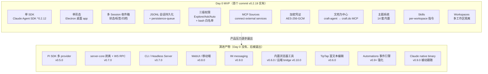
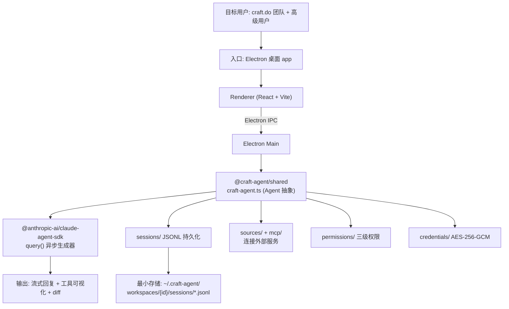
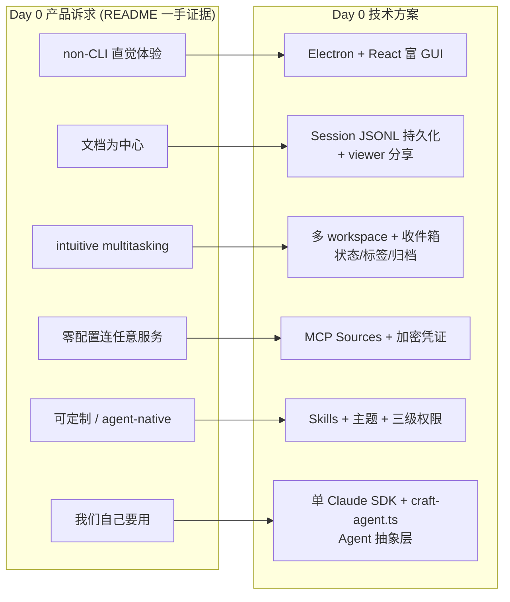
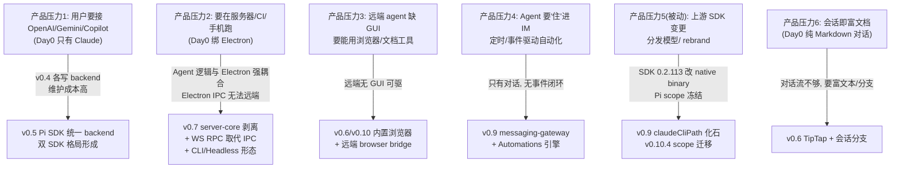

# Day 0 产品与技术方案复原

> 本节是**对既有项目的反向研究**：从现有源码、首个 commit、release notes 与 README 证据中，复原作者在 Day 0（项目启动首日）会如何理解需求、定义产品边界、选择初始技术方案，并追溯后续产品压力如何迫使技术演进。它**不是**写新功能的 RFC/ADR/实现计划。每条结论标注证据等级：①明确 ②强推断 ③弱推断。

## 这一节解决什么问题

Craft Agents 当前是一个拥有「双 SDK（Claude + Pi）、四形态（Electron / Headless Server / CLI / WebUI）、多 IM 通道、远端 browser bridge、自动化引擎」的复杂平台。仅看当前代码，会误以为它一开始就这么宏大——例如会以为「双 SDK」「WebSocket RPC」「TipTap 编辑器」是 Day 0 决策。

本节要回答的是：**剥掉所有演进产物后，作者 Day 0 真正想要的、真正做的是什么？** 并用首个 commit（`0fe831b`，OSS 起点 v0.2.19）与原始 README 作为锚点，区分「Day 0 必备」与「后来被产品压力逼出来的」。

---

## 需求起点

### 目标用户（证据等级：①明确）

README「Why Craft Agents was built」段（`README.md:18-27`）直接给出了一手动机：

> "Craft Agents is a tool we built so that **we (at craft.do)** can work effectively with agents… We built Craft Agents because we wanted a better, more opinionated (and preferably non-CLI way) of working with the most powerful agents in the world."

复原作者 Day 0 的目标用户画像：

1. **第一优先：craft.do 团队自己**——「我们造它是因为我们自己要用」（①明确）。最强烈的一句是：「We ourselves are building Craft Agents with Craft Agents only - no code editors」（`README.md:25`），说明作者团队自己就是头号用户，且要用它替代代码编辑器完成开发。
2. **次级：偏好文档/非 CLI 的高级用户**——「想要更偏文档、更非 CLI、更可定制的方式驱动 Agent」（①明确，README 多处）。
3. **远端/自动化集成者**——这是后来才浮现的用户群（v0.7+ 的 headless server、v0.9+ 的 IM 自动化），**Day 0 不存在**。

### 核心任务（证据等级：①明确，结合 Day 0 README 与首个 commit）

首个 commit 的 README 标题句（`0fe831b:README.md`）是 Day 0 意图最干净的表述：

> "A powerful AI assistant **desktop app** built on the **Anthropic Claude Agent SDK**. **Manage documents, connect to external services, and automate workflows** — all through natural conversation with Claude."

Day 0 用户最想完成的 3 个任务：
1. **与 Claude 对话管理文档**（「Manage documents」——craft.do 是文档产品，文档为中心是天然基因）。
2. **连接外部服务**（「connect to external services」——Day 0 已有 MCP sources 子系统，见下文）。
3. **多任务并行地驱动 Agent**（README「intuitive multitasking」——Day 0 已有多 session / workspace 收件箱形态）。

### 现有替代方案的问题（证据等级：①明确）

README 直接点名痛点（`README.md:27`）：

> "We wanted a better, more opinionated (and preferably **non-CLI way**) of working with the most powerful agents in the world."

不用 Craft Agents 时，用户只能用：
- 各 provider 的 **CLI**（如 Claude Code CLI）——作者明确嫌弃 CLI 形态，要「non-CLI」「更直觉」「更可定制」。
- 各 provider 的 **Web**——缺乏统一会话管理、权限治理、本地工具执行、文档集成。
- **没有一个**工具能同时做到：会话当一等公民（收件箱/状态/标签/分享）+ 零配置连任意服务 + 多 provider 并存 + IM 自动化。

### 产品成功标准（证据等级：②强推断）

从 README「Things that are hard to believe 'just work'」（`README.md:31-62`）反推，作者心里的「有用」标准是：
- 「告诉 agent 'add Linear as a source'，它自己读文档、配凭证、装好」——**零配置连接**是核心承诺。
- 「mention 新 skill/source 用 `@`，即时生效，无需重启」——**热重载/即时**是体验底线。
- 「我们用它（Craft Agents）开发 Craft Agents，不用代码编辑器」——**自举**（dogfooding）是最高成功标准。

### 明确不做什么（证据等级：①明确 + ②强推断）

README 的克制语气与首个 commit 的形态共同表明 Day 0 排除的范围：
- **不做多 provider**（Day 0 只有 `@anthropic-ai/claude-agent-sdk`，无 Pi/OpenAI/Codex，①明确）。多 provider 是 v0.4 起才出现的演进。
- **不做远端/headless**（Day 0 README 锁定「desktop app」，无 server/CLI，①明确）。
- **不做 IM 自动化/messaging**（无 messaging 依赖，①明确；v0.9 才引入）。
- **不把 UI 直接调 SDK**——Agent 原生原则（README「agent-native software」，①明确）意味着 UI 只与 Agent 会话层对话，不直接调底层模型 API。Day 0 已有 `craft-agent.ts` 作为 Agent 抽象层（②强推断，见技术方案）。

---

## MVP 边界

下图是 Day 0 MVP 的能力边界——内圈是 Day 0 必备，外圈是后来才有的。

### MVP 能力清单

| 能力 | Day 0 是否必须 | 为什么 | 证据来源 | 证据等级 |
|------|----------------|--------|----------|----------|
| 单 SDK = Claude Agent SDK | 必须 | 作者团队就是 Claude 重度用户；README「built on the Anthropic Claude Agent SDK」 | `0fe831b:package.json` 仅 `@anthropic-ai/claude-agent-sdk@^0.2.12`，无 Pi/OpenAI | ①明确 |
| 单形态 = Electron 桌面 app | 必须 | README 明确要「non-CLI」「desktop app」；富 GUI 是「直觉」诉求的载体 | `0fe831b:README.md`「desktop app」；`apps/electron` 完整存在 | ①明确 |
| 多 Session 收件箱（状态/标签/归档） | 必须 | README「intuitive multitasking」「sharing sessions」；会话是一等公民 | 首个 commit 已有 `statuses/`、`labels/`、session 管理 | ②强推断 |
| JSONL 会话持久化 | 必须 | 文档为中心 = 会话要能保存/分享/重放；Day 0 已有完整持久化栈 | `sessions/jsonl.ts` + `persistence-queue.ts` + `storage.ts`(847行) 在首个 commit | ①明确 |
| 三级权限（Explore/Ask/Auto）+ bash 白名单 | 必须 | 本地工具执行必须可治理；「Ask to Edit」是默认安全感 | `permissions/default.json`(139行 bash 白名单) 在首个 commit；README 权限三态 | ①明确 |
| MCP Sources（连外部服务） | 必须 | README「connect to external services」「zero-config connect any API」是核心承诺 | 首个 commit 已有 `sources/` + `mcp/` 子系统 | ①明确 |
| 加密凭证（AES-256-GCM） | 必须 | 连外部服务必然要存凭证；本地优先 = 必须本地加密 | 首个 commit 已有 `credentials/` | ②强推断 |
| 文档为中心（craft-agent → craft.do MCP） | 必须 | craft.do 是文档产品；「document-centric」是基因 | `agent/craft-agent.ts` 命名直指 craft 文档；README「Manage documents」 | ②强推断 |
| 主题系统（14 套内置） | 必须 | 「beautiful and fluid UI」是产品基调；可定制性承诺 | 首个 commit `resources/themes/` 含 14 个主题 JSON | ①明确 |
| Skills（per-workspace 指令） | 必须 | 「highly customisable」承诺；`@mention` 即时生效 | 首个 commit 已有 `skills/` | ②强推断 |
| Workspaces（多工作区隔离） | 必须 | 多任务并行 + 配置隔离的最小单元 | 首个 commit 已有 `workspaces/` | ②强推断 |
| **Pi SDK 多 provider** | **可以没有** | Day 0 只服务 Claude 用户；多 provider 是外部用户需求 | v0.4.0 才出现 Codex backend，v0.5.0 才有 Pi | ①明确 |
| **server-core / WS RPC / Headless / CLI** | **可以没有** | Day 0 是纯桌面；远端/无头是后期场景 | v0.7.0 才剥离 server-core、取代 Electron IPC | ①明确 |
| **TipTap 富文本编辑** | **可以没有** | Day 0 是对话式而非富文本编辑 | 首个 commit 无 `@tiptap`；v0.6.0 才引入 | ①明确 |
| **IM messaging（Telegram/Lark/WhatsApp）** | **可以没有** | IM 集成是远端化后才有的自动化场景 | v0.9.0 才引入 messaging-gateway | ①明确 |
| **内置浏览器工具** | **可以没有** | Day 0 是「对话管理文档」，浏览器「行动」是能力扩张 | v0.6.0 才有内置浏览器 | ①明确 |
| **Claude native binary** | **可以没有** | 这是被上游 SDK 分发模型变更逼出的，Day 0 根本不存在 | v0.9.0 SDK 0.2.113 才改 native binary | ①明确 |

---

## Day 0 技术方案

### 最小架构（证据等级：①明确，首个 commit 实证）

Day 0 是一个**纯 Electron 单体**，业务逻辑与桌面壳同进程，通信走 Electron 原生 IPC。尚未有 server-core、WS RPC、子进程化。

### 核心数据模型（证据等级：①明确）

Day 0 已落地、且贯穿至今的最小数据契约：
- **Session（JSONL）**：会话是一等公民，逐 turn 追加写入，支持持久化/重放/分享。`sessions/jsonl.ts` + `persistence-queue.ts`（异步队列防并发覆盖）+ `storage.ts`(847行) + `slug-generator.ts`（人类可读会话 ID）。这是「文档为中心」的物理实现——会话即文档。
- **Workspace**：配置/凭证/sessions/skills/themes/statuses 的隔离边界（`~/.craft-agent/workspaces/{id}/`）。
- **Permission 三态**：`safe`(Explore 只读) / `ask`(Ask to Edit 默认) / `allow-all`(Auto)，配 `permissions/default.json` 的 bash 命令白名单正则。
- **Source（mcp/api/local）**：Day 0 已有 `sources/` + `mcp/`，连接外部服务的声明式配置。
- **Theme**：14 套内置主题 JSON（catppuccin/dracula/gruvbox/nord/tokyo-night…），app/workspace 两级级联。

### 核心流程（Day 0 最短链路）

1. 用户启动 Electron app，配置 Anthropic API key（或 Claude OAuth）→ 存入加密凭证。
2. 创建 workspace（或用默认），新建 session。
3. 输入消息 → renderer 经 Electron IPC 到 main → `craft-agent.ts` 调 `claude-agent-sdk` 的 `query()` 异步生成器 → 流式回复。
4. Agent 调工具（bash/MCP/文档工具）→ 经权限层校验（Explore/Ask/Auto）→ 执行 → 结果回传。
5. 每 turn 的消息/工具调用/结果以 JSONL 追加持久化到 `sessions/{id}.jsonl`。
6. 用户在收件箱按状态/标签管理会话，可分享（viewer app 上传 transcript）。

### 技术选择与「为什么够用」

| 选择 | 替代方案 | Day 0 为什么选它 | 证据 |
|------|----------|------------------|------|
| **Electron + React + Vite** | Tauri / 原生 / Web-only | 跨平台富 GUI 的成熟方案；React 生态支撑「beautiful UI」；Vite 给 renderer 快速 HMR。Day 0 团队首要诉求是「non-CLI 直觉体验」，Electron 是最短路径 | 首个 commit 完整 electron-builder 配置；`electron:dev` 用 concurrently 跑 vite+esbuild+electron | ①明确 |
| **Bun monorepo（workspaces）** | pnpm / npm | Bun 是一体化 runtime+test+install；workspaces 拆 `packages/{core,shared,ui}`+`apps/*` | 首个 commit `"workspaces": ["packages/*","apps/*"]`、`bun test` | ①明确 |
| **Claude Agent SDK（单 SDK）** | 直接调 Anthropic API / 多 SDK | 作者团队就是 Claude 用户；SDK 提供 `query()` 流式 + 工具协议，免自己造 agent loop；Day 0 只服务 Claude，无需抽象 | `description: "Claude Code-like agent for Craft documents"`；仅一个 SDK | ①明确 |
| **JSONL 会话持久化** | SQLite / 数据库 | 文档为中心 = 会话即文档，要可分享/可 diff/可纯前端渲染（viewer 是纯前端解析）；JSONL 是最简「追加写 + 纯文本」格式，零外部依赖 | `sessions/jsonl.ts` + 独立 `apps/viewer`（纯前端解析 JSONL 渲染） | ②强推断 |
| **MCP 作为 Sources 协议** | 自造连接协议 | MCP 是 Anthropic 主推的开放标准，复用生态；「零配置连任意服务」承诺需要标准化协议 | 首个 commit `@modelcontextprotocol/sdk` + `mcp/` 子系统 | ②强推断 |
| **三级权限 + bash 白名单** | 全放行 / 全拦截 | 本地工具执行必须可治理才敢让 agent 行动；「Ask to Edit」默认是安全感与效率的平衡 | `permissions/default.json` 139 行精心白名单 | ②强推断 |
| **TipTap 富文本** | Markdown 纯文本 / 其他编辑器 | **不是 Day 0 决策**——v0.6.0 才引入，纠正任务假设 | 首个 commit 根 package.json 无 `@tiptap` | ①明确 |

> **关键纠正**：TipTap **不是** Day 0 选择。Day 0 的会话渲染走 `react-markdown` + `shiki`（首个 commit 已有），是纯 Markdown 对话流。TipTap 富文本编辑是 v0.6.0「Branching & Multi-Panel」能力扩张期才进入的，对应「会话即富文档」诉求的强化——这本身是一次演进，而非初始决策。

---

## 需求 → 技术方案映射（Day 0 蓝图）

下图复原作者 Day 0 如何把产品诉求翻译成技术方案。

---

## 从 MVP 到当前系统：产品压力 → 技术演进链

下表是「产品诉求如何逼出技术决策」的因果链，标注证据等级。

| 产品压力 | 暴露的问题 | 技术变化 | 当前代码落点 | 证据等级 |
|----------|------------|----------|--------------|----------|
| 用户要接 OpenAI/Gemini/Copilot | Day 0 只能连 Claude | v0.4 各 provider 独立 backend（成本高）→ v0.5 用 Pi SDK 统一多 provider backend | `packages/shared/src/agent/backend/{claude,pi}/` + `factory.ts` 派发 | ①明确（release notes Breaking Changes） |
| 要在服务器/CI/手机/浏览器跑 Agent | Day 0 强绑 Electron + Electron IPC，无法远端/无头 | v0.7 server-core 剥离 + WebSocket RPC 取代 IPC + CLI/Headless/WebUI 三新形态 | `packages/server-core/bootstrap/headless-start.ts` 的 `bootstrapServer()` | ①明确（`0.7.0.md` Transport & Architecture） |
| 远端 agent 缺 GUI，要用浏览器/文档工具 | 远端 workspace 无桌面，浏览器工具不可用 | v0.6 内置浏览器（本地）→ v0.10 远端 browser bridge（server 反向 invoke client） | `RemoteBrowserPaneManager.ts` + `browser-capability.ts` | ①明确（`0.10.0.md`） |
| Agent 要「住」进 IM、定时/事件自动化 | Day 0 只有被动对话，无事件驱动闭环 | v0.9 messaging-gateway（Telegram/Lark/WhatsApp）+ Automations 引擎强化 | `packages/messaging-gateway/` + `SessionManager.executePromptAutomation` | ①明确（`0.9.0.md`） |
| 上游 SDK 分发模型变更（被动） | Claude SDK 0.2.113 从 cli.js 改 per-platform native binary，旧路径全失效 | v0.9 适配 native binary，bundle +210MB/平台，`claudeCliPath` 命名化石 | `runtime-resolver.ts` 注释（字段名保留 CLI 时代） | ①明确（`0.9.0.md` + 源码注释） |
| 上游 Pi SDK rebrand（被动） | `@mariozechner/*` scope 冻结 | v0.10.4 全量迁移到 `@earendil-works/*` | 根 package.json 三包 scope | ①明确（`0.10.4.md`） |
| 会话要从「对话」升级为「富文档」 | Day 0 纯 Markdown 对话流，缺富文本/分支 | v0.6 引入 TipTap + 会话分支（fork）+ 多面板 | `@tiptap/*` 依赖（v0.6.0 起） | ①明确（首个 commit 无 TipTap，v0.6.0 引入） |

---

## 作者视角的设计取舍

| 设计选择 | 替代方案 | 为什么 Day 0 可能这样选 | 代价 |
|----------|----------|--------------------------|------|
| 单 Claude SDK（不一开始就抽象多 provider） | 一开始就建 provider 抽象层 | 作者团队自己就是 Claude 用户，YAGNI；Day 0 服务自己，不需要多 provider | 后期多 provider 需求来时，v0.4 各写 backend 试错一轮，才在 v0.5 用 Pi SDK 统一（双 SDK 长期维护负担的源头） |
| Electron + Electron IPC（不一开始就 WS RPC） | 一开始就用 WS/HTTP 解耦 | Day 0 是纯桌面，Electron IPC 是最短路径，WS 是过度设计 | v0.7 为支持远端/无头被迫大改：WS RPC 取代 IPC + server-core 剥离（392 文件/3.4 万行重构） |
| JSONL 会话持久化（不上 SQLite） | SQLite/数据库 | 文档为中心 = 会话要可分享/可 diff/可纯前端解析；JSONL 零依赖、追加写最简 | 大量会话时查询/索引能力弱（靠 `storage.ts` 847 行手写管理） |
| MCP 作为 Sources 协议（不自造） | 自造连接协议 | 复用 Anthropic MCP 生态，兑现「零配置连任意服务」 | 受限于 MCP 协议演进；非 MCP 服务（REST API/local）需另写适配 |
| 文档为中心 + Agent 原生（UI 不直调 SDK） | UI 直接调模型 API | Agent 原生原则：UI 只与会话层对话，agent 做编排；为未来权限/工具/自动化留出空间 | 增加 `craft-agent.ts`/`SessionManager` 中间层，早期看似「重」 |
| 会话/凭证本地优先（~/.craft-agent/） | 云端存储 | 本地优先 = 隐私 + 离线 + 可控；凭证必须本地 AES-256-GCM 加密 | 跨设备同步弱（直到 v0.8「Send to Workspace」才部分解决） |

---

## Day 0 可能没想到的（后来暴露的复杂度）

> 这些是 Day 0 蓝图里不存在、被演进逼出来的「意外复杂度」。证据等级见括号。

1. **双 SDK 长期并存的同步成本**（①明确）：Day 0 是干净的单 SDK。v0.5 引入 Pi SDK 后，`backend/{claude,pi}` 两套驱动需要持续同步防漂移——release notes 反复出现「Aligned tool listing across all backends to prevent drift」「Pi backend silently dropped the Craft system prompt… Anthropic backend was unaffected」。这是 Day 0 完全无法预见的最大长期包袱。
2. **化石层**（①明确）：
   - `claudeCliPath` 字段名指向的不再是 CLI 而是 native binary（`runtime-resolver.ts` 注释明说「for back-compat」）。
   - `--preload` 失效（native binary 不支持）。
   - Claude SDK 从 caret（`^0.2.x`）退化为精确锁定（`0.2.123`），标志 SDK 升级冲突频繁。
   这些都是被上游 SDK 分发模型变更（v0.9）逼出的，Day 0 的 SDK 是 `cli.js` 脚本形态。
3. **runtime 分裂**（②强推断）：Day 0 是单一 Bun/Electron runtime。后来出现「Bun 跑不了 Baileys 密码学依赖 → WhatsApp worker 强制 Node」「Electron 用 `ELECTRON_RUN_AS_NODE`，Bun 宿主用显式 `node`」「Pi SDK 子进程化」「Claude native binary spawn」——runtime 边界从 1 个分裂成多个，Day 0 不会有这个心智。
4. **transport 从 1 种（Electron IPC）裂为多协议**（①明确）：Day 0 只有 Electron IPC。现在是「WS RPC（主）+ stdio JSONL（Pi）+ stdio MCP（session-mcp-server）+ stdio NDJSON（WhatsApp worker）+ Electron IPC（仅纯客户端能力）」五协议并存。
5. **从「服务自己」到「多类用户」的产品张力**（②强推断）：Day 0 用户单一（craft.do 团队 + Claude 高级用户）。后来远端/自动化/IM 用户涌入，逼出 headless server、CLI、WebUI、messaging、automation——Day 0 的「纯桌面 Claude 工作站」边界被持续突破。

---

## 证据等级汇总

| 判断 | 证据等级 | 证据来源 | 需要确认的问题 |
|------|----------|----------|----------------|
| Day 0 是单 Claude SDK + Electron 单体 | ①明确 | `0fe831b:package.json`（仅 `@anthropic-ai/claude-agent-sdk`）、`0fe831b:README.md`（「desktop app」「Anthropic Claude Agent SDK」） | 无 |
| Day 0 已有 JSONL 持久化/权限/MCP sources/credentials/skills/themes/workspaces | ①明确 | 首个 commit `packages/shared/src/{sessions,permissions,sources,mcp,credentials,skills,statuses,workspaces}/` 实际文件 | 无 |
| TipTap 不是 Day 0 决策（v0.6.0 才引入） | ①明确 | 首个 commit 根 package.json 无 `@tiptap`；`git log -S` 首次出现在 `9e0b8fb`(v0.6.0) | 无 |
| 多 provider/远端/messaging/CLI 是演进产物非 Day 0 | ①明确 | v0.4/v0.5/v0.7/v0.9 release notes + 依赖引入时点 | 无 |
| 作者团队自己是头号用户（dogfooding） | ①明确 | `README.md:25`「building Craft Agents with Craft Agents only - no code editors」 | 无 |
| 文档为中心 = JSONL 设计动机 | ②强推断 | JSONL 文件 + 独立 viewer 纯前端解析 + README「document-centric」 | 作者是否一开始就设计 viewer 分享，还是后来加的 |
| Agent 原生（UI 不直调 SDK）是 Day 0 原则 | ②强推断 | README「agent-native software」+ 首个 commit 已有 `craft-agent.ts` 抽象层 | Day 0 是否已显式命名该原则 |
| 内部闭源仓库的真实 Day 0 | ③弱推断 | OSS 首个 commit 已是 v0.2.19，更早历史不在 OSS 仓库（`Sync from internal repository`） | 内部仓库 v0.1.x / 0.2.0~0.2.18 的真实形态无法从 OSS 还原 |

---

## 如果我是作者，今天从 0 开始

基于上面的复原，若今天重做 Day 0 第一版：

**会保留的 Day 0 决策**（被时间证明是对的）：
- 单 SDK 起步、YAGNI 不预先抽象多 provider——但会**预留 provider 抽象接口**（`AgentBackend` 契约），避免 v0.4「各写 backend」的试错。
- JSONL 会话持久化 + 文档为中心——这是产品灵魂，会原样保留。
- MCP 作为 Sources 协议 + 加密凭证 + 三级权限——兑现「零配置连服务 + 安全执行」的根基。
- Electron + React 富 GUI——non-CLI 直觉体验的最短路径。
- Agent 原生（UI 不直调 SDK）——为权限/工具/自动化留空间。

**会延后的能力**（Day 0 不做）：
- TipTap 富文本、会话分支——等「会话即富文档」诉求真实出现再做（v0.6 才需要）。
- 内置浏览器工具——等「端到端自动化」诉求出现。
- IM messaging / 自动化引擎——等远端化之后。
- 多 provider——等外部用户真的要接 OpenAI/Gemini 再做，且直接用成熟多模型抽象（避免双 SDK 长期包袱）。

**会主动规避的复杂度**（Day 0 想不到、但今天已知）：
- **通信层一开始就用 transport 抽象而非裸 Electron IPC**——这样 v0.7 的 server-core 剥离 + WS RPC 大重构可以避免或大幅减轻。代价是 Day 0 多一层抽象，但相比后期 392 文件/3.4 万行重构，值得。
- **不假设单一 runtime**——从一开始就把「需要 Node 的能力（如密码学）」隔离到子进程，避免 v0.9 的 runtime 分裂阵痛。
- **对上游 SDK 保持版本锁定策略的清醒**——已知 SDK 会频繁破坏性变更（native binary、scope 迁移），会从 Day 0 就做版本兼容层而非裸依赖。

一句话：**Day 0 蓝图的核心（文档为中心的 Claude 桌面工作站）是对的，但低估了两件事——多 provider 会带来双 SDK 长期包袱，以及「服务自己」会迅速膨胀为「多类用户多形态平台」。前者逼出双 SDK 同步成本，后者逼出 server-core 剥离与 transport/runtime 分裂。**

---

## 摘要

本研究从首个 commit（`0fe831b` v0.2.19）与原始 README 反向复原 Craft Agents 的 Day 0 蓝图：它是一个**单 Claude SDK + 单 Electron 桌面形态**的「文档为中心 Agent 工作站」，服务 craft.do 团队自己，核心是 JSONL 会话持久化、MCP Sources 零配置连服务、三级权限、加密凭证、多 workspace 收件箱与主题系统。TipTap、Pi SDK、server-core/WS RPC、CLI、WebUI、messaging、native binary 均非 Day 0 决策，而是被「多 provider / 远端 / IM 自动化 / 上游 SDK 变更」四股产品压力逐版本逼出的演进产物。Day 0 最大的未预见复杂度是双 SDK 长期同步成本与 transport/runtime 分裂。证据主要来自首个 commit 实证与 release notes，等级多在①明确。
