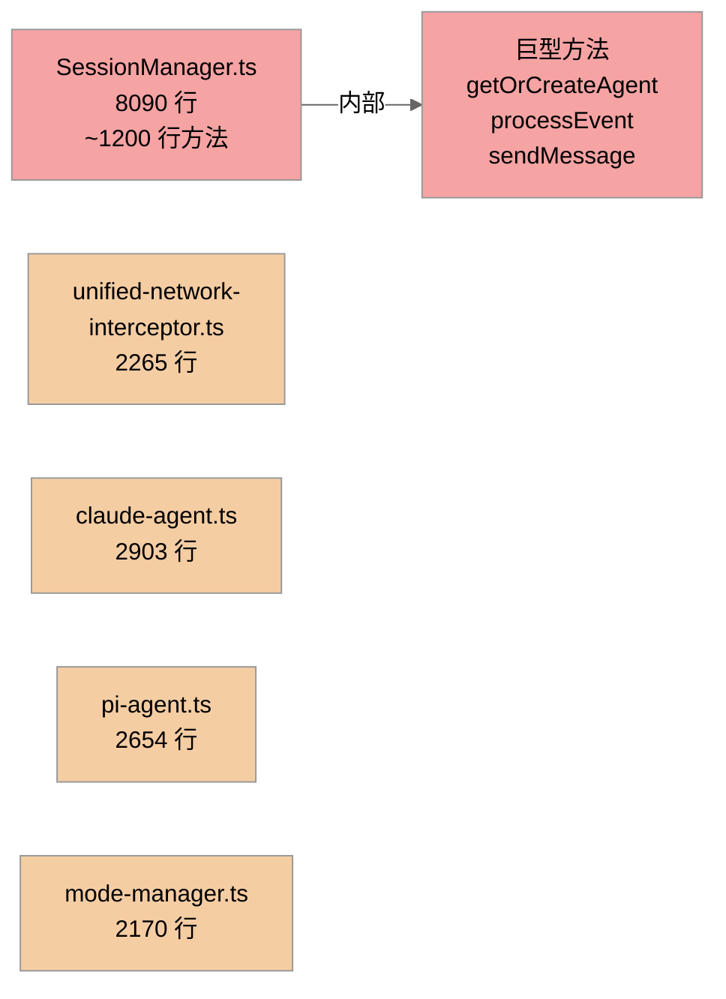

# 代码质量地图

## 这一节解决什么问题

本节基于直接阅读源码，识别 Craft Agents（Bun monorepo，双 SDK：Claude + Pi）的**可维护性风险**：模块边界、复杂度来源、修改风险、测试缺口、错误处理一致性、历史包袱、可简化点。它不是逐行 review、漏洞扫描、性能 profiling，也不提出具体重构方案，只标注风险等级与最小改善方向。

## 证据规则

- 源码是第一事实源；前置报告（01/02/03/05）只用于定位文件，不作为证据。
- 每条判断含具体文件路径 + 函数/类型/配置/调用链 + 观察到的代码行为。
- 高风险 ≥2 处源码证据；中/低风险 ≥1 处。
- 不打总分，只给模块级 Low / Medium / High。

## 覆盖范围

**已阅读**：
- `packages/server-core/src/sessions/SessionManager.ts`（8090 行，疑似核心复杂度热点）
- `packages/shared/src/agent/`（claude-agent.ts、pi-agent.ts、base-agent.ts、backend/factory.ts、claude-context.ts、mode-manager.ts）
- `packages/server-core/src/transport/`（server.ts、client.ts、codec.ts、push.ts、types.ts）
- `packages/shared/src/credentials/backends/secure-storage.ts`（凭证加解密）
- `packages/shared/src/protocol/channels.ts`（RPC 通道注册表）
- `packages/shared/src/unified-network-interceptor.ts`、`interceptor-common.ts`（错误处理抽样）
- 各 `package.json`（zod 版本一致性）
- 测试文件分布（仅用于覆盖缺口）

**未覆盖**：
- `packages/ui`、`packages/messaging-*`、`packages/session-mcp-server`（体量小或非核心运行时，仅做测试缺口统计）。
- `packages/shared/src/config/storage.ts`、`validators.ts`、`watcher.ts`（大文件，但属配置层，本专题未深读其内部复杂度）。

## 模块风险热力概览

```mermaid
%%{init: {'theme':'neutral'}}%%
quadrantChart
    title 模块复杂度 × 修改影响面
    x-axis "低内部复杂度" --> "高内部复杂度"
    y-axis "低修改影响面" --> "高修改影响面"
    quadrant-1 {高复杂 高影响: 重点}
    quadrant-2 {低复杂 高影响}
    quadrant-3 {低复杂 低影响}
    quadrant-4 {高复杂 低影响}
    "SessionManager": [0.92, 0.95]
    "双 SDK Agent": [0.7, 0.7]
    "Transport/RPC": [0.4, 0.85]
    "凭证加密": [0.55, 0.8]
    "网络拦截器": [0.8, 0.6]
    "Mode Manager": [0.65, 0.55]
    "Prompt 构造": [0.5, 0.5]
```

## 模块质量地图

| 模块 | 风险等级 | 主要判断 | 源码证据 | 影响 | 最小改善建议 |
|------|----------|----------|----------|------|--------------|
| SessionManager | High | 上帝类：单文件 8090 行，会话生命周期/持久化/认证/分享/标题/消息/事件处理全揉在一个类，含多个 600-1200 行的巨型方法 | `SessionManager.ts:1102` 单 `export class SessionManager`；`getOrCreateAgent` 3110-4315（~1200 行）；`processEvent` 6810-7486（~676 行）；`sendMessage` 5421-6026（~600 行） | 任何会话相关改动都要触动此文件，回归面极大 | 按职责拆出持久化/认证/分享/事件处理子模块（最小建议，不展开） |
| Transport / RPC 类型网 | High | 通道名虽有集中注册表，但 `handle()`/`invoke()`/`push()` 全是 `string` + `any[]`，注册侧与调用侧无编译期契约绑定 | `transport/types.ts:13` `HandlerFn = (ctx, ...args: any[]) => any`；`:16` `handle(channel: string, ...)`；`:17` `push(channel: string, ...)`；`client.ts:177` `invoke(channel: string, ...args: any[])` | 通道重命名/改签名不会在编译期报错，只能运行时暴露 | 引入基于 `RPC_CHANNELS` 的泛型重载 wrapper 收敛 |
| 凭证加解密 | Medium | 解密失败原因被吞：GCM 鉴权失败与明文 JSON 解析失败都归并为 `null`，无法区分密钥错/数据损坏 | `secure-storage.ts:tryDecrypt`（~255 行）整体 `try {...} catch { return null }`；调用方 `loadStore` 仅用「换 legacy key 再试 → 仍 null 则 `handleCorruptedFile`」二分 | 凭证加载异常时定位困难，迁移失败与损坏不可区分 | `tryDecrypt` 至少记录失败阶段（auth-tag vs parse），不改变返回契约 |
| 网络拦截器 | Medium | 2265 行单文件承担多格式 SSE 处理 + 元数据注入 + 错误捕获，且全局存在大量空 `catch {}` | `unified-network-interceptor.ts` 头注释列 6 项职责；`wc -l` 2265；全仓 `catch {}`/空 catch 共 228 处（多数在拦截器） | 修改 SSE 解析或元数据逻辑风险高，空 catch 掩盖部分失败 | SSE 解析按 API 格式拆独立模块（最小建议） |
| 双 SDK Agent | Medium | 2903 + 2654 行并行实现，但通过 `BaseAgent` 抽象共享骨架，属业务必要的并行而非有害克隆 | `base-agent.ts:1069-1136` 定义 `abstract chatImpl/abort/queryLlm/runMiniCompletion/respondToPermission`；claude/pi 各 ~50-59 个唯一方法名，重名仅 ~14 个且多为 abstract 实现 | 新增 backend 能力需在两处各加一遍 | 能力尽量下沉到 `BaseAgent`/driver 层（已有 driver-registry 趋势） |
| Mode Manager | Medium | 2170 行，权限模式 + bash 校验 + 浏览器工具判定混在一起 | `mode-manager.ts` 头注释列 safe/ask/allow-all 三模式；文件 2170 行；`import { validateBashCommand, hasControlCharacters }` 等多职责 | 权限判定与命令校验耦合，单点改动影响面大 | 拆分「模式状态机」与「命令/工具校验」 |
| Prompt 构造 | Low | system.ts 1140 行，但为纯函数式拼接，无隐式状态 | `prompts/system.ts` 导出 `getSystemPrompt`/`getMiniAgentSystemPrompt`/`getProjectContextFilesPrompt` 等独立函数 | 改动局部、易回归 | 无需优先处理 |

## 复杂度热点



## 分维度发现

### 1. 模块边界

- **SessionManager 边界过宽**：`SessionManager.ts:1102` 单类既管磁盘持久化（`persistSession`、`loadSessionsFromDisk`、`enqueuePersist`，1916-2000 行）、又管认证流（`completeAuthRequest`、`handleCredentialInput`，2053-2346）、分享（`shareToViewer`/`updateShare`/`revokeShare`，4531-4700）、标题生成（`generateTitle`，6713-6810）、事件路由（`processEvent`，6810-7486）。内部细节（`ManagedSession` 状态、persist 队列）直接暴露给同文件大量方法，跨职责调用频繁。
- **Transport 边界相对清晰**：`transport/` 按 server/client/codec/push/capabilities 拆分，`push.ts` 为单薄类型安全 helper（`pushTyped`）。边界问题主要在类型契约（见下）。

### 2. 复杂度来源

- **SessionManager 的复杂度大部分是业务必要但未拆分**：会话状态机 + 磁盘冷热持久化 + 多 SDK runtime 刷新（`tryRefreshAgentRuntime`、`runAgentRuntimeRefresh`、`disposeManagedAgentRuntime`，2895-3089）天然复杂，但 8000 行单类属可降低的偶发复杂度。
- **双 SDK 复杂度属生态约束（必要）**：`backend/factory.ts:6-13` 注释明确两个 SDK；`DRIVER_REGISTRY`（:66）+ `ProviderDriver` 抽象是合理的收敛，复杂度源自两个真实不同的 SDK。
- **网络拦截器复杂度属必要 + 可拆分**：必须 preload 注入 + 兼容 Anthropic/OpenAI 两套 SSE，必要性强，但 2265 行单文件可按格式拆。
- **凭证 legacy key 迁移属历史兼容**：`secure-storage.ts` 保留 v1（含 hostname）→ v2（硬件 UUID）双 key 尝试（243-258），是可控的历史包袱，已有自动 re-save 迁移。

### 3. 修改风险

- **改 `processEvent`（6810-7486）影响所有 agent 事件→会话状态映射**：676 行方法处理整个事件流分支，任何 agent 协议变更都集中于此。
- **改 RPC 通道签名无编译期保护**：`types.ts:13/16/17` + `client.ts:177` 全 `string`/`any[]`，删改 `RPC_CHANNELS.sessions.SEND_MESSAGE` 的调用方不会触发类型错误，只会在运行时 `CHANNEL_NOT_FOUND`（`server.ts:652`）。
- **改 `getOrCreateAgent`（3110-4315，~1200 行）**：承担 runtime 创建/刷新/分支恢复，spawn ENOENT 等错误在此处理（claude-agent.ts:1900-1925），改动牵动 SDK 子进程生命周期。

### 4. 测试缺口

| 包 | 测试文件 / 源文件 | 缺口判断 |
|----|-------------------|----------|
| server-core | 22 / 70 | **高风险缺口**：`sessions/__tests__/` 仅 `host-client-fallback.test.ts`、`RemoteBrowserPaneManager.test.ts`，**无 SessionManager 专属测试**；8090 行核心类基本无单元测试保护 |
| session-mcp-server | 0 / 1 | 整包无测试（体量小，风险低） |
| shared | 144 / 260 | 覆盖较好 |
| session-tools-core | 12 / 33 | 一般 |
| ui | 31 / 58 | 一般 |

> 测试缺口只作为风险加权，不单独构成源码质量证据。

### 5. 错误处理与失败路径

- **凭证解密失败原因被合并**：`secure-storage.ts:tryDecrypt` 把 GCM `setAuthTag` 失败（密钥错）与 `JSON.parse` 失败（明文损坏）都吞成 `return null`，调用方只能二分「换 legacy key / 判损坏」。失败可恢复但不可定位。
- **空 `catch {}` 普遍但多数合理**：全仓 228 处，抽样 `interceptor-common.ts:47/61/81/107/186/190/204` 多为日志轮转、写日志的 best-effort（有注释「Ignore — rotation is best-effort」「Silently fail if can't write to log file」），可接受；但解密路径的空 catch 不在此类。
- **Transport 错误码集中**：`server.ts:652` `CHANNEL_NOT_FOUND`、`sendResponseError`，且 `transport/__tests__/error-codes.test.ts` 有覆盖，错误返回一致性较好。
- **Claude SDK spawn 错误映射特殊处理**：`claude-agent.ts:1900-1925` 把 SDK 抛的 spawn ENOENT（伪装成 `ReferenceError`）显式拆出 `errorCode/errorSyscall`，是有意的可定位处理。

### 6. 代码一致性

- **zod 双版本残留**：根 `package.json:201` `zod ^4.0.0`，`packages/shared/package.json:87` `>=4.0.0`，`packages/session-mcp-server` `^4.0.0`，但 **`packages/session-tools-core/package.json:17` 仍为 `zod ^3.23.0`**。bun.lock 同时解析 zod@4.3.5 与 ^3.23.0。`session-tools-core/src/tool-defs.ts` 定义的 `SubmitPlanSchema`/`CredentialPromptSchema` 等 zod schema 跨越包边界被消费，两代 zod 的 schema 对象在 `.shape`/`zodToJsonSchema` 行为上可能不一致，属历史包袱一致性问题。
- **RPC 通道定义集中但类型未绑定**：`protocol/channels.ts` 提供单一事实源（`RPC_CHANNELS.sessions.*`），`handlers/rpc/sources.ts:1` 等已 import 使用，但 `handle`/`invoke` 签名仍是裸 `string`，集中化未传导到类型层。
- **历史迁移注释**：`SessionManager.ts:1004` `// TODO: Remove legacy 'think' normalization after old persisted session`；`pi-agent.ts:298` `@deprecated Use onBackendAuthRequired ... Kept as a getter/setter alias for backward compatibility`；`pi-agent.ts:1409-1410` `mcp__* tools -> MCP server proxy (TODO)`、`api_* tools -> API source proxy (TODO)`。这些是明确的待清理残留。
- **提示词提到但不存在的 lint 脚本**：任务描述提及 `scripts/check-raw-sends.sh`、`scripts/check-task-tool-checks.sh`，但 `find` 在全仓（排除 node_modules）**未找到**这两个脚本，`scripts/` 目录仅有 build/i18n/electron 类脚本。即 IPC 类型安全目前**无 lint 守网**。

### 7. 可简化点（最小建议）

1. **SessionManager 拆分**（证据：`SessionManager.ts:1102` 单类 8090 行，`getOrCreateAgent` 1200 行）：把持久化、认证、分享、事件路由拆为独立模块/类，最小化先抽 `processEvent` 与持久化层。
2. **RPC 类型网**（证据：`types.ts:13/16/17`、`client.ts:177`）：增加 `handle<K extends keyof RpcChannelMap>(...)` 泛型 wrapper，把 `RPC_CHANNELS` 的集中定义传导到注册/调用两侧，消除 `any[]`。
3. **zod 版本统一**（证据：`session-tools-core/package.json:17` ^3.23.0 vs 其余 ^4.0.0）：将 session-tools-core 升到 ^4.0.0，避免跨包 schema 行为分叉。
4. **`tryDecrypt` 失败分级**（证据：`secure-storage.ts:tryDecrypt` 空 catch 合并两种失败）：返回 `{ok:false, stage:'auth'|'parse'}` 或内部日志，不破坏对外 `null` 契约。
5. **清理历史 TODO/deprecated**（证据：`SessionManager.ts:1004`、`pi-agent.ts:298/1409/1410`）：评估 `think` 归一化、pi auth getter 别名、mcp/api 工具代理 TODO 是否可落地或删除。

## 高风险优先级

| 优先级 | 问题 | 为什么优先 | 需要先读的源码 |
|--------|------|------------|----------------|
| P1 | SessionManager 上帝类 + 巨型方法 + 零专属测试 | 任何会话/runtime 改动都集中于此，回归面最大且无测试网 | `SessionManager.ts:1102/3110/6810/5421` |
| P1 | RPC 注册/调用无编译期类型契约 | 通道改名/改参只能运行时暴露，且无 lint 守网（脚本不存在） | `transport/types.ts:13/16/17`、`client.ts:177`、`protocol/channels.ts` |
| P2 | zod 双版本残留（session-tools-core ^3 vs 其余 ^4） | 跨包 zod schema 行为可能分叉，且 tool-defs schema 是跨边界契约 | `session-tools-core/package.json:17`、`tool-defs.ts:48-86` |
| P2 | 凭证解密失败原因被吞 | 迁移失败 vs 损坏不可区分，运维定位难 | `secure-storage.ts:tryDecrypt`、`loadStore` |
| P3 | unified-network-interceptor 2265 行 + 普遍空 catch | SSE 解析改动风险中等，多数空 catch 合理但解密路径不合理 | `unified-network-interceptor.ts`、`interceptor-common.ts` |

## 待确认问题

- `scripts/check-raw-sends.sh`、`scripts/check-task-tool-checks.sh` 在本仓不存在——是否曾在历史版本中存在并被移除？IPC 类型安全是否曾经依赖外部 lint？（需 git 历史确认，非源码可见）
- SessionManager 是否有通过 `server-core` 顶层 integration test 间接覆盖？（本节未深读 `server-core` 顶层测试组织，无法确认 8090 行类的实际覆盖深度）
- zod ^3 与 ^4 的 schema 对象在 `session-tools-core` 的实际消费路径（`.shape` 提取 / `zodToJsonSchema`）是否已触发过运行时不一致？（需运行数据/issue 确认）
